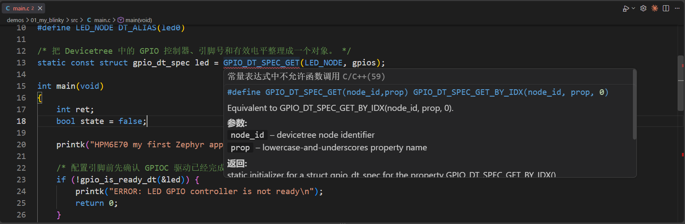

# 故障排查

排查时先找“最后一个正常结果”，再检查紧邻的下一层。这样可以避免同时怀疑环境、Board、JTAG、Flash 和应用。

## 工作区与工具

先进入工程并激活独立环境：

```powershell
Set-Location D:\100ask\work\HPM6E70
Set-ExecutionPolicy -Scope Process Bypass
.\.venv\Scripts\Activate.ps1
$env:PYTHONUTF8 = '1'
west --version
python --version
west list zephyr sdk_env sdk_glue
```

如果 PowerShell 报错“无法将 west 识别为 cmdlet”，依次执行：

```powershell
Test-Path .\.venv\Scripts\west.exe
(Get-Command python).Source
```

第一条为 `False` 时，回到第 1 课，使用国内镜像把 west 安装进 `.venv`；第一条为 `True` 但仍找不到命令时，重新执行 `.\.venv\Scripts\Activate.ps1`。

若构建在读取 `board.yml`、DTS 或其他 UTF-8 文件时出现下面这类错误：

```text
UnicodeDecodeError: 'gbk' codec can't decode byte ...
```

说明 Python 使用了中文 Windows 的系统默认编码。在当前终端设置：

```powershell
$env:PYTHONUTF8 = '1'
```

随后重新执行原来的 west 命令。该变量不会永久修改系统设置；每次打开新的 Windows PowerShell 后都需要重新设置。

若 CMake 报错位置包含 `FindZephyr-sdk.cmake`，先检查当前命令来自哪里：

```powershell
Get-Command cmake | Select-Object Source
cmake --version
```

路径应指向当前工程的 `sdk_env\tools\cmake\bin\cmake.exe`，本工作区自带版本为 3.24.0。若路径指向系统目录或 `.venv`，把 SDK 自带的 CMake 与 Ninja 放到 PATH 最前面：

```powershell
$env:Path = "$PWD\sdk_env\tools\cmake\bin;$PWD\sdk_env\tools\ninja;$env:Path"
Get-Command cmake, ninja | Select-Object Name, Source
```

若提示找不到 Zephyr SDK 或工具链，设置当前终端使用 `sdk_env` 中的工具链：

```powershell
$env:ZEPHYR_TOOLCHAIN_VARIANT = 'cross-compile'
$env:CROSS_COMPILE = "$PWD\sdk_env\toolchains\rv32imac_zicsr_zifencei_multilib_b_ext-win\bin\riscv32-unknown-elf-"
$env:HPM_SDK_DIR = "$PWD\sdk_env\hpm_sdk"
Test-Path "${env:CROSS_COMPILE}gcc.exe"
```

最后一条必须输出 `True`。

## 找不到 Board

```powershell
west boards --board-root . --board dshanmcu_hpm6e70
```

没有输出时依次检查：

1. `boards/hpmicro/dshanmcu_hpm6e70/board.yml` 是否存在；
2. `board.name` 是否为 `dshanmcu_hpm6e70`；
3. 应用 `CMakeLists.txt` 是否在 `find_package(Zephyr ...)` 前把工程根目录加入 `BOARD_ROOT`。

## DTS 或 Kconfig 修改没有生效

板级配置变化后使用全新配置：

```powershell
west build -p always -b dshanmcu_hpm6e70/hpm6e70 .\app -d .\build
```

然后检查最终合并结果，而不是只看源文件：

```powershell
Select-String .\build\zephyr\zephyr.dts -Pattern 'uart0|green LED|flash@0'
Select-String .\build\zephyr\.config -Pattern 'CONFIG_SOC_HPM6E70=y|CONFIG_XIP=y|CONFIG_UART_CONSOLE=y'
```

## 警告与失败怎样区分

出现 `warning` 后仍生成 `zephyr.elf`，表示构建完成但存在待处理问题；出现 `FATAL ERROR`、`CMake Error` 或 Ninja 停止，才是本次构建失败。不要只根据终端颜色判断结果。

## JTAG 与烧录


- `CH347 not found`：电脑没有发现调试器，检查 USB、WinUSB 接口和占用进程；
- TAP ID 全为 0 或 1：检查 TCK、TMS、TDI、TDO、GND 和目标板供电；
- 请求 500 kHz 实际显示 938 kHz：CH347F 选择了可用的相邻频率，不代表连接失败；
- `wrote ... bytes` 与 `verified ... bytes` 先后出现，才表示写入完成且已读回校验。

接线、WinUSB 接口选择、`runners.yaml` 和 `west debugserver` 的逐层检查见[连接并验证 JTAG](../common-04-连接JTAG与OpenOCD/README.md)。

## 串口偶尔出现残缺字符

少量、偶发的乱码通常来自复位瞬间、连接器接触或串口接收从一帧中间开始。若随后持续输出正常，可先记录现象；若频繁发生，再检查 115200 8N1、地线、TX/RX 连接和供电稳定性。

UART0 接线、COM 端口确认和 VS Code Serial Monitor 设置见[连接串口并确认 COM 端口](../common-05-连接串口并查看日志/README.md)。

## SDRAM 初始化状态一直是 -1

现象：SDRAM 测试应用在第一步打印 `FAIL [pre-kernel init] status=-1`。

`-1` 是 `board_sdram.c` 中 `sdram_init_status` 的初始值，只有一种情况会出现：`_init_ext_ram()` 从来没有被调用。HPM 裸机 SDK 由各 SoC 的 `start.S` 执行 `call _init_ext_ram`，而 Zephyr 的启动路径不经过它，`zsg` fork 也没有实现这个调用。检查 `board_sdram.c` 末尾是否有把初始化挂进内核启动序列的 `SYS_INIT(board_sdram_sys_init, PRE_KERNEL_2, 0)`；补上并重新构建烧录后，状态应变为 `0`，测试继续执行数据线、字节通道和地址线各阶段。

接入方法见[把板载 SDRAM 接入 Board](../p2-10-适配板载SDRAM/README.md)。



VS Code 的红色波浪线来自编辑器索引，`west build` 才使用最终设备树和生成头文件。命令行编译成功但编辑器误报时，应更新 `compile_commands.json` 或 C/C++ 配置，不要为消除误报修改正确代码。
