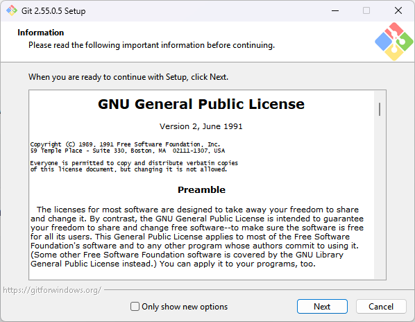

# 准备开发环境

这一课先把两期课程都会使用的基础工具准备好：工程目录、Git、uv、Python 虚拟环境和 west。CMake 与 Ninja 不单独安装：一期提供的现成工程已经包含 SDK 工具环境，二期搭建 SDK Glue 工作区时也会把它们下载下来。完成后，当前终端会显示 `(.venv)`。

:::tip[下载完整工程包时]
如果使用课程提供的**完整工程包**，包内已经包含课程所需的源码和开发环境，不需要重新安装 Git、uv、Python、west，也不需要手动创建 `.venv`。将完整工程解压到不含空格和中文字符的路径后，可跳过本课的安装步骤，直接进入后续课程进行构建检查。

如果只下载了源码，或者完整工程中的 `.venv`、`sdk_env` 缺失或无法运行，再按照本课步骤搭建环境。
:::

## 准备工程目录

下面的 `D:\100ask\work\HPM6E70` 是本课程使用的演示路径，不是固定要求。可以替换为电脑上的其他盘符和目录；如果更换路径，后续课程命令中的工程路径也要同步替换。建议路径只使用英文字母、数字、短横线和下划线，并避免空格与中文字符。

在 Windows 开始菜单中搜索并打开 **Windows PowerShell**。在 PowerShell 中创建工程目录：

```powershell
New-Item -ItemType Directory -Path D:\100ask\work\HPM6E70 -Force
```

## 打开工程目录

在 Windows PowerShell 中进入工程目录（路径可替换为你自己的工程路径）：

```powershell
Set-Location D:\100ask\work\HPM6E70
```

执行：

```powershell
Get-Location
```

输出路径的最后一级应为 `HPM6E70`。后续命令都从这个目录开始执行。

## 第一步：安装 Git

Git 用来下载 Zephyr、HPMicro 适配层和 SDK 等源码仓库。下载当前的 [Git 64 位安装程序（Git 2.55.0.5）](https://repo.huaweicloud.com/git-for-windows/v2.55.0.windows.5/Git-2.55.0.5-64-bit.exe)，双击运行。

安装向导中看到许可协议后点击 **Next**，后续选项保持默认，直到安装完成。



Git 默认安装到：

```text
C:\Program Files\Git\
```

安装完成后关闭已经打开的终端，重新打开一个普通 Windows PowerShell，进入工程目录。检查 Git：

```powershell
git --version
```

能看到版本号即可。

## 第二步：安装 uv

uv 是一个独立的 Python 工具，用来下载指定版本的 Python，并在工程目录创建 `.venv`。本课使用清华 PyPI 镜像下载，不需要先安装系统 Python。

### 2.1 下载 uv 压缩包

在工程根目录打开普通 Windows PowerShell，依次执行下面的命令。每条命令执行结束、提示符重新出现后，再执行下一条。

**1. 记录下载文件路径。** 先把下载文件的完整路径保存到变量 `$uvWheel`。变量只是给后面的命令使用，不会安装软件：

```powershell
$uvWheel = Join-Path $env:TEMP 'uv-0.9.9-py3-none-win_amd64.whl'
```

**2. 下载 uv 压缩包。**

```powershell
Invoke-WebRequest -Uri 'https://pypi.tuna.tsinghua.edu.cn/packages/f2/38/562295348cf2eb567fd5ea44512a645ea5bec2661a7e07b7f14fda54cb07/uv-0.9.9-py3-none-win_amd64.whl' -OutFile $uvWheel
```

这条命令从清华镜像下载 uv 压缩包。没有红色错误并重新出现提示符，就表示下载完成。

### 2.2 解压并放置 uv.exe

**1. 设置临时解压目录。** `$uvExtract` 只记录目录路径：

```powershell
$uvExtract = Join-Path $env:TEMP 'uv-extract'
```

**2. 清理旧目录。**

```powershell
Remove-Item $uvExtract -Recurse -Force -ErrorAction SilentlyContinue
```

这条命令删除同名旧目录，避免上次解压残留文件干扰；目录不存在时不会报错。

**3. 创建解压目录。**

```powershell
New-Item -ItemType Directory -Path $uvExtract | Out-Null
```

这条命令创建新的解压目录。

**4. 解压 uv 压缩包。**

```powershell
tar -xf $uvWheel -C $uvExtract
```

这条命令把刚下载的压缩包解压到 `$uvExtract`，解压后其中应能找到 `uv.exe`。

**5. 设置安装目录。** uv 会安装到当前用户目录，不需要管理员权限：

```powershell
$uvBin = Join-Path $env:USERPROFILE '.local\bin'
```

**6. 创建安装目录。**

```powershell
New-Item -ItemType Directory -Path $uvBin -Force | Out-Null
```

这条命令创建安装目录；目录已经存在时也可以执行。

**7. 复制可执行文件。**

```powershell
Copy-Item (Join-Path $uvExtract 'uv-0.9.9.data\scripts\uv.exe') (Join-Path $uvBin 'uv.exe') -Force
```

这条命令只复制 `uv.exe` 到安装目录，不会修改系统 Python，也不会覆盖其他软件。

### 2.3 验证 uv

**1. 让当前窗口识别 uv。** 把安装目录加入当前 PowerShell 窗口的 PATH：

```powershell
$env:Path = "$uvBin;$env:Path"
```

**2. 检查 uv 版本。**

```powershell
uv --version
```

能看到版本号，说明 uv 可以运行。

**3. 检查 uv 的实际位置。**

```powershell
Get-Command uv | Select-Object Source
```

这条命令确认实际调用的是刚复制的 uv；`Source` 应指向当前用户目录下的 `.local\bin\uv.exe`。


## 第三步：用 uv 创建工程 Python 虚拟环境

uv 管理的 Python 运行时会放在 uv 的用户缓存目录中，不会覆盖电脑上已有的 Python。

**1. 下载 Python 3.12。**

```powershell
uv python install 3.12 --mirror https://registry.npmmirror.com/-/binary/python-build-standalone/ --no-registry
```

看到 `Installed Python 3.12.x` 后再继续。`--no-registry` 表示不把这个版本写入 Windows 的 Python 版本注册表。

**2. 查看 Python 存放目录。**

```powershell
uv python dir
```

这条命令显示 uv 管理 Python 的存放目录，仅用于确认位置。

**3. 创建工程虚拟环境。** 在当前工程根目录执行：

```powershell
uv venv --python 3.12 --seed .venv
```

这条命令在当前工程根目录创建 `.venv`。`--python 3.12` 指定解释器版本，`--seed` 会同时准备虚拟环境所需的 pip。

虚拟环境就在当前工程的 `.venv\` 目录中，只服务于这个工程。先允许本窗口执行激活脚本：

```powershell
Set-ExecutionPolicy Bypass -Scope Process -Force
```

这个设置只对当前 PowerShell 窗口有效，关闭窗口后自动恢复。

```powershell
.\.venv\Scripts\Activate.ps1
```

看到提示符前出现 `(.venv)`，表示已经进入工程虚拟环境。

后续安装的 west 和 Python 包都会进入当前工程的 `.venv`；CMake 与 Ninja 不在 venv 中，而是统一使用 `sdk_env\tools` 里的版本。

## 第四步：安装并验证基础工具

确认命令提示符前有 `(.venv)`。下面的安装命令只把 west 放入当前工程的虚拟环境：

```powershell
python -m pip install -i https://pypi.tuna.tsinghua.edu.cn/simple west==1.5.0
```

等待安装完成并重新出现提示符后即完成。各工具的版本号在下面的「完成检查」里统一验证。

## 开发准备完成检查

- Windows PowerShell 可以正常执行 PowerShell 命令；
- `Get-Location` 指向你创建的 `HPM6E70` 目录；
- 工程路径中没有空格和中文字符。
- 命令提示符前有 `(.venv)`；
- `git --version`、`uv --version` 和 `west --version` 都能返回版本号；
- CMake 与 Ninja 将在 `sdk_env` 就绪后从 `sdk_env\tools` 加入 PATH 并验证；
- 工程根目录下已经出现 `.venv\`。

公共环境准备完成后，可以按目标进入不同路线：一期直接使用已经搭好的 HPM6E70 工程进行开发；二期从 `west init` 开始创建 Zephyr SDK Glue 工作区。
