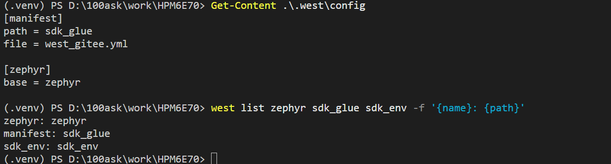
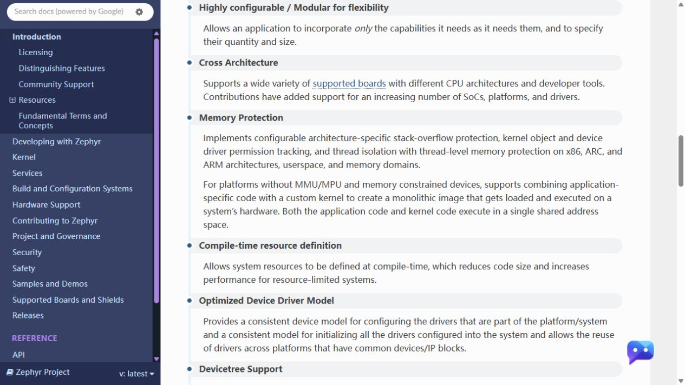

# 认识 Zephyr 与工程模型

本教程会从两个方向使用同一套工程：一期直接在现成工程中开发，二期再从空目录把它完整搭建出来。这里先沿着课程工程中的真实目录认识 Zephyr：哪些能力来自 Zephyr，哪些支持由 HPMicro 提供，板卡自身的信息又应该放在哪里。

完成本课后，你将能够在工程中找到 Zephyr、HPMicro 适配层和 HPM SDK，并了解后续为什么要为 HPM6E70 建立 Board。

## 从课程工程开始

在 Windows PowerShell 中进入 `HPM6E70` 根目录，查看 west 使用的清单：

```powershell
Get-Content .\.west\config
west list zephyr sdk_glue sdk_env -f '{name}: {path}'
```

正常情况下可以看到三项：

```text
zephyr: zephyr
sdk_glue: sdk_glue
sdk_env: sdk_env
```

下面是一次实际验证结果。第一条命令显示 `.west/config` 的内容，第二条命令列出 west 识别到的工程路径：



`.west/config` 的 `[manifest]` 部分记录清单仓库路径和清单文件名。本课程完成 Gitee 配置后应为：

```ini
[manifest]
path = sdk_glue
file = west_gitee.yml
```

也就是说，west 读取的是 `sdk_glue/west_gitee.yml`，再按照这份清单取得对应版本的 Zephyr、HPMicro 适配层和 HPM SDK；不是把 `.west/config` 当成源码目录。三个目录不是重复副本，每个目录保存不同的内容。

`west list` 输出中的 `manifest: sdk_glue` 表示“清单仓库是 `sdk_glue`”，不是需要另外创建的第四个源码目录。

把配置项放回工程目录中，可以直接看到 west 最终读取的文件：

```text
HPM6E70/
├─ .west/
│  └─ config                 ← 记录 path 和 file
├─ sdk_glue/
│  └─ west_gitee.yml        ← west 实际读取的清单
├─ zephyr/                   ← Zephyr 项目
└─ sdk_env/                  ← HPM SDK 与工具
```

`.west/config` 中的 `path = sdk_glue` 与 `file = west_gitee.yml` 组合成相对路径 `sdk_glue/west_gitee.yml`。执行 `west update` 时，west 再根据这份清单更新工作区中的各个仓库。

| 目录 | 主要内容 | 后续会在哪里遇到 |
|---|---|---|
| `zephyr/` | Zephyr 内核、通用驱动 API、Devicetree、Kconfig 和构建系统 | 应用 API、设备模型、编译过程 |
| `sdk_glue/` | HPMicro 的 Zephyr SoC 支持、驱动适配和 west 扩展 | HPM6E00 系列 SoC、Flash 驱动 |
| `sdk_env/` | HPM SDK、芯片寄存器定义、底层驱动和工具链 | 时钟、启动和芯片外设底层实现 |

这层划分很重要：应用通常调用 Zephyr API；Zephyr 通过板级描述找到设备；HPMicro 适配代码再把统一 API 接到 HPM 芯片的底层实现。

## Zephyr 不只是一个实时内核

线程、信号量、消息队列和定时器是许多 RTOS 都具备的基础能力。Zephyr 在这些内核能力之外，还把硬件描述、功能裁剪、驱动模型、板卡支持和构建流程放进同一套工程模型中。

Zephyr 官方在 *Distinguishing Features* 中列出了可配置与模块化、跨架构、编译期资源定义、统一设备驱动模型和 Devicetree 支持等特性：



可在 [Zephyr 官方 Introduction：Distinguishing Features](https://docs.zephyrproject.org/latest/introduction/index.html#distinguishing-features) 查看完整说明。上图所列内容会在后续实验中落到具体文件：

| 官方特性 | 在本课程中的落点 |
|---|---|
| Highly configurable / Modular | `prj.conf`、Kconfig，只把需要的能力编进固件 |
| Cross Architecture | HPM6E70 复用 Zephyr 已有的 RISC-V 架构实现 |
| Compile-time resource definition | Devicetree 和 Kconfig 在编译阶段生成配置 |
| Optimized Device Driver Model | 应用通过 Zephyr GPIO、UART 等统一 API 使用设备 |
| Devicetree Support | Board DTS 描述 UART、LED、Flash 和 SDRAM 的实际连接 |

## 工作区清单不包含板卡连接

`.west/config` 和 `west list` 可以确认源码来自哪个仓库、各仓库位于什么目录，但它们不会说明当前实物板使用哪颗 MCU，也不会给出 UART、LED、Flash 或 SDRAM 的实际连接。

这些硬件事实需要从芯片丝印和原理图中确认，再决定哪些内容应写入 Board、Devicetree 和 pinctrl。下一篇先记录 HPM6E70 板卡上的主控制器、外部存储器和观察接口；二期从零搭建工程时，再把这份硬件记录与现有软件支持逐层对照。

## 完成本课后的检查

继续下一篇前，确认自己能够回答：

1. `.west/config` 中的 `path` 和 `file` 最终组合成哪个清单路径？
2. `zephyr/`、`sdk_glue/` 和 `sdk_env/` 分别由谁维护、提供什么内容？
3. 为什么仅查看 west 工作区还不能确定当前板卡的 UART、LED 和外部存储器连接？

能够结合终端输出、目录树和源码作用表回答这三个问题，就可以继续从实物板与原理图确认板卡硬件。
