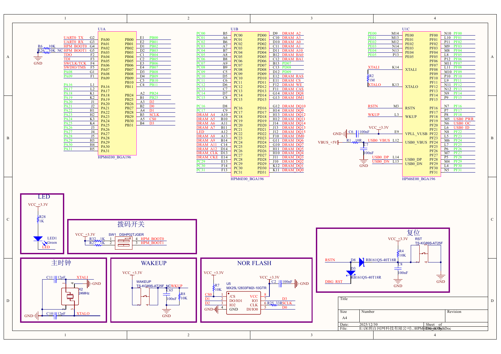
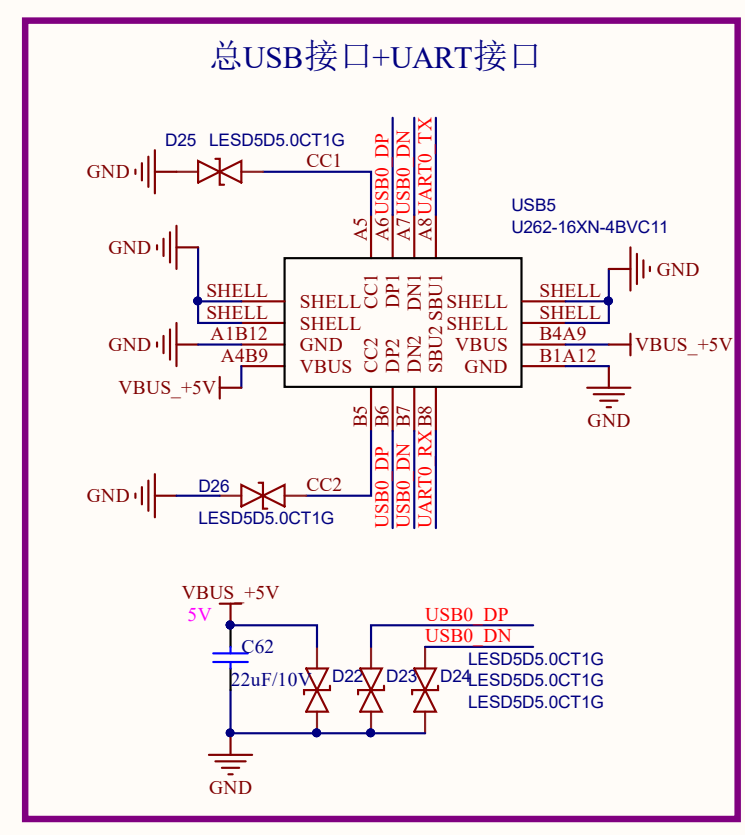

# 认识 HPM6E70 板卡

这一课先不写代码。我们要确认板上有哪些关键器件、它们怎样连接，以及后面的 Zephyr Board 必须描述哪些硬件。

## 从芯片丝印确认主控制器

<div style={{ overflow: 'hidden', borderRadius: '12px', aspectRatio: '16 / 10' }}>
  
</div>

芯片第二行是 `HPM6E70`。本工程以实物丝印为准；原理图中的早期名称不能替代实际器件型号。

HPM6E70 属于 HPM6E00 系列。板上使用的完整型号是 `HPM6E70IGN1`：`HPM6E70` 表示芯片的功能配置，`IGN1` 表示工业温度等级、BGA196 封装和版本信息。

## HPM6E70 内置了哪些资源

先把“芯片内部资源”和“板卡外接器件”分开。HPM6E70 内部已经集成处理器、SRAM 和多种外设控制器；板上的 NOR Flash、SDRAM、LED 和接口插座则是连接到芯片引脚上的外部资源。

| 类别 | HPM6E70 片内资源 | 可以完成什么 |
| --- | --- | --- |
| 处理器 | 2 个 32 位 RISC-V 内核，最高 600 MHz，带浮点、DSP 和 FFA 协处理器 | 运行 Zephyr、应用程序和实时控制算法 |
| 片内存储 | 2080 KB SRAM、128 KB Boot ROM、4096 位 OTP | 保存运行数据、执行启动程序和存放一次性配置 |
| 通用通信 | 17 个 UART、8 个 SPI、8 个 I2C、8 个 CAN-FD、1 个高速 USB 控制器 | 连接串口设备、传感器、CAN 总线和 USB 设备 |
| 定时与数据搬运 | 9 组通用定时器、5 个看门狗、1 个 RTC、两组 32 通道 DMA | 计时、监控程序运行并在外设与内存之间搬运数据 |
| 运动与模拟 | 4 组 8 通道高分辨率 PWM、4 个 16 位 ADC、8 个模拟比较器，以及编码器接口 | 驱动电机、采集模拟信号和读取位置传感器 |
| 工业网络 | EtherCAT 从站控制器和 1 个千兆以太网控制器 | 实现实时工业以太网通信；本板所用 BGA196 封装可引出 2 个 EtherCAT 端口 |
| 外部存储接口 | XPI、FEMC 和 PPI | 连接串行 NOR Flash、SDRAM、SRAM 或并行外设 |
| 通用输入输出 | BGA196 封装最多引出 148 个 GPIO | 连接 LED、按键和其他数字信号 |

这些数量表示芯片内部拥有的控制器或封装能够引出的资源，并不代表开发板已经把它们全部接到插针或接口上。一个引脚还可能在 GPIO、UART、SPI 等功能之间复用，实际使用哪项功能由原理图、引脚复用配置和 Zephyr Devicetree 共同决定。

:::note HPM6E70 没有片内程序 Flash

型号中的 `0` 表示不内置 Flash 和以太网 PHY。因此，固件需要保存在板载 NOR Flash 中；芯片虽然内置以太网控制器，但要连接网线仍需外部 PHY 和相应电路。

:::

更完整的资源数量和型号差异可查阅先楫半导体的 [HPM6E00 系列数据手册 Rev0.9](https://www.hpmicro.com/Public/Uploads/uploadfile/files/20250110/HPM6E00DSV09.pdf)。

## 板卡上的四类核心资源

| 资源 | 本板器件或连接 | 后续用途 |
| --- | --- | --- |
| 主控制器 | HPM6E70 | 执行 Zephyr 与应用代码 |
| 程序存储器 | U5，MX25L12833F，16 MiB NOR Flash | 保存断电后仍需保留的固件 |
| 扩展内存 | U9，IS42S16160J，32 MiB SDRAM | 为较大的数据缓冲区提供运行空间 |
| 观察接口 | 绿色 LED、UART0、JTAG | 观察运行状态、日志和调试连接 |



从原理图可读出三条后面会直接写进 Board 的连接：

- UART0 的 `TX/RX` 使用 `PA00/PA01`；
- 绿色 LED 接在 `PC22`，GPIO 输出低电平时点亮；
- U5 是板载 16 MiB SPI NOR Flash，程序通过 XPI 映射区运行。

## 一个 USB-C 口包含多组信号



板卡 USB-C 的 `D+/D-` 是 HPM6E70 的原生 USB；`SBU1/SBU2` 引出了 UART0。普通 USB 数据线不会自动把 SBU 上的 UART 信号转换成 COM 端口。后续串口观察需要分离器把 SBU 信号引出，再交给带 USB-UART 功能的调试器。

JTAG 与 UART 是两条不同通道：JTAG 用来停止 CPU、烧录和调试，UART 用来输出运行日志。它们可以由同一块 CH347F 调试器提供，但不能混为同一组信号。

## 本课得到的硬件记录

后续创建 Board 时会使用下面这组已确认信息：

```text
MCU       HPM6E70
UART0     PA00 / PA01，115200 8N1
LED       PC22，低电平点亮
NOR Flash MX25L12833F，16 MiB
SDRAM     IS42S16160J，32 MiB
调试接口  JTAG
```

到这里，板卡的硬件事实已经确认。进入一期时，可以直接在现成工程中使用这些资源；进入二期时，再检查 Zephyr、HPMicro 适配层和 HPM SDK 已经提供到哪一层，并决定需要新建哪些文件。
