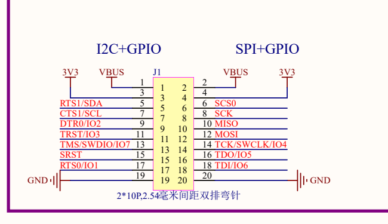
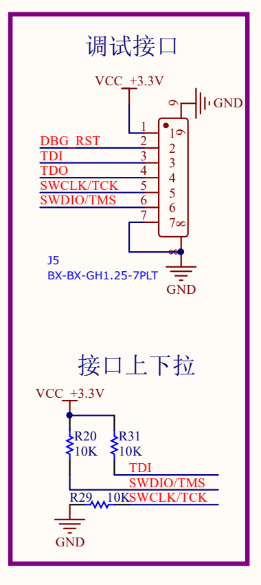
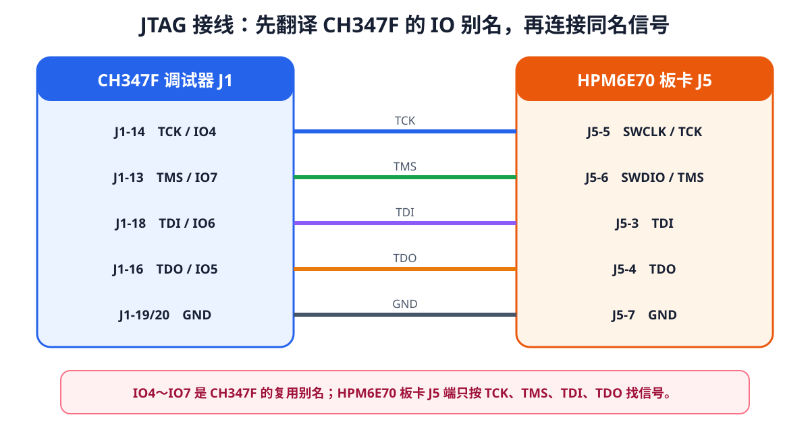
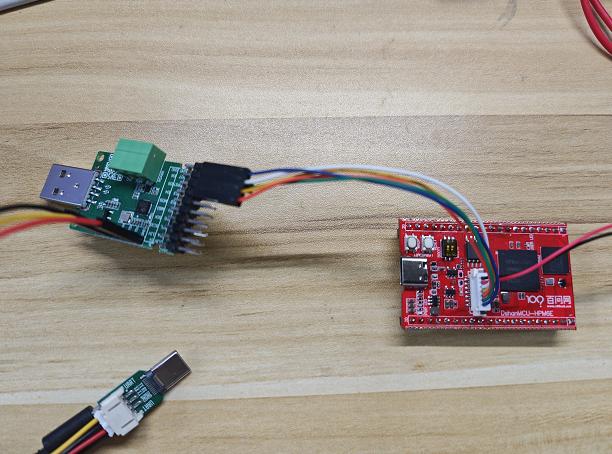
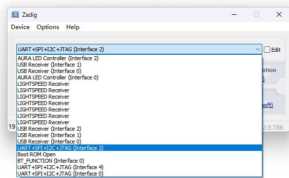
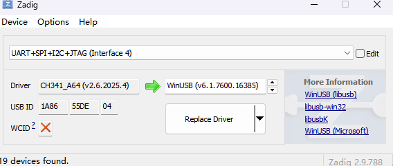
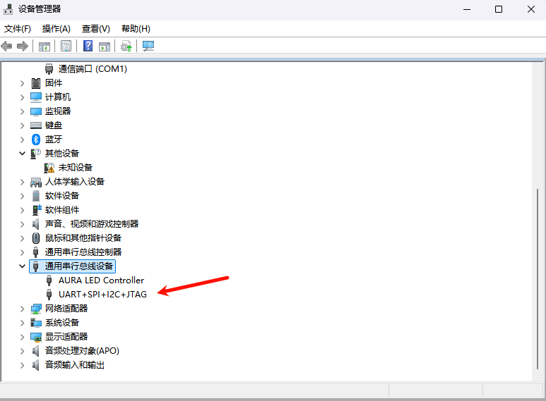
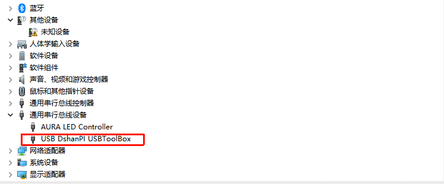
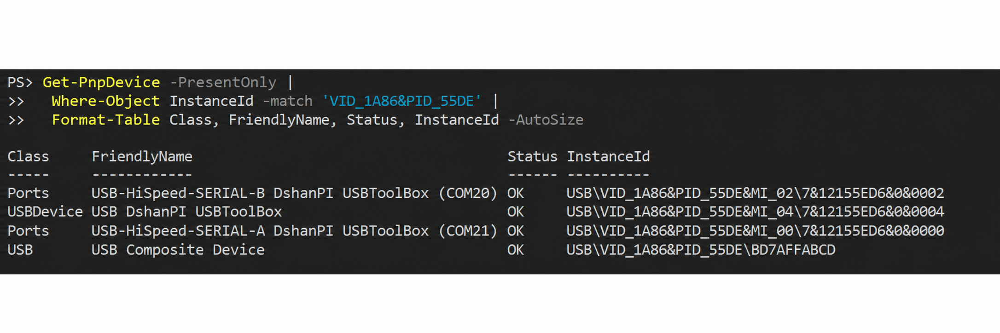

# 连接并验证 JTAG

本课把 CH347F 的 JTAG 通道连接到板卡，并配置 Windows 驱动。烧录和调试都要经过这条通道；一期可以用现成工程立即验证，二期则在工程具备可编译固件后验证。这里先把硬件连接和驱动准备就绪。

:::info[完成后的可见结果]
设备管理器能识别 CH347F 的 JTAG 接口：Interface 4 可能显示为 `UART+SPI+I2C+JTAG`，也可能显示为 `USB DshanPI USBToolBox`。该接口由 WinUSB 提供，两个串口接口保持原驱动不变。
:::

## JTAG 五根线分别传递什么

| 信号 | 方向 | 作用 |
| --- | --- | --- |
| TCK | CH347F → HPM6E70 | 为 JTAG 状态机提供时钟 |
| TMS | CH347F → HPM6E70 | 控制 JTAG 状态机切换 |
| TDI | CH347F → HPM6E70 | 数据进入目标芯片 |
| TDO | HPM6E70 → CH347F | 数据从目标芯片返回 |
| GND | 双方共用 | 建立相同的电压参考 |

`TDI` 和 `TDO` 的 I/O 以目标芯片为参照。CH347F 丝印中的 `IO4～IO7` 是复用名称，不能按照数字顺序猜测它们对应哪根 JTAG 线。

## 从两张原理图确认排针位置

CH347F 的 J1 排针把 JTAG 信号标成了复用名称：



| CH347F J1 针脚 | 丝印或复用名称 | JTAG 信号 |
| --- | --- | --- |
| J1-14 | TCK / SWCLK / IO4 | TCK |
| J1-13 | TMS / SWDIO / IO7 | TMS |
| J1-18 | TDI / IO6 | TDI |
| J1-16 | TDO / IO5 | TDO |
| J1-19 或 J1-20 | GND | GND |

HPM6E70 板卡的 J5 已直接标出目标端信号：



| HPM6E70 J5 针脚 | 信号 |
| --- | --- |
| J5-3 | TDI |
| J5-4 | TDO |
| J5-5 | SWCLK / TCK |
| J5-6 | SWDIO / TMS |
| J5-7 | GND |

两端都转换成 JTAG 信号名后，再连接同名信号：



## 断电完成接线

:::caution[接线前先断电]
先拔掉目标板和 CH347F 的 USB，再连接排针。不要在两块板上电时移动杜邦线，也不要把两端的 3.3 V 或 5 V 电源并在一起。
:::

按下面的顺序连接：

| CH347F J1 | HPM6E70 J5 | 作用 |
| --- | --- | --- |
| J1-14 / TCK / IO4 | J5-5 / SWCLK / TCK | 调试时钟 |
| J1-13 / TMS / IO7 | J5-6 / SWDIO / TMS | 模式选择 |
| J1-18 / TDI / IO6 | J5-3 / TDI | 数据进入目标芯片 |
| J1-16 / TDO / IO5 | J5-4 / TDO | 数据从目标芯片返回 |
| J1-19 或 J1-20 / GND | J5-7 / GND | 共地 |

接好后先观察实物照片中的两个位置：左侧 CH347F 使用 J1 排针，右侧 HPM6E70 板使用 J5 调试排针；五根线只连接 TCK、TMS、TDI、TDO 和 GND。



<p className="image-caption">JTAG 实物连接：CH347F J1 与板卡 J5 之间使用五根信号线；照片下方的 USB-C 分离器不参与 JTAG 通信。</p>

线材颜色只用于在照片中区分导线，不能替代上面的针脚编号。重新接线时仍应逐根核对 J1、J5 和信号名称。

本工程的 OpenOCD 配置使用五线 JTAG，并通过 RISC-V 调试模块复位目标，因此不需要连接 `SRST`、`TRST`。两块板各自通过 USB 供电时，也不要用杜邦线并接 3.3 V 或 5 V 电源。

完成接线后先给 HPM6E70 板卡上电，再连接 CH347F。若 USB 反复断开、线缆或器件异常发热，应立即断电重新核对排针方向。

## 只为 JTAG Interface 4 安装 WinUSB

CH347F 是复合 USB 设备：串口通道和 JTAG 通道会作为不同接口出现。OpenOCD 通过 libusb 访问 JTAG 接口，所以 Windows 上只把 JTAG 使用的 Interface 4 切换为 WinUSB；SERIAL-A、SERIAL-B 和父级复合设备保留原驱动。

从工程根目录运行：

```powershell
.\tools\zadig\zadig-2.9.exe
```

Zadig 是用于安装 WinUSB 等通用 USB 驱动的 Windows 工具，工程内附带的版本与[官方 Zadig 2.9](https://zadig.akeo.ie/)一致。打开后执行：

1. 选择 `Options → List All Devices`。
2. 找到名称包含 `UART+SPI+I2C+JTAG (Interface 4)` 或 `USB DshanPI USBToolBox` 的项目。
3. 再核对 USB ID 为 `1A86:55DE`、接口号为 `04`。
4. 目标驱动选择 `WinUSB`，然后点击 `Replace Driver` 或 `Install Driver`。





截图中的接口名称会随 CH347F 固件略有变化；接口号和 USB ID 比显示名称更可靠。不要选择 SERIAL-A、SERIAL-B、其他 Interface 或 `USB Composite Device`，否则串口可能从设备管理器消失。

## 在设备管理器验证 JTAG 驱动

安装完成后重新插拔 CH347F，打开 Windows 设备管理器，展开“通用串行总线设备”。JTAG 子接口可能显示为 `UART+SPI+I2C+JTAG`，也可能显示为 `USB DshanPI USBToolBox`；设备图标旁不应出现黄色感叹号：



另一种驱动或固件组合会把同一个子接口显示为 `USB DshanPI USBToolBox`：



<p className="image-caption">两张截图中的显示名称不同，但 JTAG 子接口都位于“通用串行总线设备”下；串口仍应保留在“端口（COM 和 LPT）”中。</p>

显示名称由 CH347F 固件和驱动提供，不能只凭名称判断它是不是 JTAG 接口。设备管理器只能证明 Windows 已经加载该 USB 子接口；还要在 Zadig 中核对 USB ID `1A86:55DE`、Interface `04` 与当前驱动 `WinUSB`。OpenOCD 能否打开 CH347F，则由后面的 TAP 扫描作功能验证。

也可以在 PowerShell 中列出同一设备的接口：

```powershell
Get-PnpDevice -PresentOnly |
  Where-Object InstanceId -match 'VID_1A86&PID_55DE' |
  Format-Table Class, FriendlyName, Status, InstanceId -AutoSize
```



<p className="image-caption">CH347F 接口实测结果：JTAG 子接口、两个串口接口和 USB 复合设备父项均为 OK。</p>

逐行查看 `Class`、`FriendlyName` 和 `InstanceId`，可以区分同一烧录器中的不同功能：

| 输出特征 | 当前功能 | 正常状态 |
| --- | --- | --- |
| `USBDevice`、`MI_04` | JTAG 使用的 Interface 4 | `OK`；由 WinUSB 提供访问 |
| `Ports`、`SERIAL-B`、`MI_02` | 烧录器串口 1，本教程用于接收 UART0 日志 | `OK`；继续使用 WCH 串口驱动 |
| `Ports`、`SERIAL-A`、`MI_00` | 烧录器的另一个串口通道 | `OK`；继续使用 WCH 串口驱动 |
| `USB Composite Device` | CH347F 复合设备父项 | `OK` |

图中的 `COM20`、`COM21` 是当前电脑分配的实例值，换 USB 接口或换电脑后可能变化。判断 JTAG 驱动时应核对 `MI_04` 和 `Status=OK`；判断 UART0 使用的烧录器串口 1 时应核对 `SERIAL-B` 和 `MI_02`。

如果 `MI_04` 缺失或状态异常，回到 Zadig 重新核对 Interface 4；如果 SERIAL-A 或 SERIAL-B 消失，说明串口接口可能被误换成 WinUSB。此时先在设备管理器中卸载错误接口，再安装 [WCH 官方 CH343/CH347 串口驱动](https://www.wch-ic.com/downloads/CH343SER_EXE.html)。

## 完成检查

- [ ] 能把 CH347F 的 IO4～IO7 转换成 TCK、TDO、TDI、TMS。
- [ ] 五根 JTAG 线与板卡 J5 同名信号对应，且没有并接两块板的电源。
- [ ] Zadig 只把 CH347F Interface 4 / `MI_04` 切换为 WinUSB，串口接口保持原驱动。
- [ ] 设备管理器与 PowerShell 检查中，JTAG 与两个串口接口均为 `OK`。

[上一篇：认识 HPM6E70 板卡](../common-03-认识HPM6E70板卡/README.md) · [下一篇：连接串口并确认 COM 端口](../common-05-连接串口并查看日志/README.md) · [课程目录](../README.md)
