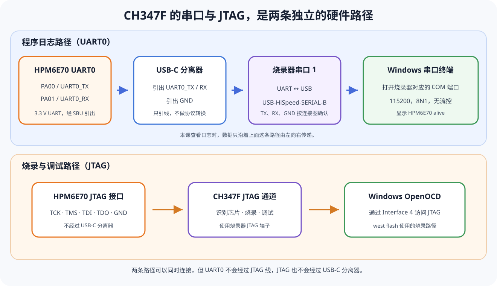
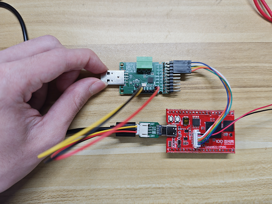
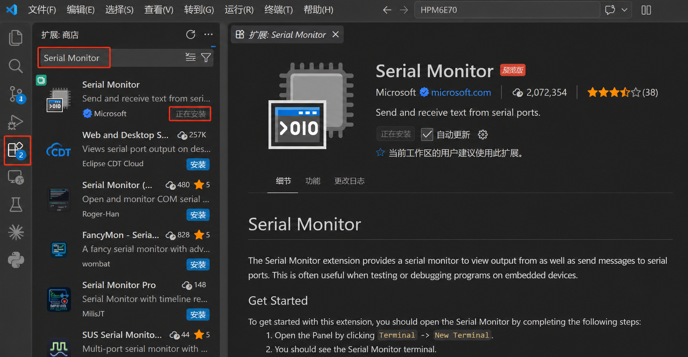
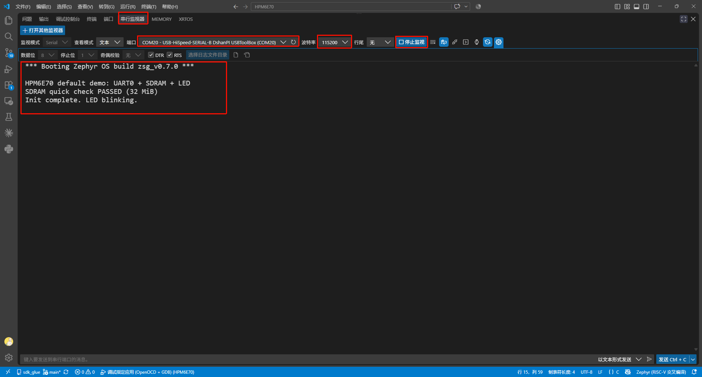

# 连接串口与 COM 端口

上一篇已经把 JTAG 五线连接到板卡并完成驱动配置；UART0 提供另一条持续观察程序运行状态的路径。本课把板卡 UART0 接入烧录器串口 1，在 Windows 中确认对应的 COM 端口并装好串口终端。使用一期的现成工程可以立即观察日志；二期则在工程完成编译烧录后观察。

`west flash` 与串口日志走的是两条独立路径。日志能够显示，需要 UART 引脚、USB-C 分离器、烧录器串口通道、Windows 驱动和终端参数全部正确；本课先把这条路径准备就绪。

:::info[完成后的可见结果]
设备管理器能找到烧录器串口 1 对应的 `USB-HiSpeed-SERIAL-B` COM 端口；VS Code Serial Monitor 已安装，并按 115200、8N1、无流控配置完成。
:::

## UART0 日志经过哪些设备



本板的日志路径是：

```text
应用 printk()
→ Zephyr console
→ HPM6E70 UART0
→ PA00 / UART0_TX
→ USB-C SBU1
→ USB-C 分离器
→ 烧录器串口 1（USB-HiSpeed-SERIAL-B）的 RX
→ Windows COM 端口
→ VS Code Serial Monitor
```

板卡 `D+/D-` 上的原生 USB 与 SBU 上的 UART0 是不同信号。普通 USB 数据线不会把 SBU1/SBU2 自动转换成 COM 端口；需要分离器引出 SBU 信号，再交给烧录器串口 1 的 USB-UART 通道。

## 从 Board 文件核对波特率和管脚

串口终端的参数来自 Board，而不是从截图照抄。打开：

```text
boards/hpmicro/dshanmcu_hpm6e70/dshanmcu_hpm6e70.dts
```

`chosen` 把 Zephyr 控制台指向 UART0，UART0 节点再给出波特率：

```dts
/ {
    chosen {
        zephyr,console = &uart0;
        zephyr,shell-uart = &uart0;
    };
};

&uart0 {
    status = "okay";
    current-speed = <115200>;
    pinctrl-0 = <&pinmux_uart0>;
    pinctrl-names = "default";
};
```

打开同目录的 `dshanmcu_hpm6e70-pinctrl.dtsi`，还能看到 `pinmux_uart0` 使用 PA00 和 PA01：

```dts
/* 原理图：PA00=UART0_TX，PA01=UART0_RX。 */
pinmux = <HPMICRO_PINMUX(HPMICRO_PIN(HPMICRO_PORTA, 0), IOC_TYPE_IOC, 0, 2)>,
         <HPMICRO_PINMUX(HPMICRO_PIN(HPMICRO_PORTA, 1), IOC_TYPE_IOC, 0, 2)>;
```

构建完成后，还可以在生成的 `build/zephyr/zephyr.dts` 中复核 `zephyr,console` 与 `current-speed = <0x1c200>`（即十进制 115200）确实生效；尚未构建时，先按上面的 Board 源文件核对即可。

## 断电连接 UART0

:::caution[接线前先断电]
断开板卡和烧录器的 USB 电源，再插入 USB-C 分离器和信号线。不要根据线材颜色判断 TX、RX 或 GND。
:::

板卡侧通过 USB-C 分离器引出 UART0，最终按信号方向连接：

| 板卡或分离器一侧 | 烧录器串口 1 | 数据方向 |
| --- | --- | --- |
| UART0_TX / SBU1 | RX | 板卡日志进入电脑 |
| UART0_RX / SBU2 | TX | 电脑数据进入板卡 |
| GND | GND | 双方共用电压参考 |

下图同时保留了 JTAG 五线连接，并在板卡左侧 USB-C 接口插入分离器。UART0 的 TX、RX 和 GND 从分离器引出，JTAG 与串口可以同时连接，但两组信号不会互相替代。



<p className="image-caption">串口实物连接：USB-C 分离器负责引出 UART0；彩色线只用于区分导线，实际接线以 TX→RX、RX→TX、GND→GND 为准。</p>

TX 与 RX 要交叉连接，因为一端发送的数据必须进入另一端接收引脚。只查看日志时，最少需要板卡 TX、烧录器串口 1 的 RX 和 GND；保留 RX→TX 连接可供后续 Zephyr Shell 或交互应用使用。

本板使用 3.3 V UART 电平。USB-C 分离器与烧录器串口 1 的端子编号必须按配套连接图或模块原理图确认，不要按线材颜色猜测。两端各自供电时，不要额外并接 3.3 V 或 5 V 电源。

## 在 Windows 中确认实际 COM 端口

JTAG 教程只为 CH347F Interface 4 安装了 WinUSB；串口接口应继续使用 WCH 串口驱动。在设备管理器中展开“端口（COM 和 LPT）”，拔插 USB-UART，找出随设备一起消失和出现的端口。

也可以在 PowerShell 中列出串口：

```powershell
Get-CimInstance Win32_SerialPort |
  Format-Table DeviceID, Name, PNPDeviceID -AutoSize
```

本教程的实测接法把 UART0 接到了烧录器串口 1。该通道在 Windows 和 Serial Monitor 中显示为 `USB-HiSpeed-SERIAL-B DshanPI USBToolBox`；如果同时出现 SERIAL-A 和 SERIAL-B，应选择 SERIAL-B。

`COM20` 是截图所在电脑当次分配的端口号，重新插拔设备、换 USB 接口或换一台电脑后都可能变化。识别端口时应同时核对 `USB-HiSpeed-SERIAL-B` 名称和当前 COM 编号，不能只照抄 `COM20`。

设备管理器完全没有串口时，先检查 USB 连接和驱动。WCH 串口驱动可从[官方 CH343/CH347 驱动页面](https://www.wch-ic.com/downloads/CH343SER_EXE.html)取得；此时不需要修改 Zephyr 工程。

## 使用 VS Code Serial Monitor

在 VS Code 扩展视图中搜索 `Serial Monitor`，安装发布者为 Microsoft、扩展标识为下面内容的项目：

```text
ms-vscode.vscode-serial-monitor
```

搜索结果中可能出现多个名称相近的串口扩展。选择扩展前，先核对名称为 `Serial Monitor`，发布者为 `Microsoft`；不要只根据搜索结果中的名称或图标判断。



<p className="image-caption">VS Code 扩展市场：选择 Microsoft 发布的 Serial Monitor；安装按钮、版本号和界面布局可能随扩展更新而变化。</p>

Microsoft 的[官方扩展页面](https://marketplace.visualstudio.com/items?itemName=ms-vscode.vscode-serial-monitor)说明该扩展可以查看串口输出，也可以向串口发送数据。安装后打开底部面板并切换到 `Serial Monitor`。

使用设备管理器或 PowerShell 确认的端口，并设置：

| 参数 | 本板设置 |
| --- | --- |
| Port | `USB-HiSpeed-SERIAL-B DshanPI USBToolBox` 当前对应的 COM 端口 |
| Baud rate | 115200 |
| Data bits | 8 |
| Parity | None |
| Stop bits | 1 |
| Flow control | None |

这组参数通常缩写为 `115200 8N1`。本板 UART0 没有连接 RTS/CTS 硬件流控线，因此 Flow control 使用 `None`。

端口与参数配置完成后，先不要关闭 Serial Monitor 面板：烧录固件并复位板卡后，运行日志就会出现在这里。

下面是一期默认 Demo 的正常输出示例：



<p className="image-caption">选择 USB-HiSpeed-SERIAL-B 对应的 COM 端口，波特率设为 115200。复位后能够看到 Zephyr 启动信息、SDRAM 自检通过和 LED 初始化完成，说明 UART0 日志输出正常。</p>

## 按现象缩小故障范围

### 设备管理器中没有 COM 端口

检查 USB-UART 到电脑的 USB 线和串口驱动。Windows 尚未建立串口设备，修改 DTS 或重新烧录不会解决该问题。

### COM 端口存在但无法打开

同一个串口通常不能被多个程序同时占用。断开其他 Serial Monitor、串口助手或终端程序后再连接。

### 持续乱码

持续乱码说明端口已经打开、线路上也确实有数据，但波特率、串口格式或电气连接不正确——即使本课还没烧录固件，板上遗留的旧固件或线路干扰也可能造成这种输出。重新核对 115200 8N1、GND、线长和供电稳定性。只有复位瞬间出现少量残缺字符、随后长期正常时，才属于正常的起始现象。

### 端口能打开但复位后没有文字

日志要等固件烧录并运行后才会产生。若绿色 LED 已经每秒翻转而串口仍无输出，按“观察串口输出”的核对清单逐项检查接线、端口和参数。

## 完成检查

- [ ] 能区分 JTAG 与 UART0 的硬件路径和用途。
- [ ] 能从 Board DTS 找到 `zephyr,console` 与 115200 波特率。
- [ ] UART0_TX→RX、UART0_RX→TX、GND→GND，且没有并接两端电源。
- [ ] 能在 Windows 中找到烧录器串口 1 的 `USB-HiSpeed-SERIAL-B`，并确认其实际 COM 端口。
- [ ] VS Code Serial Monitor 已安装并设置为 115200、8N1、无流控。

[上一篇：连接并验证 JTAG](../common-04-连接JTAG与OpenOCD/README.md) · [进入一期](../p1-01-从example-application认识标准工程/README.md) · [进入二期](../p2-01-搭建SDK-Glue工作区/README.md) · [课程目录](../README.md)
