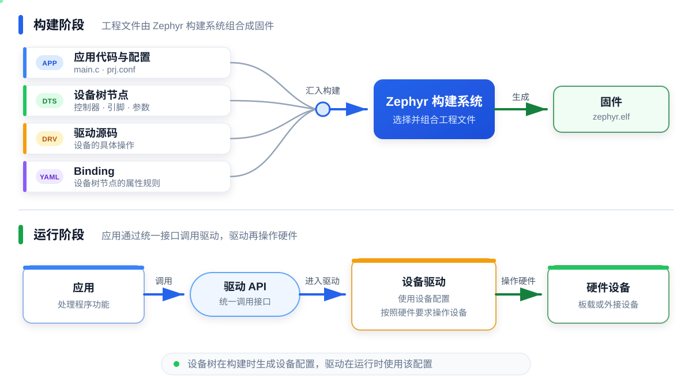
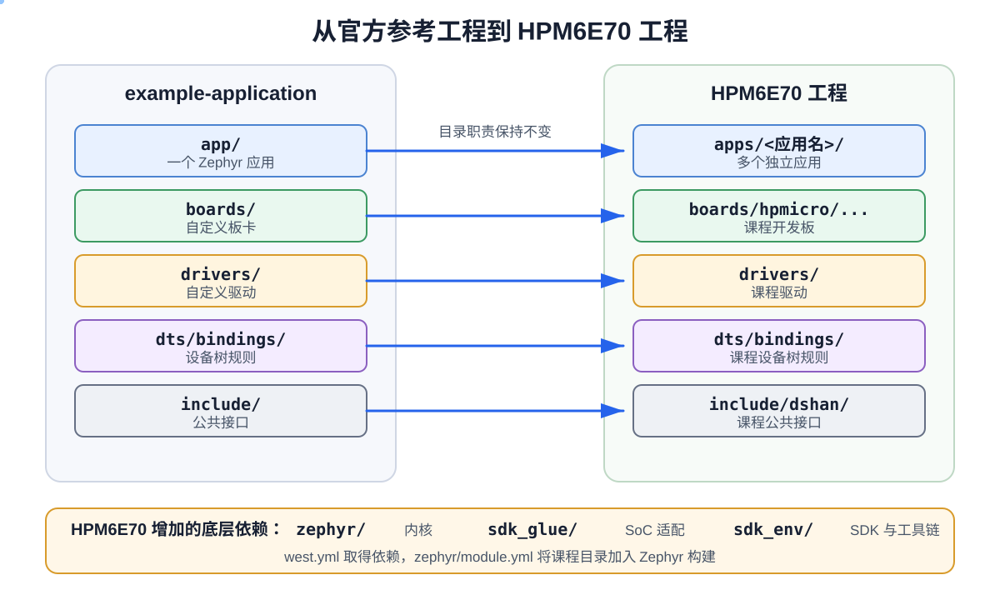

# 第 1 课：从 example-application 认识标准工程

打开 Zephyr 官方的 [example-application](https://github.com/zephyrproject-rtos/example-application)，首先看到的不是一个单独的 `main.c`，而是 `app/`、`boards/`、`drivers/`、`dts/bindings/` 等目录。要理解这些目录为什么存在，需要先知道 Zephyr 工程由哪些内容组成。

本课先介绍 Zephyr、应用、设备树和驱动，再阅读 `example-application` 的目录，最后找到它们在 HPM6E70 工程中的实际位置。这里只确认各类文件的职责，不编写驱动，也不要求学习工程中的全部 demo。

## Zephyr、应用、设备树和驱动

Zephyr 是一个主要运行在微控制器（MCU）上的实时操作系统，HPM6E70 就是一颗 MCU。它提供线程调度、内存管理等内核功能，也提供驱动接口、设备树和构建系统。开发一个 Zephyr 程序时，除了编写要执行的功能，还要告诉构建系统使用哪块板卡、板上有哪些硬件以及需要编译哪些驱动。

| 名称 | 在工程中负责什么 |
| --- | --- |
| Zephyr | 提供操作系统内核、统一的驱动接口和构建系统 |
| 应用 | 决定程序要完成什么功能，例如读取外设数据并打印结果 |
| 驱动 | 按照具体硬件的工作方式操作设备，并向应用提供接口 |
| 设备树 | 描述板上有哪些设备，以及设备使用的控制器、引脚和参数 |
| Binding | 规定某类设备树节点可以填写哪些属性、哪些属性必须提供 |

假设工程需要读取一个外接设备：

- 应用决定什么时候读取数据，以及怎样处理结果；
- 驱动按照设备的工作方式操作硬件，并把结果交给应用；
- 设备树记录设备连接到哪个控制器、使用哪些引脚以及需要哪些参数；
- Binding 规定对应设备树节点可以填写哪些属性、哪些属性必须提供；
- Zephyr 驱动 API 为应用提供统一的调用方式。

下图上半部分表示构建时发生的事情：应用代码与配置、驱动源码、设备树节点和 Binding 一起进入 Zephyr 构建系统，生成可以烧录的固件。下半部分表示程序运行后的调用方向：应用通过 Zephyr 驱动 API 调用驱动，驱动再操作硬件设备。



*图 1：构建时的文件组合与运行时的驱动调用。*

如果把引脚直接写进应用，更换接线时就要修改应用代码；如果每个应用都重新实现一遍硬件操作，同一份功能也会被重复编写。Zephyr 将应用、硬件描述和驱动分开，再由构建系统把它们组合成最终固件。

现在再看 `example-application`，它的目录名称就有了明确含义：`app/` 保存应用，`drivers/` 保存驱动，`dts/bindings/` 保存设备树规则，`boards/` 保存板卡本身的硬件描述。

## example-application 的工程结构

`example-application` 的官方说明列出了工作区应用、Zephyr 模块、自定义板卡、设备树 Binding 和树外驱动等内容。与后续课程直接相关的目录可以整理为：

```text
example-application/
├─ app/                 # 一个可以独立构建的 Zephyr 应用
├─ boards/              # 工程自己的板卡文件
├─ drivers/             # 工程自己的驱动
├─ dts/bindings/        # 工程自己的设备树 Binding
├─ include/             # 提供给应用使用的头文件
├─ zephyr/module.yml    # Zephyr 模块说明文件
├─ CMakeLists.txt       # 模块的 CMake 入口
├─ Kconfig              # 模块的 Kconfig 入口
└─ west.yml             # west 工作区清单
```

这些文件没有放在 Zephyr 源码目录中，因此通常称为“树外工程”。“树外”只表示文件的存放位置改变了，不表示脱离 Zephyr：应用仍然使用 Zephyr API，驱动仍然按照 Zephyr 设备模型注册，最终仍由 Zephyr 构建系统生成固件。

其中有两个入口需要先分清：

- `west.yml` 告诉 west 需要取得哪些代码仓库；
- `zephyr/module.yml` 告诉 Zephyr 当前仓库还提供了哪些 Kconfig、CMake、板卡和设备树目录。

一个负责准备工作区中的代码，一个负责让这些代码进入 Zephyr 构建。HPM6E70 工程继续使用了这两个入口。

## 从 example-application 到 HPM6E70 工程

官方模板展示的是通用结构，课程工程还要解决 HPM6E70 的芯片支持问题。本课程使用的 [HPMicro Zephyr SDK Glue](https://github.com/hpmicro/zephyr_sdk_glue) 基于 Zephyr 3.7.0，HPMicro 的芯片级适配由这个项目维护，而不在 Zephyr 官方主线中。

因此，课程工程在 `example-application` 的结构上增加了三个依赖目录：

- `zephyr/`：Zephyr 内核和构建系统；
- `sdk_glue/`：HPMicro 的 Zephyr SoC 适配；
- `sdk_env/`：HPM SDK、交叉编译工具链和配套工具。

下图左侧是官方模板，右侧是课程工程。横向箭头表示目录负责的内容保持不变；底部列出 HPM6E70 额外需要的底层依赖。



*图 2：官方参考工程与 HPM6E70 工程的目录对应关系。*

其余目录继续承担官方模板中的职责，只针对课程的使用方式做了调整：

| example-application | HPM6E70 工程 | 调整内容 |
| --- | --- | --- |
| `app/` | `apps/<应用名>/` | 从一个应用扩展为多个独立应用 |
| `boards/` | `boards/hpmicro/dshanmcu_hpm6e70/` | 保存本课程开发板的 Board 文件 |
| `drivers/` | `drivers/` | 保存课程编写的驱动 |
| `dts/bindings/` | `dts/bindings/` | 保存课程编写的设备树 Binding |
| `include/` | `include/dshan/` | 保存需要提供给应用的公共接口 |
| `zephyr/module.yml` | `zephyr/module.yml` | 将当前工程注册为 `dshanmcu` 模块 |
| `Kconfig` | `Kconfig` | 进入本工程的驱动配置 |
| `CMakeLists.txt` | `drivers/CMakeLists.txt` | 进入本工程的驱动编译目录 |
| `west.yml` | `west.yml` | 引入 HPMicro `sdk_glue` 的工作区清单 |

把这些对应关系放回课程工程，可以得到下面的目录：

```text
HPM6E70/
├─ west.yml
├─ Kconfig
├─ apps/
├─ boards/
├─ drivers/
├─ dts/bindings/
├─ include/dshan/
├─ sdk_glue/
├─ sdk_env/
└─ zephyr/
```

目录名称虽然不完全相同，但组织原则没有改变：Zephyr 和 HPMicro 提供底层支持，`boards/`、`drivers/`、`dts/` 和 `include/` 保存多个应用可以共用的内容，`apps/` 保存可以分别构建和运行的应用。

## 新增应用、设备树和驱动的位置

以后增加一个外接模块时，不是只添加一个 `main.c`。应用、硬件连接和驱动实现属于不同部分，应写入不同目录：

| 要增加的内容 | 文件位置 | 文件负责什么 |
| --- | --- | --- |
| 应用工程 | `apps/<应用名>/` | 保存应用配置、源文件和构建入口 |
| 应用代码 | `apps/<应用名>/src/main.c` | 调用驱动并处理业务逻辑 |
| 应用配置 | `apps/<应用名>/prj.conf` | 启用应用需要的 Zephyr 功能和驱动 |
| 设备树节点 | `apps/<应用名>/boards/dshanmcu_hpm6e70.overlay` | 描述外接模块使用的控制器、引脚和参数 |
| 设备树 Binding | `dts/bindings/<类别>/<厂商>,<设备>.yaml` | 规定该节点可以填写哪些属性 |
| 驱动源码 | `drivers/<类别>/<驱动名>/` | 初始化设备并实现 Zephyr 驱动接口 |
| 公共接口 | `include/dshan/` | 保存需要直接提供给应用的头文件 |
| 驱动配置 | 驱动目录及上级目录中的 `Kconfig` | 决定驱动何时可以被启用 |
| 驱动编译 | 驱动目录及上级目录中的 `CMakeLists.txt` | 决定启用后编译哪些源文件 |

`boards/hpmicro/dshanmcu_hpm6e70/` 保存开发板本身固定存在的硬件。应用目录中的 `.overlay` 保存某个应用额外接入或启用的硬件。更换外接模块或模块引脚时，通常修改应用的 `.overlay`，不修改板卡基础文件。

## 本课检查点

打开课程工程，按照本课的顺序确认：

1. 找到 `west.yml`、`zephyr/module.yml` 和 `Kconfig`；
2. 找到 `zephyr/`、`sdk_glue/` 和 `sdk_env/`；
3. 找到 `apps/`、`boards/`、`drivers/` 和 `dts/bindings/`；
4. 能说明这些目录分别保存应用、板卡文件、驱动和设备树 Binding。

现在不需要修改文件。能够完成以上目录核对，本课就完成了。

下一课：[构建和烧录应用](../p1-02-一键开发工作流/README.md)
