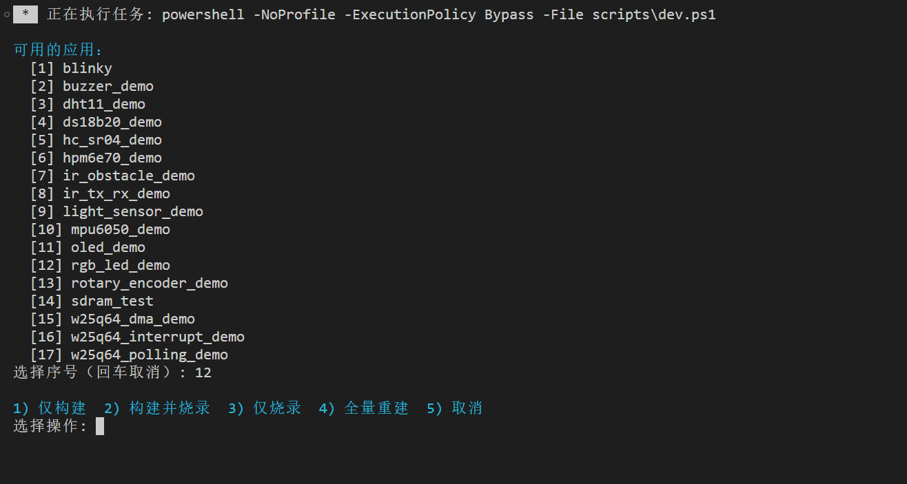
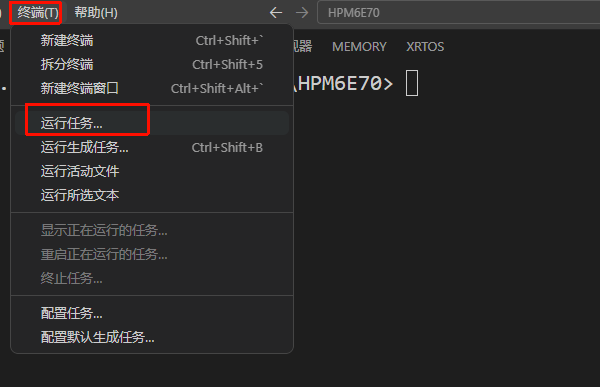
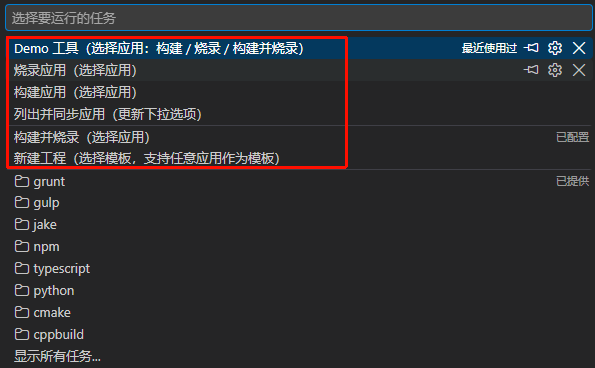

# 第 2 课：构建和烧录应用

HPM6E70 工程的 `apps/` 目录中可以保存多个应用。构建时需要确定应用目录、构建目录和开发板名称，烧录时还要使用对应应用的构建结果。每次手动输入完整的 `west` 命令，容易选错应用或构建目录。

工程提供了 `scripts/dev.ps1` 来统一处理这些参数。可以在终端中直接执行该脚本，也可以使用已经配置好的 VS Code 任务。两种操作方式调用的是同一个脚本，构建结果也保存在相同位置。`dev.ps1` 是 HPM6E70 工程提供的辅助脚本，不是 Zephyr 自带的命令。

## 使用终端命令

在 HPM6E70 工程根目录打开 PowerShell。脚本会使用工程中 `.venv` 目录里的 Python 和 west，以及 `sdk_env/tools` 目录里的 CMake 与 Ninja，不需要在终端中另外查找这些工具。

### 打开应用操作菜单

执行下面的命令：

```powershell
.\scripts\dev.ps1
```

脚本首先扫描 `apps/` 目录，并列出其中包含 `CMakeLists.txt` 的应用。输入应用前面的序号后，可以继续选择构建、烧录或全量重建：

| 输入 | 执行的操作 |
| --- | --- |
| `1` | 仅构建 |
| `2` | 构建并烧录 |
| `3` | 仅烧录 |
| `4` | 清除原有构建结果后重新构建 |
| `5` | 取消本次操作 |

### 按名称执行操作

如果已经知道应用名称，可以把操作和应用名称直接写在命令中：

| 命令 | 作用 |
| --- | --- |
| `.\scripts\dev.ps1 list` | 扫描 `apps/` 目录，并同步 VS Code 中的应用选项 |
| `.\scripts\dev.ps1 new <名称>` | 从模板创建新应用 |
| `.\scripts\dev.ps1 build <名称>` | 构建指定应用，结果保存到 `build/<名称>/` |
| `.\scripts\dev.ps1 rebuild <名称>` | 清除原有构建结果后重新构建指定应用 |
| `.\scripts\dev.ps1 flash <名称>` | 烧录指定应用的构建结果 |
| `.\scripts\dev.ps1 build-flash <名称>` | 构建并烧录指定应用 |

例如，下面的命令会构建 `hpm6e70_demo`，并把结果保存到 `build/hpm6e70_demo/`：

```powershell
.\scripts\dev.ps1 build hpm6e70_demo
```

每次构建成功后，脚本会把应用名称记录到 `build/active-app.txt`。后续执行 `build` 或 `flash` 时如果没有填写名称，脚本会使用这个当前应用。

脚本还会把最近一次构建得到的文件复制到两个固定位置：

| 固定位置 | 用途 |
| --- | --- |
| `build/current/zephyr/zephyr.elf` | 供 VS Code 的 F5 调试配置使用 |
| `build/compile_commands.json` | 让 VS Code 的代码跳转和代码提示跟随当前应用 |

## 安装 VS Code 扩展

HPM6E70 工程在 `.vscode/extensions.json` 中列出了 3 个推荐扩展。它们分别负责代码编辑、断点调试和串口查看：

| 扩展名称 | 扩展标识符 | 在本工程中的用途 |
| --- | --- | --- |
| C/C++ | `ms-vscode.cpptools` | 提供 C/C++ 代码补全、跳转和错误提示，并读取 `build/compile_commands.json` |
| Cortex-Debug | `marus25.cortex-debug` | 配合工程中的 OpenOCD 和 GDB 配置，通过 `F5` 调试程序 |
| Serial Monitor | `ms-vscode.vscode-serial-monitor` | 打开开发板串口，查看程序输出 |

用 VS Code 打开 HPM6E70 工程时，如果右下角出现安装推荐扩展的提示，点击「安装」即可一次安装这 3 个扩展。

如果没有看到提示，按下 `Ctrl+Shift+X` 打开扩展面板，在搜索框中输入：

```text
@recommended
```

扩展面板会显示当前工程推荐的扩展。依次点击「安装」，直到上表中的 3 个扩展都显示为已安装。

## 使用 VS Code

工程的 `.vscode/tasks.json` 已经把常用操作配置成 VS Code 任务。这些任务仍然调用 `scripts/dev.ps1`，只是把终端命令放进了任务列表。

### 使用快捷键打开操作菜单

按下 `Ctrl+Shift+B`。VS Code 会运行默认任务，并在终端中显示可用的应用。



先输入应用前面的序号，再输入要执行的操作。图中的应用列表来自当前工程的 `apps/` 目录；增加或删除应用后，列表内容也会发生变化。

### 从菜单打开操作任务

也可以依次点击 VS Code 顶部菜单中的「终端」和「运行任务...」。



任务列表出现后，选择「Demo 工具（选择应用：构建 / 烧录 / 构建并烧录）」。



选择完成后，终端中会出现与 `Ctrl+Shift+B` 相同的应用列表和操作选项。

### 直接选择一项操作

不需要进入 Demo 工具菜单时，可以在 VS Code 的任务列表中直接选择下面的任务：

| 操作 | 在任务列表中选择 |
| --- | --- |
| 构建指定应用 | 「构建应用（选择应用）」 |
| 构建并烧录指定应用 | 「构建并烧录（选择应用）」 |
| 烧录指定应用 | 「烧录应用（选择应用）」 |
| 更新应用下拉列表 | 「列出并同步应用（更新下拉选项）」 |
| 新建应用 | 「新建工程（选择模板，支持任意应用作为模板）」 |

任务执行后，VS Code 会在终端中显示脚本的运行过程。构建是否成功应以终端最后的构建结果和退出状态为准，不能只根据某一行文字的颜色判断。

### 使用 F5 调试当前应用

确认 Cortex-Debug 已经安装后，按下 `F5` 并选择要调试的应用。VS Code 会先构建该应用，再使用 `build/current/zephyr/zephyr.elf` 进入调试。

OpenOCD、GDB 和开发板配置已经写在工程的 `.vscode` 目录中，不需要再次填写路径。

## 本课检查点

完成下面的操作即可继续下一课：

1. 在工程根目录执行 `.\scripts\dev.ps1 list`，确认终端能够列出应用；
2. 确认 C/C++、Cortex-Debug 和 Serial Monitor 这 3 个推荐扩展已经安装；
3. 按下 `Ctrl+Shift+B`，确认 VS Code 能够打开相同的应用操作菜单；
4. 能够说明终端命令和 VS Code 任务最终都调用 `scripts/dev.ps1`；
5. 知道应用的构建结果保存在 `build/<应用名>/`。

下一课使用「新建工程」任务创建第一个应用工程，并查看 `CMakeLists.txt`、`prj.conf`、`src/main.c` 和应用 overlay 的作用。
