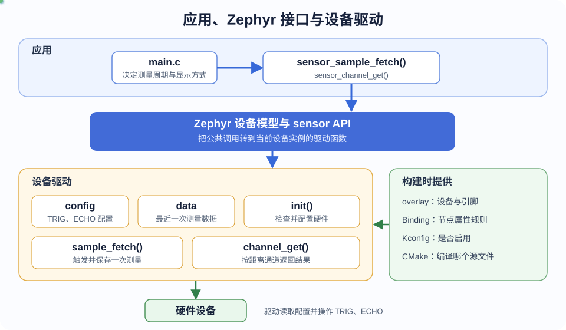

# 第 4 课：认识 Zephyr 驱动结构

`apps/hc_sr04_demo/` 已经能够独立构建，但工程中还没有超声波模块的设备树节点、Binding 和驱动。此时如果直接在 `main.c` 中控制两个 GPIO，虽然可能测出距离，却会把硬件连接、模块时序和应用功能写在同一个文件里。

接下来先确定各部分的职责。我们会让应用只发出“采样”和“读取距离”两个请求；引脚、脉冲时序和距离计算交给驱动。这样更换板卡引脚时不必重写应用，更换同类传感器时也能尽量保留应用代码。

## 应用和驱动分别负责什么

以接下来要实现的 HC-SR04 测距功能为例，一次测量包含两类工作：

| 负责者 | 要处理的内容 | 不应该处理的内容 |
| --- | --- | --- |
| 应用 | 决定何时测量、如何显示距离、发生错误后是否重试 | TRIG 接在哪个引脚、ECHO 脉宽怎样换算 |
| 驱动 | 产生 TRIG 脉冲、测量 ECHO 脉宽、换算并保存距离 | 每隔多久测量、距离以厘米还是毫米显示 |

这个分工不是按文件名人为约定的。Zephyr 的设备模型在两者之间提供了统一接口：驱动实现接口，应用取得设备后调用接口。

## 选择 Zephyr sensor 接口

HC-SR04 返回的是距离，因此驱动接入 Zephyr 的 sensor（传感器）子系统，并使用 `SENSOR_CHAN_DISTANCE` 表示距离通道。应用以后只需要包含：

```c
/* 应用只包含 Zephyr 公共接口，不直接包含具体驱动源码。 */
#include <zephyr/drivers/sensor.h>
```

应用侧会出现下面四个关键调用：

```c
/* 节点标签来自应用 overlay，设备对象由驱动注册宏生成。 */
const struct device *sensor = DEVICE_DT_GET(HC_SR04_NODE);

/* 驱动会在 main() 之前初始化，应用使用前仍要检查结果。 */
if (!device_is_ready(sensor)) {
	return 0;
}

/* 先让驱动更新样本，再读取本轮的距离值。 */
sensor_sample_fetch(sensor);
sensor_channel_get(sensor, SENSOR_CHAN_DISTANCE, &distance);
```

这段代码现在还不能加入 `main.c`，因为对应的设备实例尚未生成。先认识每个调用需要什么：

| 调用 | 含义 | 驱动必须提前提供什么 |
| --- | --- | --- |
| `DEVICE_DT_GET()` | 取得构建时创建的设备对象 | 启用的设备树节点和设备注册宏 |
| `device_is_ready()` | 判断驱动初始化是否成功 | 返回状态明确的初始化函数 |
| `sensor_sample_fetch()` | 请求驱动更新一次测量结果 | `sample_fetch` 驱动函数 |
| `sensor_channel_get()` | 读取指定通道的结果 | `channel_get` 驱动函数和距离通道 |

先把驱动准备完整，再写这段应用代码，编译错误会更容易定位：设备树生成失败、驱动没有进入链接、设备初始化失败和应用调用错误分别发生在不同阶段。

## 一个驱动实例由哪些部分组成

下图按职责排列工程对象。先看中间的 Zephyr 公共接口：它把上方的应用与下方的具体驱动隔开；右侧的工程文件在构建时决定驱动能否生成设备实例。



*图 1：应用只面对 Zephyr sensor API；驱动内部保存配置和运行数据，并通过设备注册宏成为可调用的设备实例。*

驱动源文件中会逐步加入六个部分：

| 驱动部分 | 在 HC-SR04 驱动中的作用 |
| --- | --- |
| `DT_DRV_COMPAT` | 指定驱动匹配 `dshan,hc-sr04` 节点 |
| `struct hc_sr04_config` | 保存从设备树取得的 TRIG、ECHO GPIO；运行中不改变 |
| `struct hc_sr04_data` | 保存最近一次采样得到的 ECHO 脉宽 |
| `hc_sr04_init()` | 检查 GPIO 控制器并配置两个引脚的方向 |
| `sample_fetch`、`channel_get` | 完成测量，并按 sensor API 返回距离 |
| `SENSOR_DEVICE_DT_INST_DEFINE()` | 把配置、数据、初始化函数和 API 表组合成设备实例 |

`config` 和 `data` 要分开。引脚连接由硬件决定，固件运行时保持不变，适合放在只读配置中；ECHO 脉宽每次测量都会更新，必须放在运行数据中。如果设备树中增加第二个同类设备，两者可以共用驱动函数，但各自拥有独立的配置和数据。

## 构建时需要哪些文件

驱动源文件并不是独立生效的。构建系统要沿着下面的关系找到它：

```text
apps/hc_sr04_demo/boards/dshanmcu_hpm6e70.overlay
        │ 描述设备和 TRIG、ECHO 连接
        ▼
dts/bindings/sensor/dshan,hc-sr04.yaml
        │ 检查节点允许出现的属性
        ▼
drivers/sensor/hc_sr04/Kconfig 与 CMakeLists.txt
        │ 决定是否启用并编译驱动
        ▼
drivers/sensor/hc_sr04/hc_sr04.c
        │ 注册 Zephyr sensor 设备
        ▼
apps/hc_sr04_demo/src/main.c
          通过公共接口使用设备
```

这些文件不能随意调换顺序：

1. 设备树节点先给出真实硬件连接；
2. Binding 再规定节点必须提供哪些属性；
3. Kconfig 和 CMake 决定驱动是否进入本次固件；
4. 驱动读取节点属性并注册设备；
5. 应用最后取得已经注册的设备并调用 sensor API。

设备树和 Binding 都在构建阶段参与处理，不会作为文本文件放到开发板上运行。最终固件中保留的是由它们生成的配置和设备对象。

## 从哪里判断问题

理解生成阶段和运行阶段的区别，能够缩小排查范围：

| 现象 | 先检查的位置 |
| --- | --- |
| `compatible` 找不到 Binding | `dts/bindings/` 中的 YAML 文件名和 `compatible` |
| 驱动源文件没有编译 | `.config`、驱动目录的 Kconfig 和 `CMakeLists.txt` |
| `DEVICE_DT_GET()` 引起链接错误 | 节点状态、`DT_DRV_COMPAT` 和设备注册宏 |
| `device_is_ready()` 返回 false | 驱动初始化函数和 GPIO 控制器状态 |
| 能取得设备但测量失败 | TRIG/ECHO 接线、时序、超时和模块供电 |

应用代码不需要为每一种问题都增加底层判断。构建产物和驱动日志能告诉我们故障停在了哪一层。

## 本课检查点

- 能区分应用与驱动各自负责的内容；
- 知道应用将通过 Zephyr sensor API 读取距离；
- 能说明 `config`、`data`、初始化函数、API 表和设备注册宏的作用；
- 能按依赖顺序指出设备树节点、Binding、Kconfig、CMake、驱动和应用的位置；
- 当前只确定结构，还没有提前编写测距应用。

下一课从真实硬件连接开始，把 TRIG 和 ECHO 写进应用 overlay。这个节点将成为 Binding 和驱动共同使用的输入。
