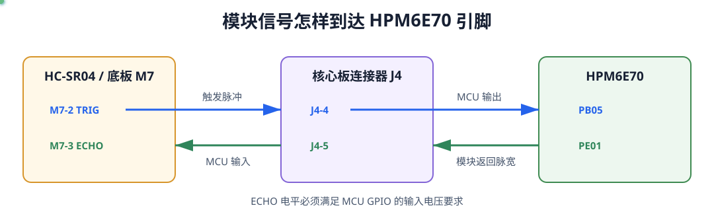

# 第 5 课：描述模块与设备树节点

上一课已经确定：应用只调用 sensor API，驱动负责操作 HC-SR04。驱动要产生 TRIG 脉冲并读取 ECHO，首先必须知道模块在当前板卡上接到了哪两个引脚。把 PB05、PE01 直接写进驱动源码，会让同一驱动无法复用到其他接线或板卡。

Zephyr 使用 Devicetree 描述硬件。本课把 HC-SR04 的连接写入 `apps/hc_sr04_demo/boards/dshanmcu_hpm6e70.overlay`，应用代码暂时不变。

## HC-SR04 的两个信号

HC-SR04 有 VCC、GND、TRIG 和 ECHO 四个引脚。供电之外，软件只需要处理两个数字信号：

| 模块引脚 | 信号方向 | MCU 要做的事 |
| --- | --- | --- |
| TRIG | MCU → HC-SR04 | 输出一个不短于 10 μs 的高电平脉冲，启动一次测量 |
| ECHO | HC-SR04 → MCU | 读取高电平持续时间，它对应声波往返时间 |

当前底板和核心板的信号连接如下图。观察重点是模块插座名称、板间连接器编号和最终 MCU 引脚，不要只记住 PB05、PE01 两个结果。



*图 1：底板 M7 插座的 TRIG、ECHO 信号经过核心板 J4，分别连接 HPM6E70 的 PB05 和 PE01。*

| 信号 | 底板模块插座 | 核心板连接器 | HPM6E70 引脚 |
| --- | --- | --- | --- |
| TRIG | M7-2 | J4-4 | PB05 |
| ECHO | M7-3 | J4-5 | PE01 |

HC-SR04 常见模块使用 5 V 供电，ECHO 可能输出 5 V 高电平。MCU GPIO 是 3.3 V 逻辑时，必须使用底板已有的电平处理电路，或者外接分压/电平转换，不能把未经处理的 5 V ECHO 直接接入 MCU。

PB05 和 PE01 还与底板上的其他模块信号复用。进行本实验时不要同时使用占用这两个信号的 SPI Flash 模块。

## overlay 是什么

开发板本身已经有一份设备树文件：

```text
boards/hpmicro/dshanmcu_hpm6e70/dshanmcu_hpm6e70.dts
```

这份 DTS 描述板卡共有的硬件，例如 CPU、内存和板载外设。HC-SR04 是当前应用外接的模块，不是每个应用都要使用它，因此不应该直接修改这份公共文件。

Zephyr 为此提供了 **Devicetree overlay**。在这里可以先把 overlay 理解为“当前应用对设备树的补充文件”：它使用与 DTS 相同的语法，在构建时与开发板 DTS 合并，最终生成一份完整的设备树。

```text
开发板 DTS                                         应用 overlay
boards/hpmicro/dshanmcu_hpm6e70/                   apps/hc_sr04_demo/boards/
dshanmcu_hpm6e70.dts                               dshanmcu_hpm6e70.overlay
                         \                         /
                          +------ 构建时合并 ------+
                                      |
                                      v
                  build/hc_sr04_demo/zephyr/zephyr.dts
```

`.overlay` 不是在开发板上运行的程序，也不会替代原来的 DTS。它主要做两件事：

- 使用 `&节点标签 { ... };` 修改已有节点，例如启用一个原本关闭的外设；
- 使用 `/ { ... };` 在设备树根节点下增加当前应用需要的新设备。

创建应用时复制的模板已经在 overlay 中保留了以下内容：

```dts
/* 当前应用继续使用基础模板已经配置的 SDRAM。 */
&dram {
	status = "okay";
};
```

`&dram` 引用开发板 DTS 中已有的 `dram` 节点，`status = "okay"` 表示当前应用启用它。这段代码属于上面的第一种用法。本课接下来使用第二种用法，在根节点下增加 HC-SR04。

当前构建目标名是 `dshanmcu_hpm6e70`，所以 Zephyr 会自动查找应用目录中的 `boards/dshanmcu_hpm6e70.overlay`。文件名必须与构建目标对应，否则文件即使放在 `boards/` 中，也不会自动参与本次构建。

## 在应用 overlay 中增加模块

打开 `apps/hc_sr04_demo/boards/dshanmcu_hpm6e70.overlay`。保留刚才说明的 `&dram` 节点，然后在文件末尾加入：

```dts
/ {
	/* 节点标签供应用通过 DT_NODELABEL() 取得设备。 */
	hc_sr04_sensor: hc-sr04 {
		/* compatible 同时连接本设备的 Binding 和驱动。 */
		compatible = "dshan,hc-sr04";
		status = "okay";

		/* 引脚来自 M7/J4 的实际连接，两个信号均按高电平有效描述。 */
		trig-gpios = <&gpiob 5 GPIO_ACTIVE_HIGH>;
		echo-gpios = <&gpioe 1 GPIO_ACTIVE_HIGH>;
	};
};
```

逐项看节点传递了什么信息：

| 写法 | 含义 | 后续由谁使用 |
| --- | --- | --- |
| `hc_sr04_sensor:` | 节点标签，C 代码可通过 `DT_NODELABEL(hc_sr04_sensor)` 找到它 | 应用 |
| `hc-sr04` | 节点名称，描述设备种类 | Devicetree 工具 |
| `compatible` | 设备与哪个 Binding、驱动匹配 | Binding 和驱动 |
| `status = "okay"` | 当前应用启用这个设备 | 设备实例生成宏 |
| `trig-gpios` | GPIOB 第 5 脚，逻辑高有效 | 驱动配置数据 |
| `echo-gpios` | GPIOE 第 1 脚，逻辑高有效 | 驱动配置数据 |

`<&gpiob 5 GPIO_ACTIVE_HIGH>` 不是普通数组。`&gpiob` 是 GPIO 控制器引用，`5` 是控制器内部的引脚编号，最后一项描述有效电平。驱动以后通过 `gpio_dt_spec` 读取这些信息，不需要再次写 PB05。

## 把两个引脚设置为普通 IO

HPM6E70 的一个封装引脚可以承担多种外设功能。除了声明 GPIO 控制器和编号，还要用 pinctrl 选择普通 IO 功能。

继续在 overlay 末尾加入：

```dts
&pinctrl {
	hc_sr04_pins: hc_sr04_pins {
		group0 {
			/* PB05 和 PE01 都选择 IOC 普通输入输出功能。 */
			pinmux = <HPMICRO_PINMUX(HPMICRO_PIN(HPMICRO_PORTB, 5),
						 IOC_TYPE_IOC, 0, 0)>,
				 <HPMICRO_PINMUX(HPMICRO_PIN(HPMICRO_PORTE, 1),
						 IOC_TYPE_IOC, 0, 0)>;
		};
	};
};

&gpiob {
	/* GPIOB 使用上面定义的默认引脚配置。 */
	pinctrl-0 = <&hc_sr04_pins>;
	pinctrl-names = "default";
};

&gpioe {
	/* GPIOE 同样需要让 PE01 切换为普通 IO。 */
	pinctrl-0 = <&hc_sr04_pins>;
	pinctrl-names = "default";
};
```

`HPMICRO_PIN()` 指出端口和编号，`HPMICRO_PINMUX(..., IOC_TYPE_IOC, 0, 0)` 选择普通 IO 功能。`pinctrl-0` 把这组设置交给 GPIO 控制器的默认状态。节点写对但 pinmux 选择错误时，生成的设备树仍可能正常，实际引脚却不会按 GPIO 工作，因此两部分都要检查。

## 核对完整 overlay

本课结束时，`apps/hc_sr04_demo/boards/dshanmcu_hpm6e70.overlay` 应包含三部分：

```text
应用 overlay
├─ &dram                  启用基础模板使用的 SDRAM
├─ / { hc-sr04 { ... } } 描述 HC-SR04 及两个 GPIO
└─ &pinctrl、&gpiob、&gpioe
                            选择 PB05、PE01 的普通 IO 功能
```

不要在这里填写测距公式、等待时间或 `sensor_sample_fetch()`。overlay 只描述这块板上“有什么”和“怎样连接”，设备的工作过程属于驱动。

## 从生成的 zephyr.dts 检查结果

设备树改变后使用全量构建，避免旧构建目录保留之前的生成文件。

使用 VS Code 时，按下 `Ctrl+Shift+B` 打开 Demo 工具，先输入 `hc_sr04_demo` 前面的序号，再输入 `4` 选择「全量重建」。

使用终端时，在工程根目录执行：

```powershell
.\scripts\dev.ps1 rebuild hc_sr04_demo
```

当前还没有为 `dshan,hc-sr04` 创建 Binding。如果构建输出提示该 `compatible` 没有匹配的 Binding，先不要改成其他名称；第 6 课会补上这个缺口。

构建工具合并开发板 DTS 和应用 overlay 后，会生成：

```text
build/hc_sr04_demo/zephyr/zephyr.dts
```

打开该文件并搜索 `hc-sr04`，应能找到：

```dts
hc_sr04_sensor: hc-sr04 {
	compatible = "dshan,hc-sr04";
	status = "okay";
	trig-gpios = < &gpiob 0x5 0x0 >;
	echo-gpios = < &gpioe 0x1 0x0 >;
};
```

生成文件把十进制引脚号显示为十六进制并不代表数值改变：`0x5` 仍是 5，`0x1` 仍是 1。不要直接编辑 `zephyr.dts`，它会在下次构建时重新生成；发现错误要回到应用 overlay 修改。

## 本课检查点

- 能说明 TRIG 和 ECHO 的信号方向；
- 能从板级连接追踪到 PB05、PE01；
- 能说明开发板 DTS、应用 overlay 和生成文件 `zephyr.dts` 的关系；
- HC-SR04 节点只写在 `hc_sr04_demo` 的 overlay 中；
- 能区分节点属性和 pinctrl 的作用；
- 在生成的 `zephyr.dts` 中能够找到最终 HC-SR04 节点。

下一课为 `compatible = "dshan,hc-sr04"` 编写 Binding，让构建系统知道节点允许出现哪些属性，以及哪些属性不能缺少。
