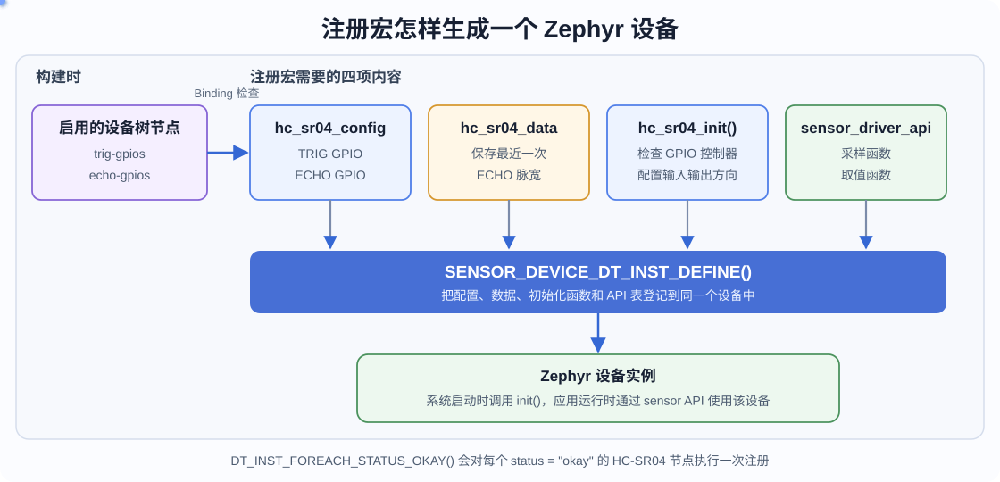

# 第 8 课：完成第一个驱动

前几课已经完成设备树节点、Binding、Kconfig 和 CMake。构建系统现在能够找到设备及其驱动源文件，但“源文件进入编译”还不等于应用已经可以使用这个设备。驱动还要实现初始化和接口函数，并注册为 Zephyr 设备。

## 驱动源文件的编写流程

打开一个 Zephyr 驱动 `.c` 文件，从上到下通常可以分成五部分：

```text
1. 匹配设备树并引入头文件
   DT_DRV_COMPAT、#include、日志模块

2. 定义驱动使用的数据
   config 保存固定配置，data 保存运行数据

3. 编写驱动函数
   初始化函数，以及子系统要求的接口回调函数

4. 建立子系统 API 表
   把统一 API 对应到本驱动的接口回调函数

5. 生成设备实例
   从设备树读取配置，并用设备注册宏组合 config、data、初始化函数和 API 表
```

前两部分准备驱动需要的信息，第三部分完成实际操作，第四部分让 Zephyr 的统一 API 能找到这些操作，最后一部分把它们登记为设备实例。具体驱动的函数名称会不同，但文件内部都要解决这五件事。

## 在 hc_sr04.c 中实现这五部分

回到当前工程，`drivers/sensor/hc_sr04/hc_sr04.c` 已经进入编译，但其中只有一行占位注释。下面按照刚才的五部分，从文件顶部开始逐段完成它。

本课实现便于观察工作过程的轮询驱动：发送 TRIG 脉冲后，使用有上限的循环等待 ECHO 并测量脉宽。它适合完成第一版驱动；如果应用不能接受最长约 60 ms 的忙等，应改用 GPIO 中断或定时器输入捕获。

先看第五部分最终要组合哪些内容。下图不是完整源文件的执行顺序：设备树为 `hc_sr04_config` 提供引脚配置；`hc_sr04_data`、`hc_sr04_init()` 和 `sensor_driver_api` 来自驱动源码。设备注册宏把这四项内容登记为同一个设备。



*图 1：Binding 先检查节点属性；设备注册宏再把配置、运行数据、初始化函数和 sensor API 表登记到同一个设备实例。*

| 部分 | 保存或执行的内容 |
| --- | --- |
| `hc_sr04_config` | 从设备树得到的 TRIG、ECHO GPIO，固件运行期间不改变 |
| `hc_sr04_data` | 最近一次测得的 ECHO 脉宽 |
| `hc_sr04_init()` | 检查 GPIO 控制器，并配置输入输出方向 |
| `sensor_driver_api` | 把 Zephyr sensor API 转到本驱动的采样和取值函数 |

配置和运行数据分开，是 Zephyr 设备驱动常见的组织方式。多个相同设备实例可以共用一套函数，但每个实例拥有自己的引脚配置和测量结果。

## 让驱动匹配 compatible

打开 `drivers/sensor/hc_sr04/hc_sr04.c`，删除占位注释，先写入文件头和头文件：

```c
/* SPDX-License-Identifier: Apache-2.0 */

/* 让后续 DT_INST_* 宏只处理 compatible 为 dshan,hc-sr04 的节点。 */
#define DT_DRV_COMPAT dshan_hc_sr04

/* 设备模型、GPIO、sensor API、时间函数和日志均由 Zephyr 提供。 */
#include <zephyr/device.h>
#include <zephyr/drivers/gpio.h>
#include <zephyr/drivers/sensor.h>
#include <zephyr/kernel.h>
#include <zephyr/logging/log.h>

#include <errno.h>
#include <stdint.h>

/* 驱动日志沿用 sensor 子系统的日志等级配置。 */
LOG_MODULE_REGISTER(hc_sr04, CONFIG_SENSOR_LOG_LEVEL);
```

`DT_DRV_COMPAT` 必须写在使用 `DT_INST_*` 宏之前。它来自节点中的 `dshan,hc-sr04`，C 标识符不能包含逗号和连字符，所以写成 `dshan_hc_sr04`。后面的实例宏只处理与该 compatible 匹配且状态为 `okay` 的节点。

`LOG_MODULE_REGISTER()` 把驱动日志归入 `hc_sr04` 模块，并使用 sensor 子系统的日志等级。应用的普通结果仍使用 `printk()`；驱动内部的初始化和错误信息使用日志接口，便于统一控制等级。

## 保存设备树配置和测量结果

在头文件之后加入：

```c
/* config 保存由设备树决定、运行期间不改变的引脚配置。 */
struct hc_sr04_config {
	struct gpio_dt_spec trig;
	struct gpio_dt_spec echo;
};

/* data 保存每个设备实例各自的最新测量结果。 */
struct hc_sr04_data {
	uint32_t echo_us;
};

/* 两段等待都必须有上限，避免模块断开时永久卡在轮询中。 */
#define HC_SR04_ECHO_TIMEOUT_US 30000U
#define HC_SR04_WAIT_TIMEOUT_US 30000U
```

`gpio_dt_spec` 同时保存 GPIO 设备、引脚编号和有效电平。驱动以后调用带 `_dt` 后缀的 GPIO API，就不需要分别传这三项。

两个 30000 μs 上限分别约束“等待 ECHO 开始”和“等待 ECHO 结束”。没有上限时，模块断开或收不到回波会让主线程永久停在循环中。当前值覆盖约 5 m 往返声程，超出本实验使用范围时会返回错误。

## 初始化两个 GPIO

继续加入：

```c
static int hc_sr04_init(const struct device *dev)
{
	/* dev->config 指向设备注册时绑定的只读配置。 */
	const struct hc_sr04_config *cfg = dev->config;

	/* 引脚所属的 GPIO 控制器必须先完成初始化。 */
	if (!gpio_is_ready_dt(&cfg->trig)) {
		LOG_ERR("TRIG GPIO controller not ready");
		return -ENODEV;
	}
	if (!gpio_is_ready_dt(&cfg->echo)) {
		LOG_ERR("ECHO GPIO controller not ready");
		return -ENODEV;
	}

	/* TRIG 初始保持低电平，ECHO 只作为输入读取。 */
	if (gpio_pin_configure_dt(&cfg->trig, GPIO_OUTPUT_INACTIVE) != 0) {
		LOG_ERR("failed to configure TRIG pin");
		return -EIO;
	}
	if (gpio_pin_configure_dt(&cfg->echo, GPIO_INPUT) != 0) {
		LOG_ERR("failed to configure ECHO pin");
		return -EIO;
	}

	LOG_INF("HC-SR04 ready");
	return 0;
}
```

`dev->config` 指向当前实例的只读配置。初始化先检查两个 GPIO 控制器是否已经就绪，再把 TRIG 设为初始低电平输出、ECHO 设为输入。

初始化函数返回 0 时，`device_is_ready()` 才会把 HC-SR04 视为可用；任何一步返回负错误码，应用就不应继续测量。

## 触发一次采样

在 `hc_sr04_init()` 前加入采样函数：

```c
static int hc_sr04_sample_fetch(const struct device *dev,
				enum sensor_channel chan)
{
	const struct hc_sr04_config *cfg = dev->config;
	struct hc_sr04_data *data = dev->data;
	uint32_t wait_us = 0;
	uint32_t echo_us = 0;

	/* 本驱动只接受“全部通道”或“距离通道”的采样请求。 */
	if (chan != SENSOR_CHAN_ALL && chan != SENSOR_CHAN_DISTANCE) {
		return -ENOTSUP;
	}

	/* 发送不短于 10 us 的触发脉冲，20 us 留出余量。 */
	gpio_pin_set_dt(&cfg->trig, 1);
	k_busy_wait(20);
	gpio_pin_set_dt(&cfg->trig, 0);

	/* 等待 ECHO 拉高；没有回波时用超时退出。 */
	while (gpio_pin_get_dt(&cfg->echo) == 0) {
		if (++wait_us > HC_SR04_WAIT_TIMEOUT_US) {
			LOG_DBG("no echo (timeout waiting for pulse start)");
			return -EAGAIN;
		}
		k_busy_wait(1);
	}

	/* 统计 ECHO 高电平持续的微秒数。 */
	while (gpio_pin_get_dt(&cfg->echo) == 1) {
		if (++echo_us > HC_SR04_ECHO_TIMEOUT_US) {
			LOG_DBG("echo pulse too long");
			return -EIO;
		}
		k_busy_wait(1);
	}

	/* 保存本轮脉宽，channel_get() 随后再完成单位换算。 */
	data->echo_us = echo_us;
	return 0;
}
```

`sensor_sample_fetch()` 的含义是让驱动更新一次内部样本，而不是直接把数值返回给应用。本驱动把 ECHO 脉宽保存到 `data->echo_us`，取值函数随后再完成单位转换。

`SENSOR_CHAN_ALL` 表示采集设备支持的全部通道；本设备只有距离通道，所以它和 `SENSOR_CHAN_DISTANCE` 都可以执行同一测量。其他通道返回 `-ENOTSUP`。

`k_busy_wait(1)` 会让 CPU 忙等 1 μs。这里需要测量微秒级脉宽，不能换成毫秒级 `k_sleep()`。忙等期间当前 CPU 不能处理同一线程中的其他任务，所以必须保留超时上限。

## 把脉宽换算为距离

继续加入：

```c
static int hc_sr04_channel_get(const struct device *dev,
			       enum sensor_channel chan,
			       struct sensor_value *val)
{
	struct hc_sr04_data *data = dev->data;

	if (chan != SENSOR_CHAN_DISTANCE) {
		return -ENOTSUP;
	}

	/* 343 m/s 等于 343 um/us；除以 2 得到单程距离。 */
	uint64_t distance_um = (uint64_t)data->echo_us * 343ULL / 2ULL;

	/* sensor_value 用“整数米 + 百万分之一米”返回标准距离。 */
	val->val1 = (int32_t)(distance_um / 1000000ULL);
	val->val2 = (int32_t)(distance_um % 1000000ULL);
	return 0;
}
```

ECHO 表示声波从模块到目标再返回的往返时间，因此距离要除以 2。驱动采用 343 m/s 作为当前计算使用的声速；温度和湿度会影响实际声速，所以这里得到的是实验测距值，不是经过环境补偿的精密测量。

Zephyr 的 `sensor_value` 用两个整数表达数值：`val1` 是整数部分，`val2` 是百万分之一单位的小数部分。`SENSOR_CHAN_DISTANCE` 使用米作为 SI 单位，所以 0.25 m 表示为 `val1 = 0`、`val2 = 250000`。驱动保持标准单位，显示成厘米还是毫米由应用决定。

## 连接 sensor API 并生成实例

在文件末尾加入：

```c
/* 把 Zephyr sensor API 的两个入口对应到本驱动函数。 */
static const struct sensor_driver_api hc_sr04_driver_api = {
	.sample_fetch = hc_sr04_sample_fetch,
	.channel_get = hc_sr04_channel_get,
};

/* 每个状态为 okay 的节点都拥有独立的 data 和 config。 */
#define HC_SR04_DEFINE(inst)                                         \
	static struct hc_sr04_data hc_sr04_data_##inst;              \
	static const struct hc_sr04_config hc_sr04_config_##inst = { \
		.trig = GPIO_DT_SPEC_INST_GET(inst, trig_gpios),     \
		.echo = GPIO_DT_SPEC_INST_GET(inst, echo_gpios),     \
	};                                                           \
	SENSOR_DEVICE_DT_INST_DEFINE(inst, hc_sr04_init, NULL,       \
				     &hc_sr04_data_##inst,           \
				     &hc_sr04_config_##inst,         \
				     POST_KERNEL,                    \
				     CONFIG_SENSOR_INIT_PRIORITY,    \
				     &hc_sr04_driver_api);

/* 为所有匹配节点展开上面的设备实例定义。 */
DT_INST_FOREACH_STATUS_OKAY(HC_SR04_DEFINE)
```

`sensor_driver_api` 把统一接口与本驱动函数对应起来。应用调用 `sensor_sample_fetch()` 时，Zephyr 会通过设备实例中的 API 表进入 `hc_sr04_sample_fetch()`。

`GPIO_DT_SPEC_INST_GET(inst, trig_gpios)` 读取 Binding 已经检查过的 `trig-gpios`。这里必须写下划线形式 `trig_gpios`；宏会找到设备树中的连字符属性。

`SENSOR_DEVICE_DT_INST_DEFINE()` 组合了当前实例的初始化函数、运行数据、只读配置、初始化阶段、优先级和 API 表。`POST_KERNEL` 表示内核基础能力就绪后初始化，`CONFIG_SENSOR_INIT_PRIORITY` 使用 sensor 子系统统一的初始化优先级。

最后，`DT_INST_FOREACH_STATUS_OKAY()` 为每个启用的 HC-SR04 节点展开一次 `HC_SR04_DEFINE()`。当前 overlay 只有一个节点，因此生成一个设备实例；以后增加第二个节点时，不需要复制驱动函数。

## 构建并检查设备实例

使用 VS Code 时，按下 `Ctrl+Shift+B` 打开 Demo 工具，先输入 `hc_sr04_demo` 前面的序号，再输入 `4` 选择「全量重建」。

使用终端时，在工程根目录执行：

```powershell
.\scripts\dev.ps1 rebuild hc_sr04_demo
```

构建成功后依次检查：

1. `build/hc_sr04_demo/zephyr/.config` 中存在 `CONFIG_DSHAN_HC_SR04=y`；
2. 构建输出包含 `drivers/sensor/hc_sr04/hc_sr04.c`；
3. `build/hc_sr04_demo/zephyr/zephyr.map` 中能搜索到 `hc_sr04_init` 和 `hc_sr04_driver_api`；
4. `zephyr.elf`、`zephyr.hex` 已重新生成。

当前应用还没有取得该设备，也没有调用测距接口。驱动实例已经进入固件，并不等于应用已经使用它。下一课回到 `src/main.c`，只通过 Zephyr sensor API 获取距离。

## 本课检查点

- 能说明 `config` 与 `data` 分别保存什么；
- 初始化函数会检查并配置 TRIG、ECHO；
- 采样函数有明确的等待上限；
- 距离通过 `sensor_value` 按米返回；
- `sensor_driver_api` 和 `SENSOR_DEVICE_DT_INST_DEFINE()` 已把驱动注册为 Zephyr sensor 设备。
