# 第 9 课：编写应用并调用驱动

HC-SR04 驱动已经注册为 Zephyr sensor 设备，但应用仍然只运行基础模板。现在回到 `apps/hc_sr04_demo/src/main.c`：应用负责决定何时测量以及怎样显示结果，不再读取 TRIG、ECHO，也不包含 `hc_sr04.c`。

这种分工带来一个直接结果：应用只依赖 `<zephyr/drivers/sensor.h>` 中的统一接口。GPIO 时序、超时和距离计算继续留在驱动中。

## Zephyr 何时执行应用

开发板上电后不会立即进入应用的 `main()`。启动代码先准备处理器和 C 运行环境，Zephyr 随后初始化内核以及已经注册的设备，最后由主线程调用应用提供的 `main()`。

HC-SR04 驱动使用 `SENSOR_DEVICE_DT_INST_DEFINE()` 注册，并选择 `POST_KERNEL` 初始化阶段。因此，程序进入 `main()` 时设备初始化已经执行过；应用不需要再次调用 `hc_sr04_init()`，只需要用 `device_is_ready()` 检查初始化结果。

应用代码还会用到两个基础接口：

| 接口 | 在本应用中的作用 | 信息来自哪里 |
| --- | --- | --- |
| `printk()` | 把初始化状态和距离输出到控制台 | 控制台由开发板 DTS 中的 `zephyr,console` 选择 |
| `k_sleep(K_SECONDS(1))` | 让主线程等待 1 秒，再开始下一次测量 | 测量周期由应用决定，不属于驱动协议 |

`K_SECONDS(1)` 同时表达数值和单位。休眠期间，内核可以运行其他线程或进入空闲状态；空循环延时会持续占用 CPU，时间还会受主频和编译优化影响。

## 应用调用经过哪些函数



*图 1：应用先取得设备实例，再通过 sensor API 进入驱动；驱动读取设备树配置并操作模块，测量值沿相反方向返回。*

图中的 `sensor_sample_fetch()` 和 `sensor_channel_get()` 是 Zephyr 公共接口，`hc_sr04_sample_fetch()` 和 `hc_sr04_channel_get()` 是上一课实现的驱动函数。两者通过设备实例中的 `sensor_driver_api` 对应起来。

## 引入 sensor API

打开 `apps/hc_sr04_demo/src/main.c`，在已有 Zephyr 头文件中增加：

```c
/* 使用 Zephyr 公共 sensor API，不依赖 HC-SR04 驱动的内部实现。 */
#include <zephyr/drivers/sensor.h>
```

应用不应写：

```c
/* 错误示例：不要把驱动 .c 文件直接包含进应用。 */
#include "../../../drivers/sensor/hc_sr04/hc_sr04.c"
```

直接包含 `.c` 文件会绕过驱动构建和设备模型，还可能造成函数重复定义。驱动已经由 Zephyr Module 和 CMake 编译，应用只需要公共 API 头文件。

## 通过节点标签取得设备

在现有 `LED_NODE`、`SDRAM_NODE` 宏附近增加：

```c
/* 名称必须对应 overlay 中 hc_sr04_sensor: 这个节点标签。 */
#define HC_SR04_NODE DT_NODELABEL(hc_sr04_sensor)
```

`hc_sr04_sensor` 来自第 5 课 overlay 中的节点标签：

```dts
/* 应用通过这个标签取得已经注册的设备对象。 */
hc_sr04_sensor: hc-sr04 {
```

继续在 `main()` 前增加：

```c
static const struct device *sensor_init(void)
{
	/* DEVICE_DT_GET() 取得构建阶段生成的设备对象，不会扫描硬件。 */
	const struct device *dev = DEVICE_DT_GET(HC_SR04_NODE);

	/* 初始化失败的设备对象存在，但不能继续调用。 */
	if (!device_is_ready(dev)) {
		printk("ERROR: hc-sr04 device not ready: %s\n", dev->name);
		return NULL;
	}

	printk("sensor: %s ready\n", dev->name);
	return dev;
}
```

`DEVICE_DT_GET()` 根据节点取得编译期已经生成的设备对象地址，它不会在运行时扫描总线，也不会动态创建设备。

取得地址后仍要调用 `device_is_ready()`。如果驱动初始化时发现 GPIO 控制器未就绪或引脚配置失败，设备对象虽然存在，但不能安全使用。返回 `NULL` 让 `main()` 停止后续测量，比继续解引用无效设备更容易定位问题。

如果 `DEVICE_DT_GET()` 在编译阶段就报错，优先检查节点标签和驱动实例宏；如果能够编译但 `device_is_ready()` 为假，优先检查驱动初始化日志和 GPIO 配置。两种现象对应不同阶段。

## 保留核心板初始化

模板中的 SDRAM 检查和 LED 初始化不属于测距逻辑。为了让 `main()` 更容易阅读，把原有相关代码整理成一个函数，放在 `sensor_init()` 之前：

```c
static int coreboard_init(void)
{
	int ret;

	printk("\nHC-SR04 demo: coreboard + ultrasonic sensor\n");

	/* 先保留基础模板的 SDRAM 自检，确认核心板仍正常工作。 */
	ret = quick_sdram_check();
	printk("SDRAM quick check %s (%lu MiB)\n",
	       ret == 0 ? "PASSED" : "FAILED",
	       (unsigned long)(SDRAM_SIZE_BYTES / (1024UL * 1024UL)));

	if (!gpio_is_ready_dt(&led)) {
		printk("ERROR: PC22 LED GPIO controller is not ready\n");
		return -ENODEV;
	}

	/* LED 初始保持关闭，主循环中再翻转它作为运行指示。 */
	ret = gpio_pin_configure_dt(&led, GPIO_OUTPUT_INACTIVE);
	if (ret != 0) {
		printk("ERROR: PC22 LED configure failed: %d\n", ret);
		return ret;
	}

	return 0;
}
```

这里只是把原来位于 `main()` 中的基础模板代码移入函数，`quick_sdram_check()` 本身保持不变。函数返回 0 表示基础板功能可以继续，返回负错误码表示初始化失败。

## 完成测距主循环

用下面的代码替换原来的 `main()`：

```c
int main(void)
{
	bool led_state = false;
	int ret;

	/* 核心板基础检查未通过时，不开始外接模块测量。 */
	ret = coreboard_init();
	if (ret != 0) {
		return 0;
	}

	/* 驱动已在 main() 前初始化，这里取得设备并检查状态。 */
	const struct device *sensor = sensor_init();
	if (sensor == NULL) {
		return 0;
	}

	printk("Init complete. LED blinking, ranging every second.\n");

	while (true) {
		struct sensor_value distance;

		/* 每轮翻转 LED，便于观察主循环是否仍在运行。 */
		led_state = !led_state;
		gpio_pin_set_dt(&led, led_state);

		/* 先触发一次新测量；无回波时等待下一轮。 */
		ret = sensor_sample_fetch(sensor);
		if (ret == -EAGAIN) {
			printk("distance: (no echo, target out of range)\n");
			goto sleep;
		} else if (ret != 0) {
			printk("ERROR: sample fetch failed: %d\n", ret);
			goto sleep;
		}

		/* 采样成功后，读取本轮保存的标准距离通道。 */
		ret = sensor_channel_get(sensor, SENSOR_CHAN_DISTANCE, &distance);
		if (ret != 0) {
			printk("ERROR: channel get failed: %d\n", ret);
			goto sleep;
		}

		/* sensor_value 的单位是米，先合成微米再转换为厘米。 */
		int32_t total_um =
			(int32_t)distance.val1 * 1000000 + distance.val2;
		int32_t cm_x100 = total_um / 100;

		printk("distance: %d.%02d cm\n",
		       cm_x100 / 100, cm_x100 % 100);

sleep:
		/* 所有成功和失败分支都在下一轮前等待 1 秒。 */
		k_sleep(K_SECONDS(1));
	}

	return 0;
}
```

主循环每次完成四步：

1. 改变板载 LED 状态，表示程序仍在运行；
2. `sensor_sample_fetch()` 让驱动执行一次真实测量；
3. `sensor_channel_get()` 取得标准距离通道；
4. 把米转换为带两位小数的厘米并输出，然后等待 1 秒。

先采样、再取值不能调换。`sensor_channel_get()` 只读取驱动上一次保存的 `echo_us`；如果没有先采样，得到的不是本轮新数据。

## sensor_value 怎样转换为厘米

驱动返回的单位是米：

```text
实际值（米） = val1 + val2 / 1 000 000
```

应用先把它合成微米：

```c
/* val1 是整数米，val2 是百万分之一米。 */
total_um = val1 * 1000000 + val2;
```

1 cm 等于 10000 μm。为了使用整数打印两位小数，代码让厘米值先放大 100 倍：

```c
/* 厘米值放大 100 倍，便于用整数打印两位小数。 */
cm_x100 = total_um / 100;
```

例如驱动返回 0.2514 m，`total_um` 为 251400，`cm_x100` 为 2514，最后打印成 `25.14 cm`。应用负责显示单位，驱动仍保持 Zephyr sensor API 使用的标准单位。

## 分别处理无回波和其他错误

驱动在等待不到 ECHO 脉冲时返回 `-EAGAIN`。应用把它显示为“没有回波或目标超出范围”，然后等待下一轮，不会因为一次测量失败就退出。

其他负错误码使用统一错误信息输出。`goto sleep` 在这里不是跳过资源释放，而是让所有测量分支共用循环末尾的一次休眠，避免错误发生时立即高速重试并刷满串口。

## 构建应用调用

使用 VS Code 时，按下 `Ctrl+Shift+B` 打开 Demo 工具，先输入 `hc_sr04_demo` 前面的序号，再输入 `4` 选择「全量重建」。

使用终端时，在工程根目录执行：

```powershell
.\scripts\dev.ps1 rebuild hc_sr04_demo
```

构建日志应同时出现应用和驱动两个编译输入：

```text
apps/hc_sr04_demo/src/main.c
drivers/sensor/hc_sr04/hc_sr04.c
```

如果应用提示 `undefined reference`，说明函数声明已经通过编译，但提供实现的驱动没有进入链接，回到第 7 课检查 Kconfig 和 CMake。若编译器提示找不到 `SENSOR_CHAN_DISTANCE`，则检查是否包含 `<zephyr/drivers/sensor.h>`。

本课只确认完整代码能够编译和链接。连接模块、烧录固件和判断测量结果放在下一课统一完成。

## 本课检查点

- 应用通过节点标签取得 HC-SR04 设备；
- 使用设备前调用 `device_is_ready()`；
- 应用只调用 Zephyr sensor API，不操作 TRIG、ECHO；
- 能说明采样与取值的先后关系；
- 能把 `sensor_value` 的米转换为厘米；
- 应用和驱动源文件都已进入最终链接。
