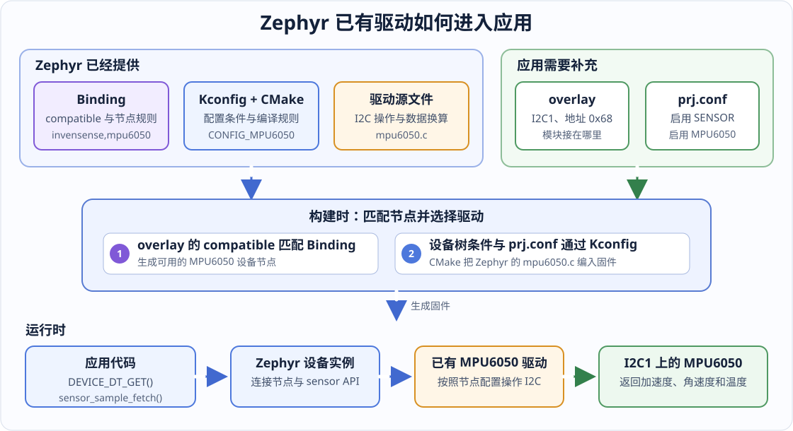

# 第 11 课：复用 Zephyr 已有驱动

前面的课程为 HC-SR04 编写了完整驱动，但接入一个新模块时，不应该马上新建驱动源文件。Zephyr 已经支持了许多常见器件；如果现有驱动与手中的硬件相符，我们只需要描述模块接在哪条总线上、启用哪些配置，再通过统一接口读取数据。

本课以工程中的 `mpu6050_demo` 为例。我们不会再实现一遍 MPU6050 驱动，而是完成下面这件事：

> 找到 Zephyr 已有的 MPU6050 支持，确认它适合当前硬件，并把它接入 HPM6E70 应用。



## 先判断能不能复用

器件名称相同，不代表驱动一定可以直接使用。动手修改应用前，依次检查四项：

| 检查内容 | 要确认的问题 | MPU6050 的答案 |
| --- | --- | --- |
| Binding | 是否存在与器件匹配的 `compatible` | 有：`invensense,mpu6050` |
| 总线与属性 | 驱动使用哪种总线，节点必须提供什么 | I2C；必须提供 `reg`，`int-gpios` 可选 |
| 驱动与配置 | 是否有 Kconfig、CMake 和驱动源文件 | 三者都有，源文件是 `mpu6050.c` |
| 应用接口 | 驱动提供的数据是否满足应用需要 | 可通过 sensor API 读取加速度、角速度和芯片温度 |

四项都满足，才选择复用。如果缺少匹配的 `compatible`、总线不受支持，或者已有驱动没有应用需要的功能，再考虑补充或新写驱动。

## 第一步：找到 Zephyr 中的现有支持

在工程根目录中查找 `mpu6050`，可以找到这些关键文件：

```text
zephyr/
├─ dts/bindings/sensor/
│  └─ invensense,mpu6050.yaml
└─ drivers/sensor/tdk/mpu6050/
   ├─ Kconfig
   ├─ CMakeLists.txt
   ├─ mpu6050.c
   └─ mpu6050_trigger.c
```

它们分别回答不同问题：

- Binding 规定设备树节点怎样写；
- Kconfig 决定驱动是否启用；
- CMake 决定启用后编译哪些源文件；
- 驱动源文件负责通过 I2C 操作器件，并向应用提供 sensor API。

### 从 Binding 确认节点写法

打开 `zephyr/dts/bindings/sensor/invensense,mpu6050.yaml`，先看这两处：

```yaml
compatible: "invensense,mpu6050"

include: [sensor-device.yaml, i2c-device.yaml]
```

这里是 Zephyr 原有内容，所以不改动它。`compatible` 是设备树节点与驱动之间的匹配名称；引入 `i2c-device.yaml` 表示节点必须位于 I2C 控制器下面，并提供从机地址 `reg`。本 Binding 还定义了可选的 `int-gpios`，只有使用数据就绪中断时才需要填写。

### 从 Kconfig 和 CMake 确认驱动会被编译

`zephyr/drivers/sensor/tdk/mpu6050/Kconfig` 中的关键条件是：

```kconfig
menuconfig MPU6050
	bool "MPU6050 Six-Axis Motion Tracking Device"
	default y
	depends on DT_HAS_INVENSENSE_MPU6050_ENABLED
	select I2C
```

`DT_HAS_INVENSENSE_MPU6050_ENABLED` 由设备树生成。只有最终设备树中存在 `status = "okay"` 的 `invensense,mpu6050` 节点，这个条件才成立。也就是说，设备树节点不只是记录接线，它还会影响驱动配置。

对应的 `CMakeLists.txt` 会在配置成立后编译 `mpu6050.c`：

```cmake
zephyr_library()

zephyr_library_sources(mpu6050.c)
zephyr_library_sources_ifdef(CONFIG_MPU6050_TRIGGER mpu6050_trigger.c)
```

### 从驱动源文件确认应用能调用什么

`mpu6050.c` 中的接口表包含：

```c
static const struct sensor_driver_api mpu6050_driver_api = {
	.sample_fetch = mpu6050_sample_fetch,
	.channel_get = mpu6050_channel_get,
};
```

这说明应用可以调用 `sensor_sample_fetch()` 让驱动采样，再调用 `sensor_channel_get()` 取得指定通道的数据。应用不需要知道 MPU6050 的寄存器地址，也不需要直接调用 I2C 读写函数。

## 第二步：在应用 overlay 中描述连接

确认驱动可用后，打开：

```text
apps/mpu6050_demo/boards/dshanmcu_hpm6e70.overlay
```

MPU6050 接在 HPM6E70 的 I2C1 上，节点应写在 `&i2c1` 内：

```dts
/* 启用 MPU6050 所在的 I2C1 控制器。 */
&i2c1 {
	status = "okay";

	/* 为 I2C1 选择开发板已经定义好的 SCL、SDA 引脚。 */
	pinctrl-0 = <&pinmux_i2c1>;
	pinctrl-names = "default";

	/* 节点地址 @68 必须与 reg 中的 I2C 地址一致。 */
	mpu6050: mpu6050@68 {
		/* 此名称同时匹配 Binding 和 Zephyr 内置驱动。 */
		compatible = "invensense,mpu6050";

		/* MPU6050 的 AD0 为低电平时，7 位 I2C 地址为 0x68。 */
		reg = <0x68>;
		status = "okay";

		/* 本应用采用每秒主动读取一次的方式，暂时不配置 INT 引脚。 */
	};
};
```

这段 overlay 只描述当前开发板上的连接关系。寄存器初始化、量程设置和原始数据换算仍由 Zephyr 的 MPU6050 驱动完成。

这里没有填写 `int-gpios`，因为应用使用轮询采样。以后改为数据就绪中断时，再根据实际接线补充该属性，不能为了“写完整”而猜一个引脚。

## 第三步：在 prj.conf 中启用所需功能

打开 `apps/mpu6050_demo/prj.conf`。与模块有关的配置只有三项：

```ini
# 启用 MPU6050 所在的 I2C 总线驱动。
CONFIG_I2C=y

# 启用 Zephyr 统一的传感器接口。
CONFIG_SENSOR=y

# 明确启用 Zephyr 内置的 MPU6050 驱动。
CONFIG_MPU6050=y
```

`CONFIG_SENSOR=y` 提供统一接口，`CONFIG_MPU6050=y` 提供这个器件的具体实现。两者缺少任何一个，应用都无法按本课方式读取数据。

虽然 MPU6050 的 Kconfig 在节点可用时可以默认选中驱动，本应用仍显式写出 `CONFIG_MPU6050=y`。这样查看 `prj.conf` 时，就能直接知道应用依赖哪一个器件驱动。

## 第四步：从设备树取得设备

应用不直接创建驱动对象，而是取得 Zephyr 在启动阶段生成的设备实例。`apps/mpu6050_demo/src/main.c` 中使用节点标签完成这一步：

```c
/* 节点标签 mpu6050 来自本应用的 overlay。 */
#define MPU6050_NODE DT_NODELABEL(mpu6050)

static const struct device *sensor_init(void)
{
	/* 取得与该设备树节点对应的 Zephyr 设备对象。 */
	const struct device *dev = DEVICE_DT_GET(MPU6050_NODE);

	/* 驱动初始化失败或 I2C 控制器不可用时，不能继续读传感器。 */
	if (!device_is_ready(dev)) {
		printk("ERROR: mpu6050 device not ready: %s\n", dev->name);
		return NULL;
	}

	printk("sensor: %s ready\n", dev->name);
	return dev;
}
```

这里有两个不同阶段：

1. `DEVICE_DT_GET()` 在编译结果中找到设备对象；
2. `device_is_ready()` 检查对应驱动在启动时是否初始化成功。

能取得指针不等于硬件已经可用，因此不能省略第二项检查。

## 第五步：通过 sensor API 读取数据

取得设备后，应用在主循环中通过 Zephyr 的统一接口读取三个通道：

```c
struct sensor_value accel[3];
struct sensor_value gyro[3];
struct sensor_value temp;

/* 先让驱动从 MPU6050 读取一组最新原始数据。 */
ret = sensor_sample_fetch(sensor);
if (ret != 0) {
	printk("ERROR: sample fetch failed: %d\n", ret);
	/* 本轮采样失败时等待一秒再重试，避免不停刷出错误信息。 */
	goto sleep;
}

/* 再从驱动缓存中分别取得三轴加速度、三轴角速度和芯片温度。 */
sensor_channel_get(sensor, SENSOR_CHAN_ACCEL_XYZ, accel);
sensor_channel_get(sensor, SENSOR_CHAN_GYRO_XYZ, gyro);
sensor_channel_get(sensor, SENSOR_CHAN_DIE_TEMP, &temp);

sleep:
	/* 无论本轮成功还是失败，都保持每秒一次的读取节奏。 */
	k_sleep(K_SECONDS(1));
```

`sensor_sample_fetch()` 与 `sensor_channel_get()` 分开，是因为一次硬件采样可能同时得到多个通道。先采样一次，再分别取值，可以保证本轮的加速度、角速度和温度来自同一组数据。

返回值使用 `struct sensor_value`，整数部分存放在 `val1`，百万分之一的小数部分存放在 `val2`。本应用将它换算成“毫单位”整数再打印，避免精简版 `printk` 不支持 `%f`：

```c
/* 将 val1 + val2 × 10^-6 换算成毫单位，便于用整数打印。 */
static int32_t to_milli(const struct sensor_value *value)
{
	int64_t micro = (int64_t)value->val1 * 1000000 + value->val2;

	/* 1 个毫单位等于 1000 个微单位。 */
	return (int32_t)(micro / 1000);
}
```

## 第六步：全量构建并检查是否真的复用了驱动

第一次加入设备树节点和配置时使用全量重建，避免旧的构建缓存继续生效。

### 使用 VS Code

1. 按 `Ctrl+Shift+B` 打开任务列表；
2. 选择「Demo 工具（选择应用：构建 / 烧录 / 构建并烧录）」；
3. 输入 `mpu6050_demo` 对应的序号；
4. 输入 `4`，执行「全量重建」。

### 使用终端

在工程根目录执行：

```powershell
.\scripts\dev.ps1 rebuild mpu6050_demo
```

构建成功后应生成：

```text
build/mpu6050_demo/zephyr/zephyr.elf
build/mpu6050_demo/zephyr/zephyr.hex
build/mpu6050_demo/zephyr/zephyr.dts
build/mpu6050_demo/zephyr/.config
```

不要只检查 `zephyr.elf` 是否存在，还要确认 Zephyr 最终使用了我们预期的节点和驱动。

### 检查最终设备树

```powershell
Select-String `
  -Path .\build\mpu6050_demo\zephyr\zephyr.dts `
  -Pattern "mpu6050@68|invensense,mpu6050"
```

结果中应出现：

```text
mpu6050: mpu6050@68 {
    compatible = "invensense,mpu6050";
```

这证明应用 overlay 已合并到最终设备树。

### 检查最终配置

```powershell
Select-String `
  -Path .\build\mpu6050_demo\zephyr\.config `
  -Pattern "^CONFIG_I2C=y$|^CONFIG_SENSOR=y$|^CONFIG_MPU6050=y$"
```

三项配置都应出现：

```text
CONFIG_I2C=y
CONFIG_SENSOR=y
CONFIG_MPU6050=y
```

### 检查驱动源文件是否进入构建

```powershell
Select-String `
  -Path .\build\mpu6050_demo\build.ninja `
  -Pattern "drivers/sensor/tdk/mpu6050/mpu6050.c"
```

如果能找到 Zephyr 目录中的 `drivers/sensor/tdk/mpu6050/mpu6050.c`，就证明这次固件编译的是已有驱动，而不是应用目录中的另一份实现。

## 烧录后观察什么

确认模块已经接到 M11 插座后，可以构建并烧录。

使用 VS Code 时，再次按 `Ctrl+Shift+B`，选择 `mpu6050_demo`，然后输入 `2` 执行「构建并烧录」。

使用终端时执行：

```powershell
.\scripts\dev.ps1 build-flash mpu6050_demo
```

串口首先应出现设备就绪信息，随后每秒输出一组加速度、角速度和温度：

```text
sensor: ... ready
Init complete. LED blinking, sampling every second.
accel[m/s^2 e-3]: ... | gyro[rad/s e-3]: ... | temp[mC]: ...
```

保持模块静止时，角速度应在较小范围内波动；转动模块时，对应轴的角速度应明显变化。模块平放时，某一个方向的加速度绝对值应接近重力加速度，即约 `9815` 毫米每二次方秒。这里用于判断数据是否会随动作变化，不作为传感器校准结果。

## 常见问题从哪里查

| 现象 | 优先检查 |
| --- | --- |
| 构建提示找不到 Binding | `compatible` 是否准确写成 `invensense,mpu6050` |
| `.config` 中没有 `CONFIG_MPU6050=y` | 节点是否位于 I2C 控制器下，节点与控制器是否都是 `okay` |
| 串口提示 `device not ready` | I2C1 的 pinctrl、模块供电、SCL/SDA 接线和地址是否正确 |
| 设备就绪但采样失败 | 模块地址是否真为 `0x68`，总线上是否能够收到器件应答 |
| 数据不随动作变化 | 是否检查了 `sensor_sample_fetch()` 的返回值，是否每轮都重新采样 |

## 本课检查点

- 能在写驱动前找到 Zephyr 已有的 Binding、Kconfig、CMake 和驱动源文件；
- 能根据 Binding 写出 I2C 设备节点，而不是猜属性名称；
- 能说明 overlay、`prj.conf` 和驱动源文件各自负责什么；
- 能通过 `DEVICE_DT_GET()` 与 sensor API 使用已有驱动；
- 能从 `zephyr.dts`、`.config` 和 `build.ninja` 证明驱动确实进入了固件。

以后遇到新模块时，先完成这四项检查，再决定是复用已有驱动，还是补充新的驱动实现。
