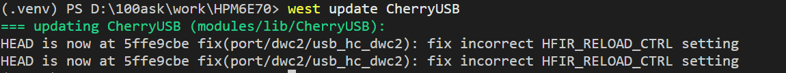
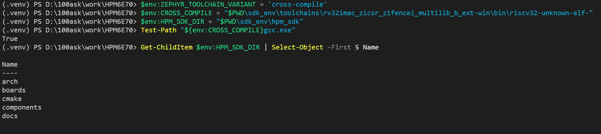

# 第 1 课：搭建 SDK Glue 工作区

HPM6E70 的 Zephyr 开发环境由多部分组成：Zephyr 内核提供操作系统能力，SDK Glue 连接 Zephyr 与 HPMicro 平台，HPM SDK 提供芯片支持，RISC-V 工具链负责生成固件。本课从已经准备好的工程目录开始，使用 `west` 清单把这些部分组合成一个完整工作区。

本课操作依据：[HPMicro《Zephyr SDK Glue 开发指南》](https://kb.hpmicro.com/2025/12/03/zephyr-zephyr-sdk-glue-%E5%BC%80%E5%8F%91%E6%8C%87%E5%8D%97/#windows-%E7%8E%AF%E5%A2%83%E6%90%AD%E5%BB%BA)。

开始前请确认：当前终端位于工程根目录，提示符前有 `(.venv)`，且 Git 与 west 已完成版本检查。CMake 和 Ninja 都使用本课下载到 `sdk_env\tools` 的锁定版本。

## 认识 west：工作区管理工具

`west` 是 Zephyr 官方提供的**工作区管理工具**。可以把它理解为“工程总管”：Git 负责下载某一个代码仓库，而 west 按照一份清单（`sdk_glue/west.yml`）一次性下载并管理 Zephyr、HPMicro 适配层、HPM SDK 等多个相互配合的仓库，还能调用构建、烧录和调试命令。

因此，west 不是编译器，也不是芯片驱动：

| 工具 | 负责什么 |
| --- | --- |
| Git | 下载和管理单个代码仓库 |
| west | 按清单组织多个仓库，并提供 `build`、`flash`、`debugserver` 等开发命令 |
| CMake + Ninja | 生成并执行 C/C++ 构建过程 |
| RISC-V GCC | 把源代码编译成 HPM6E70 能运行的固件 |

本课执行 `west init`、`west update` 后，west 会根据清单把完整源码放入工作区；后续课程执行 `west build` 时，west 再把应用、Board 和工具链串起来。你不需要手工猜测每个仓库应该放在哪里。

:::info[完成后的可见结果]
`west list zephyr sdk_glue sdk_env` 能列出三部分的版本和目录；工作区中能够看到 `.west/`、`zephyr/`、`sdk_glue/` 和 `sdk_env/`；RISC-V 编译器文件检查结果为 `True`。
:::

## 目标工作区目录

本教程使用下面的工作区：

```text
D:\100ask\work\HPM6E70
```

环境完成后，各目录的作用如下：

| 目录 | 内容 |
| --- | --- |
| `.west/` | west 工作区配置 |
| `sdk_glue/` | HPMicro 的 Zephyr 适配层和 west 清单 |
| `zephyr/` | Zephyr 源码 |
| `sdk_env/` | HPM SDK、RISC-V 工具链和 HPMicro 工具环境 |
| `.venv/` | 本工程使用的 Python、west 和 Python 包 |

## 开始前检查

下面从工作区初始化开始。工具安装已经放到“开发准备”中，以下旧版安装段落不再作为本课操作步骤。


## 第一步：创建 west 工作区

先让当前终端使用 UTF-8：

```powershell
$env:PYTHONUTF8 = '1'
```

确认当前终端位于工程根目录后，从 Gitee 初始化工作区：

```powershell
west init -m https://gitee.com/hpmicro/zephyr_sdk_glue.git --mr main
```

`west init` 会先生成 `.west/config`，其中默认记录 `file = west.yml`。本课程使用 Gitee 清单，因此单独执行：

```powershell
west config manifest.file west_gitee.yml
```

最后根据新的清单下载各个仓库：

```powershell
west update
```

### `CherryUSB` 更新失败时如何恢复

`west update` 会按清单逐个更新仓库。某个仓库失败时，前面已经显示 `HEAD is now at ...` 的仓库仍然有效，不需要全部重新下载。

如果命令最后显示：

```text
ERROR: update failed for project CherryUSB
```

先确认清单中的路径：

```powershell
west list CherryUSB
```

本工程中 `CherryUSB` 的目录是 `modules/lib/CherryUSB`。先在工程根目录重试该项目：

```powershell
west update CherryUSB
```

如果仍然失败，强制重新获取该项目：

```powershell
west update -f always CherryUSB
```

如果仓库已经创建但只有 `.git` 目录，说明源码提交还没有拉取完整。清单为 `CherryUSB` 指定的提交是 `5ffe9cbe7fb41489d99806daa8572124ace1b99b`，可以直接从清单配置的 `cherry-embedded` 远程补齐：

```powershell
git -C .\modules\lib\CherryUSB fetch cherry-embedded 5ffe9cbe7fb41489d99806daa8572124ace1b99b
west update CherryUSB
```

成功时会看到类似下面的结果：

```text
HEAD is now at 5ffe9cbe fix(port/dwc2/usb_hc_dwc2): fix incorrect HFIR_RELOAD_CTRL setting
```



图中 `HEAD is now at 5ffe9cbe` 表示 `CherryUSB` 已切换到清单要求的版本；命令返回提示符且没有新的 `ERROR` 时，才继续执行下一步。

下载完成后，工作区应至少包含：

```text
HPM6E70/
├─ .venv/
├─ .west/
├─ bootloader/
├─ modules/
├─ sdk_env/
├─ sdk_glue/
└─ zephyr/
```

检查清单配置：

```powershell
Get-Content .\.west\config
```

其中应看到：

```ini
[manifest]
path = sdk_glue
file = west_gitee.yml
```

如果仍显示 `file = west.yml`，说明清单切换命令还没有执行；回到上面的 `west config manifest.file west_gitee.yml` 单独执行即可。

## 第二步：安装 Zephyr 依赖并准备 SDK

`west update` 完成后，确认终端提示符前有 `(.venv)`，然后按下面的顺序逐条执行。每条命令执行结束、重新出现提示符后，再执行下一条。

### 2.1 安装 Zephyr 的 Python 依赖

```powershell
python -m pip install -i https://pypi.tuna.tsinghua.edu.cn/simple -r .\zephyr\scripts\requirements.txt
```

这条命令只负责把 Zephyr 构建所需的 Python 包安装到当前工程的 `.venv` 中。安装过程结束并回到命令提示符后继续。

### 2.2 检查依赖是否完整

```powershell
python -m pip check
```

看到下面的结果，表示依赖关系没有缺失：

```text
No broken requirements found.
```

如果输出：

```text
ninja 1.11.1.1 is not supported on this platform
```

这通常来自旧流程在 venv 里安装的 Python `ninja` 包。本课程**不再往 venv 安装 Ninja**（它由 SDK 工具环境提供），因此一般不会出现这个提示。若你按旧流程装过，可在当前 `(.venv)` 终端移除它：

```powershell
python -m pip uninstall ninja
```

移除后重新检查会看到 `No broken requirements found.`。本课程使用的 Ninja 在下文第三步加入 PATH（位于 `sdk_env\tools\ninja`），不属于 venv 中的 Python 包。

### 2.3 注册 Zephyr 工程

```powershell
west zephyr-export
```

该命令把当前工作区的 Zephyr CMake 包注册到用户环境中，使后续 CMake 配置能够找到 Zephyr。命令返回提示符且没有 `ERROR` 后继续。

### 2.4 应用 HPM SDK

```powershell
west supply
```

该命令根据清单把 HPM SDK 补丁应用到 `sdk_env\hpm_sdk\`。正常完成时，命令返回提示符且没有出现 `patched ... failed` 或 `ERROR`，然后进入下一步。

#### Windows 下补丁换行符不一致时

如果输出：

```text
0002-fix-enet-phy-rtl8211.patch patched in ...\sdk_env\hpm_sdk failed
```

这是补丁文件与 HPM SDK 源文件的换行符不同导致的检查失败。如果错误只指向这个 `0002` 补丁，前面的补丁已经完成，不要重复执行整个命令。保持当前目录为工程根目录，直接应用第二个补丁：

```powershell
git -C .\sdk_env\hpm_sdk apply --ignore-whitespace ..\..\sdk_glue\scripts\patch\hpm_sdk_v1.11.0\0002-fix-enet-phy-rtl8211.patch
```

这里使用 `..\..\sdk_glue` 是因为 `git -C .\sdk_env\hpm_sdk` 会先切换到 `sdk_env\hpm_sdk`；写成 `.\sdk_glue` 会被解析成错误的 `sdk_env\hpm_sdk\sdk_glue` 路径。

检查补丁是否已经写入：

```powershell
Select-String .\sdk_env\hpm_sdk\components\enet_phy\rtl8201\hpm_rtl8201.h -Pattern media_interface
```

输出包含 `uint8_t media_interface;` 后，表示补丁已完成。RISC-V 工具链位于 `sdk_env\toolchains\`，继续下一步设置当前终端使用的编译工具链。

## 第三步：为当前终端选择 SDK 工具与编译工具链

在当前终端逐行执行：

```powershell
$env:ZEPHYR_TOOLCHAIN_VARIANT = 'cross-compile'
$env:CROSS_COMPILE = "$PWD\sdk_env\toolchains\rv32imac_zicsr_zifencei_multilib_b_ext-win\bin\riscv32-unknown-elf-"
$env:HPM_SDK_DIR = "$PWD\sdk_env\hpm_sdk"
$env:Path = "$PWD\sdk_env\tools\cmake\bin;$PWD\sdk_env\tools\ninja;$env:Path"
```

这段最后一行把 SDK 自带的 CMake 与 Ninja 放到 PATH 最前面。后续 `west build` 会固定使用 `sdk_env\tools` 中的版本，不受系统安装或 Python 虚拟环境里同名程序的影响。

检查文件确实存在：

```powershell
Test-Path "${env:CROSS_COMPILE}gcc.exe"
Get-ChildItem $env:HPM_SDK_DIR | Select-Object -First 5 Name
Get-Command cmake, ninja | Select-Object Name, Source
cmake --version
ninja --version
```

第一条应输出 `True`，第二条应列出 HPM SDK 中的文件或目录。`Get-Command` 显示的 CMake 和 Ninja 路径都应位于当前工程的 `sdk_env\tools`；本工作区自带 CMake 3.24.0。

下面是一次完整的验证结果：编译器可执行文件检查返回 `True`，`HPM_SDK_DIR` 下能够列出 `arch`、`boards`、`cmake` 等目录。



## 每次新建 Windows PowerShell 都要做什么

虚拟环境和下载内容会一直保留，不需要重新安装。每次打开新的 Windows PowerShell 后，进入工作区并重新设置当前终端：

```powershell
Set-Location D:\100ask\work\HPM6E70
Set-ExecutionPolicy -Scope Process Bypass
.\.venv\Scripts\Activate.ps1
$env:PYTHONUTF8 = '1'
$env:ZEPHYR_TOOLCHAIN_VARIANT = 'cross-compile'
$env:CROSS_COMPILE = "$PWD\sdk_env\toolchains\rv32imac_zicsr_zifencei_multilib_b_ext-win\bin\riscv32-unknown-elf-"
$env:HPM_SDK_DIR = "$PWD\sdk_env\hpm_sdk"
$env:Path = "$PWD\sdk_env\tools\cmake\bin;$PWD\sdk_env\tools\ninja;$env:Path"
```

最后检查：

```powershell
python --version
west --version
west list zephyr sdk_env sdk_glue
```

此时 Zephyr SDK Glue 开发环境已经准备完成。后续课程中的 PowerShell 命令默认都在完成这一节的终端中执行。
