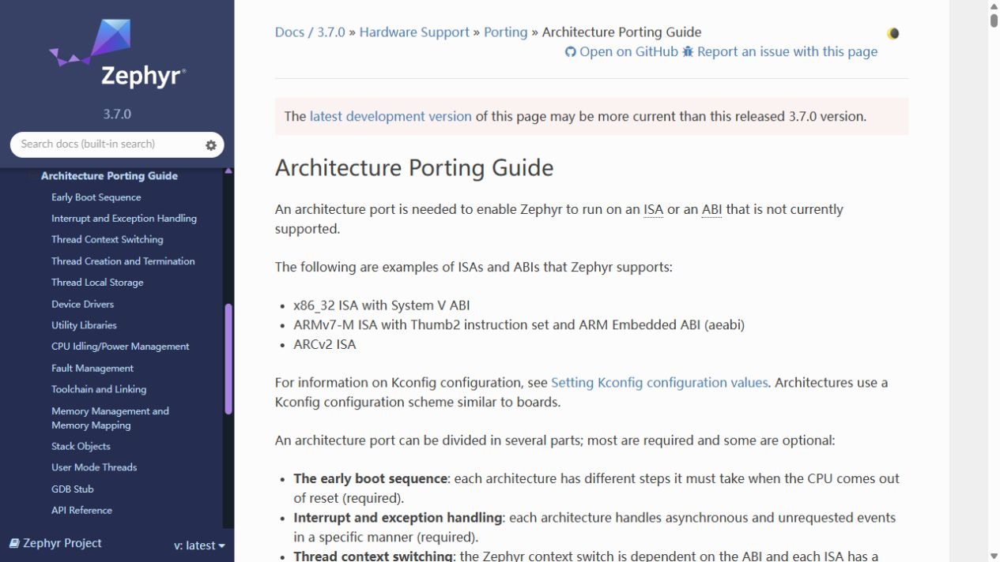
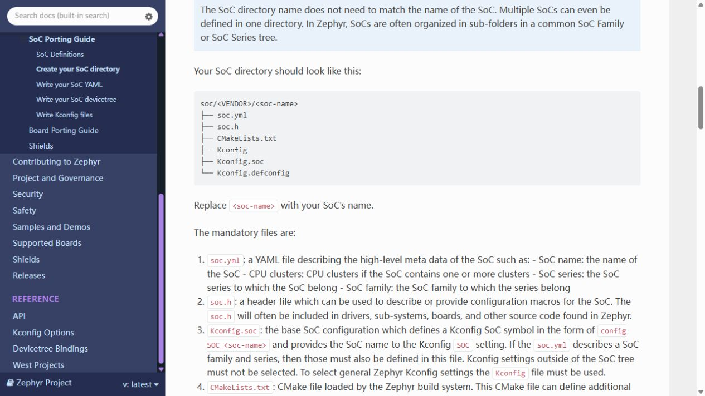
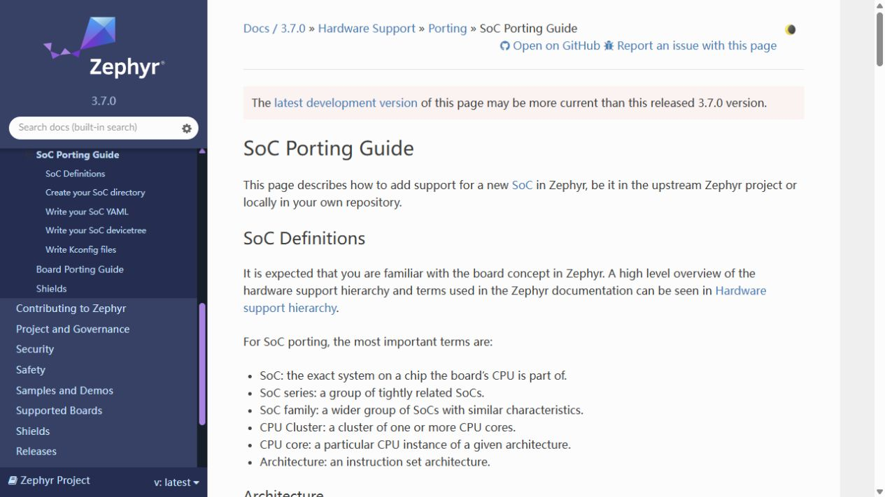
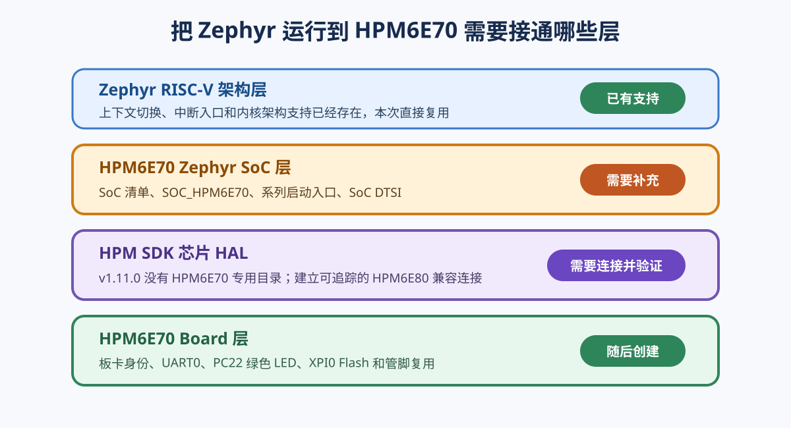

# 第 2 课：确认需要补充的软件层

把一个操作系统放到 MCU 上，不是从空白重写所有代码。应先区分处理器架构、SoC 和板卡三层，并确认现有工作区已经提供了什么。

## 从复位到应用需要哪些层

先看固件在真实硬件中的位置。图中的深蓝色大框是 HPM6E70 芯片；NOR Flash、SDRAM、LED 和串口连接都位于芯片外部。图中只为有明确先后关系的启动动作画箭头；运行时可双向读写的连接使用无箭头实线表示。



上电后，HPM6E70 按下面的路径运行：

1. 复位首先进入芯片内部固化的 BootROM。此时外部 NOR Flash 中的 Zephyr 还没有开始运行；
2. BootROM 配置片内 XPI0 控制器，再从板载 NOR Flash 读取启动头并找到固件；
3. 本工程使用 XIP，CPU 经 XPI0 直接从 NOR Flash 取指。架构启动代码同时在片内 SRAM 中建立栈，把 `.data` 的初始值复制到 SRAM，并清零 `.bss`；
4. SoC 初始化代码设置芯片内部的时钟、中断控制器和系统定时器，Zephyr 随后初始化内核与设备；
5. Zephyr 创建主线程并调用应用的 `main()`。应用经片内 UART0、GPIO 等控制器访问板级连接，最终产生串口日志和 LED 状态。

板载 SDRAM 也是外部存储器，但它不是最小启动链的必要条件。只有在 FEMC 完成引脚、时钟和时序初始化后，CPU 才能把它当作可用内存；这部分留到 SDRAM 课程再接入。

:::note Board 描述属于构建期输入

Board 的 Devicetree 和 Kconfig 不会在第 4 步作为一段独立程序执行。它们在构建时决定固件采用哪些地址、引脚、驱动和配置；运行时执行的是已经编译进固件的初始化代码与驱动。

:::

## 架构层已经存在

HPM6E70 使用 32 位 RISC-V。工作区中的 Zephyr 已经包含通用 RISC-V 架构实现：

```powershell
Get-ChildItem .\zephyr\arch\riscv
```

Zephyr 3.7.0 官方文档：[Architecture Porting Guide](https://docs.zephyrproject.org/3.7.0/hardware/porting/arch.html)



官方移植指南把新增架构限定在 Zephyr 尚未支持该处理器架构的情况。这里能够找到 `arch/riscv`，所以无需创建 HPM6E70 专用的架构目录。

## HPMicro 适配层缺少独立的 HPM6E70 SoC

检查当前 HPMicro Zephyr 适配层：

```powershell
Select-String `
  -Path .\sdk_glue\soc\hpmicro\HPM6E00\Kconfig.soc `
  -Pattern "SOC_HPM6E70"
```

在应用本工程补丁之前，这条命令找不到定义；同一目录只有 HPM6E80 等已有目标。Zephyr 官方 SoC 移植指南要求 SoC 层至少提供 SoC 定义、Kconfig 配置和设备树文件。

Zephyr 3.7.0 官方文档：[SoC Porting Guide](https://docs.zephyrproject.org/3.7.0/hardware/porting/soc_porting.html)





因此本工程需要补上独立的 `SOC_HPM6E70`，并把它接到 HPMicro 已有的 HPM6E00 系列支持上。

## 板卡层必须新建

即使两个板卡使用相同 MCU，只要 LED、晶振、Flash 或 UART 接法不同，就应该有各自的 Board。确认当前工作区还没有本板：

```powershell
west boards | Select-String "dshanmcu_hpm6e70"
```

没有输出，表示 Zephyr 尚不知道这块板卡的名称和目录。后续要在工程根目录的 `boards/hpmicro/dshanmcu_hpm6e70/` 中从零建立 Board。

## 本次移植范围



本次不重写 RISC-V 架构，也不复制一套完整 HPM SDK，而是完成两项工作：

- 在 `sdk_glue` 中增加 HPM6E70 SoC 身份和与厂商 HAL 的连接；
- 在工程中建立 `dshanmcu_hpm6e70` Board，描述本板真实硬件。

下一课先创建最小 Board 身份，使 `west` 能够发现板名。
