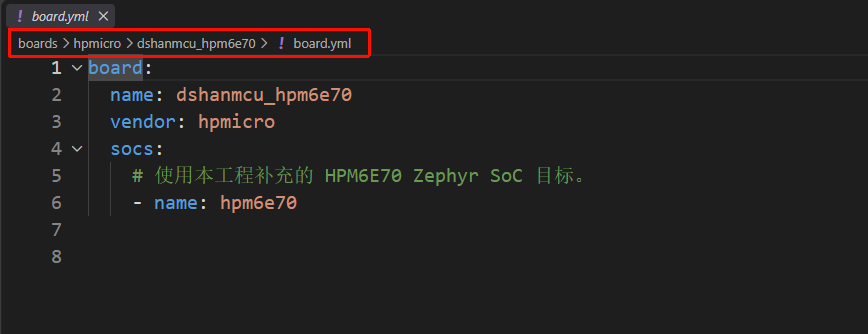
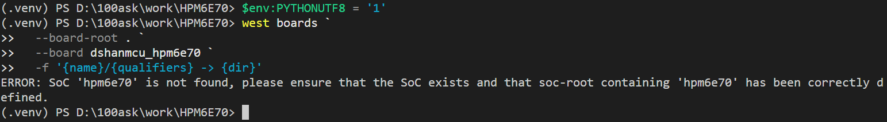

# 第 3 课：建立 Board 身份

第 2 课已经确认：Zephyr 有通用 RISC-V 架构支持，但还不认识 DshanMCU-HPM6E70 板卡。本课先建立 Board 名称以及它与 HPM6E70 SoC 的关系，不配置 UART、LED 和 Flash。

完成本课后，工程将具备 Board 名称、板卡元数据和 SoC 选择接口，并能说明完整 Board target 由哪些字段组成。

## 从 HPM6E00EVK 确认 Board 文件结构

Zephyr 3.7 使用 Hardware Model v2。官方 [Board Porting Guide](https://docs.zephyrproject.org/3.7.0/hardware/porting/board_porting.html) 规定，Board 目录用 `board.yml` 声明板名、厂商和 SoC；DTS、Kconfig 与测试元数据再分别用于硬件描述、软件选择和测试筛选。

工作区中的 `sdk_glue` 已经提供 HPMicro 官方参考板。先查看与 HPM6E70 同属 HPM6E00 系列的 HPM6E00EVK：

```powershell
Get-Content .\sdk_glue\boards\hpmicro\hpm6e00evk\board.yml
```

可以看到官方 Board 使用下面的最小结构：

```yaml
board:
  name: hpm6e00evk
  vendor: hpmicro
  socs:
    - name: hpm6e80
```

再查看它怎样在 Kconfig 中选择 SoC：

```powershell
Get-Content .\sdk_glue\boards\hpmicro\hpm6e00evk\Kconfig.hpm6e00evk
```

```kconfig
config BOARD_HPM6E00EVK
	select SOC_HPM6E80
```

这两个文件提供了可复用的 **Board 组织方式**，但不能整份照搬。HPM6E00EVK 使用 HPM6E80，板载器件与 DshanMCU-HPM6E70 也不同，因此本课只保留字段结构并替换身份：

| 参考板字段 | 本板填写 | 选择依据 |
| --- | --- | --- |
| `name: hpm6e00evk` | `name: dshanmcu_hpm6e70` | 为当前板建立不会与官方板冲突的名称 |
| `vendor: hpmicro` | `vendor: hpmicro` | 两块板都使用 HPMicro SoC，保留官方厂商标识 |
| `socs/name: hpm6e80` | `socs/name: hpm6e70` | 实物芯片是 HPM6E70，并在下一课建立对应 SoC 身份 |
| `select SOC_HPM6E80` | `select SOC_HPM6E70` | Board 被选中时应进入 HPM6E70 SoC 配置树 |

HPM6E00EVK 的 DTS、pinctrl 和默认配置描述的是另一块开发板的连线，不能作为本板硬件参数直接复制。后续课程会根据 DshanMCU-HPM6E70 原理图逐项建立这些文件。

## 创建标准 Board 目录

从工程根目录创建本板目录：

```powershell
New-Item -ItemType Directory `
  -Path .\boards\hpmicro\dshanmcu_hpm6e70 `
  -Force
```

这里的工程根目录通过后续命令的 `--board-root .` 交给 Zephyr。Zephyr 会在该根目录下扫描 `boards/<vendor>/<board>/`，所以 Board 文件必须放在：

```text
boards/hpmicro/dshanmcu_hpm6e70/
```

## board.yml 如何形成构建目标

在 `boards/hpmicro/dshanmcu_hpm6e70/` 中创建 `board.yml`：

```yaml
board:
  name: dshanmcu_hpm6e70
  vendor: hpmicro
  socs:
    # 使用下一课补充的 HPM6E70 Zephyr SoC 目标。
    - name: hpm6e70
```



三个字段的作用如下：

- `board/name` 定义板名 `dshanmcu_hpm6e70`；
- `vendor` 把板卡归入 HPMicro 厂商；
- `socs/name` 声明该板使用 `hpm6e70` SoC，并形成 SoC qualifier。

因此完整 Board target 是：

```text
dshanmcu_hpm6e70/hpm6e70
```

后续构建命令会把这个目标传给 `west build -b`。`board.yml` 只建立身份关系，不包含 UART 引脚、Flash 地址或 LED 接法；这些硬件事实属于后续的 DTS 与 pinctrl。

## 从官方参考板核对板卡元数据

同一份 [Board Porting Guide](https://docs.zephyrproject.org/3.7.0/hardware/porting/board_porting.html#write-supporting-metadata) 把 `<board>.yaml` 定义为供板卡列表和 Twister 测试工具读取的元数据文件。字段结构继续参考 HPMicro 的 HPM6E00EVK，但每个数值都要回到当前芯片、开发板和工作区核对。

先查看参考板的元数据：

```powershell
Get-Content .\sdk_glue\boards\hpmicro\hpm6e00evk\hpm6e00evk.yaml
```

其中与本课有关的字段如下：

```yaml
identifier: hpm6e00evk
name: HPMicro HPM6E00EVK
type: mcu
arch: riscv32
toolchain:
  - zephyr
  - cross-compile
ram: 1024
flash: 16384
vendor: hpmicro
```

参考板提供的是 **文件格式和字段含义**，本板的填写依据如下：

| 字段 | 本板填写 | 依据 |
| --- | --- | --- |
| `identifier`、`name` | DshanMCU-HPM6E70 的名称 | 用于板卡列表和测试结果，必须对应当前 Board，而不是保留参考板名称 |
| `type: mcu` | MCU 板卡 | HPM6E70 是微控制器 |
| `arch: riscv32` | 32 位 RISC-V | 来自 HPM6E70 的处理器架构 |
| `toolchain: cross-compile` | 本课程使用的交叉编译工具链 | 第 1 课已经为工作区配置 `CROSS_COMPILE` |
| `ram: 1024` | 1024 KiB | 来自 HPM6E00 系列 DTS 中供 Zephyr 使用的 `sram` 节点，不是芯片全部片内存储容量 |
| `flash: 16384` | 16384 KiB | 来自本板 U5：MX25L12833F，容量 16 MiB |
| `vendor: hpmicro` | HPMicro | 当前板使用 HPMicro SoC |

> HPM6E70 共有 2080 KB 片内 SRAM，但其中还包含 ITCM、DTCM、AHB SRAM 等不同区域。这里的 `ram: 1024` 对应 Zephyr 当前作为主系统内存使用的 1024 KiB `sram` 区域，不能把两个数直接当成同一个概念。

现在创建 `boards/hpmicro/dshanmcu_hpm6e70/dshanmcu_hpm6e70.yaml`：

```yaml
identifier: dshanmcu_hpm6e70
name: DshanMCU HPM6E70 Board
type: mcu
arch: riscv32
toolchain:
  - cross-compile
ram: 1024
flash: 16384
vendor: hpmicro
```

本课只登记已经确定的基础元数据，暂不填写 `supported`。UART、GPIO 和 Flash 等能力要等对应驱动与板级连接完成后，再按验证结果加入。

`ram` 和 `flash` 供板卡列表与测试筛选使用，不决定程序最终链接到哪个地址，也不划分 Flash 分区。真正的地址范围将在 DTS 中描述。

## 按 Zephyr 的 Kconfig 规则选择 HPM6E70 SoC

Zephyr 3.7 的 [Write Kconfig files](https://docs.zephyrproject.org/3.7.0/hardware/porting/board_porting.html#write-kconfig-files) 规定：`Kconfig.<board>` 用来选择该 Board 对应的 SoC，以及与 SoC 直接相关的配置。官方示例的基本形式是：

```kconfig
config BOARD_PLANK
	select SOC_SOC1
```

工作区中的 HPMicro 参考板采用了相同结构，文件位于 `sdk_glue/boards/hpmicro/hpm6e00evk/Kconfig.hpm6e00evk`：

```kconfig
config BOARD_HPM6E00EVK
	select SOC_HPM6E80
```

`BOARD_HPM6E00EVK` 和 `SOC_HPM6E80` 都属于参考板，不能原样复制。本板保持 Zephyr 规定的结构，只替换两个身份：

| Kconfig 身份 | 本板使用 | 对应来源 |
| --- | --- | --- |
| `BOARD_DSHANMCU_HPM6E70` | 当前 Board 符号 | 由 `board.yml` 中的 `dshanmcu_hpm6e70` 规范化生成 |
| `SOC_HPM6E70` | 当前 SoC 符号 | 与 `board.yml` 中的 `socs/name: hpm6e70` 对应 |

Zephyr 构建系统会创建 `BOARD_DSHANMCU_HPM6E70`，因此这里只扩展该符号并选择 SoC，不再添加 `bool` 类型。

创建 `boards/hpmicro/dshanmcu_hpm6e70/Kconfig.dshanmcu_hpm6e70`：

```kconfig
# SPDX-License-Identifier: Apache-2.0

config BOARD_DSHANMCU_HPM6E70
	# Board 被选中时进入 HPM6E70 SoC 配置树。
	select SOC_HPM6E70
```

选择当前 Board 时，`select SOC_HPM6E70` 要求构建系统继续载入 HPM6E70 的启动、时钟、中断和寄存器支持。下一课会建立这里引用的 `SOC_HPM6E70` 软件目标。

本课暂时不在这里选择 UART、GPIO 或 Flash 驱动。Board 身份只负责连接 SoC；通用软件功能应在默认配置或应用配置中按实际需要启用。

## 检查当前阶段留下的接口

先确认本课创建的三个文件：

```powershell
Get-ChildItem `
  .\boards\hpmicro\dshanmcu_hpm6e70 `
  -Name
```

应至少看到：

```text
board.yml
dshanmcu_hpm6e70.yaml
Kconfig.dshanmcu_hpm6e70
```

接下来让 Zephyr 读取刚创建的 Board。请确认终端仍位于工程根目录，并且提示符前面带有 `(.venv)`。

### 1. 让当前终端使用 UTF-8

先执行：

```powershell
$env:PYTHONUTF8 = '1'
```

该设置只对当前 PowerShell 窗口生效，用来避免 `west` 输出中文路径或提示信息时出现编码问题，不会修改工程文件。

### 2. 查找当前 Board

再执行下面这一条 `west boards` 命令：

```powershell
west boards `
  --board-root . `
  --board dshanmcu_hpm6e70 `
  -f '{name}/{qualifiers} -> {dir}'
```

这四行属于同一条 PowerShell 命令。每行末尾的反引号 `` ` `` 表示命令还没有结束；按下 Enter 后出现 `>>` 是正常的续行提示，继续输入下一行即可。

| 命令片段 | 作用 |
| --- | --- |
| `west boards` | 让 Zephyr 扫描并列出能够识别的 Board |
| `--board-root .` | 把当前工程根目录作为额外的 Board 搜索位置 |
| `--board dshanmcu_hpm6e70` | 只检查本课创建的 `dshanmcu_hpm6e70` |
| `-f '{name}/{qualifiers} -> {dir}'` | 按“Board 名称/限定名 → 所在目录”的格式显示结果 |

当前阶段会看到下面的结果：



终端最后显示：

```text
ERROR: SoC 'hpm6e70' is not found
```

这条信息说明两件事：

1. Zephyr 已读取 `board.yml`，并从 `socs/name` 得到了 `hpm6e70`；
2. Zephyr 继续查找对应的 SoC 软件目标时，没有找到 `hpm6e70`。

因此，Board 的三个身份文件已经进入 Zephyr 的解析流程，当前缺少的是它所引用的 SoC。下一课建立 `SOC_HPM6E70` 后，再执行同一条 `west boards` 命令，就能看到完整的 Board target。
