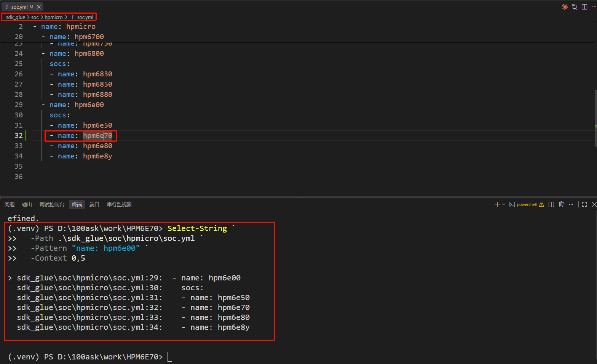
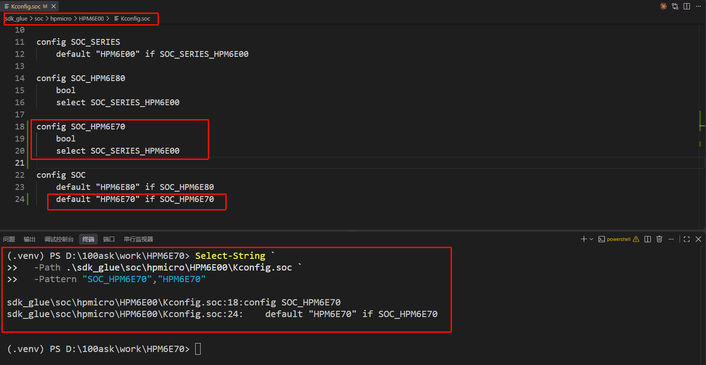
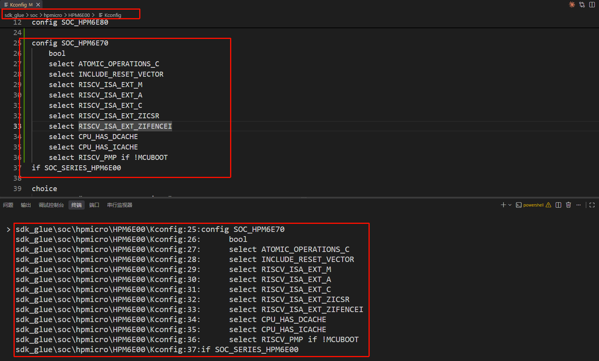
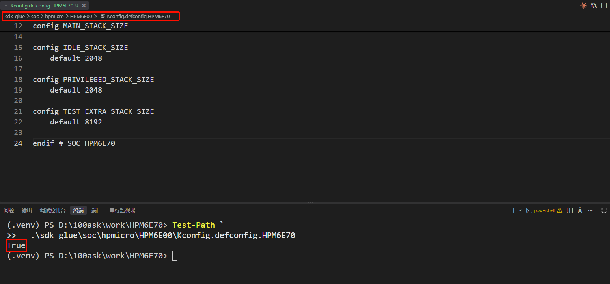
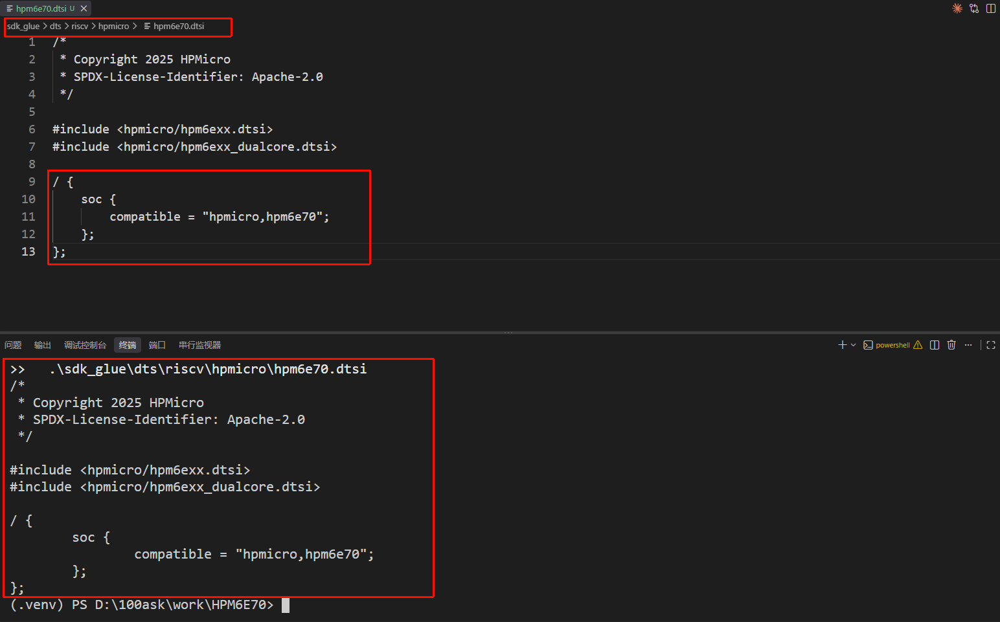
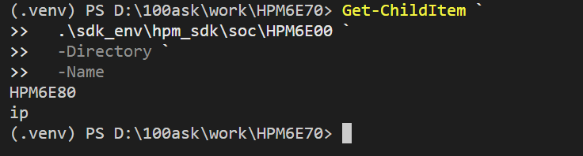
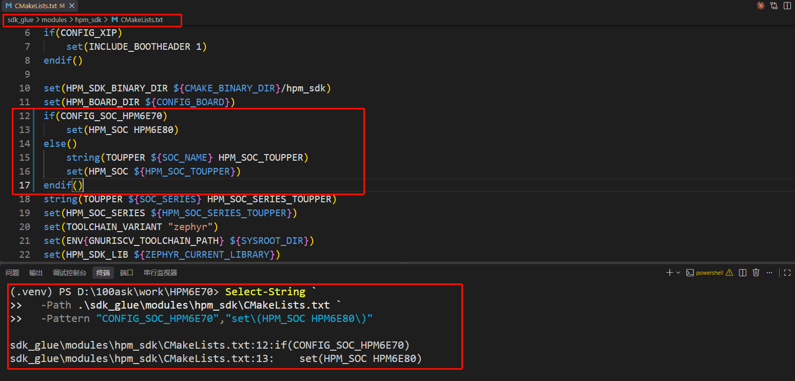
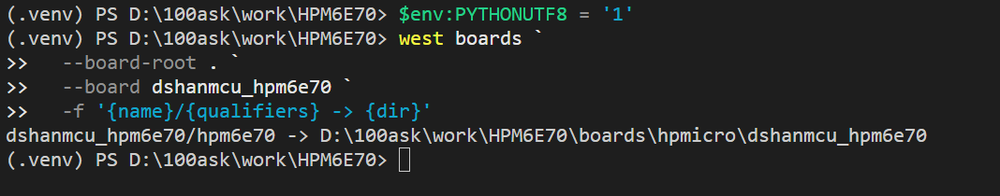
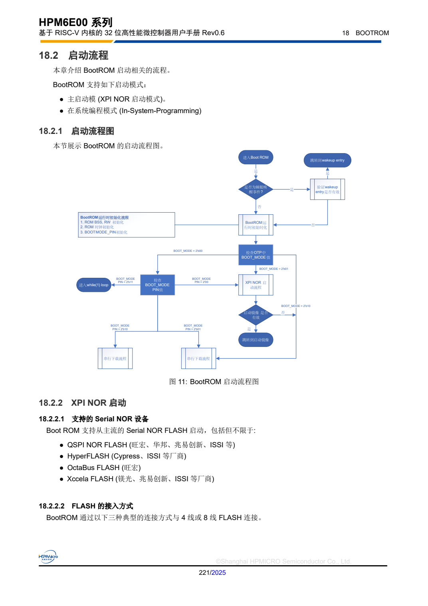
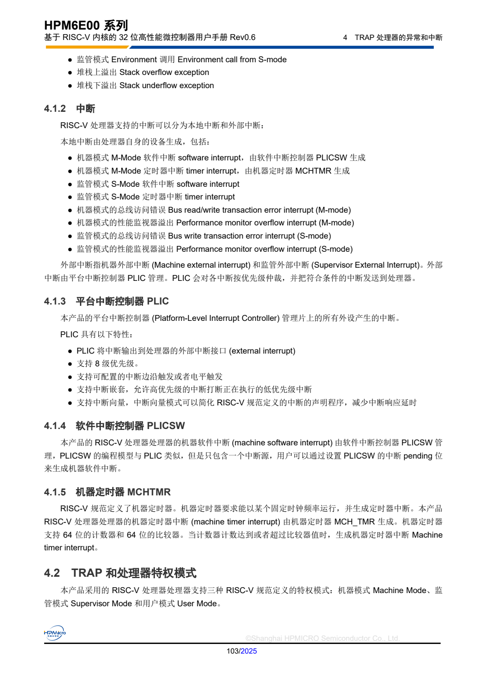

# 第 4 课：接入 SoC 支持

第 3 课已经建立 Board 身份。执行 `west boards` 时，Zephyr 能读到 Board 声明的 `hpm6e70`，但工作区中还没有与该名称对应的 SoC 支持。本课补齐 SoC 名称、处理器能力、设备树文件和厂商 HAL 映射；完成后，同一条命令应能解析出完整的 `dshanmcu_hpm6e70/hpm6e70` Board target。

## Board 声明的 hpm6e70 会被哪些文件读取

第 3 课创建的 `boards/hpmicro/dshanmcu_hpm6e70/board.yml` 中有下面这段声明：

```yaml
board:
  name: dshanmcu_hpm6e70
  socs:
    - name: hpm6e70
```

`socs/name` 不是芯片型号的备注。Zephyr 读取 `board.yml` 后，会继续用 `hpm6e70` 查找 SoC 清单、Kconfig 配置和 DTSI 文件。第 3 课出现 `SoC 'hpm6e70' is not found`，说明 Board 目录已经被找到，查找过程停在 SoC 层。

本课要依次接通下面四层：

| 连接层 | 本课涉及的文件 | Zephyr 从这一层得到什么 |
| --- | --- | --- |
| SoC 名称 | `soc/hpmicro/soc.yml` | 确认 `hpm6e70` 是 HPM6E00 系列中的有效 SoC 名称 |
| 软件配置 | `Kconfig.soc`、`Kconfig`、`Kconfig.defconfig.HPM6E70` | 建立 `SOC_HPM6E70`，选择 RISC-V 能力并设置内核默认值 |
| 硬件描述 | `dts/riscv/hpmicro/hpm6e70.dtsi` | 提供 Board DTS 可以包含的 HPM6E70 SoC 设备树文件 |
| 厂商实现 | `modules/hpm_sdk/CMakeLists.txt` | 告诉构建系统从当前 HPM SDK 的哪个目录编译启动、时钟和寄存器实现 |

它们形成的构建期连接是：

```text
board.yml 中的 hpm6e70
        ↓
soc.yml 中的 SoC 名称
        ↓
SOC_HPM6E70 与 HPM6E00 系列配置
        ↓
hpm6e70.dtsi + HPM SDK HAL 目录
```

这条连接只决定构建系统怎样识别和组合 HPM6E70 支持，不是芯片上电后的运行顺序。实际启动过程将在这些文件接通后结合芯片手册说明。

## HPM6E80 提供哪些同系列参考

HPMicro 的 `sdk_glue` 已经接入同属 HPM6E00 系列的 HPM6E80。先在 VS Code 资源管理器中展开下面三个位置：

```text
sdk_glue/soc/hpmicro/HPM6E00/
sdk_glue/dts/riscv/hpmicro/
sdk_glue/modules/hpm_sdk/
```

HPM6E80 提供的是同系列 SoC 的文件组织、RISC-V CPU0 能力和公共 DTSI 包含关系。HPM6E00EVK 的 UART、Flash、GPIO 等板级连接不在本课复用范围内。

当前 HPM SDK v1.11.0 的 `soc/HPM6E00/` 下只有 `HPM6E80` 和公共 `ip` 目录。因此，Zephyr 侧仍建立独立的 `hpm6e70` 与 `SOC_HPM6E70`；只有最后选择厂商 HAL 目录时，才把 HPM6E70 映射到当前 SDK 已提供的 HPM6E80 实现。

六个连接点与参考文件如下：

| 本课要完成的连接 | HPM6E80 参考位置 | HPM6E70 要修改的文件 |
| --- | --- | --- |
| 登记 SoC 名称 | `soc/hpmicro/soc.yml` 中的 `hpm6e80` | 在同一系列中加入 `hpm6e70` |
| 建立 SoC 与系列身份 | `HPM6E00/Kconfig.soc` 中的 `SOC_HPM6E80` | 在同一文件中加入 `SOC_HPM6E70` |
| 选择 RISC-V 能力 | `HPM6E00/Kconfig` 中的 `SOC_HPM6E80` | 在同一文件中加入 HPM6E70 配置块 |
| 设置内核默认值 | `Kconfig.defconfig.HPM6E80` | 新建 `Kconfig.defconfig.HPM6E70` |
| 建立 SoC 设备树文件 | `hpm6e80.dtsi` | 新建 `hpm6e70.dtsi`，保留 HPM6E00 系列公共包含关系 |
| 连接厂商 HAL | `sdk_env/hpm_sdk/soc/HPM6E00/HPM6E80/` | 在 `modules/hpm_sdk/CMakeLists.txt` 中只映射厂商 HAL 目录 |

下面逐项完成这些文件。所有路径都从工程根目录开始。

## 第一步：把 hpm6e70 加入 SoC 列表

打开 `sdk_glue/soc/hpmicro/soc.yml`，找到 `name: hpm6e00`。该段列出 Zephyr 能够枚举的 HPM6E00 系列 SoC；在 `hpm6e50` 与 `hpm6e80` 之间加入 `hpm6e70`：

```yaml
  - name: hpm6e00
    socs:
    - name: hpm6e50
    - name: hpm6e70
    - name: hpm6e80
    - name: hpm6e8y
```

保存后，在终端查看这一段：

```powershell
Select-String `
  -Path .\sdk_glue\soc\hpmicro\soc.yml `
  -Pattern "name: hpm6e00" `
  -Context 0,5
```

执行完成后，核对编辑器中的 `name: hpm6e70` 与终端列出的第 32 行：



*图 6-1　在 `soc.yml` 中登记并验证 HPM6E70。编辑器显示新增的 SoC 名称，终端通过 `Select-String` 读取同一段配置。截图中的盘符和行号来自课程实测环境，实际结果以自己的工程位置和文件行号为准。*

输出中应能在 `hpm6e00` 的 `socs` 列表里看到 `name: hpm6e70`。现在 Zephyr 已经知道这个 SoC 名称属于 HPM6E00 系列，但还没有名为 `SOC_HPM6E70` 的软件配置符号。下一步建立该符号并把它连到系列配置。

## 第二步：建立 SOC_HPM6E70 身份

打开 `sdk_glue/soc/hpmicro/HPM6E00/Kconfig.soc`。先找到 `config SOC_HPM6E80`，在它的后面、`config SOC` 的前面加入：

```kconfig
config SOC_HPM6E70
	bool
	select SOC_SERIES_HPM6E00
```

`select SOC_SERIES_HPM6E00` 把 HPM6E70 接入现有的 HPM6E00 系列配置。接着在文件末尾的 `config SOC` 中增加 HPM6E70 对应的默认字符串：

```kconfig
config SOC
	default "HPM6E80" if SOC_HPM6E80
	default "HPM6E70" if SOC_HPM6E70
```

保存后检查两个位置：

```powershell
Select-String `
  -Path .\sdk_glue\soc\hpmicro\HPM6E00\Kconfig.soc `
  -Pattern "SOC_HPM6E70","HPM6E70"
```

核对编辑器中的两个新增位置，并确认终端分别找到了 SoC 配置符号和默认字符串：



*图 6-2　在 `Kconfig.soc` 中建立 HPM6E70 身份。上方是写入文件的两个位置，下方是两条匹配结果。*

应同时看到 `config SOC_HPM6E70` 和 `default "HPM6E70" if SOC_HPM6E70`。现在 Board 选择 `SOC_HPM6E70` 时，Kconfig 能把它归入 HPM6E00 系列，并生成字符串形式的 SoC 名称；处理器具体具备哪些 RISC-V 能力仍需在下一步声明。

## 第三步：选择 HPM6E70 的 RISC-V 能力

打开 `sdk_glue/soc/hpmicro/HPM6E00/Kconfig`，找到以 `config SOC_HPM6E80` 开头的配置块。该块声明原子操作、复位代码、RISC-V 指令扩展、Cache 和 PMP 等处理器能力。

在 HPM6E80 配置块结束后、`if SOC_SERIES_HPM6E00` 前面加入 HPM6E70 配置块：

```kconfig
config SOC_HPM6E70
	bool
	select ATOMIC_OPERATIONS_C
	select INCLUDE_RESET_VECTOR
	select RISCV_ISA_EXT_M
	select RISCV_ISA_EXT_A
	select RISCV_ISA_EXT_C
	select RISCV_ISA_EXT_ZICSR
	select RISCV_ISA_EXT_ZIFENCEI
	select CPU_HAS_DCACHE
	select CPU_HAS_ICACHE
	select RISCV_PMP if !MCUBOOT
```

这里复用的是 HPM6E00 系列已经接入 Zephyr 的 CPU0 运行能力，不是参考板的 UART、Flash 或 GPIO 连接。

保存后搜索刚加入的配置块：

```powershell
Select-String `
  -Path .\sdk_glue\soc\hpmicro\HPM6E00\Kconfig `
  -Pattern "config SOC_HPM6E70" `
  -Context 0,12
```

终端输出应完整覆盖刚加入的配置块，而不是只找到配置名称：



*图 6-3　在 `Kconfig` 中选择 HPM6E70 的 RISC-V 能力。编辑器内容与 `Select-String -Context 0,12` 的输出逐项对应。*

输出应从 `config SOC_HPM6E70` 开始，并连续显示上述 `select` 项。此时 Zephyr 已知 HPM6E70 使用哪些通用 RISC-V 指令扩展、Cache 和 PMP 能力，但系统节拍与各类栈空间还没有 HPM6E70 专用默认值。

## 第四步：建立 HPM6E70 的内核默认配置

`sdk_glue/soc/hpmicro/HPM6E00/Kconfig.defconfig.series` 会自动载入名称符合 `Kconfig.defconfig.HPM6E*` 的文件。因此可以参照同目录的 `Kconfig.defconfig.HPM6E80`，为 HPM6E70 创建独立文件。

在 `sdk_glue/soc/hpmicro/HPM6E00/` 中新建 `Kconfig.defconfig.HPM6E70`，写入：

```kconfig
# Copyright (c) 2026 DshanMCU
# SPDX-License-Identifier: Apache-2.0

if SOC_HPM6E70

config SYS_CLOCK_TICKS_PER_SEC
	default 1000

config ISR_STACK_SIZE
	default 2048

config MAIN_STACK_SIZE
	default 8192

config IDLE_STACK_SIZE
	default 2048

config PRIVILEGED_STACK_SIZE
	default 2048

config TEST_EXTRA_STACK_SIZE
	default 8192

endif # SOC_HPM6E70
```

这些数值沿用同系列 HPM6E80 的 Zephyr 内核默认值；文件外层改为 `if SOC_HPM6E70`，确保它只在当前 SoC 被选择时生效。

保存后确认新文件存在：

```powershell
Test-Path `
  .\sdk_glue\soc\hpmicro\HPM6E00\Kconfig.defconfig.HPM6E70
```

确认编辑器标签中的文件名为 `Kconfig.defconfig.HPM6E70`，并观察终端返回值：



*图 6-4　创建并检查 `Kconfig.defconfig.HPM6E70`。文件以 `endif # SOC_HPM6E70` 结束，`Test-Path` 返回 `True`。*

应输出 `True`。这个文件只在 `SOC_HPM6E70` 被选择时提供内核默认值；应用后续仍可通过自己的配置覆盖这些默认值。软件配置已经生效，下一步为 Board DTS 提供可包含的 HPM6E70 硬件描述文件。

## 第五步：创建 HPM6E70 的 SoC DTSI 文件

打开 `sdk_glue/dts/riscv/hpmicro/hpm6e80.dtsi`。它没有重复描述每个寄存器，而是包含 HPM6E00 系列公共外设描述和双核结构。本课保留这两个公共 `include`，同时为 HPM6E70 写入独立的 `compatible`。

在同一目录新建 `hpm6e70.dtsi`：

```dts
/*
 * Copyright 2026 DshanMCU
 * SPDX-License-Identifier: Apache-2.0
 */

/* 复用 HPM6E00 系列公共外设和双核结构，板级连接由 Board DTS 补充。 */
#include <hpmicro/hpm6exx.dtsi>
#include <hpmicro/hpm6exx_dualcore.dtsi>

/ {
	soc {
		compatible = "hpmicro,hpm6e70";
	};
};
```

`hpm6exx.dtsi` 提供系列公共外设、地址与中断描述，`hpm6exx_dualcore.dtsi` 提供双核结构。新建的 `hpm6e70.dtsi` 描述 HPM6E70 SoC；下一课的 Board DTS 将包含它并补充本板的 UART、LED 和 Flash 连接。

保存后检查文件内容：

```powershell
Get-Content `
  .\sdk_glue\dts\riscv\hpmicro\hpm6e70.dtsi
```

核对文件路径、两个公共 DTSI 和 HPM6E70 的 `compatible`：



*图 6-5　创建并检查 `hpm6e70.dtsi`。编辑器中的文件内容与终端读取结果一致。*

应看到两个 `#include` 和 `compatible = "hpmicro,hpm6e70"`。现在 Board DTS 可以通过 `#include <hpmicro/hpm6e70.dtsi>` 进入 HPM6E00 系列的公共外设与双核描述；板载 UART、LED 和 Flash 的连接仍由后续 Board DTS 补充。

## 第六步：把 HPM6E70 连接到当前 HPM SDK

当前工作区使用 HPM SDK v1.11.0。先查看 HPM6E00 系列下已有的厂商 HAL 目录：

```powershell
Get-ChildItem `
  .\sdk_env\hpm_sdk\soc\HPM6E00 `
  -Directory `
  -Name
```

观察列表中现有的 SoC 目录：



*图 6-6　HPM SDK v1.11.0 的 `soc/HPM6E00` 目录。当前只有 `HPM6E80` 与公共 `ip` 目录。*

其中有 `HPM6E80`，但没有 `HPM6E70`。因此 Zephyr 保留独立的 `SOC_HPM6E70` 和 `hpm6e70.dtsi`，只有厂商 HAL 的目录选择复用当前已经使用的 HPM6E80 实现。

打开 `sdk_glue/modules/hpm_sdk/CMakeLists.txt`，找到：

```cmake
string(TOUPPER ${SOC_NAME} HPM_SOC_TOUPPER)
set(HPM_SOC ${HPM_SOC_TOUPPER})
```

用下面的条件判断替换这两行：

```cmake
# HPM SDK v1.11.0 没有 HPM6E70 专用目录，当前 SoC 复用同系列 HPM6E80 HAL。
if(CONFIG_SOC_HPM6E70)
    set(HPM_SOC HPM6E80)
else()
    string(TOUPPER ${SOC_NAME} HPM_SOC_TOUPPER)
    set(HPM_SOC ${HPM_SOC_TOUPPER})
endif()
```

`CONFIG_SOC_HPM6E70` 只影响 HPM6E70；其他 HPMicro SoC 仍按原来的 `SOC_NAME` 选择各自目录。

保存后检查条件判断已经写入：

```powershell
Select-String `
  -Path .\sdk_glue\modules\hpm_sdk\CMakeLists.txt `
  -Pattern "CONFIG_SOC_HPM6E70","set\(HPM_SOC HPM6E80\)"
```

核对条件判断所在路径，并观察终端是否找到相邻的两行：



*图 6-7　在 `modules/hpm_sdk/CMakeLists.txt` 中设置并检查 HPM6E70 的 HAL 目录映射。*

两条匹配都出现，表示 HPM6E70 的厂商 HAL 目录选择已经接通。这里改变的是厂商源码目录变量 `HPM_SOC`，不会把 Zephyr 的 SoC 名称改成 HPM6E80：Board target 仍然使用 `hpm6e70`，Kconfig 中仍然选择 `SOC_HPM6E70`。

## 重新检查 Board target

SoC 身份接入后，再执行第 3 课的 Board 检查：

```powershell
$env:PYTHONUTF8 = '1'
west boards `
  --board-root . `
  --board dshanmcu_hpm6e70 `
  -f '{name}/{qualifiers} -> {dir}'
```

终端应输出完整的 Board 名称、SoC qualifier 和 Board 目录：



*图 6-8　`west boards` 已识别 `dshanmcu_hpm6e70/hpm6e70`。箭头右侧的绝对目录会随工程保存位置变化。*

Board 名称、SoC qualifier 和目录同时出现，表示 `board.yml` 中的 SoC 名称已经能沿本课建立的清单和 Kconfig 身份完成解析。这个结果证明 Board target 可以被发现，还不能证明固件已经编译或在硬件上启动；下一课补充 Board DTS 后，构建系统才具备 UART0 等板级连接。

## 构建期连接最终服务于哪段启动过程

前面修改的六个位置都由构建系统读取。`soc.yml`、Kconfig、DTSI 和 CMake 文件不会在芯片上按顺序执行；它们共同决定 HPM6E70 固件应包含哪些 Zephyr 架构代码、HPMicro SoC 代码和 HPM SDK 源文件。

真正上电时，第一段程序来自芯片内部已经固化的 BootROM。阅读下面的手册页面时，观察 18.2.1 节中 `BOOT_MODE` 如何选择启动路径，以及 18.2.2 节列出的 XPI NOR 启动能力：



*图 6-9　BootROM 启动流程。来源：先楫半导体《[HPM6E00 系列用户手册 Rev0.6](https://www.hpmicro.com/Public/Uploads/uploadfile/files/20250109/HPM6E00UMV06.pdf)》第 18.2 节、第 221 页。后续版本可从 [HPM6E00 系列官方资料页面](https://www.hpmicro.com/product-center/microcontroller/hpm6e00) 的“芯片资料 → 用户手册”获取。*

BootROM 是 HPM6E70 出厂时已经存在于芯片内部的只读启动程序，本课不创建也不修改它。它根据启动模式配置 XPI 接口，从板载 NOR Flash 找到固件并开始执行；随后，本课配置的 Zephyr 与 HPMicro 软件开始工作。

HPM6E00 系列已有代码给出了后续两处关键连接：

```text
sdk_glue/soc/hpmicro/HPM6E00/Kconfig.defconfig.series
└─ KERNEL_ENTRY 默认设为 _start

sdk_glue/soc/hpmicro/HPM6E00/soc.c
└─ SYS_INIT(hpmicro_soc_init, PRE_KERNEL_1, ...)
   ├─ soc_init_clock()
   └─ soc_init_pma()
```

本课通过 `SOC_HPM6E70 -> SOC_SERIES_HPM6E00` 复用了这套系列代码。各部分在启动时的作用如下：

1. 芯片内部 BootROM 从板载 XPI NOR Flash 找到固件并开始执行；
2. Zephyr RISC-V 架构代码从 `_start` 建立栈和 C 运行环境；
3. HPMicro 的 `hpmicro_soc_init()` 在内核启动前配置芯片时钟和物理内存属性；
4. Zephyr 初始化中断控制器和系统定时器后进入内核；
5. Board DTS 再决定 UART、Flash、GPIO 等板级外设怎样进入驱动。

这里的第 5 项还没有完成，它正是下一课开始补充的内容。

## 中断控制器和系统节拍来自哪里

内核开始调度前，处理器还需要能够响应中断并产生系统节拍。查看手册第 4 章 `TRAP 处理器的异常和中断` 时，重点区分三个硬件模块：

- 4.1.2 节“中断”：区分机器软件中断、机器定时器中断和外部中断；
- 4.1.3 节“平台中断控制器 PLIC”：管理片上外设产生的中断；
- 4.1.5 节“机器定时器 MCHTMR”：产生 RISC-V 机器定时器中断。



*图 6-10　PLIC、PLICSW 与 MCHTMR 的作用。来源：先楫半导体《[HPM6E00 系列用户手册 Rev0.6](https://www.hpmicro.com/Public/Uploads/uploadfile/files/20250109/HPM6E00UMV06.pdf)》第 4.1.2～4.1.5 节、第 103 页。*

Kconfig 中的 `RISCV_HAS_PLIC`、`RISCV_SOC_INTERRUPT_INIT` 和 `SYS_CLOCK_HW_CYCLES_PER_SEC` 让 Zephyr 选择对应的 RISC-V 中断与定时器支持；HPMicro SoC 代码再使用厂商寄存器定义完成芯片侧初始化。它们解决的是内核运行所需的中断与节拍，不描述开发板上的 UART 引脚或 LED 接法。

完成本课后，`west boards` 已能解析 HPM6E70 Board target。下一课从 `hpm6e70.dtsi` 继续建立 Board DTS，先让 UART0 成为可观察的控制台。
