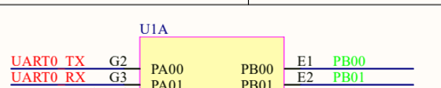
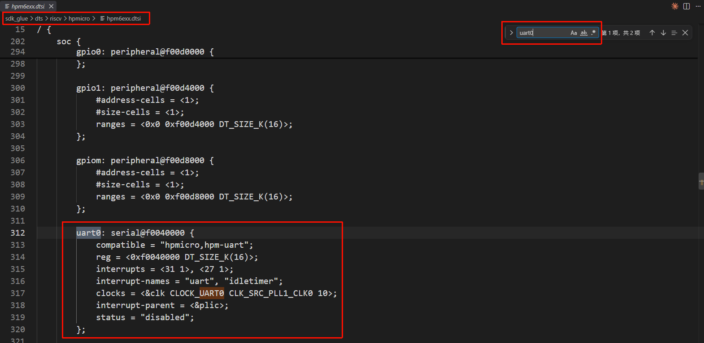
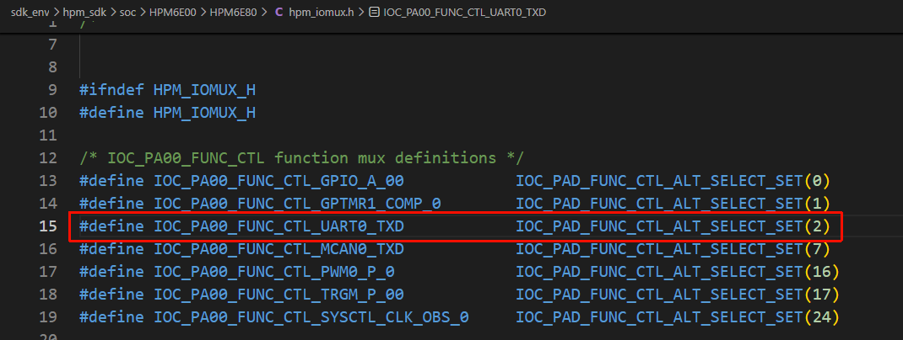
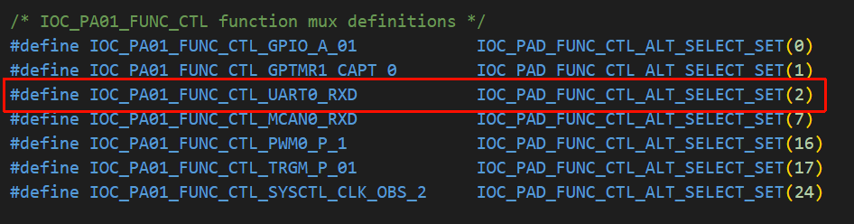
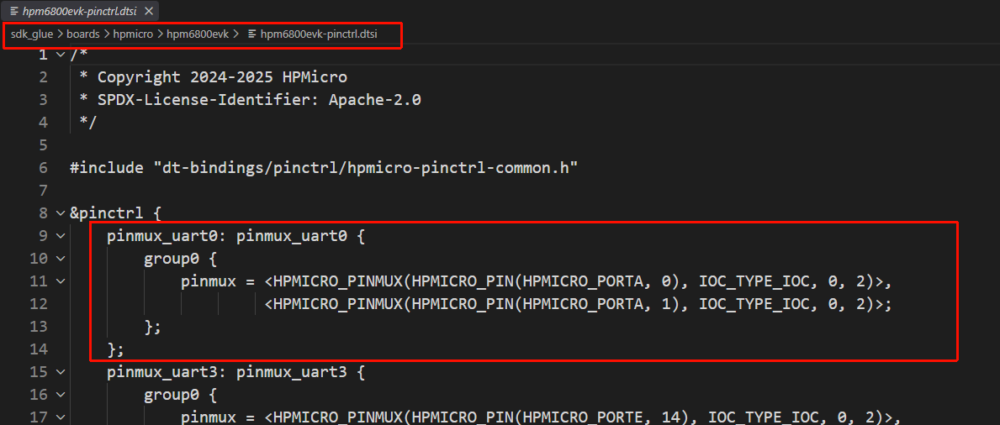

# 第 5 课：接通 UART0 控制台

第 4 课已经让 Zephyr 识别 `dshanmcu_hpm6e70/hpm6e70` Board target，并把 HPM6E70 接入 HPM6E00 系列 SoC 支持。本课开始编写 Board DTS：先为 Zephyr 选择主 SRAM、ITCM 和 DTCM，再把原理图中的 `PA00/PA01` 写入 pinctrl，最后把 UART0 选为控制台。

完成后，两个板级文件中会形成两组可以逐项检查的引用关系：

```text
zephyr,sram / zephyr,itcm / zephyr,dtcm → sram / ilm / dlm
zephyr,console → uart0 → pinmux_uart0 → PA00 / PA01
```

本课先验证文件之间的引用关系。生成后的 `zephyr.dts`、固件编译和串口输出将在后续完成基础配置后统一验证。

## 从原理图确认 UART0 管脚

先看 U1A 左上角的两条 UART0 网络，不需要同时阅读 SDRAM 和 LED 电路：



*图 7-1　U1A 管脚局部。`UART0_TX` 连接 `PA00`，`UART0_RX` 连接 `PA01`。*

原理图确定了两个板级事实：

| UART0 信号 | HPM6E70 管脚 | 数据方向 |
| --- | --- | --- |
| `UART0_TX` | `PA00` | 芯片向外发送 |
| `UART0_RX` | `PA01` | 芯片接收外部数据 |

UART0 控制器已经存在于 SoC 中，但控制器并不知道当前开发板把 TX、RX 接到了哪两个封装管脚。这个差异由 Board 的 pinctrl 文件补充。

## 在公共 SoC DTSI 中找到 UART0

在 VS Code 中打开：

```text
sdk_glue/dts/riscv/hpmicro/hpm6exx.dtsi
```

按 `Ctrl+F` 搜索 `uart0:`，定位完整的 UART0 节点：



*图 7-2　在 `hpm6exx.dtsi` 中定位 `uart0`。公共 SoC DTSI 已提供寄存器地址、中断、时钟和默认状态。*

这段节点由 HPMicro SoC 支持维护，描述的是 HPM6E00 系列芯片共有的 UART0 控制器：

| 字段 | 当前节点提供的内容 | Board 是否重复填写 |
| --- | --- | --- |
| `uart0:` | 给节点建立标签，其他 DTS 可以写 `&uart0` 引用它 | 不重复创建节点 |
| `compatible` | 让构建系统匹配 HPMicro UART binding 与驱动 | 不修改 |
| `reg` | UART0 寄存器地址和范围 | 不修改 |
| `interrupts`、`interrupt-parent` | UART0 使用的中断和 PLIC 控制器 | 不修改 |
| `clocks` | UART0 的时钟来源 | 不修改 |
| `status = "disabled"` | SoC 提供控制器，但默认不假设任意 Board 都使用它 | Board 按实际接线改为 `okay` |

因此，本课不复制整个 `serial@f0040000` 节点。Board DTS 只使用 `&uart0 { ... };` 补充当前板卡特有的波特率、管脚和启用状态。

## 确认 PA00、PA01 的复用值

一个物理管脚可以连接 GPIO、UART、SPI 等不同片上外设。pinctrl 中的复用值用于选择当前需要的功能，不能只根据管脚名称猜测。

第 4 课已经确认当前 HPM6E70 工程复用 HPM6E80 的 HPM SDK HAL 目录。在工程根目录的新建 PowerShell 终端中执行：

```powershell
Select-String `
  -Path .\sdk_env\hpm_sdk\soc\HPM6E00\HPM6E80\hpm_iomux.h `
  -Pattern "IOC_PA00_FUNC_CTL_UART0_TXD","IOC_PA01_FUNC_CTL_UART0_RXD"
```

应找到下面两个宏：

```c
#define IOC_PA00_FUNC_CTL_UART0_TXD  IOC_PAD_FUNC_CTL_ALT_SELECT_SET(2)
#define IOC_PA01_FUNC_CTL_UART0_RXD  IOC_PAD_FUNC_CTL_ALT_SELECT_SET(2)
```

先看 `PA00` 的功能表。红框中的宏把 `UART0_TXD` 与 `ALT_SELECT_SET(2)` 写在同一行：



*图 7-3　在 `sdk_env/hpm_sdk/soc/HPM6E00/HPM6E80/hpm_iomux.h` 中确认 `PA00` 选择 `ALT2` 时连接 `UART0_TXD`。*

继续查看紧邻的 `PA01` 功能表。它也把 UART0 接收功能定义为 `ALT_SELECT_SET(2)`：



*图 7-4　在同一 `hpm_iomux.h` 中确认 `PA01` 选择 `ALT2` 时连接 `UART0_RXD`。*

`ALT` 是 **Alternate Function（复用功能）** 的缩写。HPMicro 的每个复用管脚都有一个功能选择字段，`ALT2` 表示把该字段设置为数值 `2`，从而选中该管脚表中的第 2 号复用功能。

`ALT2` 不是 UART2，也不是“第二个串口”。同一个 `ALT` 数值用在不同管脚上时，可能对应不同的片上外设，必须以当前芯片的 `hpm_iomux.h` 定义为准。在当前两根管脚上，源码给出的对应关系是：

```text
PA00 + ALT2 → UART0_TXD
PA01 + ALT2 → UART0_RXD
```

因此，`PA00` 作为 UART0 TX、`PA01` 作为 UART0 RX 时都要选择 `ALT2`。工程中还可以打开下面的官方参考 Board 文件进行对照：

```text
sdk_glue/boards/hpmicro/hpm6800evk/hpm6800evk-pinctrl.dtsi
```

打开文件后，观察红框中的 `pinmux_uart0`：它把 `PA00`、`PA01` 放在同一组，并把最后一个参数设置为 `2`。



*图 7-5　在 HPMicro 官方 `hpm6800evk-pinctrl.dtsi` 中定位 `pinmux_uart0`。该参考 Board 使用 `PA00/PA01` 和 `ALT2`。*

这张参考配置说明 HPMicro Board 的 pinctrl 文件如何组织 UART0 管脚。当前板能否直接复用这组配置，仍需同时核对本板原理图以及图 7-3、图 7-4 中的 `hpm_iomux.h` 定义。三处信息一致后，再把对应配置写入本板文件。

## 创建 UART0 pinctrl

pinctrl 文件负责把“PA00、PA01 使用 UART0 功能”保存为一个可引用的配置。创建下面的文件：

```text
boards/hpmicro/dshanmcu_hpm6e70/dshanmcu_hpm6e70-pinctrl.dtsi
```

### 引入 HPMicro pinctrl 宏

先在文件开头写入许可证和头文件：

```dts
/* SPDX-License-Identifier: Apache-2.0 */

#include "dt-bindings/pinctrl/hpmicro-pinctrl-common.h"
```

该头文件位于：

```text
sdk_glue/include/dt-bindings/pinctrl/hpmicro-pinctrl-common.h
```

其中的宏参数顺序是：

```text
HPMICRO_PINMUX(物理管脚, IOC 类型, 是否为模拟功能, 复用值)
```

本课使用主 IOC 控制器 `IOC_TYPE_IOC`，UART 是数字功能，因此“是否为模拟功能”填写 `0`；最后一个参数填写刚才查到的 `2`，也就是 `ALT2`。

### 把两根管脚组成可引用的配置

在头文件之后加入 `&pinctrl` 节点：

```dts
&pinctrl {
    pinmux_uart0: pinmux_uart0 {
        group0 {
            /* 原理图确认：PA00、PA01 分别连接 UART0_TX、UART0_RX。 */
            pinmux = <HPMICRO_PINMUX(HPMICRO_PIN(HPMICRO_PORTA, 0),
                                     IOC_TYPE_IOC, 0, 2)>,
                     <HPMICRO_PINMUX(HPMICRO_PIN(HPMICRO_PORTA, 1),
                                     IOC_TYPE_IOC, 0, 2)>;
            input-enable;
        };
    };
};
```

这里需要分清三层名称：

| 写法 | 含义 |
| --- | --- |
| `HPMICRO_PIN(HPMICRO_PORTA, 0/1)` | 编码物理管脚 `PA00/PA01` |
| `HPMICRO_PINMUX(..., 0, 2)` | 把管脚设为数字功能 `ALT2` |
| `pinmux_uart0:` | 给整组配置建立标签，Board DTS 稍后通过 `&pinmux_uart0` 引用 |

`input-enable` 来自 HPMicro pinctrl binding，用于打开输入缓冲路径；UART0 的 RX 信号需要从 `PA01` 输入芯片。该属性写在 `group0` 中，因此作用于这一组管脚。

保存文件。此时 pinctrl 只定义了一组管脚配置，还没有把它分配给 UART0 控制器；下一步由 Board DTS 完成引用。

## 创建 Board DTS

创建下面的 Board 主设备树文件：

```text
boards/hpmicro/dshanmcu_hpm6e70/dshanmcu_hpm6e70.dts
```

不要一次粘贴整份文件。按下面四个增量写入，每完成一段都先确认大括号配对。

### 引入 SoC 和板级管脚文件

先写入文件头：

```dts
/* SPDX-License-Identifier: Apache-2.0 */

/dts-v1/;

/* SoC DTSI 提供 UART0 控制器；本板 pinctrl 提供 PA00、PA01 的复用。 */
#include <hpmicro/hpm6e70.dtsi>
#include "dshanmcu_hpm6e70-pinctrl.dtsi"
```

两条 `include` 的作用不同：

- `<hpmicro/hpm6e70.dtsi>` 是第 4 课建立的 HPM6E70 SoC 文件，它最终引入 `hpm6exx.dtsi` 中的 `uart0`；
- `"dshanmcu_hpm6e70-pinctrl.dtsi"` 引入本课刚创建的 `pinmux_uart0` 标签。

### 写入 Board 根节点

在两条 `include` 之后加入：

```dts
/ {
    model = "DshanMCU HPM6E70 Board";
    compatible = "hpmicro,dshanmcu-hpm6e70";
};
```

`model` 是可读的板卡名称；`compatible` 描述当前 DshanMCU Board，而不是重复 SoC 的 `hpmicro,hpm6e70` 身份。SoC 身份已经由 `hpm6e70.dtsi` 提供。

### 选择主 SRAM、ITCM 与 DTCM

第 4 课创建的 `hpm6e70.dtsi` 会继续包含 HPM6E00 系列公共设备树。打开：

```text
sdk_glue/dts/riscv/hpmicro/hpm6exx.dtsi
```

依次搜索 `sram:`、`ilm:` 和 `dlm:`，可以找到三个已经由 SoC 层描述的内存区域：

| SoC 标签 | 地址与容量 | 在当前 Board 中的角色 |
| --- | --- | --- |
| `sram` | `0x01200000`，1024 KiB | Zephyr 主系统 SRAM |
| `ilm` | `0x00000000`，256 KiB | ITCM，供处理器低延迟取指 |
| `dlm` | `0x00200000`，256 KiB | DTCM，供处理器低延迟访问数据 |

同系列官方 Board 在下面的文件中把这三个标签交给 `chosen`：

```text
sdk_glue/boards/hpmicro/hpm6e00evk/hpm6e00evk.dts
```

当前 Board 使用同一套 HPM6E00 系列公共内存描述，因此在刚创建的根节点内加入：

```dts
chosen {
    /* 主 SRAM 用于 Zephyr 的栈、堆、.data 和 .bss。 */
    zephyr,sram = &sram;

    /* ITCM 与 DTCM 标签来自 HPM6E00 系列公共 DTSI。 */
    zephyr,itcm = &ilm;
    zephyr,dtcm = &dlm;
};
```

`chosen` 不创建内存，也不改变地址和容量；它只从 SoC 已经提供的内存节点中选择当前 Board 使用的角色。`zephyr,sram` 为后续链接提供主 SRAM，`zephyr,itcm` 与 `zephyr,dtcm` 则保留处理器紧耦合内存的对应关系。

### 把 UART0 选为控制台

回到刚才创建的 `chosen { ... };`，在 `zephyr,dtcm` 后面加入两条 UART0 选择：

```dts
/* Zephyr 内核日志和 UART Shell 都使用 UART0。 */
zephyr,console = &uart0;
zephyr,shell-uart = &uart0;
```

此时根节点应为：

```dts
/ {
    model = "DshanMCU HPM6E70 Board";
    compatible = "hpmicro,dshanmcu-hpm6e70";

    chosen {
        /* 第 4 课接入的 SoC 提供这三个内存标签。 */
        zephyr,sram = &sram;
        zephyr,itcm = &ilm;
        zephyr,dtcm = &dlm;

        /* Zephyr 内核日志和 UART Shell 都使用 UART0。 */
        zephyr,console = &uart0;
        zephyr,shell-uart = &uart0;
    };
};
```

`chosen` 只回答“哪个节点承担指定角色”。本节新增的两项表示：

- `zephyr,console` 指向内核控制台；
- `zephyr,shell-uart` 指向以后启用 UART Shell 时使用的串口。

两项都引用公共 SoC DTSI 中的 `uart0:` 标签。仅写 `chosen` 还不会改变 `status = "disabled"`，因此还要显式启用 UART0。

### 启用 UART0 并绑定 pinctrl

在根节点结束符之后追加：

```dts
&uart0 {
    current-speed = <115200>;
    pinctrl-0 = <&pinmux_uart0>;
    pinctrl-names = "default";
    status = "okay";
};
```

这四个字段分别补齐 UART0 的板级使用方式：

| 字段 | 作用 | 当前值 |
| --- | --- | --- |
| `current-speed` | 设置控制台波特率 | `115200` bit/s |
| `pinctrl-0` | 指向 UART0 的第 0 组管脚状态 | `&pinmux_uart0` |
| `pinctrl-names` | 给第 0 组状态命名 | `default` |
| `status` | 覆盖公共 SoC DTSI 的默认禁用状态 | `okay` |

现在，`chosen` 负责选择控制台设备，`&uart0` 负责启用设备并提供运行参数，`pinctrl-0` 再把控制器连接到 PA00、PA01。

## 核对两个完整文件

分段写完后，pinctrl 文件应为：

```dts
/* SPDX-License-Identifier: Apache-2.0 */

#include "dt-bindings/pinctrl/hpmicro-pinctrl-common.h"

&pinctrl {
    pinmux_uart0: pinmux_uart0 {
        group0 {
            /* 原理图确认：PA00、PA01 分别连接 UART0_TX、UART0_RX。 */
            pinmux = <HPMICRO_PINMUX(HPMICRO_PIN(HPMICRO_PORTA, 0),
                                     IOC_TYPE_IOC, 0, 2)>,
                     <HPMICRO_PINMUX(HPMICRO_PIN(HPMICRO_PORTA, 1),
                                     IOC_TYPE_IOC, 0, 2)>;
            input-enable;
        };
    };
};
```

Board DTS 应为：

```dts
/* SPDX-License-Identifier: Apache-2.0 */

/dts-v1/;

/* SoC DTSI 提供 UART0 控制器；本板 pinctrl 提供 PA00、PA01 的复用。 */
#include <hpmicro/hpm6e70.dtsi>
#include "dshanmcu_hpm6e70-pinctrl.dtsi"

/ {
    model = "DshanMCU HPM6E70 Board";
    compatible = "hpmicro,dshanmcu-hpm6e70";

    chosen {
        /* 第 4 课接入的 SoC 提供这三个内存标签。 */
        zephyr,sram = &sram;
        zephyr,itcm = &ilm;
        zephyr,dtcm = &dlm;

        /* Zephyr 内核日志和 UART Shell 都使用 UART0。 */
        zephyr,console = &uart0;
        zephyr,shell-uart = &uart0;
    };
};

&uart0 {
    current-speed = <115200>;
    pinctrl-0 = <&pinmux_uart0>;
    pinctrl-names = "default";
    status = "okay";
};
```

## 沿引用关系检查 UART0 配置链

在工程根目录的新建 PowerShell 终端中，先检查 Board DTS 是否选择了三个内存区域：

```powershell
Select-String `
  -Path .\boards\hpmicro\dshanmcu_hpm6e70\dshanmcu_hpm6e70.dts `
  -Pattern "zephyr,sram = &sram", `
           "zephyr,itcm = &ilm", `
           "zephyr,dtcm = &dlm" `
  -SimpleMatch
```

输出应分别显示 `sram`、`ilm` 和 `dlm` 三个标签。再检查 Board DTS 是否选择并启用了 UART0：

```powershell
Select-String `
  -Path .\boards\hpmicro\dshanmcu_hpm6e70\dshanmcu_hpm6e70.dts `
  -Pattern 'zephyr,console = &uart0', `
           'zephyr,shell-uart = &uart0', `
           'pinctrl-0 = <&pinmux_uart0>', `
           'status = "okay"' `
  -SimpleMatch
```

输出中应同时看到：

```text
zephyr,console = &uart0;
zephyr,shell-uart = &uart0;
pinctrl-0 = <&pinmux_uart0>;
status = "okay";
```

再检查 `pinmux_uart0` 最终指向的物理管脚：

```powershell
Select-String `
  -Path .\boards\hpmicro\dshanmcu_hpm6e70\dshanmcu_hpm6e70-pinctrl.dtsi `
  -Pattern "pinmux_uart0","HPMICRO_PORTA, 0","HPMICRO_PORTA, 1"
```

三项都能找到时，可以把两份文件读成下面这条关系：

```text
zephyr,console
└─ &uart0
   └─ pinctrl-0 = <&pinmux_uart0>
      ├─ PA00：UART0_TX，ALT2
      └─ PA01：UART0_RX，ALT2
```

这一步证明文件中的标签和引用已经接通，还不等同于固件已经编译或 UART0 已经产生输出。下一课继续在同一组 Board 文件中加入绿色 LED，并补充串口、pinctrl 和 GPIO 所需的基础 Kconfig；完成这些配置后再由构建生成最终 `zephyr.dts`。
