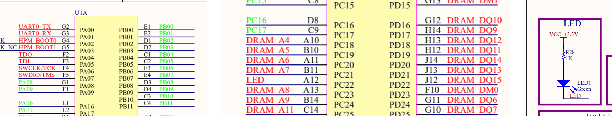

# 第 6 课：配置板载 LED 与 GPIO

第 5 课已经把 UART0 控制器连接到 `PA00/PA01`，并在 Board DTS 中选为控制台。本课继续补充绿色 LED 的板级连接：把原理图中的 `PC22` 配置为 GPIO 输出，再通过 `led0` 别名把它交给 Zephyr 应用。

完成后，Board 文件中会形成下面这条引用关系：

```text
led0 → user_led → GPIOC pin 22 → pinmux_gpioc → PC22
```

本课先检查文件中的管脚、极性和引用关系。固件编译、烧录以及 LED 翻转现象将在板载 Flash 配置完成后统一验证。

## 从原理图确认 PC22 与点亮电平

先观察原理图中间的 `LED` 网络和右侧的 LED1 电路：



*图 8-1　板载绿色 LED 的 `LED` 网络连接 HPM6E70 的 `PC22`；LED1 经 R28 接到 3.3 V。*

电流路径是：

```text
3.3 V → R28 → LED1 → PC22
```

当 `PC22` 输出低电平时，管脚吸收电流，LED1 点亮；输出高电平时，LED 两端电压不足，LED1 熄灭。因此，当前 Board 的设备树需要记录两个硬件事实：

| 原理图事实 | Board 中的写法 |
| --- | --- |
| LED 网络连接 `PC22` | `gpios = <&gpioc 22 ...>` |
| 低电平点亮 | `GPIO_ACTIVE_LOW` |

`GPIO_ACTIVE_LOW` 表示设备的逻辑有效状态对应物理低电平。应用把 LED 设置为逻辑 `1` 时，Zephyr GPIO API 会根据该标志输出低电平，不需要应用自行反转电平。

## 在 HPM SDK 中确认 PC22 的 GPIO 复用值

`PC22` 还能连接 UART5、I2C7、SPI3 等片上外设，因此不能仅凭管脚名称把 pinctrl 的复用值写成 `0`。在工程根目录的新建 PowerShell 终端中执行：

```powershell
Select-String `
  -Path .\sdk_env\hpm_sdk\soc\HPM6E00\HPM6E80\hpm_iomux.h `
  -Pattern "IOC_PC22_FUNC_CTL_GPIO_C_22"
```

应找到：

```c
#define IOC_PC22_FUNC_CTL_GPIO_C_22  IOC_PAD_FUNC_CTL_ALT_SELECT_SET(0)
```

该文件由 HPM SDK 提供，列出 HPM6E80 HAL 使用的管脚复用定义。第 4 课已经确认当前 HPM6E70 工程复用这套 HAL；上面的宏说明 `PC22` 选择 `ALT0` 时连接 `GPIO_C_22`。因此，`HPMICRO_PINMUX(...)` 的最后一个参数应填写 `0`。

## 在公共 SoC DTSI 中找到 GPIOC 控制器

打开 HPMicro 维护的公共 SoC 设备树：

```text
sdk_glue/dts/riscv/hpmicro/hpm6exx.dtsi
```

搜索 `gpioc:`，可以看到 GPIOC 已经由 SoC 层定义：

```dts
gpioc: gpio@2 {
    compatible = "hpmicro,hpm-gpio";
    reg = <0x0 DT_SIZE_K(16)>;
    gpio-controller;
    #gpio-cells = <2>;
    hpmicro-gpio-port = <2>;
    interrupts = <3 1>;
    interrupt-parent = <&plic>;
};
```

`gpioc:` 是其他设备树文件引用该控制器时使用的标签。寄存器、中断和端口编号属于 HPM6E00 系列 SoC 的公共信息，Board 不重复创建控制器；Board 只补充 `PC22` 的管脚复用、启用状态以及连接到该管脚的 LED。

## 对照官方 Board 与 gpio-leds binding

HPMicro 官方参考 Board 已展示 LED 节点的组织方式。打开：

```text
sdk_glue/boards/hpmicro/hpm6e00evk/hpm6e00evk.dts
```

文件中的关键结构是：

```dts
aliases {
    led0 = &led_r;
};

leds {
    compatible = "gpio-leds";

    led_r: led_r {
        gpios = <&gpioe 14 (GPIO_PULL_DOWN | GPIO_ACTIVE_HIGH)>;
        label = "LEDR";
    };
};
```

这段参考代码展示了 `led0` 别名、`gpio-leds` 父节点、LED 子节点和 `gpios` 属性之间的关系。再打开 Zephyr 对 `gpio-leds` 的字段定义：

```text
zephyr/dts/bindings/led/gpio-leds.yaml
```

binding 中对应的约束是：

```yaml
compatible: "gpio-leds"

child-binding:
  properties:
    gpios:
      type: phandle-array
      required: true
```

这表示每颗 LED 使用一个子节点，并通过必填的 `gpios` 属性指出 GPIO 控制器、管脚编号和有效电平。参考 Board 提供节点结构，当前 Board 的 `PC22` 和低有效极性仍以图 8-1 的原理图为准，不能照抄参考板的管脚与极性。

## 把 PC22 加入 Board pinctrl

打开第 5 课创建的文件：

```text
boards/hpmicro/dshanmcu_hpm6e70/dshanmcu_hpm6e70-pinctrl.dtsi
```

在现有 `pinmux_uart0` 节点之后、`&pinctrl` 的结束符之前加入：

```dts
pinmux_gpioc: pinmux_gpioc {
    group0 {
        /* 原理图确认：PC22 连接低电平点亮的绿色 LED。 */
        pinmux = <HPMICRO_PINMUX(HPMICRO_PIN(HPMICRO_PORTC, 22),
                                 IOC_TYPE_IOC, 0, 0)>;
    };
};
```

这行宏把刚才确认的三项信息组合起来：

| 参数 | 当前值 | 来源 |
| --- | --- | --- |
| 物理管脚 | `HPMICRO_PORTC, 22` | 板卡原理图 |
| IOC 类型 | `IOC_TYPE_IOC` | `PC22` 属于主 IOC 管脚 |
| 复用值 | `0` | `IOC_PC22_FUNC_CTL_GPIO_C_22` |

`pinmux_gpioc:` 给这组配置建立标签。Board DTS 稍后通过 `&pinmux_gpioc` 把它分配给 GPIOC 控制器。

## 在 Board DTS 中描述绿色 LED

打开：

```text
boards/hpmicro/dshanmcu_hpm6e70/dshanmcu_hpm6e70.dts
```

### 创建 gpio-leds 节点

在根节点 `/ { ... };` 内、结束符之前加入：

```dts
leds {
    compatible = "gpio-leds";

    user_led: led_0 {
        /* PC22 输出低电平时，板载绿色 LED 点亮。 */
        gpios = <&gpioc 22 GPIO_ACTIVE_LOW>;
        label = "HPM6E70 green LED";
    };
};
```

`gpios` 的三个部分分别表示：

| 写法 | 含义 |
| --- | --- |
| `&gpioc` | 使用公共 SoC DTSI 中的 GPIOC 控制器 |
| `22` | 使用 GPIOC 的第 22 号管脚，即 `PC22` |
| `GPIO_ACTIVE_LOW` | 逻辑有效状态对应物理低电平 |

`user_led:` 是这个 LED 节点的设备树标签，后面的 `aliases` 会引用它；`led_0` 是节点名称；`label` 是便于识别的可读名称。三者用途不同。

### 为标准应用提供 led0 别名

在同一个根节点中、现有 `chosen` 之前加入：

```dts
aliases {
    led0 = &user_led;
};
```

Zephyr 标准 Blinky 应用在下面的文件中使用 `DT_ALIAS(led0)` 查找 LED：

```text
zephyr/samples/basic/blinky/src/main.c
```

其中的关键代码是：

```c
#define LED0_NODE DT_ALIAS(led0)
static const struct gpio_dt_spec led = GPIO_DT_SPEC_GET(LED0_NODE, gpios);
```

应用只依赖 `led0` 和它的 `gpios` 属性，不直接写入 `PC22`。更换板卡时，只要新 Board 也提供 `led0`，同一份应用代码就能从新 Board 的设备树取得实际管脚和极性。

### 启用 GPIOC 并绑定 pinctrl

在根节点结束符之后、现有 `&uart0 { ... };` 节点之后追加：

```dts
&gpioc {
    pinctrl-0 = <&pinmux_gpioc>;
    pinctrl-names = "default";
    status = "okay";
};
```

`&gpioc` 引用 SoC 已有的控制器；`pinctrl-0` 把控制器连接到本课创建的 `PC22` 配置；`status = "okay"` 表示当前 Board 使用该控制器。

## 用 defconfig 启用基础子系统

创建下面的 Board 默认配置文件：

```text
boards/hpmicro/dshanmcu_hpm6e70/dshanmcu_hpm6e70_defconfig
```

逐行写入：

```conf
# 第 5 课的 UART0 作为 Zephyr 控制台。
CONFIG_CONSOLE=y
CONFIG_UART_CONSOLE=y
CONFIG_SERIAL=y

# 让构建系统应用 UART0 与 GPIOC 的 pinctrl 配置。
CONFIG_PINCTRL=y

# 启用本课使用的 Zephyr GPIO 子系统和 HPMicro GPIO 驱动。
CONFIG_GPIO=y
```

`defconfig` 记录选择当前 Board 时默认启用的 Kconfig 项。DTS 描述“LED 接在哪里、怎样点亮”，Kconfig 决定“GPIO、串口和 pinctrl 代码是否进入固件”；两个文件的作用不能互相替代。

## 沿引用关系检查 LED 配置

先检查 pinctrl 文件是否包含 `PC22` 和 GPIO 复用值：

```powershell
Select-String `
  -Path .\boards\hpmicro\dshanmcu_hpm6e70\dshanmcu_hpm6e70-pinctrl.dtsi `
  -Pattern "pinmux_gpioc","HPMICRO_PORTC, 22","IOC_TYPE_IOC, 0, 0"
```

再检查 Board DTS 中的 LED 节点、别名和 GPIOC 引用：

```powershell
Select-String `
  -Path .\boards\hpmicro\dshanmcu_hpm6e70\dshanmcu_hpm6e70.dts `
  -Pattern "led0 = &user_led","GPIO_ACTIVE_LOW","pinctrl-0 = <&pinmux_gpioc>"
```

最后确认 Board 默认启用了 GPIO：

```powershell
Select-String `
  -Path .\boards\hpmicro\dshanmcu_hpm6e70\dshanmcu_hpm6e70_defconfig `
  -Pattern "CONFIG_GPIO=y"
```

三次检查都能找到对应内容时，文件中的关系应为：

```text
DT_ALIAS(led0)
└─ user_led
   └─ gpios = <&gpioc 22 GPIO_ACTIVE_LOW>
      └─ pinctrl-0 = <&pinmux_gpioc>
         └─ PC22：GPIO_C_22，ALT0
```

这一步证明应用别名、LED 节点、GPIO 控制器和物理管脚已经在 Board 文件中接通。下一课继续描述板载 XPI NOR Flash；完成 Flash 与链接配置后，再构建固件并在开发板上验证串口和绿色 LED。
