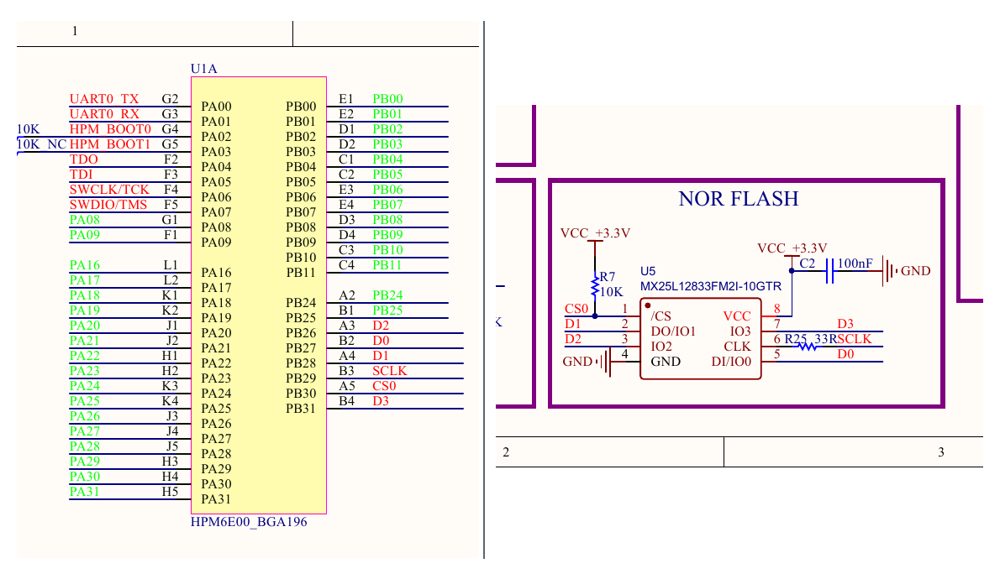
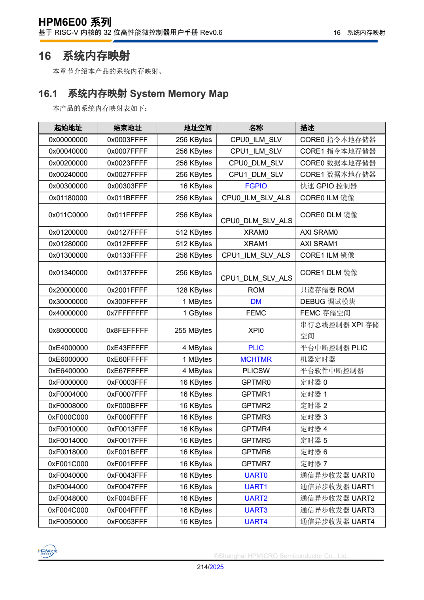

# 第 7 课：配置板载 XPI NOR Flash

第 6 课已经把绿色 LED 接入 Board。本课继续描述固件所在的板载 NOR Flash：先从原理图确认器件与 XPI0 连接，再从芯片手册确认映射地址，最后把控制器、Flash、分区和 XIP 配置写入 Board。

完成后，Board 文件中会形成下面这条启动与取指关系：

```text
上电复位
  → BootROM 配置 XPI0
  → XPI0 访问板载 U5 NOR Flash
  → Flash 映射到 CPU 地址 0x80000000
  → Zephyr 固件从该地址直接执行（XIP）
```

本课先检查源文件中的器件、地址和引用关系。编译、烧录以及断电后重新启动的结果将在第 8 课统一验证。

## 从原理图确认 U5 与 XPI0 的连接

先观察原理图中的 U5 及其与 HPM6E70 的连接：



*图 9-1　板载 U5 为 MX25L12833F；`CS0、SCLK、D0～D3` 分别连接 HPM6E70 的 `PB30、PB29、PB27、PB28、PB26、PB31`。来源：工程原理图 `hardware/hpm6e70-board/DshanMCU-HPM6E8Y_SCH_V1.pdf`，并与 `hpm_iomux.h` 中 XPI0 引脚复用定义核对一致。*

沿网络名称可以确认：U5 不是接在普通 SPI 控制器上，而是接在 HPM6E70 的 XPI0 总线上。

| U5 信号 | HPM6E70 管脚 | 作用 |
| --- | --- | --- |
| `CS0` | `PB30` | 片选 |
| `SCLK` | `PB29` | 串行时钟 |
| `D0` | `PB27` | 数据线 0 |
| `D1` | `PB28` | 数据线 1 |
| `D2` | `PB26` | 数据线 2 |
| `D3` | `PB31` | 数据线 3 |

这组对应关系可以用 HPM SDK 的引脚复用表独立核对——`sdk_env/hpm_sdk/soc/HPM6E00/HPM6E80/hpm_iomux.h` 中，`PB30` 只定义了 `XPI0_CA_CS0`、`PB29` 只定义了 `XPI0_CA_SCLK`，数据线同理；引脚能承担哪个 XPI0 功能由芯片固化，不随连线改变。

器件型号中的 `128` 表示容量为 128 Mbit。设备树使用字节描述容量，因此需要换算：

```text
128 Mbit ÷ 8 = 16 MiB = 0x01000000 Byte
```

后面 `flash0` 的容量应填写 `DT_SIZE_M(16)`。

## 从芯片手册确认 CPU 看到的地址

外部 Flash 的物理连线只能说明它接在 XPI0 上，不能决定 CPU 从哪个地址访问它。映射地址要查 HPM6E00 系列用户手册的系统内存映射表。



*图 9-2　XPI0 存储空间从 `0x80000000` 开始。来源：先楫半导体《[HPM6E00 系列用户手册 Rev0.6](https://www.hpmicro.com/Public/Uploads/uploadfile/files/20250109/HPM6E00UMV06.pdf)》第 16.1 节、第 214 页。后续版本可从 [HPM6E00 系列官方资料页面](https://www.hpmicro.com/product-center/microcontroller/hpm6e00) 获取。*

手册中的 `0x80000000` 是 XPI0 外接存储器映射到 CPU 地址空间后的起点。当前板载 Flash 容量为 16 MiB，所以本板实际使用的映射范围是：

```text
起始地址：0x80000000
结束地址：0x80FFFFFF
容量：    0x01000000 Byte（16 MiB）
```

## 区分控制器地址与 Flash 映射地址

打开 HPMicro 维护的公共 SoC 设备树：

```text
sdk_glue/dts/riscv/hpmicro/hpm6exx.dtsi
```

搜索 `xpi0:`，可以看到控制器已经由 SoC 层定义：

```dts
xpi0: xpi@f3000000 {
    compatible = "hpmicro,xpi";
    reg = <0xf3000000 DT_SIZE_K(16)>;
    #address-cells = <1>;
    #size-cells = <1>;
    status = "disabled";
};
```

这里同时出现了两个不同用途的地址，不能混用：

| 地址 | 描述的对象 | 用途 |
| --- | --- | --- |
| `0xF3000000` | XPI0 控制器寄存器 | 驱动配置 XPI0 控制器 |
| `0x80000000` | XPI0 外接存储器映射窗口 | CPU 读取指令和 Flash 数据 |

SoC 层已经提供 `xpi0:` 标签、寄存器地址和地址单元格式。Board 不重新创建控制器，只需要启用它，并在其下面描述本板实际焊接的 U5。

## 对照 binding 与官方参考 Board

先打开 HPMicro Flash binding：

```text
sdk_glue/dts/bindings/mtd/hpmicro,hpmicro-flash.yaml
```

其中把三个 XPI NOR 启动配置字定义为必填属性：

```yaml
compatible: "hpmicro,hpmicro-flash"

properties:
  "nor-cfg-opt-hdr":
    type: int
    required: true
  "nor-cfg-opt-opt0":
    type: int
    required: true
  "nor-cfg-opt-opt1":
    type: int
    required: true
```

binding 说明“属性必须存在以及数据类型是什么”，但不提供当前硬件应填写的数值。再打开同系列官方参考 Board：

```text
sdk_glue/boards/hpmicro/hpm6e00evk/hpm6e00evk.dts
```

在 `&xpi0` 中可以找到已经验证过的 HPMicro XPI NOR 节点结构和启动配置字：

```dts
nor-cfg-opt-hdr = <0xfcf90001>;
nor-cfg-opt-opt0 = <0x05>;
nor-cfg-opt-opt1 = <0x1000>;
```

本课按下面的边界使用这些资料：

| 配置内容 | 当前值的依据 |
| --- | --- |
| U5 型号、XPI0 信号连接 | 本板原理图 |
| 16 MiB 容量 | U5 器件容量 |
| `0x80000000` 映射起点 | HPM6E00 系列用户手册 |
| Flash 节点结构和三个启动配置字 | HPM6E00EVK 参考 Board |
| 属性名称与必填约束 | HPMicro Flash binding |

参考 Board 还设置了 `zephyr,code-partition = &slot0_partition`，因为它把代码区选到 `image-0` 分区。当前课程采用从 Flash 映射起点 `0x80000000` 直接执行的最小 XIP 方案，因此只指定 Flash 和控制器，不设置 `zephyr,code-partition`。

## 在 Board DTS 中选择 Flash 与控制器

打开：

```text
boards/hpmicro/dshanmcu_hpm6e70/dshanmcu_hpm6e70.dts
```

第 5 课已经在 `chosen` 中选择三个内存区域和 UART0。添加 Flash 之前，先在工程根目录检查这五项仍然存在：

```powershell
Select-String `
  -Path .\boards\hpmicro\dshanmcu_hpm6e70\dshanmcu_hpm6e70.dts `
  -Pattern "zephyr,sram = &sram", `
           "zephyr,itcm = &ilm", `
           "zephyr,dtcm = &dlm", `
           "zephyr,console = &uart0", `
           "zephyr,shell-uart = &uart0" `
  -SimpleMatch
```

应得到五条匹配结果。如果缺少其中任何一项，先回到第 5 课补齐对应内容，再继续添加 Flash。

在根节点已有的 `chosen { ... };` 中加入第一条：

```dts
zephyr,flash = &flash0;
```

它告诉 Zephyr：当前 Board 的主 Flash 是稍后创建的 `flash0`。

再加入第二条：

```dts
zephyr,flash-controller = &xpi0;
```

它告诉 Zephyr：`flash0` 由公共 SoC DTSI 中的 XPI0 控制器访问。此时完整的 `chosen` 应为：

```dts
chosen {
    zephyr,console = &uart0;
    zephyr,shell-uart = &uart0;
    zephyr,sram = &sram;
    zephyr,flash = &flash0;
    zephyr,itcm = &ilm;
    zephyr,dtcm = &dlm;
    zephyr,flash-controller = &xpi0;
};
```

七项属性的课程来源如下：

| 属性 | 写入位置 |
| --- | --- |
| `zephyr,console`、`zephyr,shell-uart` | 第 5 课的 UART0 控制台配置 |
| `zephyr,sram`、`zephyr,itcm`、`zephyr,dtcm` | 第 5 课建立 Board DTS 时选择 SoC 内存区域 |
| `zephyr,flash`、`zephyr,flash-controller` | 本课的 XPI NOR Flash 配置 |

不要加入 `zephyr,code-partition`。本课程的代码链接起点仍是整个 Flash 映射区的起点 `0x80000000`。

## 启用 XPI0 并描述板载 Flash

在 Board DTS 的根节点结束符之后追加 `&xpi0` 节点。先写入控制器和 Flash 的基本属性：

```dts
&xpi0 {
    status = "okay";

    flash0: flash@0 {
        compatible = "hpmicro,hpmicro-flash", "soc-nv-flash";
        reg = <0x80000000 DT_SIZE_M(16)>;
        status = "okay";
        erase-block-size = <4096>;
        write-block-size = <1>;

        /* 复用 HPM6E00EVK 已验证的 XPI NOR 启动配置字。 */
        nor-cfg-opt-hdr = <0xfcf90001>;
        nor-cfg-opt-opt0 = <0x05>;
        nor-cfg-opt-opt1 = <0x1000>;
    };
};
```

各字段分别解决不同的问题：

| 字段 | 当前作用 |
| --- | --- |
| `status = "okay"` | 启用 XPI0 控制器和 Flash 设备 |
| `flash0:` | 建立供 `chosen` 引用的设备树标签 |
| `compatible` | 选择 HPMicro Flash 驱动并继承通用 NOR Flash 属性 |
| `reg` | 描述 CPU 映射起点和 16 MiB 容量 |
| `erase-block-size` | 描述 4 KiB 擦除粒度 |
| `write-block-size` | 描述最小可写单位 |
| 三个 `nor-cfg-opt-*` | 交给 HPM BootROM/XPI ROM API 配置外部 NOR |

节点名中的 `flash@0` 是 XPI0 总线下的子节点名称；真正的 CPU 映射地址由 `reg = <0x80000000 ...>` 给出。

## 为当前 Flash 驱动补齐分区标签

打开当前 HPMicro Flash 驱动：

```text
sdk_glue/drivers/flash/flash_hpmicro.c
```

搜索 `FIXED_PARTITION_`，可以看到页面布局代码会读取下面五个标签：

```text
boot_partition
slot0_partition
slot1_partition
scratch_partition
storage_partition
```

因此，即使本课暂时只运行直接 XIP 的最小应用，设备树也要提供这五个标签，否则启用 Flash 驱动后会在设备树宏展开阶段缺少定义。

回到 Board DTS，在刚才三个 `nor-cfg-opt-*` 属性之后、`flash0` 的结束符之前加入：

```dts
partitions {
    compatible = "fixed-partitions";
    #address-cells = <1>;
    #size-cells = <1>;

    boot_partition: partition@0 {
        label = "mcuboot";
        reg = <0x3000 0x40000>;
    };

    slot0_partition: partition@43000 {
        label = "image-0";
        reg = <0x43000 DT_SIZE_K(1536)>;
    };

    slot1_partition: partition@1c3000 {
        label = "image-1";
        reg = <0x1c3000 DT_SIZE_K(1536)>;
    };

    scratch_partition: partition@343000 {
        label = "image-scratch";
        reg = <0x343000 DT_SIZE_K(128)>;
    };

    storage_partition: partition@363000 {
        label = "storage";
        reg = <0x363000 DT_SIZE_K(128)>;
    };
};
```

`reg` 中的第一个数是相对 Flash 起点的偏移，第二个数是分区大小。这套布局沿用官方参考 Board，满足当前驱动对五个标签的要求，也为后续 MCUboot 使用预留结构。

这些分区不会自动改变本课固件的链接起点。只有 `chosen` 明确设置 `zephyr,code-partition` 时，Zephyr 才会把所选分区当作代码区；当前 Board 没有设置它，所以最小应用仍从 `0x80000000` 直接 XIP。

## 在 defconfig 中启用 XIP 与 Flash

打开：

```text
boards/hpmicro/dshanmcu_hpm6e70/dshanmcu_hpm6e70_defconfig
```

先加入 XIP：

```conf
# 固件位于 XPI0 映射区，CPU 直接从外部 NOR Flash 取指。
CONFIG_XIP=y
```

`XIP` 是 *Execute In Place*，表示指令保留在外部 Flash 中，CPU 通过 XPI 映射窗口直接取指，不需要先把整份固件复制到 SRAM。

再启用 Flash 子系统：

```conf
# 编译 Zephyr Flash API 与 HPMicro Flash 驱动。
CONFIG_FLASH=y
```

DTS 负责描述“Flash 接在哪里、映射多大、由哪个控制器访问”；Kconfig 负责决定“XIP 与 Flash 驱动代码是否进入固件”。两部分需要同时存在。

## 沿引用关系检查 Flash 配置

先检查 `chosen` 是否指向 `flash0` 和 `xpi0`：

```powershell
Select-String `
  -Path .\boards\hpmicro\dshanmcu_hpm6e70\dshanmcu_hpm6e70.dts `
  -Pattern "zephyr,flash = &flash0", `
           "zephyr,flash-controller = &xpi0" `
  -SimpleMatch
```

再检查 Flash 的地址、容量和启动配置字：

```powershell
Select-String `
  -Path .\boards\hpmicro\dshanmcu_hpm6e70\dshanmcu_hpm6e70.dts `
  -Pattern "reg = <0x80000000 DT_SIZE_M(16)>", `
           "nor-cfg-opt-hdr", `
           "nor-cfg-opt-opt0", `
           "nor-cfg-opt-opt1" `
  -SimpleMatch
```

然后检查驱动要求的五个分区标签：

```powershell
Select-String `
  -Path .\boards\hpmicro\dshanmcu_hpm6e70\dshanmcu_hpm6e70.dts `
  -Pattern "boot_partition:", `
           "slot0_partition:", `
           "slot1_partition:", `
           "scratch_partition:", `
           "storage_partition:" `
  -SimpleMatch
```

最后确认 Board 默认启用了 XIP 和 Flash：

```powershell
Select-String `
  -Path .\boards\hpmicro\dshanmcu_hpm6e70\dshanmcu_hpm6e70_defconfig `
  -Pattern "CONFIG_XIP=y", `
           "CONFIG_FLASH=y" `
  -SimpleMatch
```

四次检查都能找到对应内容时，源文件中的关系应为：

```text
chosen zephyr,flash ───────────────→ flash0
chosen zephyr,flash-controller ────→ xpi0
xpi0 ──────────────────────────────→ 0xF3000000 控制器寄存器
flash0 reg ────────────────────────→ 0x80000000，16 MiB 映射窗口
CONFIG_XIP ────────────────────────→ 从 Flash 映射区直接取指
```

第 8 课将执行完整构建，并在生成的设备树、链接结果和固件文件中验证这条关系；随后通过烧录、断电复位和串口日志确认 BootROM 能从板载 U5 启动应用。

[进入第 8 课：编译、烧录并验证](../p2-08-编译烧录并验证/README.md) · [课程目录](../README.md)
