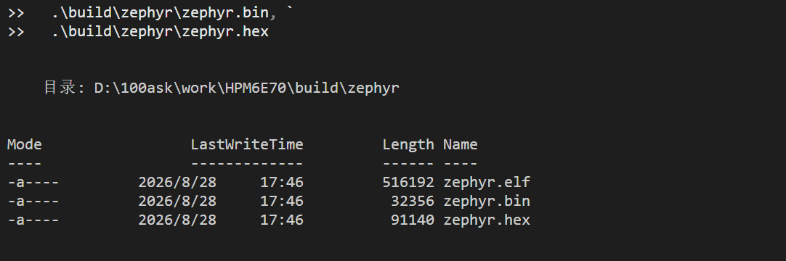
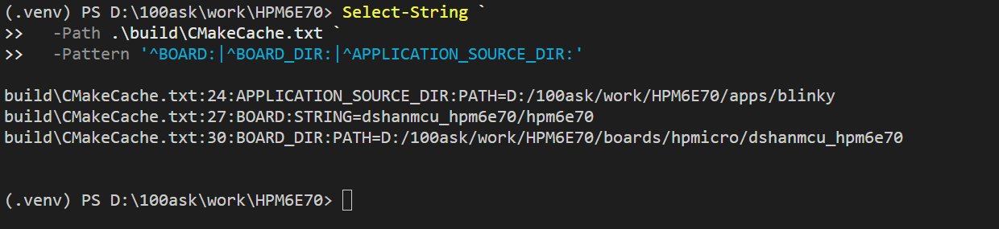
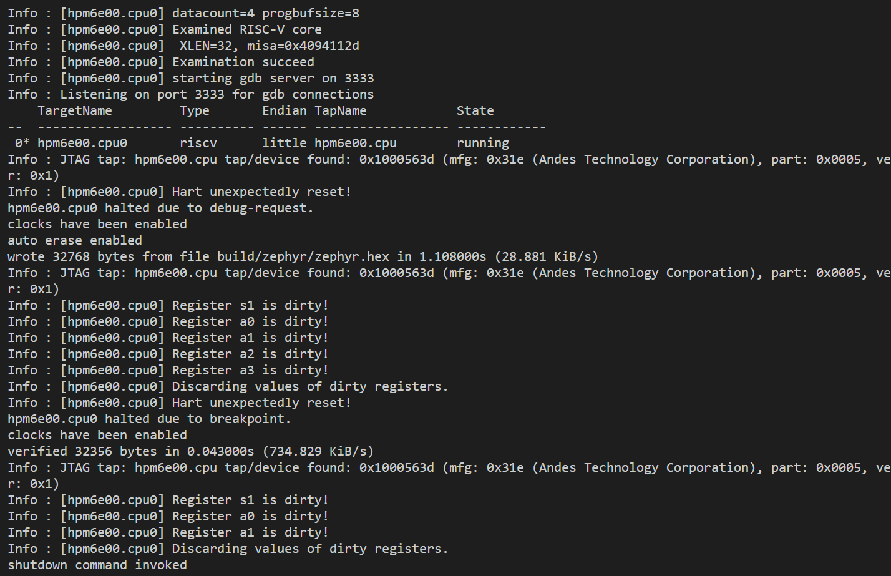
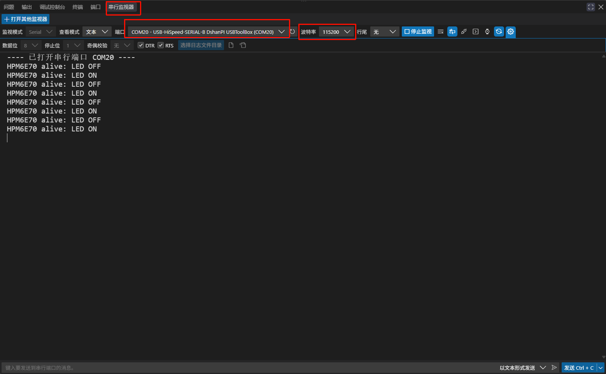
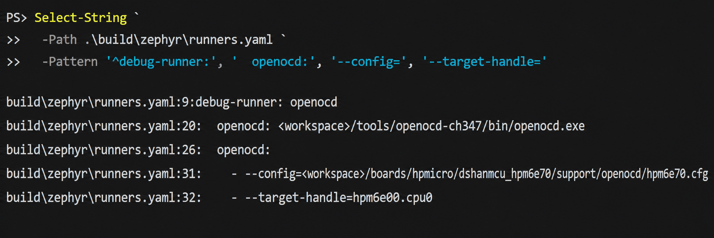

# 第 8 课：编译、烧录与验证

前面各课分别建立了 Board 身份、SoC、UART、LED 和 Flash，并在第 10、11 课接好了 JTAG 与串口两条硬件路径。本课不再增加任何构建配置，只做两件事：用标准 `west` 命令验证这些层能否组合成真正可运行的固件，再把验证结果登记回 Board 元数据。

## 编译标准应用

工程根目录的 `apps/blinky/` 是一个普通 Zephyr 应用。若刚打开新的 Windows PowerShell，先进入工程根目录（下文以 `<工程根目录>` 指代你自己的保存位置），再逐行进入开发准备阶段创建的独立环境：

```powershell
Set-ExecutionPolicy -Scope Process Bypass
.\.venv\Scripts\Activate.ps1
$env:PYTHONUTF8 = '1'
$env:ZEPHYR_TOOLCHAIN_VARIANT = 'cross-compile'
$env:CROSS_COMPILE = "$PWD\sdk_env\toolchains\rv32imac_zicsr_zifencei_multilib_b_ext-win\bin\riscv32-unknown-elf-"
$env:HPM_SDK_DIR = "$PWD\sdk_env\hpm_sdk"
```

上述命令都从工程根目录执行；`$PWD` 会自动展开为你电脑上的实际路径，无需手工替换。

先确认 `.venv` 已经激活：

```powershell
(Get-Command west).Source
```

输出应指向 `<工程根目录>\.venv\Scripts\west.exe`。然后编译：

```powershell
west build -p always `
  -b dshanmcu_hpm6e70/hpm6e70 `
  .\apps\blinky `
  -d .\build
```

这里的 `build` 指工程根目录下的 `build/`。`-p always` 会重新执行 CMake 配置，适合刚修改 Board、DTS 或 Kconfig 时使用。

打开 `apps/blinky/CMakeLists.txt`，可以看到 `find_package(Zephyr ...)` 之前已有：

```cmake
# apps/blinky/ 向上两级就是包含 boards/ 的工程根目录。
list(APPEND BOARD_ROOT ${CMAKE_CURRENT_LIST_DIR}/../..)
```

这行配置把本工程的板卡目录交给 Zephyr，所以日常构建命令不再需要手工输入 `-DBOARD_ROOT`。它必须出现在 `find_package(Zephyr ...)` 之前，因为 Zephyr 会在加载阶段搜索 Board。

成功后应存在：

```powershell
Get-Item `
  .\build\zephyr\zephyr.elf, `
  .\build\zephyr\zephyr.bin, `
  .\build\zephyr\zephyr.hex
```



再核对构建实际使用的工具：

```powershell
Select-String `
  -Path .\build\CMakeCache.txt `
  -Pattern '^WEST_PYTHON:', '^CROSS_COMPILE:', '^HPM_SDK_DIR:', '^CMAKE_MAKE_PROGRAM:'
```

`WEST_PYTHON` 和 `CMAKE_MAKE_PROGRAM` 应位于 `.venv`，`CROSS_COMPILE` 和 `HPM_SDK_DIR` 应位于 `sdk_env`。若路径不符合预期，重新进入开发环境，再使用 `-p always` 构建。

## 核对构建实际使用的 Board

```powershell
Select-String `
  -Path .\build\CMakeCache.txt `
  -Pattern '^BOARD:|^BOARD_DIR:|^APPLICATION_SOURCE_DIR:'
```



`APPLICATION_SOURCE_DIR` 应指向 `apps/blinky`，`BOARD_DIR` 应指向本工程的 `boards/hpmicro/dshanmcu_hpm6e70`。这能确认当前固件不是误用了参考板。

## 先查看烧录器配置

```powershell
west flash -d .\build --context
```

输出应显示：

- runner 为 `openocd`；
- 待烧录文件为 `build/zephyr/zephyr.hex`；
- OpenOCD 来自 `tools/openocd-ch347`；
- 配置文件来自本 Board 的 `support/openocd/hpm6e70.cfg`。

## 烧录当前构建

连接 CH347F、板卡和 JTAG 后执行：

```powershell
west flash -d .\build --skip-rebuild
```

`--skip-rebuild` 表示直接烧录刚刚核对过的构建结果。完成标志是 `wrote ... bytes from file build/zephyr/zephyr.hex` 与 `verified ... bytes` 两行——前者表示写入完成，后者表示 OpenOCD 回读校验通过；命令随后以 `shutdown command invoked` 结束。



## 观察串口输出

串口终端已在“连接串口与 COM 端口”中配置为 `115200、8N1、无流控`。在 VS Code 中打开 Serial Monitor 并点击“开始监视”，再按一下板卡复位键。`apps/blinky/src/main.c` 会先打印硬件配置摘要，然后每秒输出一次 LED 状态：

```text
HPM6E70 Zephyr bring-up: UART0 PA00/PA01, 115200 8N1
HPM6E70 alive: LED ON
HPM6E70 alive: LED OFF
HPM6E70 alive: LED ON
```



<p className="image-caption">UART0 实测日志：烧录器串口 1 枚举为 USB-HiSpeed-SERIAL-B；图中的 COM20 是当前电脑分配的实例值。</p>

截图是在应用运行后打开监视器取得的，因此没有包含启动时只打印一次的 bring-up 行；按复位键即可重新观察完整输出。核对三处：当前面板是“串行监视器”，端口属于 `USB-HiSpeed-SERIAL-B`，波特率为 115200。

观察下面三组对应关系：

| 现象 | 已验证的功能 |
| --- | --- |
| 断电后仍能启动 | BootROM → XPI0 → 板载 NOR Flash |
| 复位后出现 bring-up 行，日志持续输出 | pinctrl → UART0 → Zephyr console |
| `LED ON/OFF` 与绿色 LED 同步翻转 | DTS alias → GPIO API → GPIOC PC22 |

如果监视器打开时应用已经运行了一段时间，第一次看到的可能直接是某一条 `LED ON/OFF`；按复位键即可重新观察完整启动过程。

### 端口能打开但复位后没有文字

依次检查：

1. 选择的 COM 端口是否属于烧录器串口 1 的 `USB-HiSpeed-SERIAL-B`；
2. 板卡 UART0_TX 是否连接到转换器 RX；
3. 两端是否共地；
4. 参数是否为 115200、8N1、无流控；
5. 绿色 LED 是否仍然每秒翻转。

LED 正常闪烁时，CPU 和应用仍在运行，应优先检查 UART 接线、端口和参数。LED 也不闪时，回到本课的编译与烧录小节重新核对。若输出的是乱码而不是空白，按“连接串口与 COM 端口”中的“持续乱码”一节核对波特率与电气连接。

## 把已验证能力登记进 supported

板级支持到这里全部通过验证，第 3 课创建 `dshanmcu_hpm6e70.yaml` 时留下的约定可以兑现了——`supported` 不预先填写，等能力通过验证后再登记。刚才的三个现象正好对应三项能力：

| 刚验证过的能力 | 对应现象 |
| --- | --- |
| `flash` | `west flash` 写入固件并回读校验通过 |
| `uart` | Serial Monitor 持续输出运行日志 |
| `gpio` | 绿色 LED 周期翻转 |

打开 `boards/hpmicro/dshanmcu_hpm6e70/dshanmcu_hpm6e70.yaml`，在 `vendor:` 之前加入：

```yaml
supported:
  - flash
  - gpio
  - uart
```

`supported` 供板卡列表和 Twister 测试筛选使用：它向工具声明本板已验证支持哪些外设类别，不改变构建行为，登记之后也不必重新编译。这是本课唯一一次修改工程文件；以后每验证一类新外设，再往列表里追加。

上面这两句断言都能在工作区里自行复现：

- **它不参与构建**：把 `supported` 临时注释掉再执行 `west build`，ninja 只会回答 `no work to do`——构建系统根本不追踪这个文件的改动；
- **元数据确实被消费**：`zephyr/scripts/pylib/twister/twisterlib/testplan.py` 第 868 行，Twister 拿 yaml 里的 `ram` 与测试用例声明的 `min_ram` 比较，内存不足的板卡被自动跳过（例如 USB mass 存储样例要求 `min_ram: 128` KB，本板 `ram: 1024` 可以通过）。

你可能会有疑问：`supported` 既然是元数据，为什么不趁编译之前、和其他 Board 文件一起写好？因为它登记的不是“配置了哪些外设”，而是“验证过了哪些外设”。编译之前能确认的只是“DTS 里有这些节点”，属于未经实测的承诺；现在写下每一个条目，背后都有刚刚观察到的现象。它不参与编译，写在编译前后对固件没有任何影响——区别只在证据。第 3 课把它留到现在，就是为了把“已配置”和“已验证”分开登记。

## 验证 JTAG 调试

JTAG 检测与烧录不是同一件事。`west debugserver` 会连接并暂停 CPU，但不会擦除或写入 Flash；它适合在烧录失败时先检查调试器、接线和芯片调试端口。烧录成功后，再用同一个 JTAG 接口验证调试功能。

先确认构建目录记录了调试工具。“连接并验证 JTAG”中使用的参数来自 Board 的 `board.cmake`，构建后保存在：

```text
build/zephyr/runners.yaml
```

从工程根目录检查实际生效的配置：

```powershell
Select-String `
  -Path .\build\zephyr\runners.yaml `
  -Pattern '^debug-runner:', '  openocd:', '--config=', '--target-handle='
```



<p className="image-caption">构建结果中的 OpenOCD runner：默认 runner、程序、Board 配置文件和目标核已经同时写入 runners.yaml。</p>

`runners.yaml` 由构建系统生成，其中的 OpenOCD 程序和配置文件通常会记录为当前电脑上的绝对路径。检查自己的输出时，应关注工程根目录之后的相对位置，而不是照抄另一台电脑的盘符。应看到默认调试 runner 为 `openocd`，程序路径来自 `tools/openocd-ch347`，配置文件来自当前 Board 的 `support/openocd/hpm6e70.cfg`，目标核为 `hpm6e00.cpu0`。

然后启动 GDB 服务：

```powershell
west debugserver -d .\build
```

Zephyr 3.7 的 `west debugserver` 会从指定构建目录读取 runner、ELF 文件和调试器参数，然后启动一个供 GDB 或 IDE 连接的本地服务。官方命令说明见 [Building, Flashing and Debugging](https://docs.zephyrproject.org/3.7.0/develop/west/build-flash-debug.html#debugging-west-debug-west-debugserver)。

连接成功后，终端不会立即返回命令提示符，因为 OpenOCD 正在等待 GDB 客户端。核对下面几类输出：

```text
-- west debugserver: using runner openocd
CH347 ... found
JTAG tap: hpm6e00.cpu tap/device found: 0x1000563d
[hpm6e00.cpu0] Examination succeed
Listening on port 3333 for gdb connections
```

这些输出分别确认：

| 输出 | 已确认的环节 |
| --- | --- |
| `using runner openocd` | west 已读取当前 `build/` 的 runner 配置 |
| `CH347 ... found` | WinUSB 与 CH347F JTAG 接口可访问 |
| `tap/device found: 0x1000563d` | 五根线和目标板供电正常，JTAG 扫描成功 |
| `Examination succeed` | OpenOCD 已识别并检查 RISC-V CPU |
| `Listening on port 3333` | GDB 服务已就绪 |

配置请求的 JTAG 速度是 500 kHz。CH347F 可能报告改用硬件能够实现的相邻档位，例如 938 kHz；只要 TAP ID、CPU 检查和 GDB 监听随后成功，这条速度提示不是连接失败。

检查完成后按 `Ctrl+C` 结束 OpenOCD。CPU 在调试服务器运行期间可能保持暂停；退出后按板卡复位键即可重新运行已经烧录的应用。

### JTAG 调试排障

- **Windows 找不到 CH347F**：检查 CH347F 到电脑的 USB 连接和设备管理器。此时还没有进入 JTAG 扫描，不需要修改 Board DTS 或应用代码。
- **OpenOCD 报告无法打开 CH347F**：确认“连接并验证 JTAG”中的 Zadig 操作的是 Interface 4 / `MI_04`，并关闭其他可能占用 JTAG 接口的程序。
- **TAP ID 全为 0 或全为 1**：按顺序检查目标板供电、GND、TDO、TDI、TCK、TMS 和排针方向。`all ones` 常见于 TDO 未连接、目标板未供电或没有共地。
- **TAP ID 不是 `0x1000563D`**：停止后续烧录并保存完整输出，重新确认目标芯片型号、排针方向和 OpenOCD 配置。不同的 TAP ID 不能用“通信已经成功”直接带过。

至此，从零搭建的工程已经可以输出日志、烧录、调试和重复构建。下一课在同一块 Board 上配置板载 SDRAM。

[上一课：配置板载 XPI NOR Flash](../p2-07-配置XPI-NOR-Flash/README.md) · [下一课：认识 SDRAM 与 FEMC](../p2-09-认识SDRAM与FEMC/README.md) · [课程目录](../README.md)
