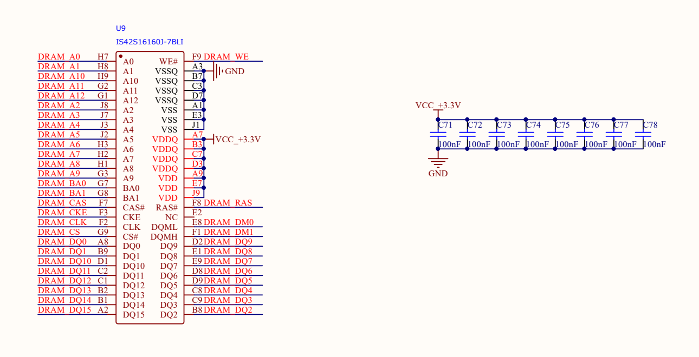
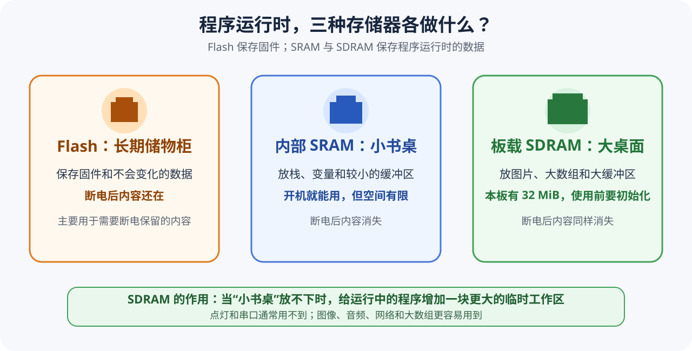
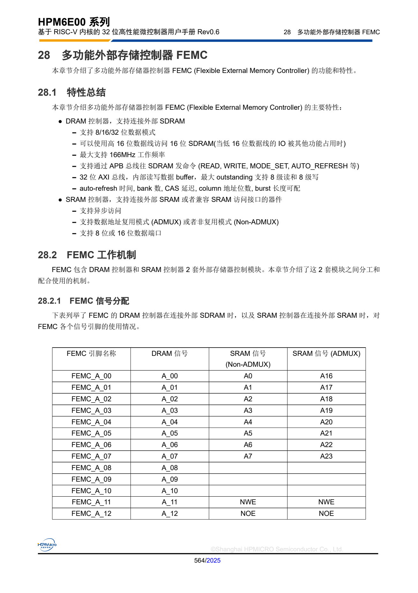
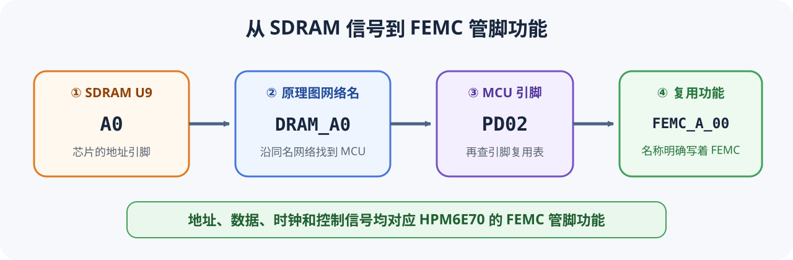
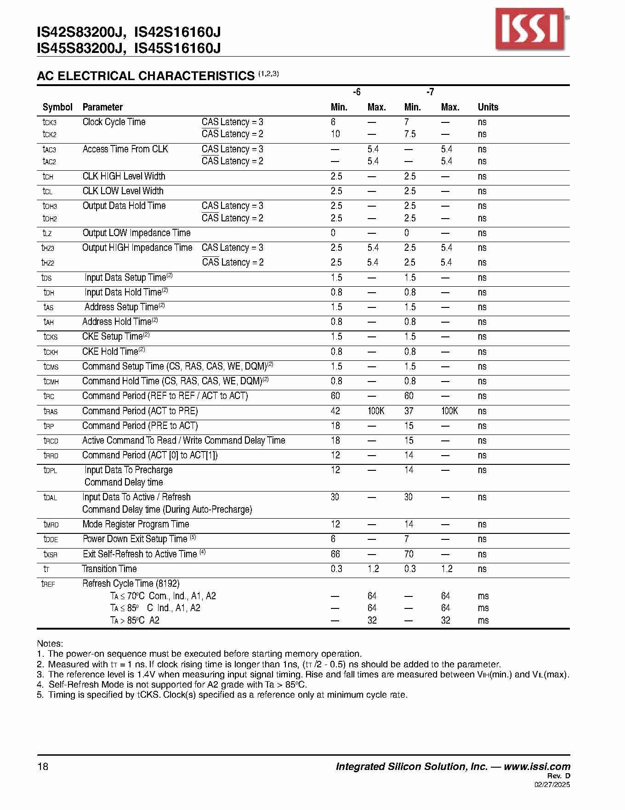

# 第 9 课：认识 SDRAM 与 FEMC

前面的程序使用芯片内部 SRAM。板卡上还焊有一颗容量更大的 SDRAM：U9，型号为 **IS42S16160J-7BLI**。这一课先从原理图和器件手册了解它的容量、连接方式和访问路径，为下一课编写板级初始化代码准备参数。

## SDRAM 在板卡上负责什么

SRAM 和 SDRAM 都会在断电后丢失内容，但用途并不相同：

| 存储器 | 本板容量 | 适合保存什么 |
|---|---:|---|
| 芯片内部 SRAM | 由 HPM6E70 提供 | 栈、全局变量和较小的运行数据 |
| 板载 SDRAM | 32 MiB | 帧缓冲、大数组、网络缓冲区等较大的运行数据 |
| 板载 NOR Flash | 16 MiB | 断电后仍需保留的固件和数据 |

SDRAM 不能替代 Flash：它扩大的是程序运行时可使用的内存，而不是断电保存空间。



从 U9 原理图可以读到三组关键信息：

- `A0～A12`、`BA0/BA1` 用来选择存储位置；
- `DQ0～DQ15` 是 16 位数据总线，`DQM0/DQM1` 分别控制两个字节通道；
- `CLK`、`CKE`、`CS`、`RAS`、`CAS`、`WE` 负责传递 SDRAM 命令和时序。

## 32 MiB 容量怎样得到

IS42S16160J 的组织形式是 **4 Bank × 4M × 16 bit**：

```text
4 × 4M × 16 bit
= 256 Mbit
= 32 MiB
```

板卡并没有只接出其中一部分数据线，因此设备树会把整颗器件描述为连续的 32 MiB 内存。

## CPU 为什么不能直接驱动 SDRAM 引脚

普通 C 代码只会发起“读取某个地址”或“写入某个地址”的请求；SDRAM 则需要激活行、选择列、预充电和周期刷新。HPM6E70 内部的 **FEMC（Flexible External Memory Controller，灵活外部存储器控制器）** 负责完成这种转换。



HPM6E00 用户手册把 SDRAM 列为 FEMC 支持的外部存储器类型，并列出了初始化、刷新和时序控制能力：



原理图也能独立验证这条关系。以 U9 的 `A0` 为例：

```text
U9 A0
  └─ 原理图网络 DRAM_A0
       └─ HPM6E70 引脚 PD02
            └─ 复用功能 FEMC_A_00
```



地址线、数据线和控制线都能用相同方法追到 `FEMC_*` 复用功能，因此板载 SDRAM 应由 FEMC 控制。

## CPU 将从哪个地址访问它

HPM6E00 用户手册给 FEMC SDRAM 分配的地址窗口从 `0x40000000` 开始：


本板容量为 32 MiB，因此可用范围为：

```text
起始地址：0x40000000
最后地址：0x41FFFFFF
容量：    0x02000000（32 MiB）
```

这组地址将在下一课写进板级设备树，应用再通过设备树取得地址和容量。

## 工作频率和时序从哪里取得

板级代码使用约 `133.33 MHz` 的 FEMC 时钟。IS42S16160J 的 `-7` 速度等级在 CL3 下允许更高的工作频率，因此该频率位于器件规格范围内。行激活、预充电和刷新等等待时间也应满足数据手册中的最小值。



下一课会把这些资料分别落实到三个位置：

1. 设备树声明地址和容量；
2. Kconfig 决定哪些应用需要 SDRAM；
3. 板级 C 代码配置引脚、FEMC 时钟、组织形式和时序。

## 本课检查

学完后，应能从资料中确认：

- U9 是 32 MiB、16 位数据总线的 SDRAM；
- HPM6E70 通过 FEMC 与 U9 通信；
- CPU 从 `0x40000000` 开始访问这块内存；
- 初始化参数分别来自板卡原理图、HPM6E00 用户手册和 ISSI 器件手册。
