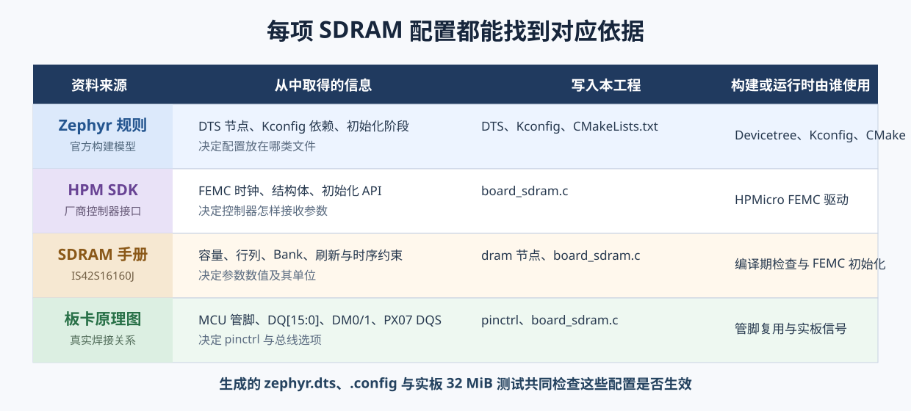
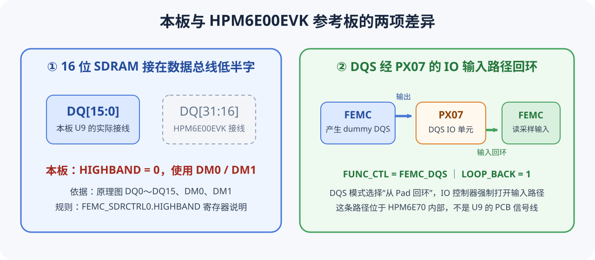

# 第 10 课：接入板载 SDRAM

上一课已经确认了 U9 的硬件事实。这一课把这些信息写进 HPM6E70 Board，使 Zephyr 能按应用需要初始化板载 SDRAM。

本课修改的都是工程源码：

```text
boards/hpmicro/dshanmcu_hpm6e70/
├─ dshanmcu_hpm6e70.dts    地址、容量和默认状态
├─ Kconfig                  SDRAM 功能开关
├─ CMakeLists.txt           决定是否编译初始化文件
└─ board_sdram.c            引脚、时钟、FEMC 参数和初始化函数
```



## 第一步：在设备树中描述这块内存

打开：

```text
boards/hpmicro/dshanmcu_hpm6e70/dshanmcu_hpm6e70.dts
```

在根节点 `/ { ... };` 中加入：

```dts
/* U9：4 Bank × 4M × 16 bit = 32 MiB。 */
dram: memory@40000000 {
    device_type = "memory";
    reg = <0x40000000 DT_SIZE_M(32)>;

    /* 普通 Demo 不需要 SDRAM，由应用 Overlay 再启用。 */
    status = "disabled";
};
```

这里的每一项都能回到上一课的资料：

| 写法 | 对应信息 |
|---|---|
| `memory@40000000` | HPM6E00 手册中的 SDRAM 地址窗口 |
| `DT_SIZE_M(32)` | U9 的 4 Bank × 4M × 16 bit 容量 |
| `status = "disabled"` | 只让真正需要 SDRAM 的应用承担初始化和代码体积 |

设备树只回答“内存在哪里、有多大”，尚未配置 FEMC。

## 第二步：增加应用可选择的 Kconfig

打开：

```text
boards/hpmicro/dshanmcu_hpm6e70/Kconfig
```

在 `if BOARD_DSHANMCU_HPM6E70` 范围内加入：

```kconfig
config DSHANMCU_HPM6E70_SDRAM
    bool "启用板载 IS42S16160J SDRAM 支持"
    default n
    # FEMC 驱动由 HPMicro 适配层提供。
    select HAS_HPMSDK_FEMC

config INIT_EXT_RAM
    bool "在 Zephyr 启动前初始化板载 SDRAM"
    default n
    depends on DSHANMCU_HPM6E70_SDRAM
```

第一个选项把 HPM SDK 的 FEMC 驱动加入构建；第二个选项启用 HPMicro SoC 启动代码已有的外部 RAM 初始化功能。应用不选择它们时，原来的 LED Demo 不会初始化 SDRAM。

## 第三步：只在启用时编译板级初始化

打开：

```text
boards/hpmicro/dshanmcu_hpm6e70/CMakeLists.txt
```

写入：

```cmake
if(CONFIG_DSHANMCU_HPM6E70_SDRAM)
    zephyr_library()

    # 应用明确需要 SDRAM 时，才编译 FEMC 初始化代码。
    zephyr_library_sources(board_sdram.c)
endif()
```

Kconfig 决定能力是否启用，CMake 决定对应源文件是否参加编译，两者承担的工作不同。

## 第四步：按原理图配置 FEMC 引脚

新建：

```text
boards/hpmicro/dshanmcu_hpm6e70/board_sdram.c
```

文件开头先取得 Zephyr 设备树和 HPM SDK 驱动接口：

```c
#include <zephyr/devicetree.h>

#include <hpm_clock_drv.h>
#include <hpm_common.h>
#include <hpm_femc_drv.h>
#include <hpm_soc.h>
```

随后逐条把原理图网络对应到 HPM6E70 引脚复用功能。例如地址线 A0：

```c
static void init_sdram_pins(void)
{
    /* U9 A0 → DRAM_A0 → PD02 → FEMC_A_00。 */
    HPM_IOC->PAD[IOC_PAD_PD02].FUNC_CTL =
        IOC_PD02_FUNC_CTL_FEMC_A_00;

    /* 其余 A、DQ、DM、BA 和控制信号按同样方法配置。 */
}
```

本板有两处不能照搬 HPM6E00EVK：



- U9 使用 `DQ[15:0]`，所以 FEMC 数据端口选择 16 位，并保持 `HIGHBAND = 0`；
- `PX07` 是 FEMC 的内部 DQS 采样回环，必须配置 `LOOP_BACK`。

```c
/* FEMC 通过 PX07 的内部回环确定读数据采样时刻。 */
HPM_IOC->PAD[IOC_PAD_PX07].FUNC_CTL =
    IOC_PX07_FUNC_CTL_FEMC_DQS |
    IOC_PAD_FUNC_CTL_LOOP_BACK_MASK;
```

## 第五步：把器件参数交给 FEMC

初始化函数依次完成时钟、控制器和 SDRAM 参数配置：

```c
int dshanmcu_hpm6e70_init_sdram(void)
{
    uint32_t femc_clk_in_hz;
    femc_config_t femc_config = {0};
    femc_sdram_config_t sdram_config = {0};

    init_sdram_pins();
    clock_add_to_group(clock_femc, 0);

    /* -7 器件在 CL3 下允许该频率，本板使用约 133.33 MHz。 */
    clock_set_source_divider(clock_femc, clk_src_pll1_clk0, 6U);
    femc_clk_in_hz = clock_get_frequency(clock_femc);

    femc_default_config(HPM_FEMC, &femc_config);
    femc_init(HPM_FEMC, &femc_config);
    femc_get_typical_sdram_config(HPM_FEMC, &sdram_config);

    /* U9 的组织形式来自器件手册。 */
    sdram_config.bank_num = FEMC_SDRAM_BANK_NUM_4;
    sdram_config.col_addr_bits = FEMC_SDRAM_COLUMN_ADDR_9_BITS;
    sdram_config.cas_latency = FEMC_SDRAM_CAS_LATENCY_3;
    sdram_config.port_size = FEMC_SDRAM_PORT_SIZE_16_BITS;
    sdram_config.refresh_count = 8192U;
    sdram_config.refresh_in_ms = 64U;

    /* 地址和容量由 Board DTS 提供。 */
    sdram_config.base_address = DT_REG_ADDR(DT_NODELABEL(dram));
    sdram_config.size_in_byte = DT_REG_SIZE(DT_NODELABEL(dram));

    return (int)femc_config_sdram(HPM_FEMC, femc_clk_in_hz,
                                 &sdram_config);
}
```

完整文件还会填写 ISSI 数据手册要求的 `tRC`、`tRFC`、`tRAS`、`tRCD`、`tRP` 等等待时间。工程中的实现位于上述 `board_sdram.c`，参考结构来自当前工作区的 HPM SDK FEMC 示例和 `hpm6e00evk` Board，电气连接与数据总线选择则以本板原理图为准。

## 第六步：接入启动过程

在 HPM 裸机 SDK 里，`_init_ext_ram()` 由各 SoC 启动汇编（`start.S` 中的 `call _init_ext_ram`）调用。Zephyr 使用自己的启动代码，不经过那个路径，`zsg` fork 也没有实现这个调用——所以必须自己把它挂到内核启动序列上，否则初始化永远不会执行，应用读到的状态会一直是初始值 `-1`。

在 `board_sdram.c` 中实现初始化函数，并使用 `SYS_INIT` 注册：

```c
#include <zephyr/init.h>

/* 保存初始化结果，供 main() 进入后核对。 */
static int sdram_init_status = -1;

void _init_ext_ram(void)
{
    sdram_init_status = dshanmcu_hpm6e70_init_sdram();
}

int dshanmcu_hpm6e70_get_sdram_init_status(void)
{
    return sdram_init_status;
}

/* PRE_KERNEL_2：时钟与 SoC 初始化（PRE_KERNEL_1）完成之后、main() 之前执行。 */
static int board_sdram_sys_init(void)
{
    _init_ext_ram();
    return 0;
}

SYS_INIT(board_sdram_sys_init, PRE_KERNEL_2, 0);
```

这里能体会到 `CONFIG_INIT_EXT_RAM` 的名字来自裸机 SDK 的习惯，而在 Zephyr 里，"谁在什么时候调用初始化"必须由 Board 自己显式安排。

到这里，Board 已具备 SDRAM 支持，但默认仍关闭。下一课会创建一个独立 Demo，通过自己的配置和 Overlay 启用它，再编写完整内存测试。

## 本课检查

现在应能说明四层文件的分工：

```text
DTS      → 内存地址、容量和默认状态
Kconfig  → 应用是否选择 SDRAM 与启动前初始化
CMake    → 选择后才编译 board_sdram.c
C 代码   → 引脚、时钟、FEMC 组织与时序参数
```
