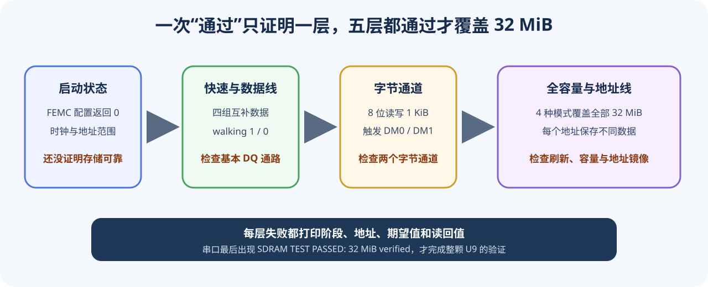
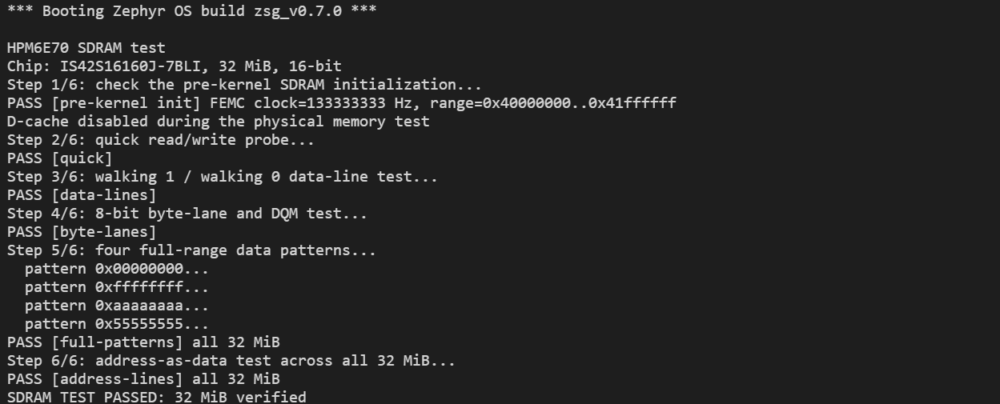

# 第 11 课：编写 SDRAM 测试应用

Board 已经具备 SDRAM 初始化能力，现在用一个独立 Zephyr 应用选择这项能力，并验证地址线、数据线、字节通道和全部 32 MiB 空间。



## 先认识这个独立应用

应用位于：

```text
apps/sdram_test/
├─ CMakeLists.txt
├─ prj.conf
├─ sample.yaml
├─ README.md
├─ boards/
│  └─ dshanmcu_hpm6e70.overlay
└─ src/
   └─ main.c
```

它与 LED 应用 互不读取源文件或配置。构建时选择哪个应用目录，就只编译哪个应用。

打开 `apps/sdram_test/CMakeLists.txt`，其中先登记本工程的 Board 搜索根目录：

```cmake
# 当前文件位于 apps/sdram_test/，向上两级就是工程根目录。
list(APPEND BOARD_ROOT ${CMAKE_CURRENT_LIST_DIR}/../..)

find_package(Zephyr REQUIRED HINTS $ENV{ZEPHYR_BASE})
```

因此这个独立应用可以直接选择 `dshanmcu_hpm6e70`，不要求使用者在每次构建时重复填写板卡目录。

## 第一步：在本应用中启用 SDRAM

打开：

```text
apps/sdram_test/prj.conf
```

加入：

```ini
# 编译本板的 FEMC 与 SDRAM 初始化代码。
CONFIG_DSHANMCU_HPM6E70_SDRAM=y

# 在 Zephyr 进入 main() 前完成 SDRAM 初始化。
CONFIG_INIT_EXT_RAM=y

# 输出测试过程，并为完整测试留出足够的主线程栈。
CONFIG_PRINTK=y
CONFIG_MAIN_STACK_SIZE=4096
```

Board 中的 SDRAM 节点默认关闭，所以还要用本应用的 Overlay 启用它。打开：

```text
apps/sdram_test/boards/dshanmcu_hpm6e70.overlay
```

写入：

```dts
/* 只有这个应用需要使用板载 SDRAM。 */
&dram {
    status = "okay";
};
```

`prj.conf` 选择软件能力，Overlay 改变本次构建使用的硬件状态。两项缺少任何一项，都会在编译阶段被 Board 中的检查发现。

## 第二步：从设备树取得测试范围

打开：

```text
apps/sdram_test/src/main.c
```

文件开头加入：

```c
#include <zephyr/kernel.h>
#include <zephyr/devicetree.h>
#include <zephyr/sys/printk.h>

#include <hpm_clock_drv.h>
#include <hpm_l1c_drv.h>

#include <stdbool.h>
#include <stddef.h>
#include <stdint.h>

/* 地址和容量来自 Board DTS，不在应用中重复写死。 */
#define SDRAM_NODE       DT_NODELABEL(dram)
#define SDRAM_BASE       DT_REG_ADDR(SDRAM_NODE)
#define SDRAM_SIZE_BYTES DT_REG_SIZE(SDRAM_NODE)
#define SDRAM_WORDS      (SDRAM_SIZE_BYTES / sizeof(uint32_t))

/* 取得 main() 之前执行的板级初始化结果。 */
extern int dshanmcu_hpm6e70_get_sdram_init_status(void);
```

如果以后修改设备树中的容量，测试范围会随构建结果一起改变，应用不需要同步维护另一个常量。

## 第三步：先确认初始化成功

`main()` 开始时先检查 Board 初始化返回值：

```c
int init_status;

printk("\nHPM6E70 SDRAM test\n");
printk("Step 1/6: check the pre-kernel SDRAM initialization...\n");

init_status = dshanmcu_hpm6e70_get_sdram_init_status();
if (init_status != 0) {
    printk("FAIL [pre-kernel init] status=%d\n", init_status);
    printk("SDRAM TEST FAILED\n");
    return 0;
}
```

这样可以区分“FEMC 没有初始化成功”和“初始化成功但某根存储器信号异常”。

## 第四步：物理内存测试期间绕过 D-cache

如果 CPU 从缓存中读回刚写入的数据，即使 SDRAM 没有正确保存，也可能得到相同结果。完整测试开始前保存当前状态并关闭 D-cache：

```c
bool dcache_was_enabled = l1c_dc_is_enabled();

if (dcache_was_enabled) {
    l1c_dc_writeback_all();
    l1c_dc_disable();
}

/* 所有物理 SDRAM 测试在这里执行。 */

if (dcache_was_enabled) {
    l1c_dc_invalidate_all();
    l1c_dc_enable();
}
```

这不是为了提高测试强度，而是为了确保每次读写都真正到达 FEMC 和 U9。

## 第五步：逐层编写测试

测试不是简单重复写入同一个数。每种模式用于暴露不同类型的连接问题：

| 测试 | 写入方式 | 主要检查对象 |
|---|---|---|
| 快速探测 | 四个互补 32 位数 | 基本读写通路 |
| Walking 1/0 | 单个 1 或 0 逐位移动 | 数据线短路、断路、固定电平 |
| 字节通道 | 使用 `uint8_t` 连续读写 | `DQM0/DQM1` 与两个字节通道 |
| 全空间固定模式 | 四种模式覆盖 32 MiB | 全部存储单元的基本稳定性 |
| 地址作为数据 | 每个地址写入不同值 | 地址镜像和地址线问题 |

Walking 1/0 的实现如下：

```c
static bool walking_data_test(void)
{
    volatile uint32_t *cell = (volatile uint32_t *)SDRAM_BASE;

    /* 让 1 和 0 依次经过每一位。 */
    for (uint32_t bit = 0; bit < 32U; ++bit) {
        uint32_t walking_one = 1UL << bit;

        *cell = walking_one;
        if (*cell != walking_one) {
            return false;
        }

        *cell = ~walking_one;
        if (*cell != ~walking_one) {
            return false;
        }
    }
    return true;
}
```

字节通道测试必须使用 8 位指针：

```c
static bool byte_lane_test(void)
{
    /* 8 位访问会让 FEMC 使用 DQM0/DQM1 控制相应字节。 */
    volatile uint8_t *mem = (volatile uint8_t *)SDRAM_BASE;

    for (size_t i = 0; i < 1024U; ++i) {
        mem[i] = (uint8_t)(i ^ (i >> 3));
    }
    for (size_t i = 0; i < 1024U; ++i) {
        if (mem[i] != (uint8_t)(i ^ (i >> 3))) {
            return false;
        }
    }
    return true;
}
```

工程中的 `main.c` 还会在失败时打印阶段、地址、期望值和实际值，便于把现象对应到具体连接。

## 第六步：使用标准 west 命令编译

在 `HPM6E70` 工程根目录执行：

```powershell
west build -p always `
  -b dshanmcu_hpm6e70/hpm6e70 `
  -d build-sdram `
  apps/sdram_test
```

本工程已经用该命令完成编译，构建目录中应出现：

```text
build-sdram/zephyr/zephyr.elf
build-sdram/zephyr/zephyr.bin
build-sdram/zephyr/zephyr.hex
build-sdram/zephyr/zephyr.dts
build-sdram/zephyr/.config
```

烧录当前构建：

```powershell
west flash -d build-sdram --skip-rebuild
```

## 第七步：根据串口输出判断结果

测试通过时，串口会依次出现每个阶段的 `PASS`，最后一行应为：

```text
SDRAM TEST PASSED: 32 MiB verified
```



*真机实测输出：固件由本课流程构建并经 CH347F 烧录，启动横幅显示构建分支 `zsg_v0.7.0`，Step 1 可见 FEMC 时钟 133333333 Hz 与 SDRAM 映射范围 `0x40000000..0x41ffffff`。*

如果失败，不要只记录“SDRAM 不工作”。先看方括号中的阶段：

- `pre-kernel init`：检查 FEMC 时钟、引脚复用和时序；
- `data-lines`：重点检查 DQ 数据线；
- `byte-lanes`：重点检查 DQM0/DQM1；
- `address-lines`：重点检查地址线、Bank 线和容量描述。

## 本课完成结果

完成后，已经把一项板载硬件能力完整接入 Zephyr：应用通过 Kconfig 选择能力，通过 Overlay 启用硬件节点，通过设备树宏取得资源，并用可定位故障的程序验证真实存储器，而不是依赖应用中的固定地址和单次读写。
