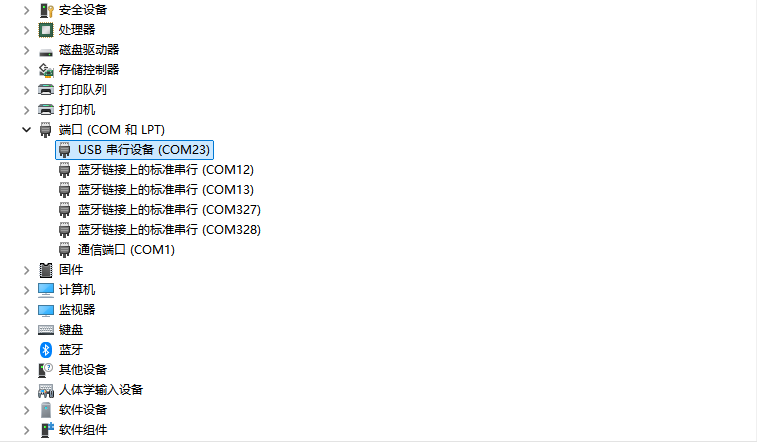

# 准备工程与连接开发板

课程使用 DShanMCU RA6M5 开发板，通过板上丝印为 **Debug** 的接口完成供电、烧录、调试和串口通信。

先准备开发板、一根能够传输数据的 USB Type-C 线，以及运行 Windows 的电脑。

## 获取课程工程

本教程使用配套的 **RA6M5 完整课程工程**。工程中包含 Zephyr 源码、板卡文件、依赖库、编译工具和开发脚本。

:::note 课程工程下载
完整课程工程的下载入口待发布。开发板原理图、位号图等硬件资料可从[百问网 RA6M5 资料页面](https://download.100ask.net/boards/Renesas/DShanMCU-RA6M5/index.html)获取。
:::

取得工程压缩包后，先完整解压。工程根目录是包含 `apps`、`scripts` 和 `west.yml` 的这一层；下一篇会在 VS Code 中打开这个目录。

建议将工程放在路径较短、没有空格的英文目录中。解压完成后，至少应能找到下面这些内容：

```text
RA6M5/
├─ .venv/          # Python、west、CMake 等开发工具所在目录
├─ .vscode/        # 编辑器任务与调试配置
├─ apps/           # 各个独立的 Zephyr 示例应用
├─ boards/         # 本开发板的硬件描述
├─ drivers/        # 工程中的设备驱动
├─ dts/            # 设备树 Binding
├─ hardware/       # 原理图和位号图
├─ modules/        # Zephyr 依赖模块
├─ scripts/        # 编译、烧录、串口脚本
├─ sdk_env/        # Arm 编译器与 probe-rs
├─ zephyr/         # Zephyr 源码
└─ west.yml        # 工作区清单
```

这些目录需要保留相对位置。`scripts/dev.ps1` 会相对于工程根目录寻找工具，不要单独移动其中的 `scripts` 或 `sdk_env`。

`apps` 中的每个子目录都是一个独立的 Zephyr 应用，初次使用可以先编译、烧录 `board_bringup`，确认串口输出和 LED 闪烁。

## 配套资料

| 资料 | 内容 |
| --- | --- |
| <span id="apps-中的示例程序"></span>[配套示例详解](/docs/ra6m5/reference/examples/) | 各示例的功能、所需硬件、操作与运行现象。 |
| <span id="认识-ra6m5-主芯片"></span>[RA6M5 芯片与硬件](/docs/ra6m5/reference/hardware/) | 主芯片参数、官方框图及板载器件连接。 |

## 认识这次使用的板卡资源

课程工程中的板卡名称为 `dshan_ra6m5`，板卡文件描述了这颗 RA6M5 与各个器件之间的连接。

在板上先找到以下位置即可：

| 板上标识 | 用途 |
| --- | --- |
| Debug | 连接电脑，提供供电、串口和调试通道 |
| BootMode | 选择启动方式，正常运行程序时拨到 **OFF** |
| RES | 复位按键，重新启动程序 |
| LED / D12 | 程序控制的指示灯，连接 P400 |
| KEY / K2 | 用户按键，连接 P000 |

下面的位号图用于寻找接口和按键。图中上方的 **UART&DAP** 对应实物丝印为 **Debug** 的接口，下方标出了 BootMode、RES、LED 和 KEY。


*图 1：开发板正面接口位置，摘自工程配套《RA6M5 位号图》第 1 页。[查看完整位号图](pathname:///files/ra6m5/ra6m5-assembly.pdf)。*

灯和按键已经接在板上。EEPROM 也已焊接并接入 I²C 总线，后面的实验无需额外连接杜邦线。

## 连接 Debug 接口

1. 将 BootMode 拨到板上标出的 **OFF** 一侧。
2. 将 USB 线接入丝印为 **Debug** 的 Type-C 接口。
3. 将 USB 线另一端接入电脑。

USB 数据线接入 **Debug** 口后，即可通过同一根线供电、烧录、调试和查看串口输出。

板上的另一个 Type-C 接口标为 OTG，不能用它代替本课程的 Debug 接口。

## 确认电脑识别到开发板

先打开 Windows“设备管理器”，展开“端口（COM 和 LPT）”。插拔开发板时应出现或消失一个 USB 串口。COM 编号由电脑分配，记下本次识别到的编号，后面使用串口插件时需要选择它；换一台电脑后应重新确认。

下图中，开发板对应的是 **USB 串行设备（COM23）**。列表里的蓝牙串口属于其他设备；通过插拔时的变化，可以找到当前开发板对应的那一项。

[](./images/windows-device-manager-serial.png)

*图 2：展开“端口（COM 和 LPT）”后查看板载串口。COM23 是本次连接的示例编号，你的电脑可能不同。点击图片可查看原图。*

板载 WCH-Link 提供的是 USB CDC 串口。Windows 10/11 通常会自动加载系统自带的串口驱动；如果已经出现正常的 COM 口，就无需额外安装。自动识别方式见[微软 USB 串行驱动说明](https://learn.microsoft.com/zh-cn/windows-hardware/drivers/usbcon/usb-driver-installation-based-on-compatible-ids)。

:::note 串口驱动官网下载
如果对应设备出现黄色感叹号，且设备属性提示未安装驱动，可从以下官网入口获取配套驱动与安装说明：

- [沁恒官网：WCH-Link 配套工具与驱动下载](https://www.wch.cn/downloads/WCH-LinkUtility_ZIP.html)。
- [沁恒官网：WCH-Link 使用说明](https://www.wch.cn/downloads/WCH-LinkUserManual_PDF.html)，查看“驱动安装”章节中的 **CDC 驱动**说明；官方资料中将串口驱动标为 `WCHLinkSER`。

完成串口驱动安装后，重新插拔 USB 线，确认“端口（COM 和 LPT）”下出现 COM 口且没有黄色感叹号。
:::

板载调试器按本工程的 CMSIS-DAP 方式使用，无需额外接入调试器。

工程已经解压，设备管理器中也出现了板载串口。下一步阅读[配置 VS Code 开发环境](../02-配置VSCode开发环境/README.md)，安装编辑器和所需扩展，打开工程并检查调试器连接。
