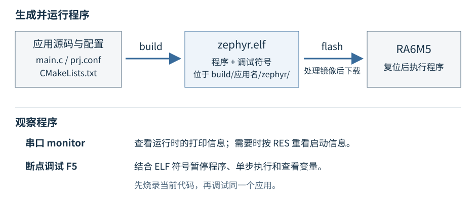

# 编译、烧录与调试程序

电脑识别开发板后，使用工程的 `scripts/dev.ps1` 完成编译、烧录和串口监视，使用配套的 VS Code 配置进行断点调试。

下面以 `board_bringup` 为应用名称说明操作。[第2章](../../01-Zephyr应用开发/02-编写第一个Zephyr应用/README.md)会逐步讲解这个应用的编写过程。后续各章只需将命令中的应用名称换成对应名称。

## 打开工程终端

在 VS Code 中打开整个 RA6M5 工程，选择“终端 → 新建终端”，确认使用的是 PowerShell，当前位置包含 `scripts`、`apps` 和 `west.yml`。

编译、烧录和串口命令都从这个目录执行。输入 `Get-Location` 可以查看终端的当前目录。

工程中的 `scripts/dev.ps1` 将板卡名称和工具路径统一放在脚本里。它使用的目标板是 `dshan_ra6m5`，调用工程内的 west、Arm 编译器和 probe-rs。后面编写应用时，只需要指定应用名称。

图中上半部分表示程序生成和下载的方向，下半部分列出串口与断点调试这两种观察方式。



*图 1：从源文件到板上程序。根据 `scripts/dev.ps1` 与 `.vscode/launch.json` 绘制。*

## 编译应用

在工程根目录的终端中执行：

```powershell
.\scripts\dev.ps1 build board_bringup
```

命令中的三个部分分别是：

| 部分 | 含义 |
| --- | --- |
| `.\scripts\dev.ps1` | 调用当前工程提供的开发脚本 |
| `build` | 将应用代码、配置和板卡支持编译成固件 |
| `board_bringup` | 选择 `apps/board_bringup` 目录中的应用 |

编译成功后，主要产物位于：

```text
build/board_bringup/
├─ compile_commands.json
└─ zephyr/
   ├─ zephyr.elf        # 带符号信息的程序，调试时需要
   ├─ zephyr.dts        # 本次构建实际采用的设备树
   └─ .config          # 本次构建实际采用的配置
```

终端最后会出现程序链接完成和存储空间占用信息。脚本还会显示“当前应用 = board_bringup”，并将调试所需的 ELF 同步到 `build/current/zephyr/zephyr.elf`。

只看到 CMake 配置完成还不代表编译结束；要等编译、链接全部完成，终端回到可输入命令的状态。若最后有错误，向上找到首个具体错误信息，先解决它。

修改代码后，继续使用同一条 `build` 命令。它会进行增量构建。只有更换配置或遇到构建缓存不一致等问题时，再使用：

```powershell
.\scripts\dev.ps1 rebuild board_bringup
```

## 烧录并运行

确认 USB 线连接 Debug、BootMode 为 OFF，然后执行：

```powershell
.\scripts\dev.ps1 flash board_bringup
```

脚本会先检查并构建最新代码，再下载程序，最后复位开发板。成功结束时会显示：

```text
烧录完成，已复位运行。
```

`flash` 指向的是应用名称，不需要自己寻找或选择 ELF 文件。脚本会处理本板的烧录镜像，只下载程序使用的 Code Flash 内容。

也可以把构建和烧录写成一条命令：

```powershell
.\scripts\dev.ps1 build-flash board_bringup
```

完成第2章的灯控制代码后，烧录成功还应检查 D12 是否周期性亮灭。下载工具成功返回，证明下载流程完成；板上现象则用来判断程序是否按预期运行。

## 查看串口输出

程序中的打印信息通过板载串口返回电脑。另开一个工程终端，执行：

```powershell
.\scripts\dev.ps1 monitor
```

脚本按 USB 设备标识自动选择板载串口，使用 **115200 波特率、8 数据位、无校验、1 停止位**。终端会先显示选中的 COM 端口，然后持续显示程序输出。

如果只看到了串口监视已启动，而没有程序信息，按一下板上的 **RES**。启动信息只在程序启动时打印，打开串口后复位便能重新看到它。

在串口终端中按 **Ctrl+C** 退出。一个串口同一时间只能由一个程序打开；若出现“拒绝访问”或“端口被占用”，先关闭其他串口软件或另一个监视终端，再重新执行。

## 在 VS Code 中调试

工程的 `.vscode/launch.json` 已提供 probe-rs 调试配置，调试符号来自当前应用的 ELF 文件。

首次使用时，确认 VS Code 已安装工作区推荐的 **C/C++** 和 **probe-rs Debugger** 扩展。可以在扩展面板中搜索 `@recommended` 查看工程推荐项；工程已经配置了 probe-rs 可执行文件的相对路径。

按下面的顺序操作：

1. 使用 `flash board_bringup` 将当前代码编译并烧录。
2. 打开 `apps/board_bringup/src/main.c`，在 `main()` 内一条可执行语句的左侧单击，设置断点。
3. 打开“运行和调试”面板，选择 **调试当前应用 (probe-rs)**。
4. 按 **F5**。构建任务提示选择应用时，选择刚才烧录的 `board_bringup`。
5. 程序停下后，在变量面板查看局部变量，或将鼠标放到变量名上查看其值。

| 按键 | 用途 |
| --- | --- |
| F9 | 在当前行设置或取消断点 |
| F10 | 单步执行当前语句，不进入被调用函数 |
| F11 | 单步进入被调用函数 |
| F5 | 继续运行到下一个断点 |
| Shift+F5 | 结束当前调试会话 |

例如，第2章会调用 `gpio_pin_configure_dt()` 并检查它的返回值 `ret`。把断点设在调用后的检查语句上，就可以确认配置结果。编译器可能优化部分变量；变量不可见时，先停到使用它的语句附近再检查。

本工程的 F5 配置读取 `build/current/zephyr/zephyr.elf` 中的调试信息，**不会代替烧录步骤**。如果改了代码，应先重新烧录，再开始调试；否则电脑读取的符号可能与开发板中实际运行的程序不一致。保留工程现有的 `flashingEnabled: false` 配置即可。

## 用编辑器菜单调用相同操作

熟悉终端命令后，可以在 VS Code 按 **Ctrl+Shift+B**，打开工程的 Demo 工具菜单，选择应用，再选择构建或烧录。

菜单和终端最终调用的是同一个 `scripts/dev.ps1`。如果 PowerShell 提示禁止运行脚本，可以从 VS Code 任务菜单运行对应任务；工程任务已设置仅作用于该次进程的执行参数，不需要修改电脑的全局执行策略。

后续实验最常用的是下面三条命令：

```powershell
.\scripts\dev.ps1 build board_bringup
.\scripts\dev.ps1 flash board_bringup
.\scripts\dev.ps1 monitor
```

保留这页作为操作参考，接下来从[第1章：从 example-application 认识 Zephyr 工程](../../01-Zephyr应用开发/01-从example-application认识Zephyr工程/README.md)开始阅读工程结构。
