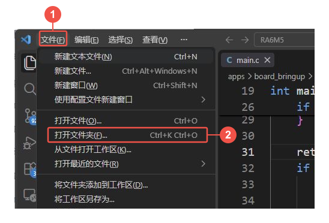
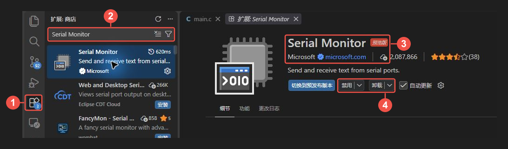
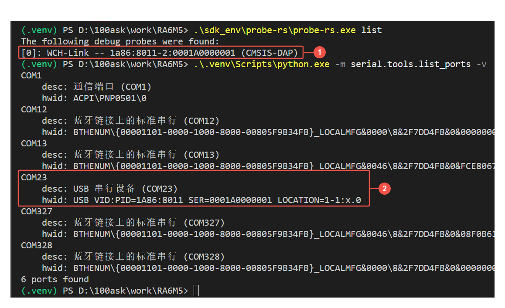

# 配置 VS Code 开发环境

上一节已经解压课程工程，并在设备管理器中找到了开发板的串口。接下来把工程放进 VS Code，安装代码编辑、调试和串口查看所用的扩展，再检查电脑能否通过工程配套工具找到开发板。

课程工程的 `.venv` 和 `sdk_env` 已包含 Python、west、CMake、Ninja、Arm 编译器和 probe-rs。VS Code 提供编辑和操作界面，编译、烧录任务调用这些配套工具；保留工程目录的相对位置即可，无需重新搭建 Zephyr 工具链。

## 安装 VS Code

打开 [VS Code 官方下载页](https://code.visualstudio.com/download)，在 **Windows** 下选择 **User Installer → x64**，下载适用于普通 Intel / AMD 64 位 Windows 电脑的安装程序。这里选择的是**电脑的架构**；开发板使用 Arm 芯片，不表示电脑也要下载 Arm64 版。

运行下载的 `VSCodeUserSetup-…exe`，按安装向导完成安装，然后启动 **Visual Studio Code**。User Installer 安装到当前 Windows 用户，通常无需管理员权限；具体选项见 [VS Code 官方 Windows 安装说明](https://code.visualstudio.com/docs/setup/windows)。已经安装 VS Code 时，直接继续下面的操作。

本文截图使用中文界面，正文同时给出关键菜单的英文名称。安装后的欢迎页和登录提示不影响打开本地工程。

## 打开完整的 RA6M5 工程

点击 **①“文件（File）” → ②“打开文件夹…（Open Folder…）”**，在文件夹选择窗口中找到解压后的 `RA6M5` 目录，点击“选择文件夹”。

[](./images/vscode-open-folder.png)

*图 1：①打开文件菜单，②选择“打开文件夹…”。每张图中的序号对应当前图里的操作或检查位置，点击图片可查看原图。*

打开后，点击左侧“资源管理器（Explorer）”，检查 **①根目录名称**和 **②目录内容**：应能同时找到 `.vscode`、`apps`、`scripts`、`sdk_env` 和 `west.yml`。

<a href={require('./images/vscode-workspace-root.png').default}></a>

*图 2：①当前工作区是 RA6M5；②工程目录中包含编辑器配置、应用和配套工具。这里截取资源管理器区域，便于核对目录层级。*

**打开目录的层级会影响后面的操作。** VS Code 从当前文件夹的 `.vscode` 读取推荐扩展、菜单任务和调试配置。如果只打开 `apps/board_bringup`、`zephyr` 或一个 `main.c`，这些工程配置就不会按本教程的方式加载。找不到后文的任务时，先回到“打开文件夹”，重新选择整个工程根目录。

若首次打开时出现“是否信任此文件夹中文件的作者”提示，确认选择的是你从课程渠道取得的工程，再选择信任，以允许工程任务和调试功能运行。工作区信任的作用见 [VS Code 官方说明](https://code.visualstudio.com/docs/editing/workspaces/workspace-trust)。

## 安装工程使用的三项扩展

工程里的 `.vscode/extensions.json` 保存推荐名单，但**推荐不代表已经安装**。即使没有看到右下角提示，也可以按 **Ctrl+Shift+X** 打开“扩展（Extensions）”，在顶部搜索框输入 `@recommended`，查看“工作区推荐（Workspace Recommendations）”。这一入口由 VS Code 提供，见[官方推荐扩展说明](https://code.visualstudio.com/docs/configure/extensions/extension-marketplace#_workspace-recommended-extensions)。

课程使用以下三项。可以从推荐列表逐一打开，也可以清空搜索框，输入表中完整的 **`@id:…`** 条件直接查找：

| 扩展与发布者 | 扩展搜索框中输入 | 在课程中的用途 |
| --- | --- | --- |
| [C/C++](https://marketplace.visualstudio.com/items?itemName=ms-vscode.cpptools) · Microsoft | `@id:ms-vscode.cpptools` | C 代码补全、函数跳转和编辑检查 |
| [Debugger for probe-rs](https://marketplace.visualstudio.com/items?itemName=probe-rs.probe-rs-debugger) · probe-rs | `@id:probe-rs.probe-rs-debugger` | 连接调试器，设置断点、单步执行和查看变量 |
| [Serial Monitor](https://marketplace.visualstudio.com/items?itemName=ms-vscode.vscode-serial-monitor) · Microsoft | `@id:ms-vscode.vscode-serial-monitor` | 在 VS Code 面板中选择串口并查看打印信息 |

### 查找扩展并确认安装状态

以 **Serial Monitor** 为例，按图中的位置操作：

1. 点击 **①扩展图标**。
2. 在 **②搜索框**中输入 `Serial Monitor`；想直接定位时，也可以输入表中的完整 ID 条件。
3. 打开扩展详情，核对 **③名称为 Serial Monitor、发布者为 Microsoft**。
4. 查看 **④按钮区域**。未安装时点击“安装（Install）”并等待完成；若显示“禁用（Disable）”和“卸载（Uninstall）”，说明已经安装。

[](./images/vscode-serial-plugin-install.png)

*图 3：①扩展入口，②搜索框，③名称与发布者，④安装状态。本图是在已安装的电脑上截取的，因此④显示“禁用”和“卸载”。*

用相同的方法检查 **C/C++** 和 **Debugger for probe-rs**。C/C++ 选择表中的单个扩展即可。如果详情页显示“启用（Enable）”，先启用；出现“重新加载窗口”或“重启扩展”按钮时，按提示完成后再继续。列表中暂时没有推荐项时，仍可通过表中的 ID 查找并检查状态。

本课程调试配置按 **Debugger for probe-rs 0.32.0** 与工程内 **probe-rs 0.32.0** 验证。该版本扩展要求 VS Code **1.116.0 或更高版本**；若安装时提示编辑器版本不兼容，先从官网下载并更新 VS Code。扩展是编辑器里的调试入口，实际连接硬件的 probe-rs 程序已在 `sdk_env/probe-rs/` 中，由工程配置指定路径。

### 工程已经提供的配置

展开资源管理器中的 `.vscode`，可以找到下面这些文件。它们随课程工程提供，首次使用不用重新创建：

| 文件 | VS Code 如何使用它 |
| --- | --- |
| `extensions.json` | 显示前面的三项扩展推荐 |
| `tasks.json` | 提供构建、烧录和串口等菜单任务，调用 `scripts/dev.ps1` |
| `launch.json` | 指定 probe-rs 程序、芯片和调试 ELF，供“运行和调试”使用 |
| `c_cpp_properties.json` | 让 C/C++ 扩展使用工程内的 Arm 编译器及当前应用的代码索引 |

C/C++ 扩展本身不包含编译器，见[官方 C/C++ 说明](https://code.visualstudio.com/docs/languages/cpp)。本工程已经配好 Arm 编译器，后面通过“终端 → 运行任务…”构建整个 Zephyr 应用；不使用源码右上角的“运行 C/C++ 文件”按钮编译单个文件。

初次构建前，编辑器可能提示找不到 `compile_commands.json` 或某些生成头文件。这个索引由构建过程生成，脚本会同步到 `build/compile_commands.json`，供 C/C++ 扩展读取。完成下一篇的首次构建后再检查代码提示；红色波浪线和任务终端中的编译结果需要分别判断。

## 在终端检查工程工具与开发板

保持开发板连接 **Debug** 接口。在 VS Code 中选择 **“终端（Terminal）→ 新建终端（New Terminal）”**，使用 **PowerShell**。窗口较窄时，“终端”菜单可能收在顶部的“…”中。

终端提示符中 `PS` 后面的路径应是解压后的工程根目录。以下两条命令都从这一层执行；开头的 `.\` 表示从当前目录查找配套工具。

先输入下面的命令，按回车列出调试器：

```powershell
.\sdk_env\probe-rs\probe-rs.exe list
```

输出中应出现 **`WCH-Link`**，设备标识包含 **`1a86:8011`**，括号内为 **`CMSIS-DAP`**。这表示工程里的 probe-rs 程序已经运行，并找到了板载调试器。

等提示符重新出现，再输入第二条命令，列出串口：

```powershell
.\.venv\Scripts\python.exe -m serial.tools.list_ports -v
```

找到硬件标识包含 **`VID:PID=1A86:8011`** 的 USB 串口，并核对它的 COM 编号是否与设备管理器一致。不要把列表中的蓝牙串口当作开发板。

[](./images/vscode-probe-and-serial-check.png)

*图 4：①WCH-Link / CMSIS-DAP 是调试器枚举结果，②COM23 的 VID:PID 对应同一开发板的串口。截图中的存放路径和 COM23 是实例值，以你的工程位置及实际端口为准。*

两条命令都能执行，且分别找到调试器和串口，说明工程工具与 USB 连接已具备后续操作条件。这里执行的是设备枚举，还没有编译或烧录应用。

| 当前现象 | 处理方法 |
| --- | --- |
| 提示找不到命令或文件 | 检查终端是否在工程根目录，以及 `.venv`、`sdk_env` 是否完整解压 |
| `probe-rs list` 没有列出调试器 | 检查 USB 是否插在 Debug、线缆是否支持数据传输、开发板是否正常供电 |
| 没有找到对应 USB 串口 | 回到[电脑识别检查](../01-准备工程与连接开发板/README.md#确认电脑识别到开发板)，查看设备管理器和串口驱动 |

现在，VS Code 已打开完整工程，三项扩展已安装，工程工具也能找到开发板。继续阅读[编译与烧录程序](../03-编译与烧录程序/README.md)，通过菜单选择 `board_bringup`，完成第一次构建和下载。
