# 编译与烧录程序

完成[VS Code 开发环境配置](../02-配置VSCode开发环境/README.md)后，电脑已经识别到开发板，所需扩展也已安装。接下来用 VS Code 的菜单选择应用，完成编译和烧录。**编译是在电脑上生成程序文件，烧录是把程序写入开发板，让 RA6M5 执行它。**

下面使用 `board_bringup` 应用。它会打印启动信息，并让板上的 D12 周期闪烁；[第2章](../../01-Zephyr应用开发/02-编写第一个Zephyr应用/README.md)会逐步讲解代码如何编写。

先确认 VS Code 打开的是整个 `RA6M5` 工程，左侧能找到 `apps`、`scripts` 和 `west.yml`。下面按截图中的框选位置操作；**每张图内的序号只对应当前图中的操作或结果**，点击图片可以查看原图。

## 编译应用

### 1. 打开任务菜单

依次点击 VS Code 顶部的 **①“终端” → ②“运行任务…”**。

[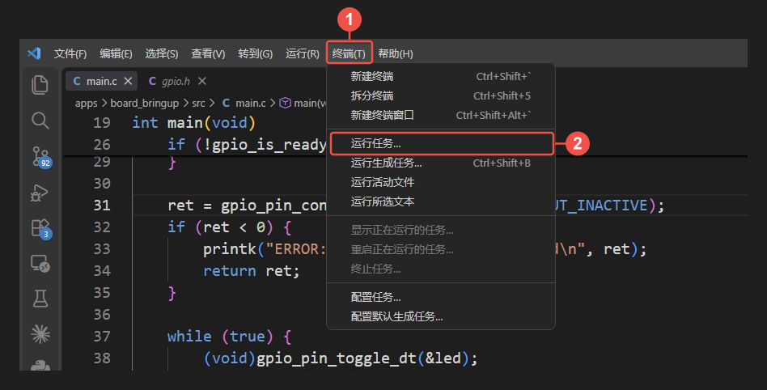](./images/vscode-task-menu.png)

*图 1：①打开“终端”菜单，②点击“运行任务…”，显示工程提供的操作列表。*

### 2. 选择构建任务与应用

在弹出的任务列表中，点击 **①“构建应用（选择应用）”**。这里的“构建”会完成编译和链接，生成可供烧录的程序。

[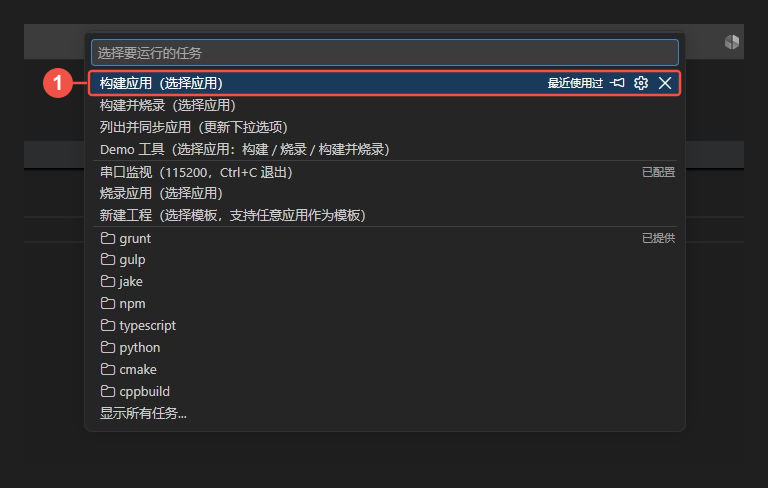](./images/vscode-build-task.png)

*图 2：①选择“构建应用（选择应用）”。*

随后出现“选择要构建/烧录的应用”列表，点击 **② `board_bringup`**。这个名称对应工程中的 `apps/board_bringup` 目录。

[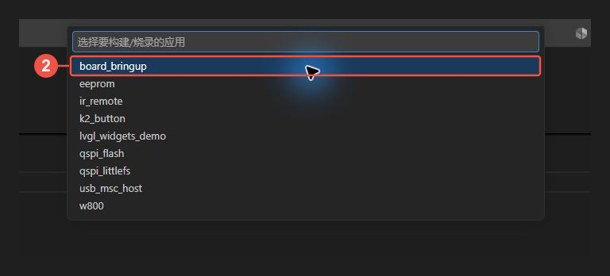](./images/vscode-select-app.png)

*图 3：②选择本次要编译的 `board_bringup` 应用。以后编译其他应用时，在这里选择对应名称。*

### 3. 确认编译完成

VS Code 下方会打开任务终端，显示构建输出。等待任务结束，再核对图中的两个位置：

- **① 当前应用与 ELF 同步结果**：显示 `当前应用 = board_bringup`，以及 `已更新调试镜像 → build/current/zephyr/zephyr.elf`。说明所选应用已完成构建，程序文件已经准备好。
- **② 任务结束提示**：看到“终端将被任务重用，按任意键关闭”时，本次任务已经结束，终端保留输出供你查看。

[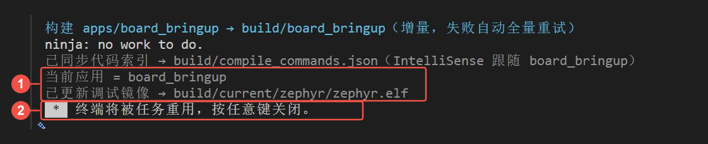](./images/vscode-build-result.png)

*图 4：先核对①中的构建结果，再核对②中的任务结束提示。此时生成的程序仍保存在电脑上。*

本次输出中还有 `ninja: no work to do.`，表示已有构建结果与当前源码一致，无需重新编译。第一次构建或修改代码后，会看到实际的编译、链接进度。

任务结束提示本身不能证明构建成功；如果终端最后出现错误或失败的退出代码，应向上找到具体报错并处理。完成编译后，继续下一步，把程序写入开发板。

## 烧录并运行

### 1. 选择烧录任务

确认 USB 数据线连接板上的 **Debug** 接口，**BootMode 为 OFF**。如果正在调试，先结束调试会话，释放调试器连接。

再次点击 **“终端 → 运行任务…”**，在任务列表中选择 **①“烧录应用（选择应用）”**。

[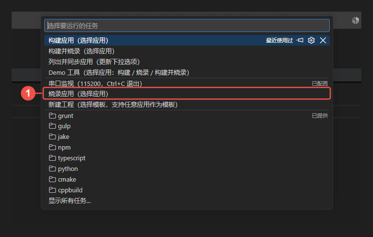](./images/vscode-flash-task.png)

*图 5：①选择“烧录应用（选择应用）”，准备把程序写入开发板。*

随后在应用列表中点击 **`board_bringup`**，与图 3 的选择相同。任务会自动找到该应用的构建产物，处理烧录镜像，再下载并复位开发板。

**“烧录应用”会先自动编译。** 平时修改并保存代码后，可以直接运行这个任务，无需先重复点击“构建应用”。前面单独编译一次，是为了检查程序能否成功生成。

### 2. 等待烧录完成

任务终端先显示构建信息，再显示下载结果。按图中的两个位置核对：

- **① 烧录目标**：以 `烧录 R7FA6M5BF via ...` 开头，表示任务已找到调试器，开始向目标芯片下载程序。
- **② 完成结果**：显示 **`烧录完成，已复位运行。`**，说明下载和复位步骤都已成功结束。

[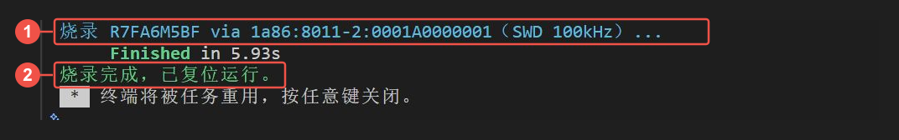](./images/vscode-flash-result.png)

*图 6：①确认操作的目标芯片，②确认下载完成且开发板已复位运行。*

烧录任务前半段也会出现“当前应用”和“已更新调试镜像”等构建输出，要等到最后的 **“烧录完成，已复位运行。”** 再检查运行现象。

此时观察板上的 **D12**，应每隔约 500 ms 改变一次亮灭状态。烧录成功说明程序已经下载，灯的变化则用来判断它是否在按预期运行。接下来再查看程序打印的启动信息。

## 查看串口输出

程序中的打印信息通过板载串口返回电脑。可以使用 **Serial Monitor 插件**，也可以使用**工程自带的串口任务**。下面分别介绍这两种方式，选择一种即可。切换方式前，先停止当前监视，避免两个程序同时占用串口。

### 使用 Serial Monitor 插件

前一篇已经安装了 Microsoft 的 **Serial Monitor**。若尚未安装，先完成[扩展安装与状态检查](../02-配置VSCode开发环境/README.md#安装工程使用的三项扩展)，再按下面的步骤操作。

#### 1. 打开面板并选择串口 {#2-打开面板并选择串口}

选择 **“终端 → 新建终端”**，展开 VS Code 底部面板，然后点击 **①“串行监视器”** 标签。监视模式使用 **Serial**，查看模式使用 **文本**。

展开 **②“端口”** 下拉列表，选择设备管理器中开发板对应的 USB 串口。图中的 **③ `COM23 - USB 串行设备 (COM23)`** 是本次连接的开发板；你的电脑可能使用其他 COM 编号，以[连接开发板时查到的端口](../01-准备工程与连接开发板/README.md#确认电脑识别到开发板)为准。

[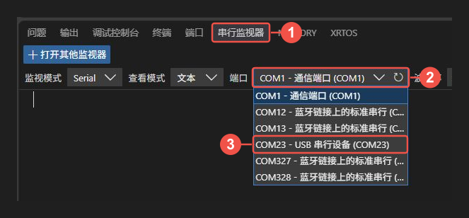](./images/vscode-serial-plugin-port.png)

*图 7：①切换到串行监视器，②展开端口列表，③选择开发板对应的端口。*

如果刚插入开发板、列表中还没有对应端口，点击端口下拉框右侧的刷新图标，再重新选择。

#### 2. 设置参数并开始监视 {#3-设置参数并开始监视}

按图中序号完成设置：

1. 将 **①波特率**设为 **115200**，与工程的串口输出速率一致。
2. 点击 **②齿轮图标“其他设置”**，展开附加参数。
3. 确认 **③数据位为 8、停止位为 1、奇偶校验为“无”**，其余选项保持默认。这组参数通常写作 **8N1**。
4. 点击 **④“开始监视”**，打开串口连接。

[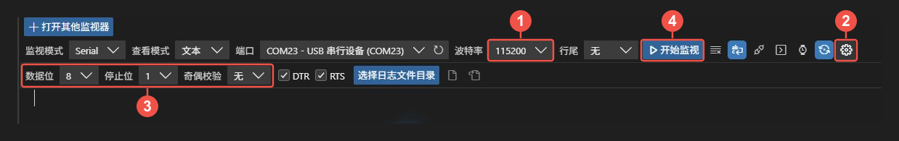](./images/vscode-serial-plugin-settings.png)

*图 8：①波特率，②展开其他设置，③核对 8N1，④开始监视。*

#### 3. 查看输出并停止监视 {#4-查看输出并停止监视}

输出区出现 **“已打开串行端口 COM…”** 后，按一下板上的 **RES**，让程序重新启动。随后应看到 Zephyr 的启动信息，以及图中 **①以 `Dshan RA6M5 bring-up:` 开头的应用输出**。

[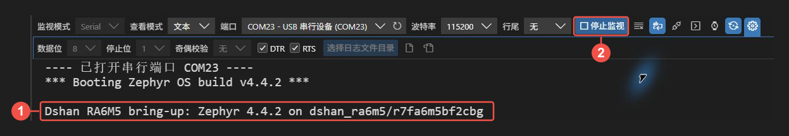](./images/vscode-serial-plugin-output.png)

*图 9：①开发板实际打印的启动信息；查看结束后，点击②“停止监视”。*

`board_bringup` 只在启动时打印一次，之后循环控制 D12 闪烁。看到启动信息后，输出区不再增加内容是正常现象；需要重看时，保持连接并再次按 **RES**。

结束查看时点击 **②“停止监视”**。输出区显示 **“关闭串行端口 COM…”**，按钮恢复为“开始监视”，表示连接已经关闭。仅切换面板不会停止监视；再次使用工程串口任务前，也应先点击这个按钮。

### 使用工程串口任务

工程自带的任务会自动识别板载串口并设置通信参数。若刚使用过 Serial Monitor 插件，先点击插件中的 **“停止监视”**，再执行下面的操作。

#### 1. 打开串口监视

与前面的编译、烧录操作一样，点击 **“终端 → 运行任务…”**，然后选择图中 **①“串口监视（115200，Ctrl+C 退出）”**。

[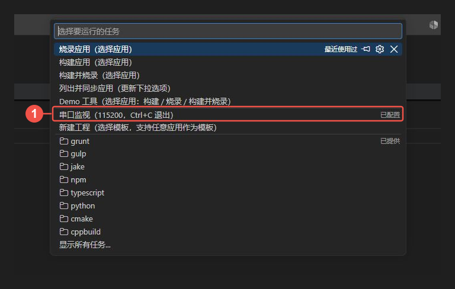](./images/vscode-serial-task.png)

*图 10：①点击串口监视任务。任务会直接打开监视终端，无需再选择应用。*

该任务按 USB 设备标识自动选择板载串口，并设置 **115200 波特率、8 数据位、无校验、1 停止位**，不需要手动填写这些参数。

#### 2. 查看开发板打印的信息

终端出现串口监视提示后，按一下板上的 **RES**，让程序重新启动。随后按图中的两个位置核对：

- **① 串口与通信参数**：`COM23` 是本次连接的串口，`115200 8N1` 对应前面的通信参数。你的电脑可能显示其他 COM 编号，以实际结果为准。这一行由电脑上的监视脚本打印。
- **② 应用启动信息**：以 `Dshan RA6M5 bring-up:` 开头，是开发板上的 `board_bringup` 程序打印的内容。看到这一行，说明已经收到了开发板发来的信息。

[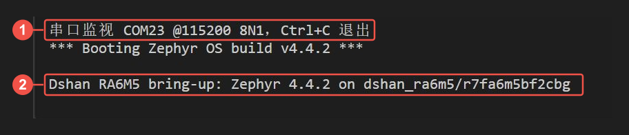](./images/vscode-serial-output.png)

*图 11：①查看打开的串口及参数，②查看开发板的实际输出；两者之间还会显示 Zephyr 的启动信息。*

**这个应用只在启动时打印一次信息，之后循环控制 D12 闪烁。** 因此，看到启动信息后，终端不再增加新内容是正常现象。若只有①、没有②，先确认前面已烧录 `board_bringup`，再保持串口监视打开，按一下 **RES**。

#### 3. 退出串口监视

点击串口终端的空白处，确保没有选中文字，再按 **Ctrl+C**。看到 **“已退出。”**，表示监视程序已关闭串口；开发板上的程序仍会继续运行。主动中断后，VS Code 的任务末尾可能显示“退出代码：1”，本次操作中这是停止监视的结果。

一个串口同一时间只能由一个程序打开。若启动时出现“拒绝访问”或“端口被占用”，先关闭其他串口软件或另一个监视终端，再重新执行。

## 编译产物与开发流程

前面的菜单任务定义在 `.vscode/tasks.json` 中，实际调用工程的 `scripts/dev.ps1`。脚本使用 `dshan_ra6m5` 板卡配置以及工程配套的工具，完成构建、烧录或串口监视。

编译 `board_bringup` 后，可以在 VS Code 的资源管理器中找到这些文件：

```text
build/board_bringup/
├─ compile_commands.json
└─ zephyr/
   ├─ zephyr.elf        # 程序及调试符号
   ├─ zephyr.dts        # 本次构建实际采用的设备树
   └─ .config          # 本次构建实际采用的配置
```

其中，`zephyr.elf` 保存构建得到的程序。烧录任务从它生成供本板下载的镜像，只写入程序使用的 Code Flash 内容。脚本还会把 ELF 同步到 `build/current/zephyr/zephyr.elf`，供下一篇的调试操作使用。

下图按电脑和开发板划分位置。上方的箭头表示编译和烧录；中间的双向连线表示调试交互；下方的箭头表示开发板把打印信息送回电脑。烧录、调试和 USB 串口都经过板载调试器，共用开发板的 Debug 接口。

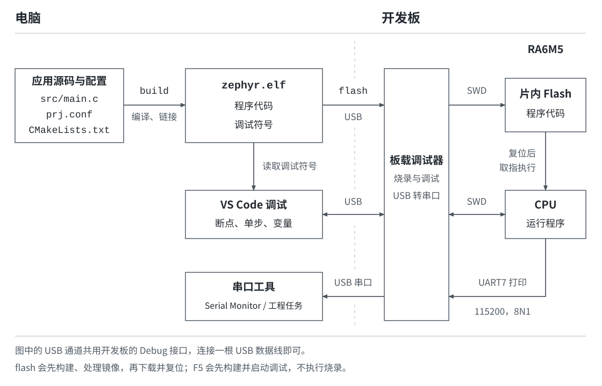

*图 12：编译、烧录、串口与调试的连接关系。电脑保留 ELF 调试符号，开发板执行写入 Flash 的程序代码。*

图中的 `build`、`flash` 对应工程任务；调试流程由 `.vscode/launch.json` 配置。修改代码后，先重新烧录，再调试同一个应用，保证电脑上的 ELF 与板上程序一致。

## 终端命令参考

后续章节会直接给出命令。它们与前面的菜单任务调用同一个脚本，可以根据操作场景使用。

在 VS Code 中选择 **“终端 → 新建终端”**，使用 PowerShell，确认当前目录是包含 `apps`、`scripts` 和 `west.yml` 的工程根目录。常用命令与任务的对应关系为：

| 操作 | 工程根目录中的命令 |
| --- | --- |
| 编译应用 | `.\scripts\dev.ps1 build board_bringup` |
| 编译后烧录并复位 | `.\scripts\dev.ps1 flash board_bringup` |
| 查看串口输出 | `.\scripts\dev.ps1 monitor` |

`build` 和 `flash` 后的 `board_bringup` 是应用名称，换成其他 `apps` 子目录名即可操作对应应用。日常编译采用增量构建；需要清除旧构建结果、重新完整编译时，执行：

```powershell
.\scripts\dev.ps1 rebuild board_bringup
```

如果直接输入命令时 PowerShell 提示禁止运行脚本，可以使用前面的 **“终端 → 运行任务…”** 操作。工程任务已设置仅作用于该次进程的执行参数。

程序已经能在板上运行，也能通过串口查看输出。下一篇[使用 VS Code 调试程序](../04-使用VSCode调试程序/README.md)，将让程序在指定位置暂停，查看变量并控制它继续执行。
