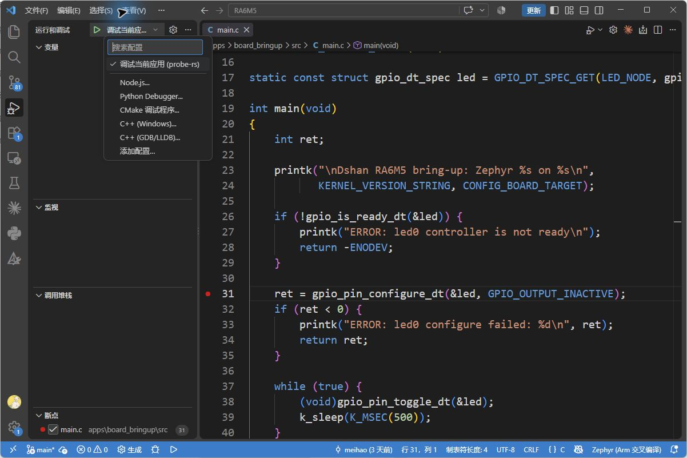
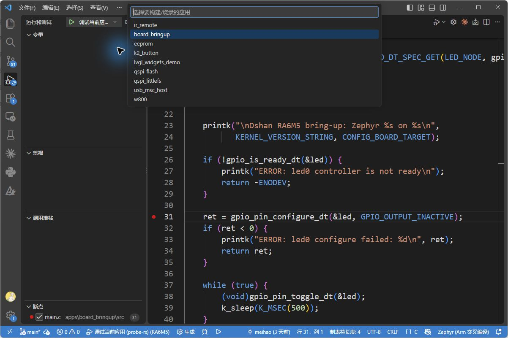
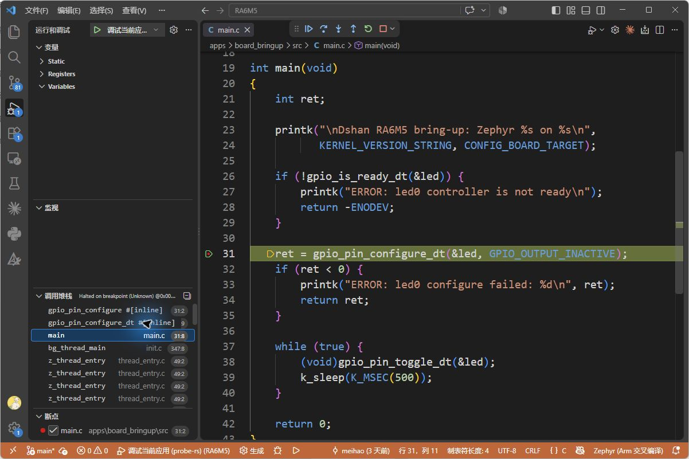
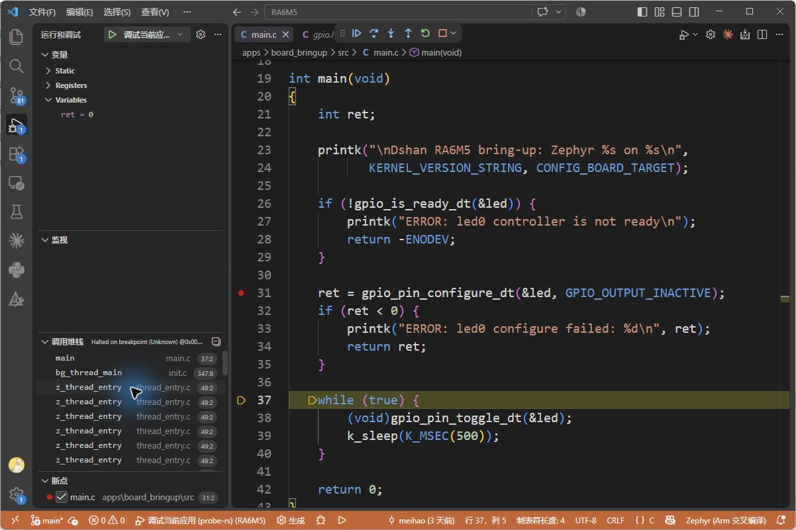
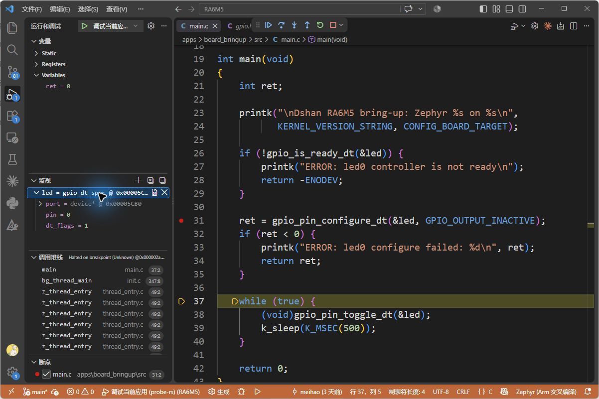

# 使用 VS Code 调试程序

在上一篇[编译与烧录程序](../03-编译与烧录程序/README.md)中，我们把 `board_bringup` 写入了开发板，并通过串口查看输出。程序运行时，你能看到灯在闪，也能看到打印的信息，但仅凭这些现象，不能随时知道程序执行到了哪里、某个变量现在是多少。

## 认识断点与单步执行

**调试可以让开发板上的程序暂停，查看暂停时的数据，再控制它继续执行。** VS Code 通过板载调试器控制 RA6M5；程序仍然运行在开发板上，电脑负责显示源码、发送控制命令和读取数据。

这篇文章只检查一件事：**程序配置 LED 引脚的这次调用，是否执行成功。** `apps/board_bringup/src/main.c` 中负责配置的代码是：

```c
ret = gpio_pin_configure_dt(&led, GPIO_OUTPUT_INACTIVE);
```

先读懂这一行的两个部分：`gpio_pin_configure_dt(...)` 配置 LED 所用的 GPIO 引脚，`ret` 接收函数执行后的返回值。这个函数返回 `0` 表示配置成功，返回负数表示失败。

下面先让程序在这次调用处停下，再执行完调用，最后读取 `ret`。操作过程中会用到三个控制动作：

| 动作 | 对开发板上的程序做了什么 |
| --- | --- |
| 设置断点 | 标记一个暂停位置；程序运行到这里时停下，等待你操作 |
| 单步执行 | 从暂停处向前执行一小步，然后再次停下，便于检查变化 |
| 继续运行 | 结束当前暂停，让程序自动执行，直到下一个断点或主动暂停 |

以下操作和截图使用 **Debugger for probe-rs 0.32.0** 扩展及工程内的 **probe-rs 0.32.0**，已经在 RA6M5 开发板上实测。点击截图可查看原图。

## 1. 准备本次要调试的程序

在 VS Code 中打开整个 `RA6M5` 目录，并完成[开发环境配置](../02-配置VSCode开发环境/README.md)。其中的 **Debugger for probe-rs** 扩展负责连接开发板并执行调试操作，工程已经提供了它的配置。

本次仍然调试 `board_bringup`。如果已经按上一篇完成烧录，而且没有修改代码或配置，可以直接进入下一步；否则，在工程根目录的终端执行：

```powershell
.\scripts\dev.ps1 flash board_bringup
```

等到出现“烧录完成，已复位运行。”，说明本次要观察的程序已经写入开发板。下一步打开它的源码，选择暂停位置。

**本工程需要先烧录，再启动调试。** 后面按 F5 会连接并复位开发板，但不会代替这次下载；修改代码后，也要重新执行上面的烧录命令，使屏幕上的源码与板上程序一致。

## 2. 设置断点并选择调试配置

按 **Ctrl+P**，输入 `apps/board_bringup/src/main.c` 并回车。在 `main()` 中找到下面这行代码，本工程中位于第 31 行：

```c
ret = gpio_pin_configure_dt(&led, GPIO_OUTPUT_INACTIVE);
```

单击这一行**行号左侧的空白处**，出现红色圆点即表示设置了断点。也可以先将光标放到这一行，再按 **F9**。

这个红点的意思是：启动调试后，让程序运行到这次 GPIO 配置调用时暂停。**仅仅加上红点，还没有让开发板停下来**；下一步启动调试后才会生效。

点击左侧“运行和调试”图标，或按 **Ctrl+Shift+D**；在面板顶部的下拉框中选择 **调试当前应用 (probe-rs)**。

[](./images/vscode-debug-select.png)

*图 1：只需核对两个位置：第 31 行左侧有红点，左上方选中“调试当前应用 (probe-rs)”。*

## 3. 按 F5，等待程序命中断点

点击源码编辑区域，再按 **F5**。在弹出的应用列表中选择 **board_bringup**，按回车。这次 F5 的作用是**启动一次调试**。

[](./images/vscode-debug-app.png)

*图 2：选择与刚才烧录一致的应用，构建任务会同步它的调试 ELF。*

等待构建完成。调试器连接开发板并复位，让程序从启动位置重新执行。当它到达断点，RA6M5 就暂停执行程序，等待下一条调试命令。

左侧“调用堆栈”列出暂停处所在的函数及调用关系。点击其中的 **main**，让编辑器显示我们正在检查的 `main()`。即使刚停下时显示的是 GPIO 头文件，也可以用这个方法回到 `main.c`。

对照下图，找到**第 31 行的黄色高亮**。这表示本次 GPIO 配置调用还没有完成，程序目前停在这次调用中。

[](./images/vscode-debug-breakpoint.png)

*图 3：左侧选中 `main`，右侧显示暂停的第 31 行。此时开发板正在等待操作，配置调用尚未返回。*

红点和黄色高亮的用途不同：**红点是你设置的暂停位置，黄色高亮是程序当前停留的位置**。后面单步执行时，黄色高亮会移动，红点仍留在第 31 行。

现在还不能根据 `ret` 判断结果，因为这次调用还没有返回。接下来让程序继续执行这次调用，再检查它交回来的数值。

## 4. 单步执行，检查返回值

现在按 **F10**。它会让程序从暂停处向前执行，然后再次停下。我们要等 GPIO 配置调用完成，才能读取它返回给 `ret` 的值。

按下面的顺序操作：

1. 按一次 **F10**，等编辑器显示新的暂停位置。
2. 本次实测第一次会停到 `gpio.h` 中。此时继续按一次 **F10**，程序便回到 `main.c` 的第 37 行 `while (true)`。如果你的停留位置略有不同，以这次配置调用执行完为准；停在 `if (ret < 0)` 或其内部的错误处理语句时，也先停下读取 `ret`，不必继续追到第 37 行。每次都等程序停下再按键。
3. 在左侧“调用堆栈”中点击 **main**，再展开上方“变量”里的 **Variables**。
4. 找到 **ret**，读取等号右边的数值。

F10 不保证每次恰好移动到下一行 C 源码；编译时的优化和内联会影响停留位置。这里不需要分析头文件的实现，先看调用执行完后的结果。

下图中需要对照两个地方：右侧黄色高亮已经移到第 37 行，左上角显示 **`ret = 0`**。

[](./images/vscode-debug-step.png)

*图 4：单步之后，暂停位置从 GPIO 配置调用移到了主循环；`ret = 0` 是这次配置调用返回的结果。*

这时就可以得出判断：**GPIO 配置函数报告成功。** 接下来的代码用 `if (ret < 0)` 判断是否失败；由于 `ret` 为 `0`，程序跳过了错误处理，进入闪灯循环。

把刚才的两次暂停放在一起看：

| 暂停时机 | 此时能判断什么 |
| --- | --- |
| 图 3：配置调用还没有返回 | 已经运行到要检查的位置，但还不能读取本次调用的结果 |
| 图 4：配置调用已经返回 | 可以读取 `ret`；本次为 `0`，说明配置成功 |

调试并不需要先往程序里增加打印语句，也能读到这个结果。以后需要检查其他函数时，同样可以在调用附近暂停，执行完调用后查看返回值，并结合该函数的返回值含义判断结果。

## 5. 继续运行并结束调试

读完 `ret` 后，程序仍然处于暂停状态，并不会因为你看完变量就自动运行。按 **F5** 让它继续。这次 F5 的作用是**恢复当前程序的执行**，不会重新从头启动。

源码暂停高亮消失，“调用堆栈”显示“正在运行”。变量面板可能清空，监视表达式也可能显示“不可用”；要再次检查数据，需要先让程序暂停。

本例的断点位于循环之前，所以继续运行后不会反复命中它。此时可以观察 D12 是否恢复周期性亮灭。需要再检查初始化过程时，重新启动一次调试即可。

结束本次调试时，按 **Shift+F5**，或点击调试工具栏的红色方框，断开这次调试连接。它不是擦除固件；程序已经保存在开发板中。重新烧录前，也先结束当前调试会话，释放调试器连接。

常用操作可以按下表查找：

| 按键 | 用途 |
| --- | --- |
| F9 | 在当前行设置或取消断点 |
| F10 | 暂停后向前执行一步，再次停下 |
| F5 | 尚未调试时启动调试；已暂停时继续运行 |
| Shift+F5 | 结束当前调试会话 |

<details>
<summary>查看结构体变量：在“监视”中展开 led</summary>

“变量”面板自动列出当前函数中可查看的变量。“监视”允许你自己指定想看的变量或表达式。需要检查结构体内部的数据时，可以用 `led` 练习这项操作。

重新启动调试，按前面的步骤让程序停在主循环。将鼠标移到左侧“监视”标题上，点击出现的 **＋**，输入 `led` 并回车，再点击 `led` 左侧的小箭头。

[](./images/vscode-debug-watch.png)

*图 5：展开 `led` 后，可以分别读取结构体成员；本次显示 `pin = 0`、`dt_flags = 1`。*

`led` 保存 LED 的 GPIO 配置，其中 `port` 是控制器设备，`pin` 是该控制器的引脚编号，`dt_flags` 是引脚的配置标志。这些值来自板卡设备树 `boards/dshan/dshan_ra6m5/dshan_ra6m5.dts`：

```dts
gpios = <&ioport4 0 GPIO_ACTIVE_LOW>;
```

这里对应 `ioport4` 的第 0 号引脚 P400，`GPIO_ACTIVE_LOW` 的值为 `1`，表示低电平有效。后续学习设备树时，可以再用监视窗口核对这些数据。

</details>

<details>
<summary>调试配置与常见问题</summary>

应用的 `apps/board_bringup/prj.conf` 已包含：

```ini
CONFIG_DEBUG_OPTIMIZATIONS=y
```

这个配置使用适合调试的 `-Og` 优化级别，便于查看变量和单步执行。它仍会进行部分优化，因此源码行与机器指令并不总是一一对应。

调试器还需要 ELF 文件中的符号信息，才能把板上的执行位置对应到源码，并找到变量。本工程构建时会同步所选应用的 ELF，调试时读取该文件。

工程已提供完整配置，日常使用直接选择应用即可。需要核对路径时，打开 `.vscode/launch.json`，查看以下字段：

| 字段 | 本工程的值与作用 |
| --- | --- |
| `runtimeExecutable` | `${workspaceFolder}/sdk_env/probe-rs/probe-rs.exe`，指定实际使用的 probe-rs 程序 |
| `coreConfigs[0].programBinary` | `${workspaceFolder}/build/current/zephyr/zephyr.elf`，指定调试符号所在的 ELF |
| `preLaunchTask` | `构建应用（选择应用）`，F5 启动前构建所选应用并同步 ELF |
| `flashingConfig.flashingEnabled` | `false`，烧录由前面的 `dev.ps1 flash` 命令完成 |

`${workspaceFolder}` 表示 VS Code 打开的工程根目录。字段名称应保持上述写法；probe-rs 0.32.0 的 ELF 配置字段为 `programBinary`。配置定义可查阅 [probe-rs 0.32.0 官方源码](https://github.com/probe-rs/probe-rs/blob/v0.32.0/probe-rs-tools/src/bin/probe-rs/cmd/dap_server/server/configuration.rs)。

| 现象 | 检查方法 |
| --- | --- |
| 提示找不到 probe-rs | 确认打开的是整个 `RA6M5` 目录，并检查 `runtimeExecutable` 指向的文件是否存在 |
| 提示 `Cannot set source breakpoint without debug information` | 核对 `programBinary` 字段和 ELF 路径；重新执行 `flash board_bringup`，F5 时仍选择 `board_bringup` |
| 看不到 `ret`，或显示被优化 | 先等配置调用完成，再选择调用堆栈中的 `main`；确认 `prj.conf` 已启用调试优化，并已重新编译、烧录 |
| 调试器连接失败或被占用 | 检查 USB 是否连接 Debug，结束另一个 VS Code 调试会话，等待烧录命令退出后再试 |

</details>

完成这次调试后，你已经能让程序在指定位置暂停，执行一次调用并查看返回值，再让它继续运行。接下来从[第1章：从 example-application 认识 Zephyr 工程](../../01-Zephyr应用开发/01-从example-application认识Zephyr工程/README.md)开始阅读工程结构；[第2章](../../01-Zephyr应用开发/02-编写第一个Zephyr应用/README.md)会逐步讲解本次调试的应用如何编写。
