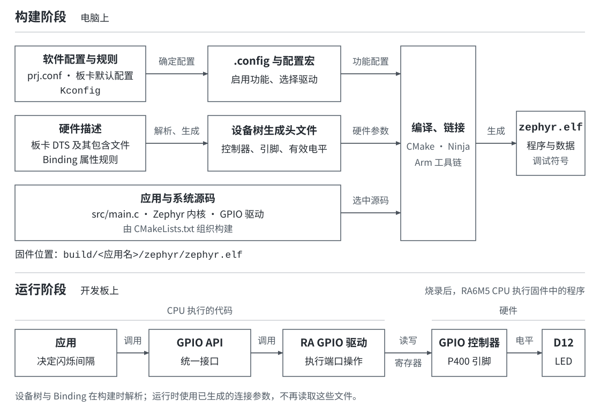

# 第1章 从 example-application 认识 Zephyr 工程

准备阶段已经在 VS Code 中打开 RA6M5 工程，并确认了开发工具和串口连接。接下来要确定应用怎样进入 Zephyr 构建：源文件放在哪里，驱动在哪里启用，板卡引脚又从哪里取得？

Zephyr 官方的 [example-application](https://github.com/zephyrproject-rtos/example-application) 把应用、板卡、自定义驱动和 Binding 放在同一个工程中，并提供接入 Zephyr 的构建入口。沿着这份参考结构，可以把应用源码、软件配置和硬件描述对应到当前 RA6M5 工程。

## 应用怎样使用 Zephyr 和硬件

以板载 LED 为例，应用调用 GPIO API 控制亮灭，GPIO 驱动负责操作控制器，设备树保存连接关系。构建系统再将应用、选中的驱动与硬件描述组合成固件。

| 内容 | 负责什么 | LED 程序中的例子 |
| --- | --- | --- |
| 应用 | 决定程序执行的功能和顺序 | 打印启动信息，每隔一段时间翻转 LED |
| Zephyr 内核 | 提供线程运行、等待和调度等机制 | `k_sleep()` 让当前线程等待 |
| 驱动 | 实现对应硬件的操作，并提供设备接口 | GPIO 驱动配置和切换输出电平 |
| 设备树（Devicetree） | 描述设备、连接与参数 | LED 所属控制器、引脚编号和有效电平 |
| Binding | 规定一类设备节点的属性含义与要求 | 规定 `gpio-leds` 子节点使用 `gpios` 描述连接 |

设备树和 Binding 在构建时被解析；应用运行时调用的是已编译进固件的驱动。观察下图的上下两部分：上半部分的箭头表示文件进入构建系统，下半部分表示程序运行后的函数调用与硬件操作。



*图 1：同一个 LED 程序的构建阶段与运行阶段。设备树提供硬件描述，运行中的应用通过 GPIO API 使用控制器。*

这份分工决定了修改位置：闪烁间隔写在应用中，LED 接线写在设备树中，是否启用 GPIO 功能由配置决定。后续编写 `main.c` 时，通过设备树宏取得连接信息，再调用已选入固件的 GPIO 驱动。

## example-application 提供的参考结构

官方仓库演示了工作区应用、自定义板卡、树外驱动、Binding 和 Zephyr 模块。与当前课程有关的目录如下：

```text
example-application/
├─ app/                  # 可以独立构建的应用
├─ boards/               # 工程提供的板卡描述
├─ drivers/              # 工程提供的驱动
├─ dts/bindings/          # 工程提供的设备树属性规则
├─ include/app/          # 应用或驱动共用的头文件
├─ lib/                  # 可复用的库代码
├─ zephyr/module.yml     # 声明工程怎样接入 Zephyr 构建
├─ CMakeLists.txt        # 共享代码的编译入口
├─ Kconfig               # 共享代码的配置入口
└─ west.yml              # 工作区依赖清单
```

应用和扩展代码放在 Zephyr 源码仓库之外，因此常称为“树外”应用或驱动。它们仍然使用 Zephyr 的 API、配置和构建机制。官方的 [Application Development：Using a Reference Workspace Application](https://docs.zephyrproject.org/latest/develop/application/index.html#using-a-reference-workspace-application) 将这个仓库作为工作区应用的参考。

`example-application` 是一种组织参考，不要求所有工程都只能有一个 `app/`。RA6M5 工程把应用放在 `apps/<应用名>/` 中，让多个示例各有自己的配置和源文件，并共用同一套板卡与驱动。

## 在 RA6M5 工程中找到对应目录

在 VS Code 中打开 `RA6M5/` 根目录。这里的根目录是同时包含 `west.yml`、`apps/` 和 `scripts/` 的目录。后续命令均从这里执行。

```text
RA6M5/
├─ .west/config
├─ west.yml
├─ apps/                             # 各应用独立构建
├─ boards/dshan/dshan_ra6m5/          # 本板的硬件描述与默认配置
├─ drivers/                          # 工程内的驱动实现
├─ dts/bindings/                      # 工程内的 Binding
├─ include/                          # 公共头文件
├─ lib/                              # 公共库代码
├─ CMakeLists.txt                    # 工程模块的编译入口
├─ Kconfig                           # 工程模块的配置入口
├─ zephyr/                           # Zephyr 源码
│  └─ module.yml                     # 当前工程的模块描述文件
├─ modules/                          # west 管理的外部依赖
├─ sdk_env/                          # 工程配套工具
├─ scripts/dev.ps1                   # 工程提供的开发辅助脚本
└─ build/                            # 生成的构建结果
```

应用建立后，`apps/` 与 `build/` 中相同的应用名表示来源和结果。例如下一章创建的 `apps/board_bringup/` 是应用输入，编译后生成的 `build/board_bringup/` 是它的构建输出。修改源文件应进入 `apps/`；查看最终设备树、配置和固件应进入 `build/`。

不要仅凭文件名判断作用。当前工程有两类 `CMakeLists.txt`：根目录的文件组织共享代码，应用目录的文件决定本次要构建哪个应用。它们在同一次构建中都可能被读取，但负责的内容不同。

## west.yml 确定工作区使用哪些源码

west 是工作区管理和开发命令工具。先查看它在当前工程中使用的清单位置：

```powershell
Get-Content .\.west\config
```

关注其中的两项：

```ini
[manifest]
path = .
file = west.yml
```

`path = .` 指向工作区根目录，`file = west.yml` 指定清单文件。因此应阅读根目录的 `west.yml`。其中 Zephyr 项目的关键字段为：

```yaml
remotes:
  - name: zephyrproject-rtos
    url-base: https://github.com/zephyrproject-rtos

projects:
  - name: zephyr
    remote: zephyrproject-rtos
    revision: v4.4.2
```

这是清单的节选。`remote` 与 `name` 对应到 Zephyr 官方仓库，`revision` 指定本工程清单选择的版本；后面的 `import` 再从 Zephyr 清单引入需要的模块。课程命令使用已经准备好的这套工作区，不需要为每个应用重新下载 Zephyr。

清单解决的是源码仓库及其版本问题。LED 连接到哪个引脚、应用要编译哪个 `main.c`，分别由板卡描述和应用构建文件决定，不写入 `west.yml`。

## module.yml 把共享代码接入构建

工程根目录下有 `drivers/`，并不意味着这个目录中的所有源文件都会自动编译。Zephyr 需要先知道当前工程提供了哪些构建入口，再根据配置选择具体源码。

打开 `zephyr/module.yml`。这里的路径是 Zephyr 约定的模块描述文件位置；文件里的 `.` 相对于当前模块的根目录，即 `RA6M5/`。关键内容为：

```yaml
build:
  kconfig: Kconfig
  cmake: .
  settings:
    board_root: .
    dts_root: .
    soc_root: .
```

这些字段把当前工程接入 Zephyr 的构建搜索范围。`kconfig` 指向根目录的配置入口，`cmake` 指向包含根 `CMakeLists.txt` 的目录；`board_root`、`dts_root` 和 `soc_root` 分别补充 Board、设备树与 SoC 文件的查找位置。Zephyr 的 [Modules：Module yaml file description](https://docs.zephyrproject.org/latest/develop/modules.html#module-yaml-file-description) 说明了这些模块字段。

继续打开根目录的 `CMakeLists.txt`，可以看到共享内容怎样进入编译：

```cmake
zephyr_include_directories(include)

add_subdirectory(drivers)
add_subdirectory(lib)
```

第一行向构建系统提供公共头文件目录，后两行进入驱动与库的构建入口。根目录 `Kconfig` 则继续读取配置定义：

```kconfig
rsource "drivers/Kconfig"
rsource "lib/Kconfig"
```

Kconfig 定义可选功能及依赖，CMake 按配置选择源文件。应用通过自己的 `prj.conf` 选择共享驱动；驱动实现仍由工程模块的构建规则管理。第4、5章会沿着这两个入口接入新的驱动。

## 一个应用需要哪些文件

将注意力放到 `apps/<应用名>/`。应用至少要给构建系统三个输入：编译入口、软件配置和程序源文件。

| 文件 | 谁读取它 | 当前应用要表达的内容 |
| --- | --- | --- |
| `CMakeLists.txt` | CMake，在构建配置阶段读取 | 接入 Zephyr，声明要编译的源文件 |
| `prj.conf` | Kconfig 配置过程读取 | 为本应用选择功能，例如启用 `printk` 输出 |
| `src/main.c` | C 编译器编译，固件启动后由应用线程执行 `main()` | 打印内容、调用设备 API、安排运行顺序 |
| `app.overlay` 或应用下的板卡 overlay | 设备树处理过程读取，应用需要时添加 | 为该应用补充或调整硬件描述 |

`prj.conf` 使用 `CONFIG_选项名=值` 为本次构建选择已有选项，`target_sources(app PRIVATE src/main.c)` 则把源文件加入应用目标。这两个输入分别回答“开启哪些功能”和“编译哪些代码”。修改配置后，是否生效应查看生成的 `.config`；修改源码列表后，可查看 `compile_commands.json` 中是否出现对应文件。

板载 LED 已经在 `boards/dshan/dshan_ra6m5/dshan_ra6m5.dts` 中描述。下一章使用这份描述，所以应用无需再创建一份 LED overlay。只有应用确实需要补充硬件连接或改变节点配置时，才增加 overlay。

## 从文件位置判断应改哪里

在 VS Code 中分别找到下面的文件，并核对对应内容：

| 要确认的内容 | 打开的文件或目录 | 应找到什么 |
| --- | --- | --- |
| 工作区清单入口 | `.west/config` | `path = .` 与 `file = west.yml` |
| Zephyr 依赖 | `west.yml` | `name: zephyr`、对应仓库及 `revision` |
| 共享代码接入方式 | `zephyr/module.yml`、根 `CMakeLists.txt` | 模块入口与 `drivers/`、`lib/` 的引用 |
| 板载 LED 描述 | `boards/dshan/dshan_ra6m5/dshan_ra6m5.dts` | `led0` 别名和 `user_led` 节点 |
| 自己的程序 | `apps/` | 每个应用单独保存构建入口、配置和源码 |

能够找到这些位置，就可以开始增加应用：在 `apps/board_bringup/` 中安排打印和闪灯逻辑，复用工程已有的板卡描述和 Zephyr GPIO 驱动。

[下一章：编写第一个 Zephyr 应用](../02-编写第一个Zephyr应用/README.md)
