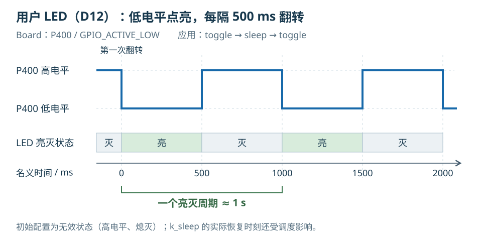

# 第2章 编写第一个 Zephyr 应用

上一章已经找到应用、板卡描述和共享驱动的位置。现在在 `apps/board_bringup/` 中编写一个应用：启动时通过串口打印 Zephyr 版本与板卡目标，然后让 D12 每隔 500 ms 翻转一次。

先建立能够编译的串口应用，再使用 Board 已有的 `led0` 描述加入 GPIO 操作。所有命令从 `RA6M5/` 工程根目录执行；开发工具与连接方式沿用[学习准备](../../00-学习准备/02-编译烧录与调试程序/README.md)。

## 建立应用目录

在 VS Code 的资源管理器中找到 `apps/`，新建 `board_bringup/`，再在里面新建 `src/`。也可以在工程根目录的 PowerShell 终端执行：

```powershell
New-Item -ItemType Directory -Path .\apps\board_bringup\src -Force
```

应用的核心文件放在下面的位置，接下来逐个创建：

```text
apps/board_bringup/
├─ CMakeLists.txt       # 连接 Zephyr 构建系统，列出应用源文件
├─ prj.conf             # 选择应用需要的软件功能
└─ src/
   └─ main.c            # 串口横幅与 LED 程序
```

目录名 `board_bringup` 会作为工程脚本的应用参数。脚本在 `apps/board_bringup/` 中查找源码，把构建结果放入 `build/board_bringup/`，因此不要把 `main.c` 建在 `build/` 下。

## 将 main.c 加入 Zephyr 构建

在 `apps/board_bringup/` 中新建 `CMakeLists.txt`，先写入下面的内容：

```cmake
# 沿用工程模板的入口声明；实际工具版本由配套开发环境提供。
cmake_minimum_required(VERSION 3.13.1)

# 加载 Zephyr 构建系统，由它建立应用使用的 app 目标。
find_package(Zephyr REQUIRED HINTS $ENV{ZEPHYR_BASE})

project(app LANGUAGES C)

# 路径相对于当前应用目录，将 main.c 加入 app 目标。
target_sources(app PRIVATE src/main.c)
```

`find_package(Zephyr ...)` 让 CMake 进入 Zephyr 的构建流程，随后 `target_sources()` 把应用源码加入 `app` 目标。只有文件存在而没有加入编译目标，编译器不会自动扫描到它。以后把代码拆成 `src/main.c` 和 `src/display.c` 时，应在这里明确列出两个源文件。

`cmake_minimum_required()` 中的数值沿用当前工程模板，不能据此判断整个 Zephyr 工作区只需要该版本的 CMake；Zephyr 自身也会检查构建工具要求。本课直接使用准备阶段已确认的工程环境。

## 配置串口输出

在 `apps/board_bringup/` 中新建 `prj.conf`，完整内容为：

```ini
# main() 使用 printk 输出启动信息。
CONFIG_PRINTK=y

# 保留 Zephyr 自身的启动横幅，便于观察复位后是否启动。
CONFIG_BOOT_BANNER=y
```

`prj.conf` 是应用的 Kconfig 配置片段。Zephyr 把它与板卡默认配置等输入合并，最终配置保存在构建目录的 `zephyr/.config` 中。

当前 Board 的 `boards/dshan/dshan_ra6m5/dshan_ra6m5_defconfig` 已经提供以下设置，可以打开文件核对：

```ini
CONFIG_GPIO=y
CONFIG_SERIAL=y
CONFIG_UART_CONSOLE=y
CONFIG_UART_INTERRUPT_DRIVEN=y
CONFIG_CONSOLE=y
```

因此本应用的 `prj.conf` 不必重复加入 GPIO 和控制台选项。控制台实际选择哪个 UART，由同目录的 Board DTS 中 `zephyr,console = &uart7` 指定。应用通过 `printk()` 输出文字，串口选择沿用 Board。

## 先让 main() 输出启动横幅

在 `apps/board_bringup/src/` 中新建 `main.c`。`printk()` 是本次使用的输出函数，声明在 `zephyr/sys/printk.h`；`zephyr/version.h` 提供内核版本字符串。将文件写成下面的最小状态：

```c
/* SPDX-License-Identifier: Apache-2.0 */

#include <zephyr/kernel.h>
#include <zephyr/sys/printk.h>
#include <zephyr/version.h>

int main(void)
{
	/* 版本与板卡名称来自本次构建，便于识别正在运行的固件。 */
	printk("\nDshan RA6M5 bring-up: Zephyr %s on %s\n",
	       KERNEL_VERSION_STRING, CONFIG_BOARD_TARGET);

	return 0;
}
```

在当前工程中，Zephyr 自动建立主线程，完成启动初始化后由它调用应用的 `main()`。因此这里已经可以使用线程接口，无需在应用中另行创建主线程或启动调度器。源码入口是 `zephyr/kernel/init.c` 中的 `bg_thread_main()`；也可参阅官方[系统线程说明](https://docs.zephyrproject.org/latest/kernel/services/threads/system_threads.html)。

`main()` 正常返回会结束主线程，其它系统线程继续运行。后面需要持续控制 LED，就将循环直接放在 `main()` 中。主线程的栈大小和优先级分别由 `CONFIG_MAIN_STACK_SIZE`、`CONFIG_MAIN_THREAD_PRIORITY` 配置，可以在生成的 `.config` 中核对本次取值。

横幅中的 `CONFIG_BOARD_TARGET` 来自本次构建选择的板卡目标，用于确认当前固件对应的板卡；更换构建目标后，输出会随配置改变。

保存文件，在工程根目录执行：

```powershell
.\scripts\dev.ps1 build board_bringup
```

脚本已经指定 Board 为 `dshan_ra6m5`，并设置配套工具环境。它调用 west 构建当前应用，成功后应产生以下文件：

```text
build/board_bringup/zephyr/
├─ zephyr.elf           # 应用与 Zephyr 链接得到的固件
├─ zephyr.dts           # 合并后的设备树
└─ .config              # 合并后的 Kconfig 配置
```

可以继续在同一个终端查看本次配置：

```powershell
Select-String -Path .\build\board_bringup\zephyr\.config -Pattern '^CONFIG_PRINTK=y$', '^CONFIG_BOOT_BANNER=y$', '^CONFIG_BOARD_TARGET='
```

前两项应为 `y`，说明 `prj.conf` 里的配置已进入最终结果；`CONFIG_BOARD_TARGET` 对应横幅即将打印的板卡目标。此时 `main()` 只有打印和返回，尚未操作 LED。构建成功后再增加 GPIO 部分，后续出现的问题就能集中到新增代码。

## 从 Board 的 led0 取得 LED 连接

GPIO API 需要知道控制器、引脚与有效电平。应用使用的 `led0` 是设备树别名，不是 C 变量。在 `boards/dshan/dshan_ra6m5/dshan_ra6m5.dts` 中分别找到 `aliases` 与 `leds`，相关内容为：

```dts
aliases {
	led0 = &user_led;
};

leds {
	compatible = "gpio-leds";

	user_led: user-led {
		gpios = <&ioport4 0 GPIO_ACTIVE_LOW>;
		label = "User LED D12";
	};
};
```

这是 Board 源码中两个位置的节选，不需要写入应用。`led0` 指向 `user_led`，其中的 `gpios` 对应三项信息：

| `gpios` 内容 | 含义 | 本应用使用的结果 |
| --- | --- | --- |
| `&ioport4` | GPIO 控制器 | 第4组 GPIO 端口的设备对象 |
| `0` | 控制器内的引脚编号 | P400 |
| `GPIO_ACTIVE_LOW` | 低电平表示有效状态 | D12 在低电平时点亮 |

Zephyr 提供 `struct gpio_dt_spec` 保存这组信息，包括控制器指针 `port`、引脚 `pin` 和设备树标志 `dt_flags`。`GPIO_DT_SPEC_GET()` 从指定节点的 GPIO 属性生成这份描述，调用时不用在 C 文件里重复写 P400。

打开 `apps/board_bringup/src/main.c`，在 `#include <zephyr/kernel.h>` 后增加 GPIO 头文件：

```c
#include <zephyr/drivers/gpio.h>
```

接着在所有 `#include` 之后、`main()` 之前增加：

```c
/* 通过别名找到 Board 已描述的 LED，应用不重复指定物理引脚。 */
#define LED_NODE DT_ALIAS(led0)

static const struct gpio_dt_spec led = GPIO_DT_SPEC_GET(LED_NODE, gpios);
```

`DT_ALIAS(led0)` 在构建时取得节点标识，`GPIO_DT_SPEC_GET(LED_NODE, gpios)` 进一步取得连接信息。官方 [Blinky 示例](https://docs.zephyrproject.org/latest/samples/basic/blinky/README.html) 也通过 `led0` 选择 LED；本板的具体控制器和电平则以这里的 Board DTS 为准。

## 检查控制器，再设置初始输出

拿到设备描述后，还要确认 GPIO 控制器已经初始化。`gpio_is_ready_dt(&led)` 检查描述中的控制器能否使用；通过检查后，`gpio_pin_configure_dt()` 才配置引脚方向和初始输出状态。

在 `main()` 的左花括号后、`printk()` 前增加返回值变量：

```c
	int ret;
```

在原来的 `printk()` 之后、`return 0;` 之前插入：

```c
	/* 有设备描述不等于控制器初始化成功，先检查再操作。 */
	if (!gpio_is_ready_dt(&led)) {
		printk("ERROR: led0 controller is not ready\n");
		return -ENODEV;
	}

	/* 先让 LED 处于无效状态；ACTIVE_LOW 会把它转换为高电平。 */
	ret = gpio_pin_configure_dt(&led, GPIO_OUTPUT_INACTIVE);
	if (ret < 0) {
		printk("ERROR: led0 configure failed: %d\n", ret);
		return ret;
	}
```

`GPIO_OUTPUT_INACTIVE` 表示配置成输出，并以逻辑无效状态启动。它不是固定的低电平：本板使用 `GPIO_ACTIVE_LOW`，因此初始输出是高电平，D12 熄灭。设备树标志会由 `gpio_pin_configure_dt()` 与调用参数一起交给 GPIO 驱动。

两个错误分支分别区分“控制器未就绪”和“引脚配置失败”。错误码为负数，出现错误时函数返回，不继续执行后面的翻转操作。相关 API 可以在工程的 `zephyr/include/zephyr/drivers/gpio.h` 中查到，也可以查阅官方 [GPIO API](https://docs.zephyrproject.org/latest/hardware/peripherals/gpio.html)。

## 每隔 500 ms 翻转一次 LED

`gpio_pin_toggle_dt()` 根据 `led` 翻转输出。Zephyr 的线程延时使用 `k_sleep()`，参数通过 `K_MSEC(500)` 明确表示 500 ms；这里暂停的是执行 `main()` 的主线程。

在 `main()` 中找到最后的 `return 0;`，把它替换为下面这一段；保留其后的函数右花括号：

```c
	while (true) {
		/* 翻转当前输出，等待后再翻转，形成持续心跳。 */
		(void)gpio_pin_toggle_dt(&led);
		k_sleep(K_MSEC(500));
	}

	return 0;
```

前面已经检查初始化与配置结果；这个应用在循环中显式忽略翻转函数的返回值。若运行中需要识别每一次输出失败，应像配置步骤那样检查返回值并输出错误。

注意“翻转间隔”和“一个完整亮灭周期”的区别。下图从第一次进入循环开始计时：初始配置让 LED 熄灭，第一次翻转立即点亮，等待 500 ms 后再熄灭。



*图 1：`GPIO_ACTIVE_LOW` 下的电平与 LED 状态。图中时间为忽略执行与调度开销的名义时序，完整亮灭周期约为 1 s。*

如果把 `K_MSEC(500)` 改成 `K_MSEC(1000)`，每种状态的持续时间都会变长，完整亮灭周期约为 2 s。需要修改的是应用等待参数，Board 中的 GPIO 连接保持不变。

### 核对完整 main.c

完成以上修改后，`apps/board_bringup/src/main.c` 应包含下面的结构。先核对头文件、设备描述和 `main()` 内的顺序，再进行最终构建。

<details>
<summary>展开完整 main.c</summary>

```c
/* SPDX-License-Identifier: Apache-2.0 */

#include <zephyr/kernel.h>
#include <zephyr/drivers/gpio.h>
#include <zephyr/sys/printk.h>
#include <zephyr/version.h>

/* LED 的连接信息由 Board 提供，应用只使用约定的别名。 */
#define LED_NODE DT_ALIAS(led0)

static const struct gpio_dt_spec led = GPIO_DT_SPEC_GET(LED_NODE, gpios);

int main(void)
{
	int ret;

	/* 从本次构建取得内核版本与板卡目标。 */
	printk("\nDshan RA6M5 bring-up: Zephyr %s on %s\n",
	       KERNEL_VERSION_STRING, CONFIG_BOARD_TARGET);

	/* 控制器初始化成功后，才能配置和操作引脚。 */
	if (!gpio_is_ready_dt(&led)) {
		printk("ERROR: led0 controller is not ready\n");
		return -ENODEV;
	}

	/* 低电平点亮的 LED，以高电平开始，保持初始熄灭。 */
	ret = gpio_pin_configure_dt(&led, GPIO_OUTPUT_INACTIVE);
	if (ret < 0) {
		printk("ERROR: led0 configure failed: %d\n", ret);
		return ret;
	}

	while (true) {
		(void)gpio_pin_toggle_dt(&led);
		/* 让出当前线程，每隔约 500 ms 再翻转一次。 */
		k_sleep(K_MSEC(500));
	}

	return 0;
}
```

</details>

## 构建后核对设备树与配置

保存全部文件，再次从工程根目录构建：

```powershell
.\scripts\dev.ps1 build board_bringup
```

构建成功后，打开 `build/board_bringup/zephyr/zephyr.dts`，搜索 `led0` 与 `user-led`。应能沿着 `led0 = &user_led` 找到 LED 节点。生成文件里的 `gpios` 可能已转换成数值形式，可以回到 Board DTS 对照控制器、引脚编号与标志。

再确认 GPIO 功能已进入本次配置：

```powershell
Select-String -Path .\build\board_bringup\zephyr\.config -Pattern '^CONFIG_GPIO=y$', '^CONFIG_GPIO_RA_IOPORT=y$'
```

`CONFIG_GPIO=y` 表示 GPIO 功能开启，`CONFIG_GPIO_RA_IOPORT=y` 表示本次选择了 RA I/O 端口驱动。设备树描述与驱动配置都进入构建，才能让应用里的 GPIO 调用操作到本板控制器。

## 烧录并观察横幅和 D12

在工程根目录执行：

```powershell
.\scripts\dev.ps1 flash board_bringup
```

这里使用工程提供的烧录脚本。它先增量构建，再生成供下载使用的 `zephyr_codeflash.elf`，通过配套工具烧录并复位板卡。确认脚本结束并提示烧录完成后，打开串口监视：

```powershell
.\scripts\dev.ps1 monitor
```

串口打开后复位板卡，观察从启动开始的输出。`monitor` 会根据板载调试器的 USB 标识寻找串口，以 115200、8N1 打开；退出时按 `Ctrl+C`。

本次在开发板上运行 `board_bringup`，串口实测的应用横幅为：

```text
Dshan RA6M5 bring-up: Zephyr 4.4.2 on dshan_ra6m5/r7fa6m5bf2cbg
```

横幅中的版本与板卡目标来自该次构建。复位后继续核对输出与实物现象：

- 串口出现以 `Dshan RA6M5 bring-up: Zephyr` 开头的应用横幅，后面包含本次构建的内核版本与板卡目标。
- 没有出现 `led0 controller is not ready` 或 `led0 configure failed` 错误。
- D12 约每隔 500 ms 改变一次亮灭状态，一个完整亮灭周期约为 1 s。

应用只在启动时打印一次横幅，循环中不会持续打印文字。因此横幅之后串口保持安静、LED 继续闪烁，是这份程序的预期行为。若在烧录复位之后才打开串口，可能错过横幅；保持监视窗口打开，再复位一次即可观察。

| 当前现象 | 优先检查的位置 |
| --- | --- |
| 构建找不到 `src/main.c` | `CMakeLists.txt` 的源文件路径与实际目录 |
| 构建报错涉及 `DT_ALIAS(led0)` 或 `gpios` | 所选 Board，以及生成设备树中的别名和节点 |
| 横幅出现，但提示控制器未就绪 | 最终 `.config` 中的 GPIO 配置，以及驱动初始化结果 |
| 没有横幅，但 D12 正在闪烁 | 串口是否已经打开、是否错过启动输出、是否需要复位 |
| 串口有横幅，D12 不翻转 | 是否构建并烧录了加入循环后的 `board_bringup`，以及 GPIO 配置错误输出 |

现在已经把一个应用从构建入口、配置和最小 `main.c` 写到了设备操作。下一章继续沿着设备树和标准 API，学习使用工程已有的设备驱动。

[上一章：从 example-application 认识 Zephyr 工程](../01-从example-application认识Zephyr工程/README.md) · [下一章：Zephyr 设备驱动的使用](../03-Zephyr设备驱动的使用/README.md)
