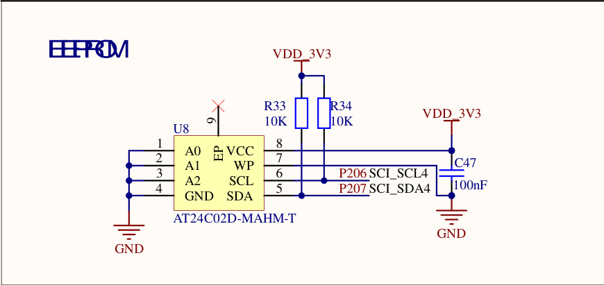
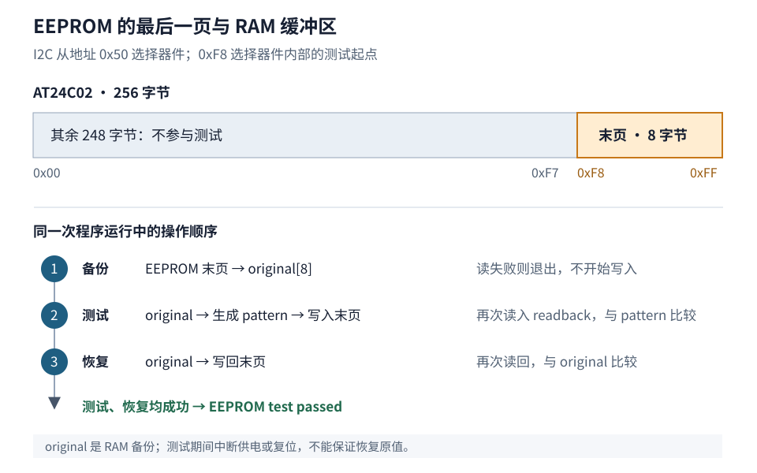

# 第3章 Zephyr 设备驱动的使用

上一章的 `board_bringup` 通过 `led0` 使用 GPIO 控制器。板载 AT24C02 同样已有设备树节点；要在新应用中访问它，还需要选中 EEPROM 驱动，再把这个实例交给 EEPROM API。

在 `apps/eeprom` 中创建应用，依次完成设备获取、容量读取、末页备份、写读比较和原值恢复。Board 提供器件与总线配置，`prj.conf` 选择驱动，应用决定测试范围和数据处理。

## 3.1 用设备树选择 EEPROM 实例

先看原理图中 U8 的地址引脚与两条总线信号：A0、A1、A2 均接地，SCL、SDA 分别连接 P206、P207。



图 3-1：板载 EEPROM 电路。来源：《RA6M5_v4_20230706》原理图第 3 页 EEPROM 部分；[完整原理图](pathname:///files/ra6m5/ra6m5-v4-schematic.pdf)。

图中的器件为 AT24C02D-MAHM-T，R33、R34 把 SDA、SCL 分别通过 10 kΩ 电阻上拉到 3.3 V。WP 接地，硬件未禁止写入。AT24C02D 的地址格式为 `1010 A2 A1 A0` 加读写位；本板三个地址引脚为低电平，因此传给 Zephyr 的 **7 位地址为 `0x50`**，不要填包含读写位的 `0xA0` 或 `0xA1`。地址格式及 32 页、每页 8 字节的组织方式见 [AT24C01D/AT24C02D 数据手册 DS20006100A，第 6 节](https://ww1.microchip.com/downloads/en/DeviceDoc/AT24C01D-AT24C02D-I2C-Compatible-Two-Wire-Serial-EEPROM-1Kbit-2Kbit-20006100A.pdf)。

在工程根目录打开 `boards/dshan/dshan_ra6m5/dshan_ra6m5.dts`，先查找 `eeprom0`。它位于 `/aliases` 中：

```dts
eeprom0 = &at24c02;
```

`eeprom0` 是应用使用的别名，`at24c02` 是设备树节点标签。继续查找 `at24c02:`，可以看到它位于 `sci4` 的 I2C 子节点中。下面是当前 Board 已有的这部分配置，保持原样：

```dts
&sci4 {
	pinctrl-0 = <&sci4_eeprom_default>;
	pinctrl-names = "default";
	status = "okay";

	i2c4: i2c {
		sda-output-delay = <300>;
		noise-filter-clock-select = <1>;
		bit-rate-modulation;
		clock-frequency = <I2C_BITRATE_STANDARD>;
		status = "okay";

		at24c02: eeprom@50 {
			compatible = "atmel,at24";
			reg = <0x50>;
			size = <256>;
			pagesize = <8>;
			address-width = <8>;
			timeout = <5>;
		};
	};
};
```

本板使用 SCI4 的 simple-I2C 模式连接 AT24C02。`dshan_ra6m5-pinctrl.dtsi` 中的 `sci4_eeprom_default` 已指定 SDA 使用 P207、SCL 使用 P206。应用访问的是下面这些属性描述的 EEPROM 实例：

| 字段 | 当前值及单位 | 后续用途 |
| --- | --- | --- |
| `compatible` | `"atmel,at24"` | 匹配 AT24 系列 EEPROM 的 binding 和驱动 |
| `reg` | `0x50`，I2C 从设备地址 | I2C 传输时选择 AT24C02，不是 EEPROM 内部偏移 |
| `size` | 256 字节 | 合法内部偏移为 `0x00`～`0xFF` |
| `pagesize` | 8 字节 | EEPROM 的页写入大小，不是整个器件容量 |
| `address-width` | 8 位 | 访问内部存储单元时发送的偏移地址宽度 |
| `timeout` | 5 毫秒 | 驱动等待 EEPROM 写周期的超时参数 |
| `clock-frequency` | `I2C_BITRATE_STANDARD`，100 kHz | SCI4 I2C 总线时钟 |

构建系统根据 `compatible` 匹配 `zephyr/dts/bindings/mtd/atmel,at24.yaml`，结合它包含的 `atmel,at2x-base.yaml`、`eeprom-base.yaml` 检查属性并生成设备树宏。表中的容量、页大小和地址宽度由这些 binding 约定单位，再交给驱动使用。

`at24c02` 未单独写 `status`，按设备树规则视为启用；它所在的总线也已启用。本应用直接使用 Board 的描述，不需要新增 overlay。换板时，应重新确认 `eeprom0` 指向的器件、容量和总线配置。

## 3.2 创建应用并启用 EEPROM 驱动

在 VS Code 的工程资源管理器中，在 `apps` 下新建 `eeprom`，再创建下面三个文件：

```text
apps/
└─ eeprom/
   ├─ CMakeLists.txt
   ├─ prj.conf
   └─ src/
      └─ main.c
```

在 `apps/eeprom/CMakeLists.txt` 写入：

```cmake
# SPDX-License-Identifier: Apache-2.0

cmake_minimum_required(VERSION 3.20.0)
find_package(Zephyr REQUIRED HINTS $ENV{ZEPHYR_BASE})
project(eeprom LANGUAGES C)

# app 是 Zephyr 应用目标；把入口文件加入它的编译列表。
target_sources(app PRIVATE src/main.c)
```

工程脚本根据名称 `eeprom` 选择 `apps/eeprom`，`target_sources()` 将这个应用的 `src/main.c` 加入 `app` 编译目标。

### 启用 EEPROM、I2C 和日志

设备树描述硬件，`prj.conf` 决定当前固件需要哪些软件能力。在 `apps/eeprom/prj.conf` 写入：

```ini
# 启用 EEPROM 接口及其底层 I2C 传输。
CONFIG_EEPROM=y
CONFIG_I2C=y

# 当前 RA SCI simple-I2C 驱动计算总线时序时使用 ceil/floor。
CONFIG_NEWLIB_LIBC=y

# 用日志区分备份、测试和恢复结果。
CONFIG_LOG=y
CONFIG_LOG_PROCESS_TRIGGER_THRESHOLD=1
CONFIG_MAIN_STACK_SIZE=2048
CONFIG_STACK_SENTINEL=y
```

`CONFIG_EEPROM=y` 开启 EEPROM 驱动配置。启用的 `atmel,at24` 节点使 Kconfig 默认选中 `CONFIG_EEPROM_AT24`，进一步启用共用的 AT2X 实现和 I2C 依赖。构建系统据此编译驱动；实际选择结果写入 `build/eeprom/zephyr/.config`。

`CONFIG_NEWLIB_LIBC=y` 满足当前 SCI I2C 驱动的 C 库依赖：`zephyr/drivers/i2c/i2c_renesas_ra_sci.c` 的时序计算使用了 `ceil()`、`floor()`。更换总线驱动后，应重新核对这项依赖。

其余配置启用日志，将延迟日志线程的唤醒阈值设为 1，并设置主线程栈和栈边界检查。读写结果将统一输出到串口。

## 3.3 获取设备并确认初始化状态

GPIO 与 EEPROM 都使用 Zephyr 的设备对象。应用通过设备树定位对象，再把对象指针交给相应类别的 API。这里依次使用：

```text
DT_ALIAS(eeprom0) → EEPROM 节点
DEVICE_DT_GET(...) → const struct device *
eeprom_get_size(...) → EEPROM 容量
```

`DT_ALIAS(eeprom0)` 选中设备树节点，`DEVICE_DT_GET()` 引用构建时为该节点生成的设备对象。宏展开不执行设备初始化；`device_is_ready()` 检查的是系统启动时记录的初始化结果。应用确认设备就绪后，再调用 EEPROM API。

在 `apps/eeprom/src/main.c` 写入第一个可构建版本：

```c
/* SPDX-License-Identifier: Apache-2.0 */

#include <errno.h>

#include <zephyr/device.h>
#include <zephyr/devicetree.h>
#include <zephyr/drivers/eeprom.h>
#include <zephyr/logging/log.h>

LOG_MODULE_REGISTER(eeprom_demo, LOG_LEVEL_INF);

#define EEPROM_NODE DT_ALIAS(eeprom0)

int main(void)
{
	/* 使用 Board 提供的别名，应用不依赖具体 I2C 控制器或引脚。 */
	const struct device *eeprom = DEVICE_DT_GET(EEPROM_NODE);
	size_t capacity;

	LOG_INF("Dshan RA6M5 AT24C02 EEPROM demo");

	if (!device_is_ready(eeprom)) {
		LOG_ERR("EEPROM device %s is not ready", eeprom->name);
		return -ENODEV;
	}

	capacity = eeprom_get_size(eeprom);
	LOG_INF("Device: %s, capacity: %zu bytes", eeprom->name, capacity);
	return 0;
}
```

`LOG_MODULE_REGISTER()` 将本文件的输出归入 `eeprom_demo` 模块。后续可以从同一模块的日志区分设备检查、读写测试和恢复结果。

在**工程根目录**的 PowerShell 中构建：

```powershell
.\scripts\dev.ps1 build eeprom
```

构建成功后，打开 `build/eeprom/zephyr/.config`，确认有以下最终配置：

```ini
CONFIG_EEPROM=y
CONFIG_EEPROM_AT24=y
CONFIG_EEPROM_AT2X=y
CONFIG_I2C=y
CONFIG_I2C_RENESAS_RA_SCI=y
CONFIG_NEWLIB_LIBC=y
```

其中 `CONFIG_EEPROM_AT24`、`CONFIG_EEPROM_AT2X` 确认 EEPROM 实现被选中，`CONFIG_I2C_RENESAS_RA_SCI` 确认 SCI I2C 控制器驱动被选中。再打开 `build/eeprom/zephyr/zephyr.dts`，查找 `eeprom0` 和 `eeprom@50`，核对别名、从地址、容量 `0x100` 和页大小 `0x8`。

这两份产物分别回答“哪些软件被选中”和“当前实例使用哪些硬件参数”。`eeprom_get_size()` 只读取驱动配置中的容量；接下来的 `eeprom_read()` 才会实际访问 I2C 线上的 EEPROM。

## 3.4 通过 EEPROM API 读取末页

测试长度取 8 字节，与本板 EEPROM 的一页相同。测试起点由容量计算，而不是另写一个 I2C 地址：

```text
内部偏移 = 容量 − 测试长度 = 256 − 8 = 248 = 0xF8
测试范围 = 0xF8～0xFF
I2C 从设备地址仍为 0x50
```

图中把 EEPROM 与 RAM 分开。`original` 保存的是写入前的字节，后续恢复只能使用这份备份。



图 3-2：EEPROM 最后一页的备份、测试与恢复。容量、页大小来自 `boards/dshan/dshan_ra6m5/dshan_ra6m5.dts`；缓冲区和操作顺序对应本章编写的 `apps/eeprom/src/main.c`。

先在 `apps/eeprom/src/main.c` 的 `#include <errno.h>` 后追加：

```c
#include <stdint.h>
#include <string.h>
```

然后在 `EEPROM_NODE` 宏后追加本次读取长度：

```c
/* 只测试末尾一页，长度来自本板 pagesize = <8>。 */
#define TEST_SIZE 8U
```

EEPROM 读取 API 在 `zephyr/include/zephyr/drivers/eeprom.h` 中声明为：

```c
__syscall int eeprom_read(const struct device *dev, off_t offset, void *data,
			  size_t len);
```

`__syscall` 用于 Zephyr 的接口代码生成，应用仍调用 `eeprom_read()`。四个参数把设备实例与本次数据访问分开：

| 参数 | 本次读取传入的值 | 含义 |
| --- | --- | --- |
| `dev` | `eeprom` | 要访问的 EEPROM 设备对象 |
| `offset` | `0xF8` | EEPROM 内部的字节偏移 |
| `data` | `original` | 用于接收数据的 RAM 缓冲区 |
| `len` | `sizeof(original)`，8 | 本次读取的字节数 |

返回值为 `0` 表示完成，负值表示失败；它不返回“成功读到的字节数”。在 `main()` **之前**新增下面的函数，暂时只读取备份：

```c
static int run_eeprom_test(const struct device *eeprom, size_t capacity)
{
	uint8_t original[TEST_SIZE];
	off_t offset = (off_t)(capacity - TEST_SIZE);
	int ret;

	/* original 在函数返回前一直保留，后续写入前必须先读成功。 */
	ret = eeprom_read(eeprom, offset, original, sizeof(original));
	if (ret < 0) {
		LOG_ERR("Backup read failed: %d", ret);
		return ret;
	}

	LOG_INF("Backup read passed at offset 0x%02lx", (long)offset);
	return 0;
}
```

调用测试前，先确认设备容量至少为 `TEST_SIZE`，再计算末页偏移。把 `main()` 替换为下面的版本；后续增加写入流程时继续保留它：

```c
int main(void)
{
	const struct device *eeprom = DEVICE_DT_GET(EEPROM_NODE);
	size_t capacity;
	int ret;

	LOG_INF("Dshan RA6M5 AT24C02 EEPROM demo");

	if (!device_is_ready(eeprom)) {
		LOG_ERR("EEPROM device %s is not ready", eeprom->name);
		return -ENODEV;
	}

	capacity = eeprom_get_size(eeprom);
	/* 先检查容量，run_eeprom_test() 才能安全计算末页起点。 */
	if (capacity < TEST_SIZE) {
		LOG_ERR("EEPROM capacity %zu is smaller than the test page", capacity);
		return -ENOSPC;
	}

	LOG_INF("Device: %s, capacity: %zu bytes", eeprom->name, capacity);
	ret = run_eeprom_test(eeprom, capacity);
	if (ret == 0) {
		LOG_INF("EEPROM test passed");
	} else {
		LOG_ERR("EEPROM test failed: %d", ret);
	}

	return ret;
}
```

此时 `run_eeprom_test()` 只包含读取，所以当前版本的 `EEPROM test passed` 也只代表读取测试通过。在工程根目录依次执行：

```powershell
.\scripts\dev.ps1 build eeprom
.\scripts\dev.ps1 flash eeprom
.\scripts\dev.ps1 monitor
```

串口监视打开后按开发板复位键。应看到容量 `256 bytes`、`Backup read passed at offset 0xf8`，随后是测试通过信息，表示末页已通过 I2C 读入 RAM。若出现 `Backup read failed`，先保留返回码并检查当前固件、最终设备树和供电，读取成功后再继续。

## 3.5 准备写入数据与原值恢复

测试数据根据备份逐字节生成，确保这 8 个字节与原值不同，避免原内容恰好等于测试数据而掩盖写入问题。

在 `apps/eeprom/src/main.c` 中，把下面的函数插入到 `run_eeprom_test()` **之前**：

```c
static void make_test_pattern(const uint8_t *original, uint8_t *pattern)
{
	for (size_t i = 0; i < TEST_SIZE; i++) {
		/* 根据备份生成不同值，避免“原数据恰好等于测试数据”。 */
		pattern[i] = original[i] ^ (uint8_t)(0xa5U + (i * 17U));
	}
}
```

写入接口与读取接口的参数排列相同：

```c
__syscall int eeprom_write(const struct device *dev, off_t offset,
			   const void *data,
			   size_t len);
```

这里的 `data` 提供待写入内容，返回值仍是成功为 `0`、失败为负错误码。写入后继续调用 `eeprom_read()` 并比较，确认器件中保存的内容。

在开始写测试数据之前，先实现恢复操作。在 `make_test_pattern()` 后、`run_eeprom_test()` 前添加：

```c
static int restore_original(const struct device *eeprom, off_t offset,
			    const uint8_t *original)
{
	uint8_t readback[TEST_SIZE];
	int ret;

	/* 恢复必须使用最初的备份，不能用已经生成的 pattern。 */
	ret = eeprom_write(eeprom, offset, original, TEST_SIZE);
	if (ret < 0) {
		LOG_ERR("Original-data restore write failed: %d", ret);
		return ret;
	}

	ret = eeprom_read(eeprom, offset, readback, sizeof(readback));
	if (ret < 0) {
		LOG_ERR("Original-data restore read failed: %d", ret);
		return ret;
	}

	/* 读回比较通过，才把恢复报告为成功。 */
	if (memcmp(original, readback, sizeof(readback)) != 0) {
		LOG_ERR("Original-data restore verification failed");
		return -EIO;
	}

	return 0;
}
```

恢复以写回后再次读回一致为成功；API 失败保留其错误码，内容不一致则由应用返回 `-EIO`。

备份放在主线程的 RAM 栈中，恢复只能在程序继续运行且通信正常时完成。因此执行后面的测试期间保持供电，不在写入与恢复之间复位；如果原内容重要，应先另行保存。这段程序包含恢复流程，但不是掉电原子事务。

## 3.6 完成读写校验和原值恢复

现在三个缓冲区各有用途：`original` 始终保存原值，`pattern` 保存要写入的新值，`readback` 接收测试读取的数据。在 `apps/eeprom/src/main.c` 中，将只读版本的 `run_eeprom_test()` 替换为：

```c
static int run_eeprom_test(const struct device *eeprom, size_t capacity)
{
	uint8_t original[TEST_SIZE];
	uint8_t pattern[TEST_SIZE];
	uint8_t readback[TEST_SIZE];
	off_t offset = (off_t)(capacity - TEST_SIZE);
	int restore_ret;
	int ret;

	ret = eeprom_read(eeprom, offset, original, sizeof(original));
	if (ret < 0) {
		/* 没有有效备份时立即退出，后面不会执行任何写入。 */
		LOG_ERR("Backup read failed: %d", ret);
		return ret;
	}

	make_test_pattern(original, pattern);
	LOG_INF("Testing final EEPROM page at offset 0x%02lx", (long)offset);

	ret = eeprom_write(eeprom, offset, pattern, sizeof(pattern));
	if (ret < 0) {
		/* 写入报错也可能已有部分内容改变，仍然尝试恢复。 */
		LOG_ERR("Test write failed: %d", ret);
		goto restore;
	}

	ret = eeprom_read(eeprom, offset, readback, sizeof(readback));
	if (ret < 0) {
		LOG_ERR("Test read failed: %d", ret);
		goto restore;
	}

	if (memcmp(pattern, readback, sizeof(readback)) != 0) {
		LOG_ERR("Test read-back verification failed");
		ret = -EIO;
		goto restore;
	}

	LOG_INF("Test pattern read-back passed");

restore:
	/* 测试成功和测试失败都汇合到恢复步骤。 */
	restore_ret = restore_original(eeprom, offset, original);
	if (restore_ret < 0) {
		return restore_ret;
	}

	LOG_INF("Original EEPROM data restored");
	return ret;
}
```

备份读取失败直接返回；一旦开始写入，后续成功或失败都执行恢复。`ret` 保留测试结果，`restore_ret` 记录恢复结果：恢复失败时优先报告恢复错误，恢复成功也保留此前的测试错误。只有测试和恢复都完成，才返回 `0`。

保存后，`main.c` 从上到下应依次是：头文件、日志模块、`EEPROM_NODE` 与 `TEST_SIZE`、`make_test_pattern()`、`restore_original()`、`run_eeprom_test()`、`main()`。`main()` 保留 3.4 节的版本；不要保留两个同名 `run_eeprom_test()`。

## 3.7 在固件与串口中确认访问结果

在工程根目录重新构建：

```powershell
.\scripts\dev.ps1 build eeprom
```

本次变化都在 `apps/eeprom/src/main.c` 中，成功后会更新 `build/eeprom/zephyr/zephyr.elf`。确认没有编译或链接错误，再执行：

```powershell
.\scripts\dev.ps1 flash eeprom
.\scripts\dev.ps1 monitor
```

`dev.ps1` 是当前工程的辅助脚本。它在烧录前构建应用，从 ELF 中剥离 RA 选项字节段，再通过 probe-rs 下载程序并复位；本课继续使用准备课的这条烧录路径。

打开串口后按一次板上复位键。下面是一轮完整测试的板上串口记录，可以用它核对消息顺序；每次运行的时间戳可能不同：

```text
*** Booting Zephyr OS build v4.4.2 ***
[00:00:00.000,000] <inf> eeprom_demo: Dshan RA6M5 AT24C02 EEPROM demo
[00:00:00.000,000] <inf> eeprom_demo: Device: eeprom@50, capacity: 256 bytes
[00:00:00.001,000] <inf> eeprom_demo: Testing final EEPROM page at offset 0xf8
[00:00:00.007,000] <inf> eeprom_demo: Test pattern read-back passed
[00:00:00.012,000] <inf> eeprom_demo: Original EEPROM data restored
[00:00:00.012,000] <inf> eeprom_demo: EEPROM test passed
```

`Test pattern read-back passed` 表示读回数据与生成的 `pattern` 一致；`Original EEPROM data restored` 表示原值恢复后又通过了一次读回比较。只有看到最后的 `EEPROM test passed`，才表示测试和恢复两部分都成功。

程序每次复位执行一轮，不会不断擦写 EEPROM。以后若修改测试范围，需要重新核对容量、起点和长度；不能把本板的 8 字节测试长度当作所有 EEPROM 的页大小。

### 按失败位置定位

| 现象 | 先检查的对象 |
| --- | --- |
| 编译时找不到 `eeprom0` 对应宏 | `zephyr.dts` 中的别名；构建目标是否仍为 `dshan_ra6m5` |
| 链接出现设备符号未定义 | `.config` 是否选中 EEPROM/AT24；最终节点是否启用 |
| `device ... is not ready` | 初始化日志与 I2C 控制器状态；设备对象存在不等于初始化成功 |
| 读取、比较或恢复日志报错 | 按具体阶段与返回码检查当前固件、偏移和长度、SCI4 I2C 配置及供电；恢复失败时，原值仍未得到确认 |

应用现在通过 `eeprom0` 选择实例，由 `prj.conf` 使对应驱动进入构建，再用 EEPROM API 完成数据访问。下一章从 `eeprom_read()` 继续追踪设备对象、操作表和初始化函数，查看这些配置如何参与实际调用。

## 参考资料

- [Zephyr v4.4.2 EEPROM API 源码](https://github.com/zephyrproject-rtos/zephyr/blob/v4.4.2/include/zephyr/drivers/eeprom.h)：读写参数、返回值及容量接口。
- [Zephyr v4.4.2 AT24 binding](https://github.com/zephyrproject-rtos/zephyr/blob/v4.4.2/dts/bindings/mtd/atmel,at24.yaml) 与 [AT2X 公共属性](https://github.com/zephyrproject-rtos/zephyr/blob/v4.4.2/dts/bindings/mtd/atmel,at2x-base.yaml)：设备属性及单位。
- 工程内 `boards/dshan/dshan_ra6m5/dshan_ra6m5.dts`、`dshan_ra6m5-pinctrl.dtsi` 与 `scripts/dev.ps1`：本板连接、应用配置与烧录入口。

[上一章：编写第一个 Zephyr 应用](../02-编写第一个Zephyr应用/README.md) · [下一章：Zephyr 设备驱动模型](../../02-Zephyr驱动开发/04-Zephyr设备驱动模型/README.md)
