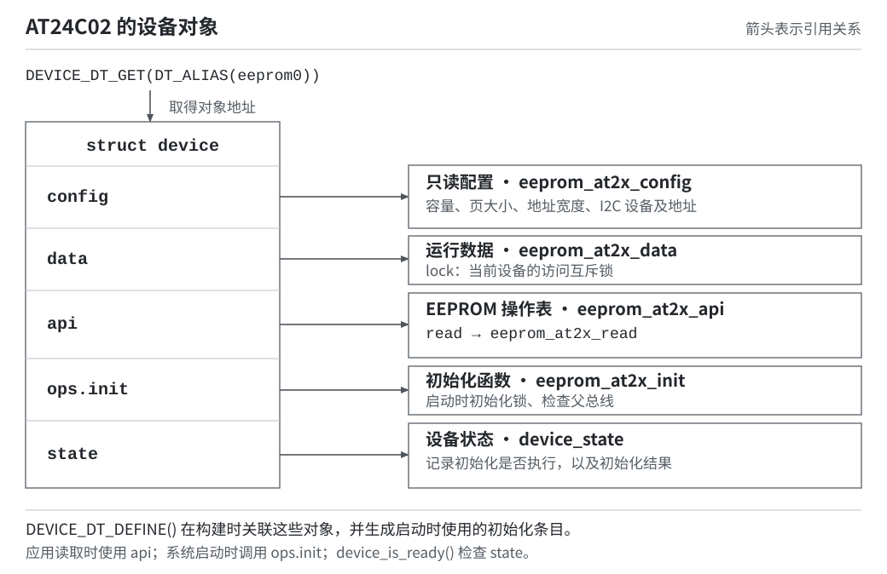

# 第4章 Zephyr 设备驱动模型

上一章的 `apps/eeprom` 只调用了 `eeprom_get_size()`、`eeprom_read()` 和 `eeprom_write()`，没有写 I2C 时序，却能完成 AT24C02 的读写。应用中还存在一个值得继续追踪的对象：`const struct device *eeprom`。它怎样决定调用哪个函数，又怎样把 `0x50`、256 字节和 SCI4 传给驱动？

保持上一章的应用和 Board 配置不变，从 `eeprom_read()` 逐层查看工程里的 Zephyr 源码。沿这次读取，可以把设备对象、配置、运行数据、操作表和初始化过程连在一起。

## 4.1 从应用接口进入操作表

打开 `apps/eeprom/src/main.c`，找到备份原数据的这一行：

```c
ret = eeprom_read(eeprom, offset, original, sizeof(original));
```

在这个调用位置，`eeprom` 指向 AT24C02 的设备对象，`offset` 为 `0xF8`，`original` 是 RAM 中的 8 字节缓冲区。应用传入“哪个设备、从哪读、放到哪、读多少”，还没有选择底层传输函数。

继续打开 `zephyr/include/zephyr/drivers/eeprom.h`，查找 `z_impl_eeprom_read`。本工程版本中的实现如下：

```c
static inline int z_impl_eeprom_read(const struct device *dev, off_t offset,
				     void *data, size_t len)
{
	const struct eeprom_driver_api *api =
		(const struct eeprom_driver_api *)dev->api;

	return api->read(dev, offset, data, len);
}
```

`eeprom_read()` 是公开接口，头文件中的 `__syscall` 声明参与 Zephyr 的接口代码生成。当前应用没有启用用户态隔离，调用会进入 `z_impl_eeprom_read()`，再通过设备对象的 `api` 选择具体实现。

这段代码做了两件事：把设备的 `api` 指针解释为 EEPROM 操作表，再调用表中的 `read` 函数。向上查找同文件中的操作表类型：

```c
__subsystem struct eeprom_driver_api {
	eeprom_api_read read;
	eeprom_api_write write;
	eeprom_api_size size;
};
```

操作表规定了每个 EEPROM 驱动需要实现的函数类型。例如读取接口的声明为：

```c
typedef int (*eeprom_api_read)(const struct device *dev, off_t offset,
			       void *data,
			       size_t len);
```

各驱动按这个类型实现读取函数，应用便可以通过 `eeprom_read()` 访问不同 EEPROM；具体调用哪一个实现由传入的设备对象决定。

这里的“统一”有类别限制。EEPROM 对象应传给 EEPROM API，GPIO 控制器对象应传给 GPIO API；两个对象都用 `struct device` 表示，不代表可以交换使用。`eeprom_read()` 也不会通过 `device_is_ready()` 自动检查对象，调用前的状态检查仍由应用负责。

## 4.2 `struct device` 中保存了什么

打开 `zephyr/include/zephyr/device.h`，查找 `struct device`。其中与当前读取直接相关的字段是：

```c
	/** Name of the device instance */
	const char *name;
	/** Address of device instance config information */
	const void *config;
	/** Address of the API structure exposed by the device instance */
	const void *api;
	/** Address of the common device state */
	struct device_state *state;
	/** Address of the device instance private data */
	void *data;
	/** Device operations */
	struct device_ops ops;
```

这些是 `struct device` 的字段节选。Zephyr 管理通用设备对象，具体驱动定义 `config`、`data` 和 `api` 所指向的类型；应用通过相应类别的 API 使用设备。

图中实线表示指针指向的对象，不表示按箭头顺序执行函数。注意同一个设备同时关联只读配置、运行数据和操作表。



图 4-1：AT24C02 设备实例的对象关系。根据工程内 Zephyr v4.4.2 的 `include/zephyr/device.h`、`drivers/eeprom/eeprom_at2x.c` 及本板设备树绘制；上游原文件见 [device.h](https://github.com/zephyrproject-rtos/zephyr/blob/v4.4.2/include/zephyr/device.h) 和 [AT2X 驱动](https://github.com/zephyrproject-rtos/zephyr/blob/v4.4.2/drivers/eeprom/eeprom_at2x.c)。

| 字段 | AT24C02 实例关联的内容 | 使用阶段 |
| --- | --- | --- |
| `name` | 当前设备实例名称 | 应用和驱动打印定位信息 |
| `config` | `struct eeprom_at2x_config` | 初始化和读写时读取硬件参数 |
| `data` | `struct eeprom_at2x_data` | 保存驱动运行中变化的状态 |
| `api` | `eeprom_at2x_api` | EEPROM API 分发读、写、容量请求 |
| `ops.init` | `eeprom_at2x_init` | 系统启动时初始化该实例 |
| `state` | 初始化是否执行及其结果 | `device_is_ready()` 检查状态 |

`ops.init` 与 `api->read` 不属于同一张表。前者是设备生命周期中的初始化入口，由设备框架调用；后者是 EEPROM 类别定义的读操作，由 EEPROM API 调用。不能在应用中每读一次数据就重新调用初始化函数。

## 4.3 找到 AT24 对应的具体函数

`api->read` 只告诉我们“从操作表调用读取函数”，还没有给出函数名称。打开 `zephyr/drivers/eeprom/eeprom_at2x.c`，查找 `eeprom_at2x_api`：

```c
static DEVICE_API(eeprom, eeprom_at2x_api) = {
	.read = eeprom_at2x_read,
	.write = eeprom_at2x_write,
	.size = eeprom_at2x_size,
};
```

`DEVICE_API(eeprom, ...)` 定义 EEPROM 类别的操作表。三个成员分别指向当前驱动的读取、写入和容量函数。文件名中的 `at2x` 表示这里共用了 AT24 I2C EEPROM 与 AT25 SPI EEPROM 的一部分逻辑，不能只凭文件名判断底层一定使用 I2C。

### 容量来自 `config`

在同文件查找 `eeprom_at2x_size()`：

```c
static size_t eeprom_at2x_size(const struct device *dev)
{
	const struct eeprom_at2x_config *config = dev->config;

	return config->size;
}
```

上一章 `eeprom_get_size()` 打印的 256 来自 `config->size`，没有读取芯片的容量寄存器。这个配置值在构建时由设备树生成；如果设备树把容量填错，容量 API 也会返回错误的配置值。

### 读取同时使用 `config` 与 `data`

再查找 `eeprom_at2x_read()`。先关注它开头的类型转换：

```c
	const struct eeprom_at2x_config *config = dev->config;
	struct eeprom_at2x_data *data = dev->data;
	uint8_t *pbuf = buf;
	int ret;
```

`config` 保存设备树确定的容量、总线等参数，以及具体传输函数。可变状态则放在 `data`；当前驱动的数据结构为：

```c
struct eeprom_at2x_data {
	struct k_mutex lock;
};
```

`lock` 属于当前设备实例，由驱动初始化并用于串行化读写。多个 EEPROM 实例各有自己的 `data`，互斥锁也分别保存。

读取时，驱动用 `config->size` 检查范围，通过 `data->lock` 保护访问，再调用 `config->read_fn` 完成传输。对应实现如下：

<details>
<summary>查看 AT2X 读取循环</summary>

```c
	if ((offset + len) > config->size) {
		LOG_WRN("attempt to read past device boundary");
		return -EINVAL;
	}

	k_mutex_lock(&data->lock, K_FOREVER);
	while (len) {
		ret = config->read_fn(dev, offset, pbuf, len);
		if (ret < 0) {
			LOG_ERR("failed to read EEPROM (err %d)", ret);
			k_mutex_unlock(&data->lock);
			return ret;
		}

		pbuf += ret;
		offset += ret;
		len -= ret;
	}

	k_mutex_unlock(&data->lock);

	return 0;
```

</details>

内部 `read_fn` 返回本次传输的字节数，AT2X 层完成全部读取后才向应用返回 `0`。应用遵循的是 EEPROM API 的返回约定。

## 4.4 通过总线设备访问硬件

`dev->api` 对接 EEPROM 接口，`config->read_fn` 则选择 AT24 或 AT25 的总线实现。在 `eeprom_at2x.c` 的实例配置宏中可以找到：

```c
		.bus_is_ready = eeprom_at##t##_bus_is_ready, \
		.read_fn = eeprom_at##t##_read, \
		.write_fn = eeprom_at##t##_write, \
```

本板节点的 `compatible = "atmel,at24"` 对应宏参数 `t = 24`，因此 `read_fn` 指向 `eeprom_at24_read()`。

在同文件定位 `eeprom_at24_read()`，它按照配置的地址宽度组织内部偏移，然后调用 I2C API：

```c
		err = i2c_write_read(config->bus.i2c.bus, bus_addr,
				     addr, config->addr_width / 8,
				     buf, len);
```

这里传入的是 SCI4 I2C 控制器对象和从地址 `0x50`。AT24 驱动先发送一个字节的内部偏移 `0xF8`，再读取 8 字节；器件寻址、写周期等待等细节都由驱动完成。

### I2C 控制器也是一个设备对象

打开 `zephyr/include/zephyr/drivers/i2c.h`，查找 `struct i2c_dt_spec`：

```c
struct i2c_dt_spec {
	const struct device *bus;
	uint16_t addr;
};
```

EEPROM 配置里的 `bus.i2c` 使用这个结构，分别保存控制器对象和从设备地址。宏 `I2C_DT_SPEC_GET()` 从 EEPROM 节点所在总线获得 `bus`，从节点的 `reg` 获得 `addr`。因此，`dev` 指向 EEPROM，而 `config->bus.i2c.bus` 指向 SCI4 I2C 控制器，两个对象的职责不同。

继续在同头文件中查看 `i2c_write_read()`：它构造两个 `i2c_msg`，第一个发送内部地址，第二个带重新起始条件读取数据并结束传输，最后调用 `i2c_transfer()`。

在 `zephyr/drivers/i2c/i2c_renesas_ra_sci.c` 中查找 `renesas_ra_sci_i2c_driver_api`，其 `.transfer` 指向 `renesas_ra_sci_i2c_transfer()`。后者调用 Renesas FSP 的 `R_SCI_I2C_Write()`、`R_SCI_I2C_Read()`，由 SCI4 控制器完成总线通信。

至此，这次读取的方向已经明确：

```text
apps/eeprom/src/main.c
  eeprom_read(EEPROM 设备, 0xF8, original, 8)
    → z_impl_eeprom_read()
    → dev->api->read，即 eeprom_at2x_read()
    → config->read_fn，即 eeprom_at24_read()
    → i2c_write_read(I2C 控制器设备, 0x50, ...)
    → i2c_transfer()
    → renesas_ra_sci_i2c_transfer()
    → Renesas FSP → SCI4 → AT24C02
```

应用决定数据用途，AT24 驱动解释 EEPROM 的寻址和页操作，SCI I2C 驱动控制 MCU 外设。换成另一种 I2C 控制器时，AT24 的上层读写接口可以继续使用，变化集中在控制器及对应板级描述。

## 4.5 配置和操作表怎样关联到设备

调用链能工作，还需要解释设备对象从哪里来。回到 `zephyr/drivers/eeprom/eeprom_at2x.c`，查看文件末尾的 `EEPROM_AT2X_DEVICE(n, t)`。这个宏为一个 EEPROM 节点生成配置、运行数据和设备定义。

宏中的配置部分如下：

```c
	static const struct eeprom_at2x_config eeprom_at##t##_config_##n = { \
		.bus = EEPROM_AT##t##_BUS(n, t), \
		EEPROM_AT2X_WP_GPIOS(INST_DT_AT2X(n, t)) \
		.size = DT_PROP(INST_DT_AT2X(n, t), size), \
		.pagesize = DT_PROP(INST_DT_AT2X(n, t), pagesize), \
		.addr_width = DT_PROP(INST_DT_AT2X(n, t), address_width), \
		.readonly = DT_PROP(INST_DT_AT2X(n, t), read_only), \
		.timeout = DT_PROP(INST_DT_AT2X(n, t), timeout), \
		.bus_is_ready = eeprom_at##t##_bus_is_ready, \
		.read_fn = eeprom_at##t##_read, \
		.write_fn = eeprom_at##t##_write, \
	}; \
```

`n` 是该 compatible 对应的实例编号，`t` 选择 24 或 25。`DT_PROP()` 从构建生成的设备树宏中取属性。例如，设备树的 `address-width` 在 C 宏参数中写为 `address_width`，最终进入配置成员 `addr_width`。

`static const` 配置可被驱动反复读取；它不需要在 `main()` 中重新创建。当前 AT24C02 实例最终取得 `size=256`、`pagesize=8`、`addr_width=8`、`timeout=5`，并引用 SCI4 I2C 控制器。

紧接着，宏定义可写的数据对象，再调用 `DEVICE_DT_DEFINE()`：

```c
	static struct eeprom_at2x_data eeprom_at##t##_data_##n; \
	DEVICE_DT_DEFINE(INST_DT_AT2X(n, t), eeprom_at2x_init, \
			    NULL, &eeprom_at##t##_data_##n, \
			    &eeprom_at##t##_config_##n, POST_KERNEL, \
			    CONFIG_EEPROM_AT2X_INIT_PRIORITY, \
			    &eeprom_at2x_api)
```

这里使用的是 `DEVICE_DT_DEFINE()`。它接受一个节点标识，并将前面几部分关联起来：

| 参数 | 当前驱动传入的对象 | 含义 |
| --- | --- | --- |
| `node_id` | `INST_DT_AT2X(n, t)` | 当前 EEPROM 设备树节点 |
| `init_fn` | `eeprom_at2x_init` | 系统启动时调用的初始化函数 |
| `pm` | `NULL` | 此处没有提供设备电源管理对象 |
| `data` | 实例的 `eeprom_at2x_data` | 保存互斥锁等运行数据 |
| `config` | 实例的 `eeprom_at2x_config` | 保存容量、总线等只读配置 |
| `level` | `POST_KERNEL` | 内核基础初始化之后的设备初始化阶段 |
| `prio` | `CONFIG_EEPROM_AT2X_INIT_PRIORITY` | 同一阶段中的初始化次序 |
| `api` | `&eeprom_at2x_api` | EEPROM 类别操作表 |

这些都是定义宏，不是在 `main()` 中调用的“注册函数”。构建时它们生成设备对象和初始化条目；系统启动时才执行相应初始化函数。`DEVICE_DT_GET(EEPROM_NODE)` 则取得已经定义的对象地址，不会另外创建一个设备。

同一个源码文件可以匹配多个 EEPROM 节点，每个实例各有自己的 `config` 和 `data`，操作表则可以共用。因此一个 EEPROM 的容量或运行锁不必存放在影响所有实例的全局变量中。

### Devicetree 与 Kconfig 共同选择驱动

仅有 C 文件并不会让它进入固件。查看 `zephyr/drivers/eeprom/Kconfig` 中的 AT24 选项：

```kconfig
config EEPROM_AT24
	bool "I2C EEPROMs compatible with Atmel's AT24 family"
	default y
	depends on DT_HAS_ATMEL_AT24_ENABLED
	select I2C
	select EEPROM_AT2X
```

启用的 `atmel,at24` 节点让设备树条件成立；应用的 `CONFIG_EEPROM=y` 打开 EEPROM 配置范围，然后 AT24 选项选择 I2C 和共用的 AT2X 实现。

对应的 `zephyr/drivers/eeprom/CMakeLists.txt` 有这一行：

```cmake
zephyr_library_sources_ifdef(CONFIG_EEPROM_AT2X eeprom_at2x.c)
```

它根据最终 Kconfig 结果决定是否编译该源文件。源文件末尾再遍历启用的 AT24 实例，生成设备定义。设备树提供实例及硬件参数，Kconfig 选择软件能力，CMake 将实现加入构建，三者缺一都可能使应用找不到可用设备。

## 4.6 初始化结果如何成为 ready 状态

在 `eeprom_at2x.c` 中查看 `eeprom_at2x_init()` 的开头：

```c
static int eeprom_at2x_init(const struct device *dev)
{
	const struct eeprom_at2x_config *config = dev->config;
	struct eeprom_at2x_data *data = dev->data;

	k_mutex_init(&data->lock);

	if (!config->bus_is_ready(dev)) {
		LOG_ERR("parent bus device not ready");
		return -EINVAL;
	}
```

它首先初始化互斥锁，然后确认父总线已经就绪。当前实例的 `bus_is_ready` 指向 `eeprom_at24_bus_is_ready()`，后者调用 `device_is_ready(config->bus.i2c.bus)` 检查 SCI4 I2C 控制器。

若节点提供 `wp-gpios`，后面的条件代码还会配置写保护 GPIO；本板 WP 直接接地，节点没有该属性。正常完成初始化后，函数返回 `0`。

SCI4 I2C 与 AT24 的初始化都有先后要求。打开上一章构建生成的 `build/eeprom/zephyr/.config`，可以查到：

```ini
CONFIG_I2C_INIT_PRIORITY=50
CONFIG_EEPROM_AT2X_INIT_PRIORITY=80
```

再对照 SCI I2C 和 EEPROM 源码中的设备定义，两者均使用 `POST_KERNEL`。在同一初始化阶段，数字较小的优先级先执行，所以控制器先于依赖它的 EEPROM 初始化。这个数字不是线程调度优先级，也不是中断优先级。

系统执行这些条目的路径可以在两个文件中找到：

- `zephyr/kernel/init.c`：`z_sys_init_run_level()` 遍历相应阶段的初始化条目；正常启动进入应用 `main()` 前执行设备初始化。
- `zephyr/kernel/device.c`：`do_device_init()` 调用 `dev->ops.init(dev)`，并把结果记录到 `dev->state`。

在 `zephyr/kernel/device.c` 中，`z_impl_device_is_ready()` 的实际判断是：

```c
	if (dev == NULL) {
		return false;
	}

	return dev->state->initialized && (dev->state->init_res == 0U);
```

它检查的是“初始化执行过且结果成功”，并不会每次发起 I2C 通信。本驱动初始化也没有读取 EEPROM 内容，所以 `device_is_ready()` 成功、`eeprom_get_size()` 返回 256 后，仍需要上一章的实际读写和比较来确认器件通信。

## 4.7 在构建产物中对应设备实例

回到工程根目录，用上一章的应用生成这次检查所需的产物：

```powershell
.\scripts\dev.ps1 build eeprom
```

这一步构建应用，不需要重新烧录。依次打开下面三个文件，把刚刚看到的源码与产物对应起来。

### `zephyr.dts`：确认输入的节点

打开 `build/eeprom/zephyr/zephyr.dts`，找到：

```dts
at24c02: eeprom@50 {
	compatible = "atmel,at24";
	reg = <0x50>;
	size = <0x100>;
	pagesize = <0x8>;
	address-width = <0x8>;
	timeout = <0x5>;
};
```

这是去掉来源注释、统一空格后的相关节点摘录。它保留了输入参数：`0x100` 是 256 字节，`0x8` 分别作为页大小和地址位宽，单位由各自属性决定。

### `devicetree_generated.h`：确认别名成为 C 宏

打开 `build/eeprom/zephyr/include/generated/zephyr/devicetree_generated.h`，搜索 `DT_N_ALIAS_eeprom0`。当前节点路径对应：

```c
#define DT_N_ALIAS_eeprom0     DT_N_S_soc_S_sci4_40118400_S_i2c_S_eeprom_50
```

这说明应用中的别名最终关联到 `/soc/sci4@40118400/i2c/eeprom@50`。生成的长标识符由工具维护，不要在应用里手写，也不要复制到另一块板上；应用继续使用 `DT_ALIAS(eeprom0)`。

### `zephyr.map`：确认实现已经链接

打开 `build/eeprom/zephyr/zephyr.map`，依次搜索：

```text
eeprom_at2x_read
eeprom_at24_read
eeprom_at2x_api
eeprom_at24_config_0
eeprom_at24_data_0
```

这些条目分别对应通用读入口、I2C EEPROM 读实现、操作表、配置和运行数据。当前配置实例位于只读数据相关区域，运行数据实例位于可写的 BSS 区域；实际地址由链接决定，不应作为应用常量使用。

若新增其他节点，实例编号和长设备标识符可能改变。判断依据是节点、compatible、对应函数及配置关系，不是记住当前的 `_0` 或某个内存地址。链接图只证明代码和对象已进入固件，硬件通信结果仍由上一章的运行测试判断。

## 4.8 设备模型与驱动接口的职责

现在可以把上一章的应用调用拆成两部分：设备模型把一个实例的配置、数据、初始化和接口关联起来；EEPROM 子系统规定读取、写入和获取容量这些操作的类型。AT24 驱动同时满足这两个要求，应用因而不必调用厂商 HAL。

但不是每个设备都需要一张类似 `eeprom_driver_api` 的读写表。例如，输入设备可以在状态变化时向 Input 子系统上报事件，再由子系统分发给应用。此类驱动仍然需要配置、运行数据和初始化，注册时却可以令 `api` 为 `NULL`，因为应用通过输入事件接收结果。

`api = NULL` 不表示设备没有初始化，也不表示设备不能供系统使用；它表示这个实例不通过自己的设备 API 表提供直接调用接口。相应地，不能把这样的对象传给会解引用 `dev->api` 的 `eeprom_read()`。

下一章从板上的 K2 按键开始，编写一个输入驱动：把引脚和消抖参数交给设备树，把初始化与运行数据交给设备模型，把按下、松开事件交给 Input 子系统。这里已经建立的设备定义和初始化关系可以继续使用，具体的应用交互方式则由输入设备的行为决定。

## 参考资料

- [Zephyr v4.4.2 EEPROM 接口](https://github.com/zephyrproject-rtos/zephyr/blob/v4.4.2/include/zephyr/drivers/eeprom.h)：`eeprom_driver_api` 与 API 分发。
- [Zephyr v4.4.2 AT2X 驱动](https://github.com/zephyrproject-rtos/zephyr/blob/v4.4.2/drivers/eeprom/eeprom_at2x.c)：配置、数据、AT24 访问及设备定义。
- [Zephyr v4.4.2 设备定义](https://github.com/zephyrproject-rtos/zephyr/blob/v4.4.2/include/zephyr/device.h) 与 [运行时设备管理](https://github.com/zephyrproject-rtos/zephyr/blob/v4.4.2/kernel/device.c)：`struct device`、初始化结果和 ready 状态。
- [Zephyr v4.4.2 I2C 接口](https://github.com/zephyrproject-rtos/zephyr/blob/v4.4.2/include/zephyr/drivers/i2c.h)：总线对象、地址以及写后读操作。

[上一章：Zephyr 设备驱动的使用](../../01-Zephyr应用开发/03-Zephyr设备驱动的使用/README.md) · [下一章：编写第一个 Zephyr 设备驱动](../05-编写第一个Zephyr设备驱动/README.md)
