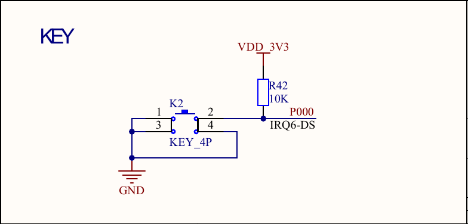
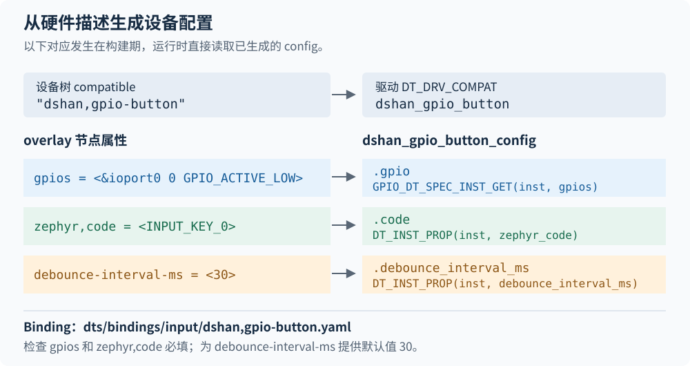
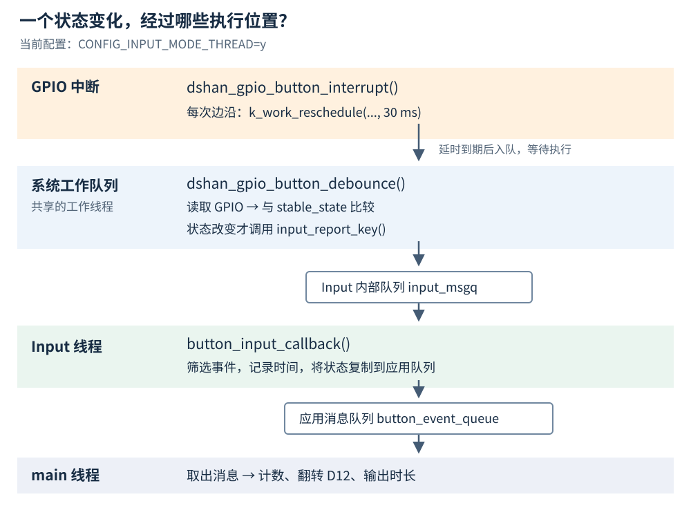

# 第5章 编写第一个 Zephyr 设备驱动

前面已经通过 `eeprom_read()` 追踪了设备对象、驱动接口和初始化过程。现在把这些机制用于一个新驱动：为 K2 定义设备树属性，将驱动加入 Zephyr 构建，再注册设备并通过 Input 子系统上报按下、松开事件。

驱动复用已有的 GPIO 控制器，负责中断和消抖；应用接收事件后翻转 D12、记录按下次数和保持时间。Board 和 GPIO 控制器驱动沿用工程现有支持。

## 5.1 确定驱动与应用之间的接口

驱动与应用之间采用 Zephyr 的标准输入事件 `struct input_event`，本例约定如下。

| 字段 | 本例的取值 | 应用如何使用 |
| --- | --- | --- |
| `dev` | 自定义按键的设备对象 | 只接收这个设备的事件 |
| `type` | `INPUT_EV_KEY` | 判断事件属于按键类型 |
| `code` | `INPUT_KEY_0` | 区分具体按键 |
| `value` | 按下为 `1`，松开为 `0` | 执行按下或松开的处理 |
| `sync` | `true` | 表示这一组状态已经上报完整 |

`INPUT_KEY_0` 是事件编号，与 GPIO 的引脚号无关。一个按键每次只报告一个状态，所以该事件同时设置 `sync = true`。`sync` 本身不执行消抖；消抖需要由驱动完成。

在 `zephyr/include/zephyr/input/input.h` 中，`input_report_key()` 把按键状态转换为标准事件。它的核心语句是：

```c
return input_report(dev, INPUT_EV_KEY, code, !!value, sync, timeout);
```

驱动调用 `input_report_key()` 上报，应用用 `INPUT_CALLBACK_DEFINE()` 注册接收函数。本设备仍需注册到 Zephyr 设备模型，但应用访问入口由 Input 提供，因此设备的 `.api` 指针可以为 `NULL`。[Input 官方说明](https://docs.zephyrproject.org/latest/services/input/index.html)

## 5.2 为应用描述一个输入设备

以下路径均相对于工程根目录。先在编辑器中创建这些目录和文件：

```text
apps/k2_button/
├─ CMakeLists.txt
├─ prj.conf
├─ boards/
│  └─ dshan_ra6m5.overlay
└─ src/
   └─ main.c

dts/bindings/input/
└─ dshan,gpio-button.yaml

drivers/input/
└─ input_dshan_gpio_button.c
```

应用的 `CMakeLists.txt`、`prj.conf` 和 `main.c` 延续前面两章的组织方式。驱动放在工程根目录的 `drivers/input/` 中，供应用选择使用；硬件属性的定义放在 `dts/bindings/input/` 中。

### 5.2.1 用 Binding 定义属性

自定义设备需要 GPIO、按键事件编号和消抖间隔。Binding 用 `compatible` 匹配节点，声明属性的类型、必填项和默认值；构建系统据此检查节点并生成驱动使用的 C 宏。

新建 `dts/bindings/input/dshan,gpio-button.yaml`，写入：

```yaml
# SPDX-License-Identifier: Apache-2.0

description: |
  A single GPIO-backed button that reports standard Zephyr input key events.
  The driver uses edge interrupts and delayed work for software debounce.

compatible: "dshan,gpio-button"

include: base.yaml

properties:
  gpios:
    type: phandle-array
    required: true
    description: GPIO connected to the button.

  zephyr,code:
    type: int
    required: true
    description: Input key code reported when the button changes state.

  debounce-interval-ms:
    type: int
    # 未在节点中填写时采用 30 ms；它是软件消抖参数。
    default: 30
    description: Quiet interval in milliseconds used for software debounce.
```

`phandle-array` 可以描述“GPIO 控制器引用＋引脚号＋标志”。`required: true` 要求节点必须填写对应属性；`base.yaml` 引入设备树的通用属性。`debounce-interval-ms` 的单位是毫秒，默认值 `30` 是本驱动的软件消抖策略，不是 MCU 的硬件定时参数。

工程的 `zephyr/module.yml` 已通过 `dts_root: .` 将根目录加入设备树搜索范围，因此构建系统会查找这里的 Binding。Binding 只定义属性规则，具体设备实例由下面的 overlay 描述。

### 5.2.2 在 overlay 中实例化设备

先观察原理图中的 K2、P000 和 R42：松开时，R42 将 P000 上拉到电源电压；按下时，K2 将 P000 接地。



*图 5-1　K2 的引脚和有效电平。《RA6M5_v4_20230706》原理图第 3 页 KEY 部分，见[完整原理图](pathname:///files/ra6m5/ra6m5-v4-schematic.pdf)。*

因此按下对应低电平，松开对应高电平；板上已有 10 kΩ 外部上拉，本例不再配置 GPIO 内部上拉。

先查看 `boards/dshan/dshan_ra6m5/dshan_ra6m5.dts`。Board 已用下面的节点描述 K2：

```dts
buttons {
    compatible = "gpio-keys";

    user_button: user-button {
        gpios = <&ioport0 0 GPIO_ACTIVE_LOW>;
        label = "User button K2";
        zephyr,code = <INPUT_KEY_0>;
    };
};
```

`&ioport0` 的第 `0` 个引脚对应 P000，`GPIO_ACTIVE_LOW` 表示低电平为有效状态。现在给自定义驱动使用同一个引脚，需要在当前应用中禁用原来的 `gpio-keys` 节点，避免两套驱动同时配置 P000。

新建 `apps/k2_button/boards/dshan_ra6m5.overlay`，写入：

```dts
/* SPDX-License-Identifier: Apache-2.0 */

#include <zephyr/dt-bindings/gpio/gpio.h>
#include <zephyr/dt-bindings/input/input-event-codes.h>

/* 只覆盖当前应用，让 P000 由下面的自定义设备使用。 */
&{/buttons} {
    status = "disabled";
};

/ {
    k2_custom: k2-custom-button {
        compatible = "dshan,gpio-button";
        /* 板上已有外部上拉，按下时 P000 为低电平。 */
        gpios = <&ioport0 0 GPIO_ACTIVE_LOW>;
        zephyr,code = <INPUT_KEY_0>;
        debounce-interval-ms = <30>;
        status = "okay";
    };

    aliases {
        sw0 = &k2_custom;
        k2-button0 = &k2_custom;
    };
};
```

构建当前应用时，Zephyr 将 `boards/dshan_ra6m5.overlay` 合并到 Board 设备树。`&{/buttons}` 按路径修改原节点；`sw0` 和新增的 `k2-button0` 都指向新设备，C 代码通过 `DT_ALIAS(k2_button0)` 引用它。这些覆盖仅用于当前应用的固件，Board 源文件保持不变。

`compatible` 将节点与 Binding、驱动对应起来。下面按同一颜色追踪一个属性从节点进入 C 结构体的过程。



*图 5-2　设备树属性与驱动配置的对应关系。依据本章的 overlay、Binding 和设备注册宏绘制。*

例如 `zephyr,code` 在 C 宏参数中写成 `zephyr_code`，属性名中的逗号、连字符会转换为下划线。Binding 负责定义和检查属性，稍后注册设备时使用的 `DT_INST_PROP()` 才把具体值放进配置结构体。

## 5.3 把驱动加入构建

设备树中存在启用节点，还需要驱动源文件参与编译。这里用 Kconfig 决定是否启用驱动，再由 CMake 根据配置选择 `.c` 文件；这两步与设备树实例一起决定最终是否产生设备对象。

### 5.3.1 添加驱动选项和源文件规则

打开 `drivers/input/Kconfig`，在文件开头的版权注释后添加以下选项，保留其它驱动的配置：

```kconfig
config INPUT_DSHAN_GPIO_BUTTON
    bool "Dshan GPIO button input driver"
    default y
    depends on INPUT
    depends on DT_HAS_DSHAN_GPIO_BUTTON_ENABLED
    select GPIO
    help
      Enable the Dshan GPIO button driver. It handles GPIO interrupts
      and software debounce, then reports standard Zephyr input events.
```

`DT_HAS_DSHAN_GPIO_BUTTON_ENABLED` 由设备树生成，表示存在启用的 `dshan,gpio-button` 节点。它与 `INPUT` 同时满足时，驱动选项才可启用；在 `prj.conf` 中写 `y` 也不能绕过这些依赖。`select GPIO` 启用驱动所需的 GPIO 支持。

打开 `drivers/input/CMakeLists.txt`，在已有的 `zephyr_library()` 后追加一行：

```cmake
# 驱动选项为 y 时，将本文件编译进 Zephyr 驱动库。
zephyr_library_sources_ifdef(CONFIG_INPUT_DSHAN_GPIO_BUTTON input_dshan_gpio_button.c)
```

如果该目录尚没有 `CMakeLists.txt`，先写入一行 `zephyr_library()`，再加入上面的规则。一个目录只需调用一次 `zephyr_library()`。

根目录已经具备下表所示入口。核对这些语句即可，不要重复追加。

| 文件 | 已有入口 | 作用 |
| --- | --- | --- |
| `Kconfig` | `rsource "drivers/Kconfig"` | 读取工程驱动的配置 |
| `drivers/Kconfig` | `rsource "input/Kconfig"` | 读取输入驱动选项 |
| `CMakeLists.txt` | `add_subdirectory(drivers)` | 进入工程驱动目录 |
| `drivers/CMakeLists.txt` | `add_subdirectory_ifdef(CONFIG_INPUT input)` | 启用 Input 时处理输入驱动 |

### 5.3.2 写应用构建文件

在 `apps/k2_button/CMakeLists.txt` 中写入：

```cmake
# SPDX-License-Identifier: Apache-2.0

cmake_minimum_required(VERSION 3.20.0)
find_package(Zephyr REQUIRED HINTS $ENV{ZEPHYR_BASE})
project(k2_button LANGUAGES C)

# 应用只加入自己的代码；驱动由模块的构建规则选择。
target_sources(app PRIVATE src/main.c)
```

在 `apps/k2_button/prj.conf` 中写入：

```ini
CONFIG_INPUT=y
# 接收回调由 Input 线程执行。
CONFIG_INPUT_MODE_THREAD=y
CONFIG_INPUT_DSHAN_GPIO_BUTTON=y

# 关闭本应用不使用的板载输入设备驱动。
CONFIG_INPUT_IRM_H638=n

CONFIG_LOG=y
CONFIG_LOG_PROCESS_TRIGGER_THRESHOLD=1
CONFIG_BOOT_BANNER=y
CONFIG_MAIN_STACK_SIZE=2048
CONFIG_STACK_SENTINEL=y
```

`CONFIG_INPUT_MODE_THREAD=y` 选择由 Input 自带线程分发事件：`input_report_key()` 提交事件后，应用的接收回调在 Input 线程中执行。它不会为应用创建处理线程；应用自己的处理仍放在 `main()` 中。日志和栈配置沿用前面的应用。

## 5.4 注册一个能初始化的设备

先让设备完成 GPIO 配置和就绪检查，再加入事件处理。

### 5.4.1 保存配置和运行状态

新建 `drivers/input/input_dshan_gpio_button.c`，先写入头文件、日志模块和两个结构体：

```c
/* SPDX-License-Identifier: Apache-2.0 */

/* 对应设备树中的 compatible = "dshan,gpio-button"。 */
#define DT_DRV_COMPAT dshan_gpio_button

#include <stdint.h>

#include <zephyr/device.h>
#include <zephyr/drivers/gpio.h>
#include <zephyr/input/input.h>
#include <zephyr/kernel.h>
#include <zephyr/logging/log.h>
#include <zephyr/sys/util.h>

LOG_MODULE_REGISTER(input_dshan_gpio_button, CONFIG_INPUT_LOG_LEVEL);

/* 构建时由设备树确定；运行时只读取。 */
struct dshan_gpio_button_config {
    struct gpio_dt_spec gpio;
    uint16_t code;
    uint32_t debounce_interval_ms;
};

/* 运行时保存所属设备和已经确认的按键状态。 */
struct dshan_gpio_button_data {
    const struct device *dev;
    int stable_state;
};
```

`config` 由设备树初始化，其中的 `gpio_dt_spec` 同时保存控制器设备、引脚号和标志。`data` 归当前设备实例所有，后续回调通过 `data->dev->config` 取得该实例的配置。

### 5.4.2 编写初始化函数

在两个结构体后追加 `dshan_gpio_button_init()`：

```c
static int dshan_gpio_button_init(const struct device *dev)
{
    const struct dshan_gpio_button_config *config = dev->config;
    struct dshan_gpio_button_data *data = dev->data;
    int ret;

    if (!gpio_is_ready_dt(&config->gpio)) {
        LOG_ERR("Button GPIO controller is not ready");
        return -ENODEV;
    }

    ret = gpio_pin_configure_dt(&config->gpio, GPIO_INPUT);
    if (ret < 0) {
        LOG_ERR("Failed to configure button GPIO: %d", ret);
        return ret;
    }

    ret = gpio_pin_get_dt(&config->gpio);
    if (ret < 0) {
        LOG_ERR("Failed to read initial button state: %d", ret);
        return ret;
    }

    data->dev = dev;
    /* 保存启动时状态，后续只报告状态的变化。 */
    data->stable_state = !!ret;
    return 0;
}
```

`gpio_pin_configure_dt()` 合并设备树标志与 `GPIO_INPUT`，将 P000 配置为输入。`gpio_pin_get_dt()` 返回的是逻辑状态：本节点指定了 `GPIO_ACTIVE_LOW`，所以物理低电平读作 `1`，高电平读作 `0`。无需在驱动中再手动反相。

Zephyr 保存初始化函数的返回结果，应用随后通过 `device_is_ready()` 检查；取得设备指针本身不会执行初始化。

### 5.4.3 为每个启用节点创建设备对象

在初始化函数后、文件末尾追加：

```c
#define DSHAN_GPIO_BUTTON_DEFINE(inst)                                      \
    static struct dshan_gpio_button_data dshan_gpio_button_data_##inst;     \
                                                                          \
    static const struct dshan_gpio_button_config                           \
        dshan_gpio_button_config_##inst = {                                \
        .gpio = GPIO_DT_SPEC_INST_GET(inst, gpios),                         \
        .code = DT_INST_PROP(inst, zephyr_code),                            \
        .debounce_interval_ms = DT_INST_PROP(inst, debounce_interval_ms),   \
    };                                                                    \
                                                                          \
    DEVICE_DT_INST_DEFINE(inst, dshan_gpio_button_init, NULL,               \
                          &dshan_gpio_button_data_##inst,                  \
                          &dshan_gpio_button_config_##inst, POST_KERNEL,   \
                          CONFIG_INPUT_INIT_PRIORITY, NULL);

DT_INST_FOREACH_STATUS_OKAY(DSHAN_GPIO_BUTTON_DEFINE)
```

宏在构建时为每个启用节点生成 `data`、`config` 和设备对象，并记录初始化入口。启动时由 Zephyr 按初始化阶段和优先级调用 `dshan_gpio_button_init()`；应用无需自行调用它。

| 写法 | 含义 |
| --- | --- |
| `inst` | 当前 `compatible` 下的实例编号，不是 GPIO 编号 |
| `dshan_gpio_button_data_##inst` | 每个实例拥有独立的运行数据 |
| `GPIO_DT_SPEC_INST_GET()` | 获取该实例的 GPIO 配置 |
| `DT_INST_FOREACH_STATUS_OKAY()` | 为当前 `compatible` 的每个启用实例展开宏 |
| `POST_KERNEL` | 在内核相关设施可用的初始化阶段执行 |
| `CONFIG_INPUT_INIT_PRIORITY` | 决定同一初始化阶段的调用顺序，与线程调度优先级无关 |
| 最后一个 `NULL` | 此设备不提供供应用主动调用的 API 函数表 |

`DEVICE_DT_INST_DEFINE()` 中初始化函数后的第一个 `NULL` 是电源管理设备指针；最后一个才是驱动 API 指针。两者不能混为一谈。

### 5.4.4 从应用取得设备

在 `apps/k2_button/src/main.c` 中写入这个阶段的完整程序：

```c
#include <errno.h>

#include <zephyr/device.h>
#include <zephyr/devicetree.h>
#include <zephyr/logging/log.h>

LOG_MODULE_REGISTER(k2_button_demo, LOG_LEVEL_INF);

#define BUTTON_NODE DT_ALIAS(k2_button0)

static const struct device *const button_dev = DEVICE_DT_GET(BUTTON_NODE);

int main(void)
{
    if (!device_is_ready(button_dev)) {
        LOG_ERR("K2 input device is not ready");
        return -ENODEV;
    }

    LOG_INF("K2 input device is ready: %s", button_dev->name);
    return 0;
}
```

回到工程根目录的 PowerShell 终端执行：

```powershell
.\scripts\dev.ps1 build k2_button
```

本工程脚本会构建 `apps/k2_button/`，输出位于 `build/k2_button/`。构建成功后，打开以下文件核对刚刚建立的关系：

| 生成文件 | 检查内容 |
| --- | --- |
| `build/k2_button/zephyr/zephyr.dts` | `buttons` 已禁用，`k2-custom-button` 启用；两个别名指向新节点 |
| `build/k2_button/zephyr/.config` | `CONFIG_INPUT_DSHAN_GPIO_BUTTON=y`、`CONFIG_INPUT_MODE_THREAD=y` |
| `build/k2_button/compile_commands.json` | 能找到 `input_dshan_gpio_button.c` 的编译条目 |

生成的 DTS 中可能用数值表示 `INPUT_KEY_0`、`GPIO_ACTIVE_LOW`，应核对展开后的含义，不要求与 overlay 的文字完全一致。

随后按准备课的方法烧录并查看串口。此阶段应出现 `K2 input device is ready:` 后跟设备名；按键还不会触发应用行为，因为中断和事件发送尚未加入。

## 5.5 让驱动报告按键变化

消抖使用 Zephyr 的 `k_work_delayable`：GPIO 中断重新安排延迟工作，工作函数读取 GPIO，只在状态改变时上报事件。

`k_work_reschedule()` 把工作交给 Zephyr 已有的系统工作队列，驱动无需额外创建线程。该 API 会替换尚未完成的延时；工作到期入队后，由系统工作队列线程执行，实际执行时间受排队和调度影响。[延迟工作说明](https://docs.zephyrproject.org/latest/kernel/services/threads/workqueue.html#scheduling-a-delayable-work-item)

### 5.5.1 为回调保存状态

打开 `drivers/input/input_dshan_gpio_button.c`，将原来的 `struct dshan_gpio_button_data` 替换为：

```c
struct dshan_gpio_button_data {
    const struct device *dev;
    struct gpio_callback gpio_callback;
    struct k_work_delayable debounce_work;
    int stable_state;
};
```

每个实例在 `data` 中保存自己的 GPIO 回调和延迟工作对象，初始化时分别交给 GPIO API 和工作队列 API。

### 5.5.2 在工作函数中读取并上报

在 `dshan_gpio_button_data` 定义之后、`dshan_gpio_button_init()` 之前，插入：

```c
static void dshan_gpio_button_debounce(struct k_work *work)
{
    struct k_work_delayable *dwork = k_work_delayable_from_work(work);
    struct dshan_gpio_button_data *data =
        CONTAINER_OF(dwork, struct dshan_gpio_button_data, debounce_work);
    const struct dshan_gpio_button_config *config = data->dev->config;
    int state;
    int ret;

    /* dt 版本已处理 ACTIVE_LOW，按下时逻辑值为 1。 */
    state = gpio_pin_get_dt(&config->gpio);
    if (state < 0) {
        LOG_ERR("Failed to read button GPIO: %d", state);
        return;
    }

    state = !!state;
    if (state == data->stable_state) {
        return;
    }

    data->stable_state = state;
    /* 一个按键状态构成一组完整事件；队列满时不阻塞工作队列。 */
    ret = input_report_key(data->dev, config->code, state, true, K_NO_WAIT);
    if (ret < 0) {
        LOG_WRN("Failed to report button event: %d", ret);
    }
}
```

Zephyr 的工作回调参数是 `struct k_work *`。这里通过 `k_work_delayable_from_work()` 和 `CONTAINER_OF()` 找回所属设备的 `data`，随后使用该设备的配置读 GPIO、上报事件。

读到的状态与 `stable_state` 相同就返回，因此保持按住时不会反复报告按下。上报使用 `K_NO_WAIT`：如果 Input 内部队列已满，函数立即返回错误，驱动输出警告；本实现不重试这一条事件。

### 5.5.3 在中断中重新安排延迟工作

紧接着工作函数，在初始化函数之前插入：

```c
static void dshan_gpio_button_interrupt(const struct device *port,
                                        struct gpio_callback *callback,
                                        gpio_port_pins_t pins)
{
    struct dshan_gpio_button_data *data =
        CONTAINER_OF(callback, struct dshan_gpio_button_data, gpio_callback);
    const struct dshan_gpio_button_config *config = data->dev->config;

    ARG_UNUSED(port);
    ARG_UNUSED(pins);

    /* 每次边沿重设尚未完成的消抖延时，中断中不等待。 */
    (void)k_work_reschedule(&data->debounce_work,
                          K_MSEC(config->debounce_interval_ms));
}
```

GPIO 回调通过 `gpio_callback` 找回设备数据；`K_MSEC()` 将设备树中的毫秒数转换为 Zephyr 超时值。中断只重新安排工作，不在这里等待或上报事件。

若连续边沿发生在 `0 ms`、`4 ms`、`9 ms`，且工作仍在等待到期，`30 ms` 的延时会依次重新安排到约 `30 ms`、`34 ms`、`39 ms`。实际读取还要等待工作线程执行，所以不能理解为“第一次边沿后固定 30 ms 上报”。若工作已经入队或正在执行，重新安排延时也不会撤回那次执行。

### 5.5.4 在初始化函数中启用中断

现在两个回调都已经定义。找到 `dshan_gpio_button_init()` 末尾的：

```c
data->dev = dev;
data->stable_state = !!ret;
return 0;
```

保留前两行，将最后的 `return 0;` 替换为以下代码：

```c
    /* 所有回调使用的对象，必须在打开中断之前初始化。 */
    k_work_init_delayable(&data->debounce_work, dshan_gpio_button_debounce);

    gpio_init_callback(&data->gpio_callback, dshan_gpio_button_interrupt,
                       BIT(config->gpio.pin));
    ret = gpio_add_callback(config->gpio.port, &data->gpio_callback);
    if (ret < 0) {
        LOG_ERR("Failed to add button GPIO callback: %d", ret);
        return ret;
    }

    ret = gpio_pin_interrupt_configure_dt(&config->gpio, GPIO_INT_EDGE_BOTH);
    if (ret < 0) {
        LOG_ERR("Failed to configure button interrupt: %d", ret);
        (void)gpio_remove_callback(config->gpio.port, &data->gpio_callback);
        return ret;
    }

    LOG_DBG("%s ready on %s pin %u", dev->name, config->gpio.port->name,
            config->gpio.pin);
    return 0;
```

`BIT(config->gpio.pin)` 指定回调关注哪个引脚，`GPIO_INT_EDGE_BOTH` 同时接收按下和松开对应的边沿。顺序不能交换：先设置 `data->dev`、初始状态和工作对象，再注册回调，最后启用中断。启用中断失败时，移除已经注册的 GPIO 回调。

驱动文件此时应按以下顺序排列，文件末尾的注册宏保持不变：

```text
头文件、日志模块
config 和 data 结构体
dshan_gpio_button_debounce()
dshan_gpio_button_interrupt()
dshan_gpio_button_init()
DSHAN_GPIO_BUTTON_DEFINE 宏
DT_INST_FOREACH_STATUS_OKAY(...)
```

再次在工程根目录执行 `.\scripts\dev.ps1 build k2_button`，确认新加入的回调、工作对象及 GPIO 中断接口能完成编译链接。应用目前仍只检查设备就绪，接下来为它加入事件接收。

## 5.6 在应用中接收并处理事件

沿下图检查每个回调的执行位置。GPIO 中断、系统工作队列、Input 线程和 `main()` 之间的交接，分别由工作队列 API、Input 和应用消息队列完成。



*图 5-3　当前配置下的事件传递与执行位置。依据驱动、应用及 `zephyr/subsys/input/input.c` 绘制。*

在 `zephyr/subsys/input/input.c` 中，`CONFIG_INPUT_MODE_THREAD` 使 `input_report()` 将事件放入内部的 `input_msgq`，由 `input_thread()` 取出并分发。应用另外定义的 `button_event_queue` 负责将处理转交给 `main()`，不会改变 Input 回调自身的执行位置。

若选择 Input 同步模式，回调会在上报事件的上下文中执行，本例就是系统工作队列线程。两种模式下，接收回调都应保持简短；耗时处理放到应用自己的执行位置。

### 5.6.1 定义应用自己的消息

打开 `apps/k2_button/src/main.c`，将现有头文件区替换为：

```c
#include <errno.h>
#include <stdbool.h>
#include <stdint.h>

#include <zephyr/device.h>
#include <zephyr/devicetree.h>
#include <zephyr/drivers/gpio.h>
#include <zephyr/dt-bindings/input/input-event-codes.h>
#include <zephyr/input/input.h>
#include <zephyr/kernel.h>
#include <zephyr/logging/log.h>
#include <zephyr/sys/atomic.h>
```

保留 `LOG_MODULE_REGISTER()`。将其后的 `BUTTON_NODE` 宏和 `button_dev` 定义替换为以下内容，暂时保留原来的 `main()`：

```c
#define BUTTON_NODE DT_ALIAS(k2_button0)
#define LED_NODE    DT_ALIAS(led0)

struct button_event {
    int64_t uptime_ms;
    bool pressed;
};

static const struct device *const button_dev = DEVICE_DT_GET(BUTTON_NODE);
static const struct gpio_dt_spec user_led = GPIO_DT_SPEC_GET(LED_NODE, gpios);

/* 每条消息保存一份结构体副本，最多缓存 8 条，缓冲区按 4 字节对齐。 */
K_MSGQ_DEFINE(button_event_queue, sizeof(struct button_event), 8, 4);
static atomic_t dropped_events;
```

`K_MSGQ_DEFINE()` 静态定义应用队列，收发时复制完整的 `button_event`。`dropped_events` 使用 Zephyr 原子 API，在 Input 线程和主线程之间记录丢失次数。[消息队列说明](https://docs.zephyrproject.org/latest/kernel/services/data_passing/message_queues.html)

### 5.6.2 注册 Input 回调

在 `dropped_events` 定义之后、`main()` 之前添加：

```c
static void button_input_callback(struct input_event *event, void *user_data)
{
    struct button_event button_event;

    ARG_UNUSED(user_data);

    if (event->type != INPUT_EV_KEY || event->code != INPUT_KEY_0 || !event->sync) {
        return;
    }

    /* 时间记录在接收事件时，避免主线程稍后处理造成额外计时偏差。 */
    button_event.uptime_ms = k_uptime_get();
    button_event.pressed = event->value != 0;
    if (k_msgq_put(&button_event_queue, &button_event, K_NO_WAIT) < 0) {
        atomic_inc(&dropped_events);
    }
}

INPUT_CALLBACK_DEFINE(button_dev, button_input_callback, NULL);
```

`INPUT_CALLBACK_DEFINE()` 在构建时登记设备过滤条件和接收函数，Input 分发事件时调用匹配项；无需在 `main()` 中另行注册。这里记录的 `k_uptime_get()` 是消抖后事件到达回调的时间，不是 GPIO 边沿时间。

`K_NO_WAIT` 使回调在应用队列已满时立即返回，避免它等待主线程而阻塞其它 Input 事件的分发。此时增加丢失计数，由主线程统一报告。

### 5.6.3 让主线程等待并处理消息

将原来的整个 `main()` 替换为下面的实现：

```c
int main(void)
{
    struct button_event event;
    int64_t pressed_at = -1;
    uint32_t press_count = 0U;
    int ret;

    if (!device_is_ready(button_dev)) {
        LOG_ERR("K2 input device is not ready");
        return -ENODEV;
    }

    if (!gpio_is_ready_dt(&user_led)) {
        LOG_ERR("User LED GPIO is not ready");
        return -ENODEV;
    }

    ret = gpio_pin_configure_dt(&user_led, GPIO_OUTPUT_INACTIVE);
    if (ret < 0) {
        LOG_ERR("Failed to configure user LED: %d", ret);
        return ret;
    }

    LOG_INF("Dshan RA6M5 K2 custom-driver demo");
    LOG_INF("Device: %s; press K2 to toggle D12", button_dev->name);

    while (true) {
        atomic_val_t dropped;

        /* 队列为空时阻塞等待，主线程不轮询 GPIO。 */
        (void)k_msgq_get(&button_event_queue, &event, K_FOREVER);

        /* atomic_set 返回旧值，同时将共享计数清零。 */
        dropped = atomic_set(&dropped_events, 0);
        if (dropped > 0) {
            LOG_WRN("Dropped %ld application event(s)", (long)dropped);
        }

        if (event.pressed) {
            pressed_at = event.uptime_ms;
            press_count++;
            ret = gpio_pin_toggle_dt(&user_led);
            if (ret < 0) {
                LOG_ERR("Failed to toggle user LED: %d", ret);
            }
            LOG_INF("K2 pressed  count=%u", press_count);
        } else if (pressed_at >= 0) {
            LOG_INF("K2 released held=%lld ms",
                    (long long)(event.uptime_ms - pressed_at));
            pressed_at = -1;
        } else {
            LOG_INF("K2 released");
        }
    }

    return 0;
}
```

主线程通过 `k_msgq_get(..., K_FOREVER)` 等待应用消息，完成计数、翻转 D12 和时间差计算。若上电时按住 K2，驱动仅记录初始状态，松开后可能只收到释放事件；`pressed_at = -1` 用于跳过未配对的时长计算。

最终 `main.c` 按以下顺序组成：

```text
头文件、LOG_MODULE_REGISTER
BUTTON_NODE、LED_NODE
button_event 结构体
button_dev、user_led、消息队列、丢失计数
button_input_callback()
INPUT_CALLBACK_DEFINE(...)
main()
```

## 5.7 编译、烧录与检查结果

在工程根目录执行：

```powershell
.\scripts\dev.ps1 build k2_button
.\scripts\dev.ps1 flash k2_button
.\scripts\dev.ps1 monitor
```

烧录和串口连接方法沿用学习准备中的操作。打开串口后按一下 RES，可以看到下面的启动信息：

```text
*** Booting Zephyr OS build v4.4.2 ***
[00:00:00.000,000] <inf> k2_button_demo: Dshan RA6M5 K2 custom-driver demo
[00:00:00.000,000] <inf> k2_button_demo: Device: k2-custom-button; press K2 to toggle D12
```

下面是开发板上两次按下、松开的实测日志节选。两次操作的计数分别为 `1` 和 `2`；松开时显示各自的保持时间，具体数值会随操作变化。

```text
[00:00:30.344,000] <inf> k2_button_demo: K2 pressed  count=1
[00:00:30.542,000] <inf> k2_button_demo: K2 released held=198 ms
[00:00:31.217,000] <inf> k2_button_demo: K2 pressed  count=2
[00:00:31.397,000] <inf> k2_button_demo: K2 released held=180 ms
```

对照串口信息，再检查每种操作对应的板上现象：

| 操作 | D12 | 串口内容 |
| --- | --- | --- |
| 复位后松开 K2 | 初始关闭 | 程序名称、设备名称和操作提示 |
| 按下并保持 K2 | 翻转一次 | 一条 `K2 pressed`，`count` 增加一次 |
| 持续按住 | 保持状态 | 不连续增加按下次数 |
| 松开 K2 | 保持状态 | `K2 released held=... ms` |
| 再按下、松开 | 再翻转一次 | 计数继续增加，显示本次时长 |

保持时间来自消抖后事件的时间差，用于观察按键操作。消抖间隔内完成的短促动作可能被合并，不应把该程序当作脉宽测量工具。

若结果不符合预期，沿已经建立的文件关系检查：

| 现象 | 优先检查 |
| --- | --- |
| 设备树提示 Binding 属性错误 | `compatible` 是否一致；`gpios`、`zephyr,code` 是否填写 |
| 链接时找不到 `__device_dts_ord_...` | `.config` 中驱动是否启用，CMake 是否加入源文件，注册宏是否匹配节点 |
| 输出 `K2 input device is not ready` | 驱动初始化中的第一条错误；GPIO 控制器是否就绪 |
| 设备就绪，按下没有事件 | 最终 DTS 是否禁用原 `buttons`；新节点是否使用 P000；中断启用是否返回错误 |
| 事件到了，灯不翻转 | `led0` 的 GPIO 配置和 `gpio_pin_toggle_dt()` 返回值 |
| 出现队列满或 `Dropped ...` 警告 | 回调和主线程是否被加入了耗时处理；事件产生速度是否超过处理速度 |

更换按键 GPIO 时，修改设备树中的 `gpios`；更换事件编号时，同时核对 `zephyr,code` 与应用的筛选条件。增加同类设备实例时，沿用 Binding 和驱动，由设备注册宏为新节点生成独立配置和状态。
