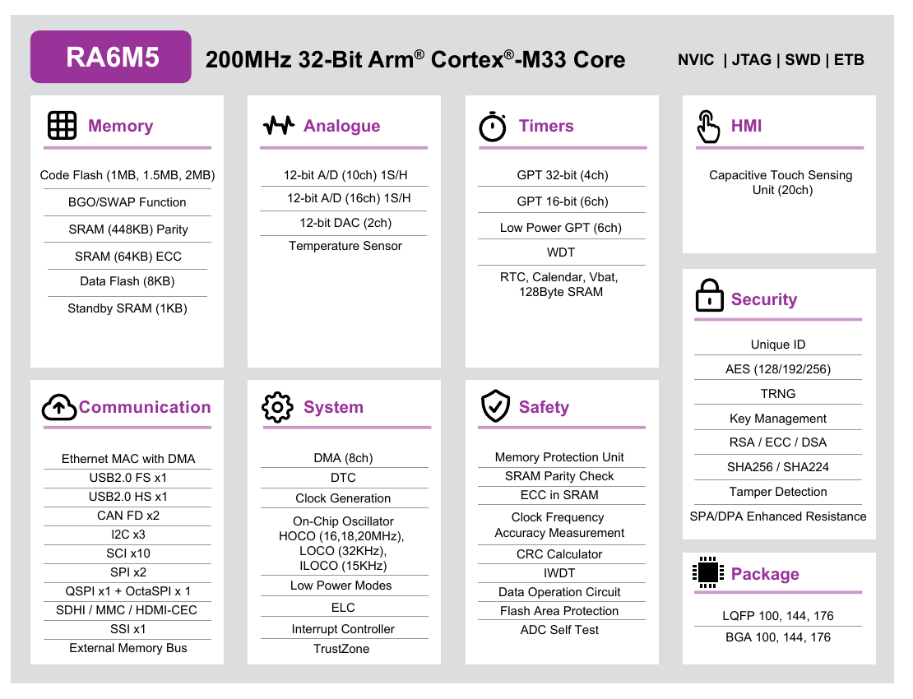

# RA6M5 芯片与硬件

开发板的主芯片是瑞萨 **R7FA6M5BF2CBG**，属于 RA 家族的 RA6 系列、RA6M5 产品组。Zephyr 程序运行在这颗 MCU 上，通过它的外设接口访问板上的灯、按键、存储器和屏幕。

| 核心规格 | R7FA6M5BF2CBG |
| --- | --- |
| CPU | 32 位 Arm Cortex-M33，支持 DSP 指令与单精度浮点运算 |
| 主频 | 最高 200 MHz；本课程工程配置为 200 MHz |
| Code Flash | 1 MiB，保存程序 |
| SRAM | 512 KiB：448 KiB 带奇偶校验，64 KiB 带 ECC 错误校正 |
| Data Flash | 8 KiB，保存需要断电保留的数据 |
| 安全硬件 | Arm TrustZone、MPU、SCE 安全加密引擎 |
| 封装 | 176 引脚 BGA，封装本体 13 mm × 13 mm |
| 工作条件 | VCC 为 2.7～3.6 V，环境温度为 −40～+85 ℃ |

容量采用二进制单位：1 MiB = 1024 KiB，1 KiB = 1024 字节。参数来源为[瑞萨 R7FA6M5BF2CBG 产品页](https://www.renesas.com/en/products/ra6m5/part-details/r7fa6m5bf2cbg-ac0)与[《RA6M5 Group Datasheet》§1.1、§1.3](https://www.renesas.com/en/document/dst/ra6m5-group-datasheet#page=2)。

## 完整型号与工程主频

`RA6M5` 是产品组名称，完整型号还决定功能、存储容量和封装。`R7FA6M5BF2CBG` 中，`6M5` 之后的 `B` 表示支持 CAN FD，随后的 `F` 表示 1 MB 程序 Flash，末尾 `BG` 表示 176 引脚 BGA 封装。查规格时，应以完整型号为准。[命名规则见数据手册 §1.3、图 1.2 与表 1.13](https://www.renesas.com/en/document/dst/ra6m5-group-datasheet#page=8)。

本工程使用板上的 24 MHz 晶振，经 PLL 分频、倍频后，将 CPU 时钟配置为 **200 MHz**。编译 `board_bringup` 后，可在 `build/board_bringup/zephyr/.config` 中核对：

```text
CONFIG_SYS_CLOCK_HW_CYCLES_PER_SEC=200000000
```

## 片内存储与板载存储

烧录后的程序保存在 **Code Flash** 中，断电后仍然保留。运行时的变量、线程栈和缓冲区主要占用 **SRAM**，断电后不保留。**Data Flash** 是独立的片内非易失存储区，容量不计入那 1 MiB Code Flash。

开发板上还焊有两颗独立的存储芯片：`eeprom` 示例使用的 **AT24C02，容量 256 字节**；`qspi_flash`、`qspi_littlefs` 示例使用的 **W25Q64JV，容量 8 MiB**。它们通过总线连接 RA6M5，不属于上表中的片内存储。

## 瑞萨官方功能框图

图中上方是 Cortex-M33 内核，**Memory**、**Communication** 和 **System** 分别表示存储器、通信接口和系统功能。它们共同构成 CPU 可以使用的片内硬件资源。

[](./images/ra6m5-renesas-block-diagram.png)

*图 1：瑞萨《Renesas RA6M5 Group》产品简介，文档 R01PF0210EU0400，2025.07，第 1 页 Block Diagram。[查看瑞萨官方原文](https://www.renesas.com/en/document/fly/renesas-ra6m5-group#page=1)。点击图片可查看原图。*

这是 **RA6M5 产品组**的框图，Code Flash 因此同时标出了 1 MB、1.5 MB 和 2 MB；本板使用其中的 **1 MiB 型号**。其余模块可按用途查阅：

- **通信接口：** SCI 可工作在 UART 等模式；芯片还提供 3 路 I²C、2 路 SPI，以及 QSPI、OctaSPI、USB FS/HS、以太网 MAC、CAN FD 和 SDHI，用于与其他芯片或外部设备交换数据。
- **定时与模拟接口：** GPT 定时器可产生 PWM，ADC 采集模拟电压，DAC 输出模拟电压，RTC 提供日历和时间保持功能。
- **数据搬运与事件处理：** DMAC 有 8 个通道，配合 DTC、ELC 等模块完成硬件触发与数据传输，减少 CPU 对部分操作的逐次干预。
- **保护与安全：** MPU 用于内存访问保护，TrustZone 提供安全域划分能力，SCE 提供硬件加密相关功能。

模块说明见[数据手册 §1.1 Function Outline](https://www.renesas.com/en/document/dst/ra6m5-group-datasheet#page=2)。芯片具有这些能力，应用实际使用哪些模块，还由设备树、功能配置和驱动共同决定。例如，`board_bringup` 只演示串口输出和 GPIO 控灯，当前配置没有启用 TrustZone。

## 板载器件与片内接口

板上的器件通过不同接口连接 MCU。对照下表，可以从示例使用的器件找到 RA6M5 内部负责通信或控制的模块。

| 开发板上的功能或器件 | RA6M5 片内接口 | 工程中的用途 |
| --- | --- | --- |
| D12 指示灯、K2 按键 | GPIO，分别连接 P400、P000 | 控灯、接收按键输入 |
| Debug 串口 | SCI7，作为 UART 使用 | 通过板载 USB 串口通道输出日志 |
| AT24C02 EEPROM | SCI4 的简易 I²C 模式 | 读写板载 EEPROM |
| W25Q64JV Flash | QSPI0 | 擦写扇区，或供 LittleFS 保存文件 |
| W800 无线模块 | SCI6，作为 UART 使用 | 与 AT 固件通信，使用 Wi-Fi 和 BLE |
| USB HOST 接口 J3 | USBHS 控制器 | 作为 USB 主机访问移动存储 |
| ST7796S 显示屏 | SPI1 | 传输图像数据 |
| FT6336U 触摸 | IIC2 | 读取触摸坐标 |
| 屏幕背光 | GPT4 的 PWM 输出 | 调节亮度 |

**SCI4 简易 I²C** 和 **IIC2** 都用于 I²C 通信，但属于不同硬件模块。手册使用 `SCI`、`IIC`、`GPT` 等硬件模块名称，应用则按 UART、I²C、PWM 等接口类型访问它们；同一个 SCI 模块可以工作在不同模式。

连接和参数记录在 `boards/dshan/dshan_ra6m5/dshan_ra6m5.dts`、同目录的 `dshan_ra6m5-pinctrl.dtsi`，以及各应用的 `boards/dshan_ra6m5.overlay` 中。Wi-Fi 和 BLE 由外接 W800 提供；屏幕也有独立的显示、触摸控制器，RA6M5 通过相应总线控制它们。

板载调试器通过 **SWD** 与 RA6M5 通信，并向电脑提供 USB 调试和串口通道。连接电脑的 **Debug 接口**与应用使用的 **USB HOST/OTG 接口**用途不同，连接时应按接口丝印区分。

## 瑞萨官方资料

| 查阅内容 | 官方资料 |
| --- | --- |
| 具体型号的规格与封装 | [R7FA6M5BF2CBG 产品页](https://www.renesas.com/en/products/ra6m5/part-details/r7fa6m5bf2cbg-ac0) |
| 引脚、功能概要与电气参数 | [RA6M5 Group Datasheet](https://www.renesas.com/en/document/dst/ra6m5-group-datasheet) |
| 外设寄存器、工作模式与操作流程 | [RA6M5 Group User's Manual: Hardware](https://www.renesas.com/en/document/man/ra6m5-group-users-manual-hardware) |

继续[准备工程与连接开发板](/docs/ra6m5/preparation/project-and-board/)，或查阅[配套示例详解](/docs/ra6m5/reference/examples/)中各个应用使用的器件与运行现象。
